# vagrant를 이용한 Ansible 서버 관리 자동화

## 1. 개요

- 'vagrant'는 사용자의 요구에 맞게 시스템 자원을 할당, 배치 등을 해 두었다가 **필요할때 시스템을 사용할 수 있는 상태로 만들어 준다**. 이와 같은 작업은 **Provisioning(프로비저닝, 공급)** 이라고 한다.

- Provisioning(프로비저닝, 공급)
    - 어떤 프로세스 또는 서비스를 실행하기 위한 준비 단계 라고 할 수 있다.
    - 프로비저닝에는 다음과 같은 단계로 구분할 수 있다.
        - 네트워크나 컴퓨팅 자원을 준비하는 단계
            - Terraform은 이 단계를 주로 다루는 도구이다.
        - 준비된 컴퓨팅 자원에 사이트 패키지나 애플리케이션 의존성을 준비하는 단계
        

## 2. 'Vagrant' [다운로드 및 설치](https://developer.hashicorp.com/vagrant)

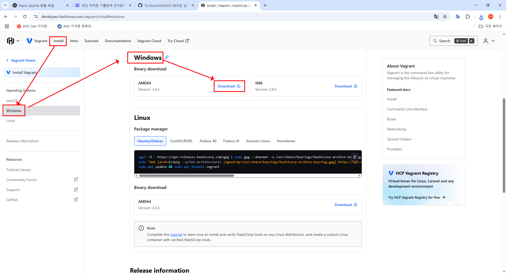        


### 🖥️ 작업환경 (NAT 구성)

#### ✅ Windows 10 시스템
- Vagrant 파일을 Guest OS로 로딩한 후 기본값으로 설치한다.
- 지금은 그냥 이대로 설치하면 된다.

## ✅ VirtualBox[다운로드](https://www.virtualbox.org/wiki/Downloads)
### 개요
- **Vagrant**에서 기본적으로 인식되는 **virtual Machine Tools**이다.
### 필수 환경 설정
- **파일** 메뉴 하단에 있는 **환경 설정**을 클릭한다.
- **가상 머신** 탭을 클릭한 후 **Host key Combo** 옆에 있는 'Right Control' 지우개를 클릭한다.
- 이 때 하단에 보면 '잘못된 설정 감지됨'이 나오는데 이것은 정상적인 오류이다. 화면 상단에 있는 '기본 머신 폴더'의 경로가 잘못도ㅓㅣ어 있기 때문에 그러하다.
- **기본 머신 폴더** 옆의 화살표를 클릭하고 **기타**를 클릭한 후 정확한 경로를 찾으면 된다. 즉, **C:\Users\CloudDX\.VirtualBox**로 지정하면 앞의 오류가 사라진다.
- 다시 하단에 있는 '가상 머신' 탭을 클릭한 후 'Host key Combo' 옆에 있는 'Right Control' 옆에 있는 지우개를 클릭한다.
- 왼쪽의 빈 공간을 클릭한 후 'ctrl + Alt'를 동시에 누르면 된다.

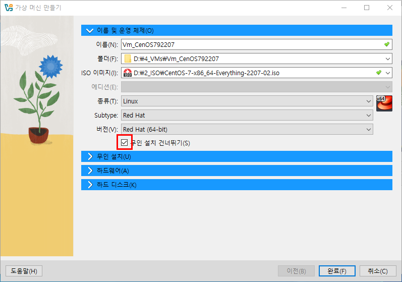

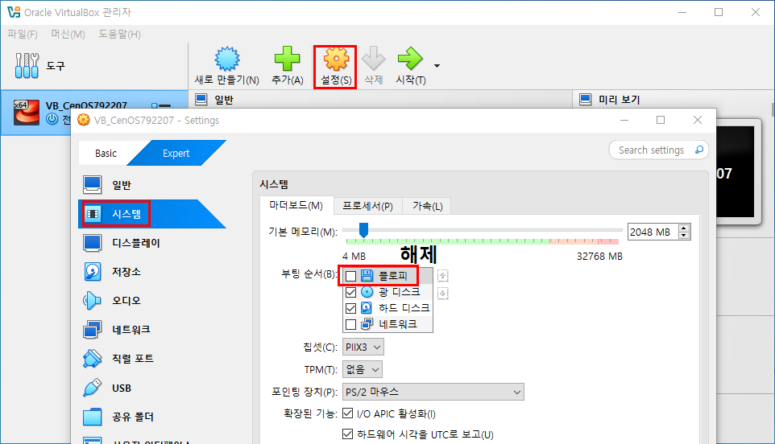

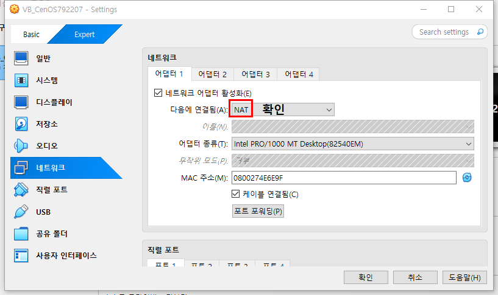

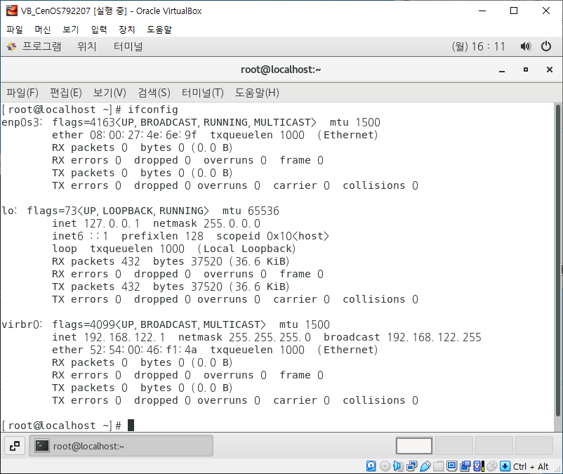

CentOS 설치 방법대로 설치

## 네트워크 설정

- 1대의 시스템만 사용 (한 개의 네트워크 어뎁터만 필요)

- 여러 대의 시스템 사용 (두 개의 네트워크 어뎁터가 필요)

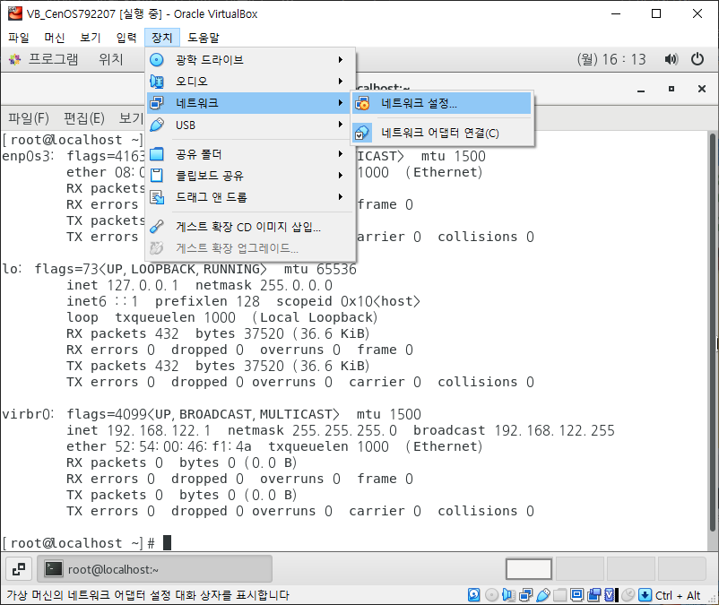

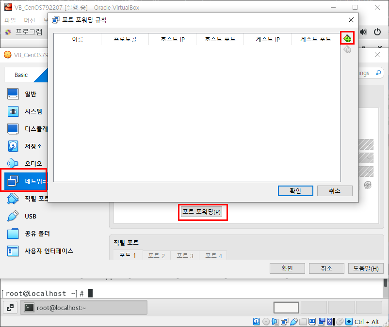

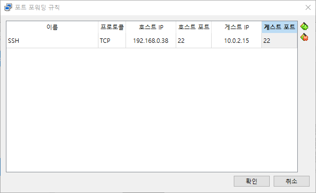

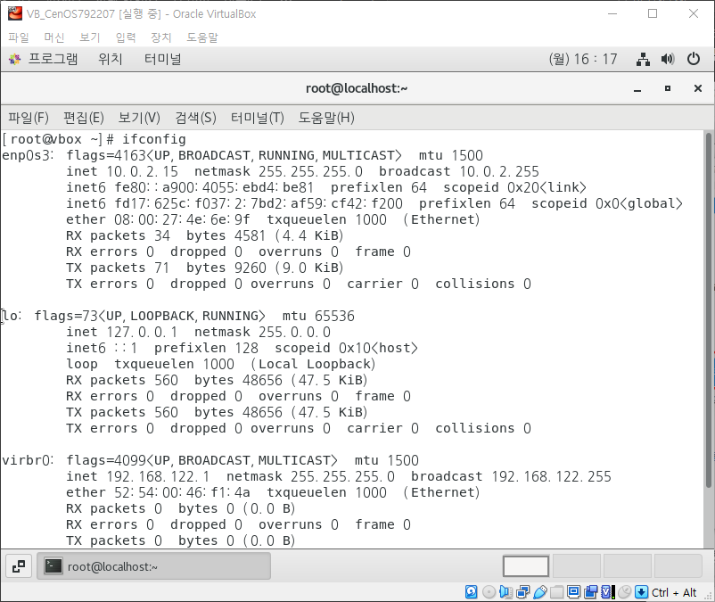

##### 어댑터 1

호스트 전용 어댑터로 모두 허용으로 변경<br>

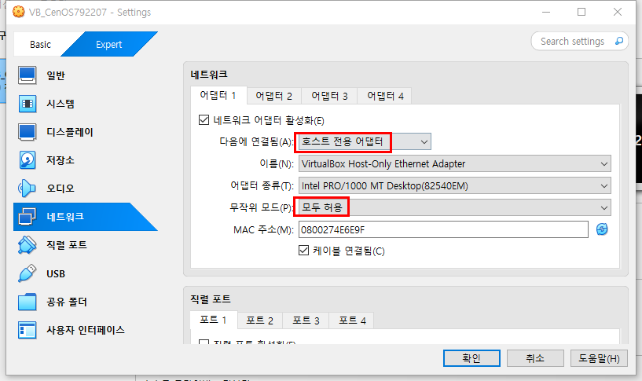

다시 NAT로 변경<br>

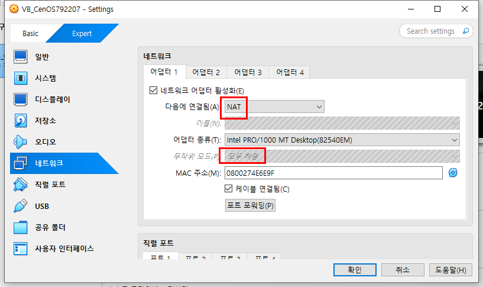

##### 어댑터 2 

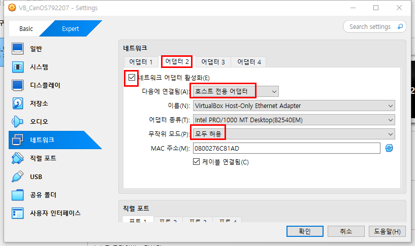

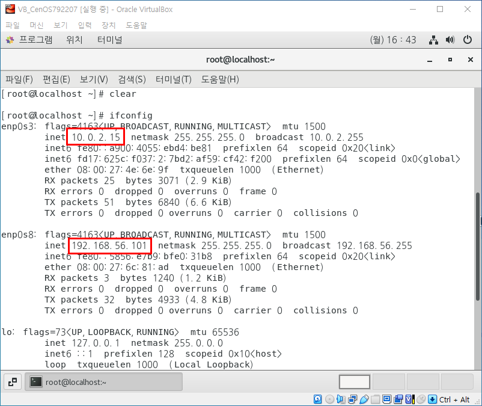

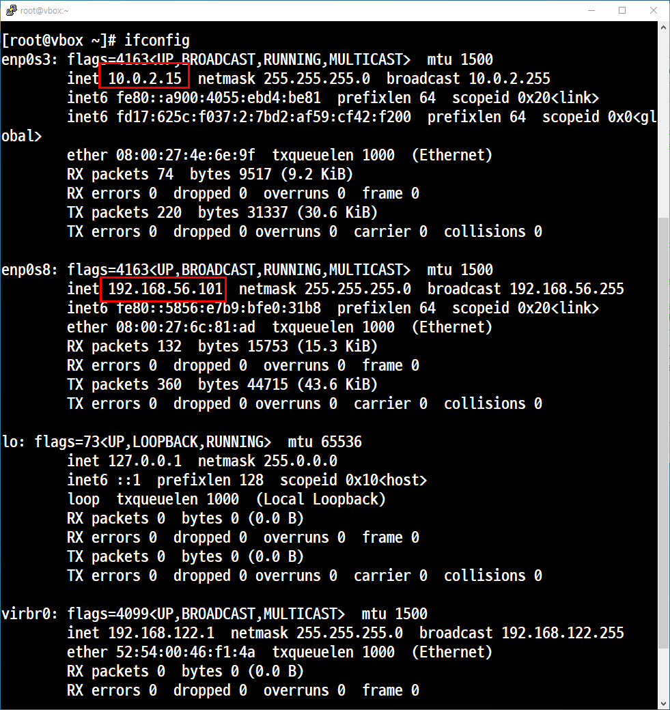

## 원격 접속


## 3. Provisioning 하기
### 개요
- Provisioning 하기 위해서는 스크립트를 작성해야 한다.

### Provisioning을 위한 vagrant 명령어


### ✅ `vagrant init`
- Provisioning을 위한 예제 스크립트를 생성한다.

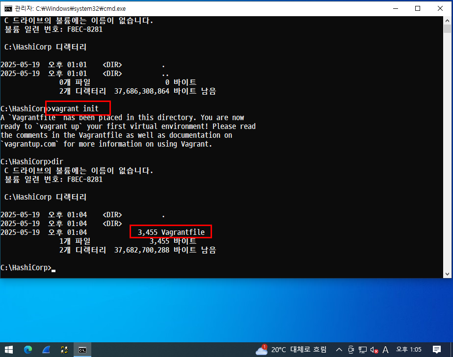

- type Vargrantfile

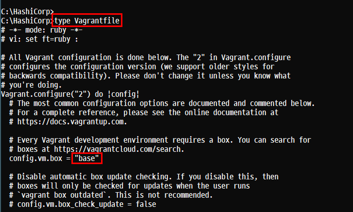


### ✅ `vagrant up`
- `Vagrantfile`을 읽어 들여 가상 머신을 **프로비저닝**하고 실행한다. (가상 머신 생성)

### ✅ `vagrant halt`
- 가상 머신을 **종료**한다. (삭제 아님)

### ✅ `vagrant destroy`
- Vagrant에서 관리하는 가상 머신을 **완전히 삭제**한다.

### ✅ `vagrant ssh`
- 가상 머신에 **SSH로 접속**한다.

### ✅ `vagrant provision`
- 변경된 설정을 가상 머신에 **재적용(프로비저닝)**한다.

## 스크립트 생성
### `vagrant init`

## 가상 머신 생성
### Case 1. OS Image가 로딩되어 있지 않은 경우

- 실행 1. **Hyper-V** 적용 유무에 따른 오류

    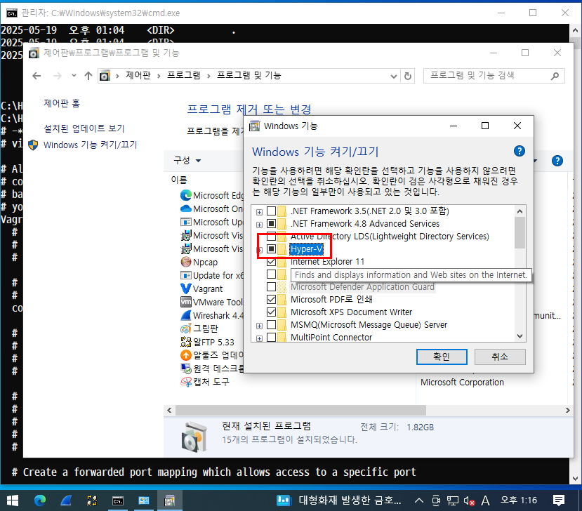
    - 현재 설치되어 있는 이미지가 'base'로 되어 있기 때문에 오류가 발생한다.
    - 해당 이미지를 찾지 못해서 발생하는 오류이다.

- 실행 2. **base** 이미지

### Case 2. **OS Image**가 로딩, 다운로드, 설치가 되어 있는 경우

- Windows 10을 '가상 머신'이 아닌 **Host OS**에서 실행해야 한다.
- 왜? 가상 OS를 가상 OS안에 설치할 수가 없기 때문이다.

- 실행 1. 

오류


정상

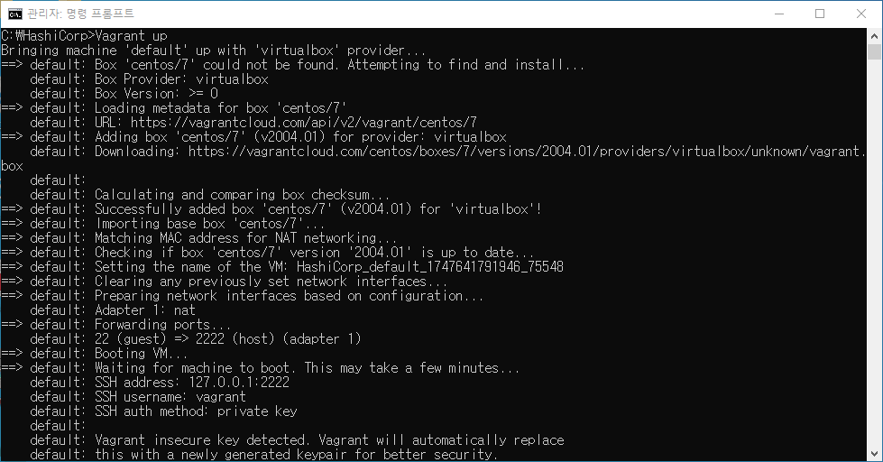

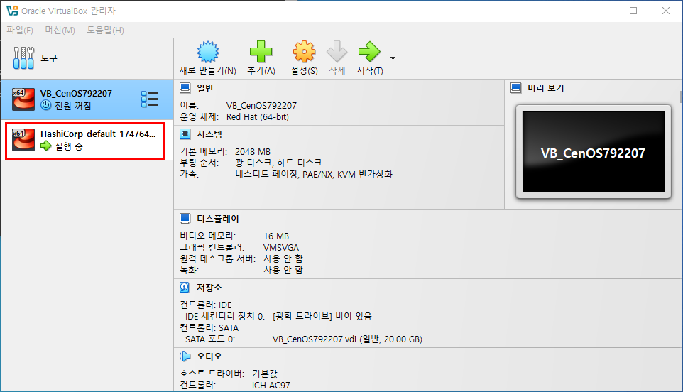

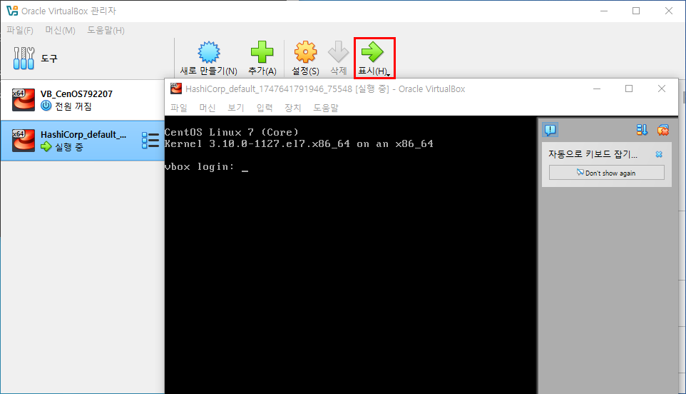


```
C:\HashiCorp>Vagrant up
Bringing machine 'default' up with 'virtualbox' provider...
==> default: Box 'centos/7' could not be found. Attempting to find and install...
    default: Box Provider: virtualbox
    default: Box Version: >= 0
==> default: Loading metadata for box 'centos/7'
    default: URL: https://vagrantcloud.com/api/v2/vagrant/centos/7
==> default: Adding box 'centos/7' (v2004.01) for provider: virtualbox
    default: Downloading: https://vagrantcloud.com/centos/boxes/7/versions/2004.01/providers/virtualbox/unknown/vagrant.box
    default:
    default: Calculating and comparing box checksum...
==> default: Successfully added box 'centos/7' (v2004.01) for 'virtualbox'!
==> default: Importing base box 'centos/7'...
==> default: Matching MAC address for NAT networking...
==> default: Checking if box 'centos/7' version '2004.01' is up to date...
==> default: Setting the name of the VM: HashiCorp_default_1747641791946_75548
==> default: Clearing any previously set network interfaces...
==> default: Preparing network interfaces based on configuration...
    default: Adapter 1: nat
==> default: Forwarding ports...
    default: 22 (guest) => 2222 (host) (adapter 1)
==> default: Booting VM...
==> default: Waiting for machine to boot. This may take a few minutes...
    default: SSH address: 127.0.0.1:2222
    default: SSH username: vagrant
    default: SSH auth method: private key
    default:
    default: Vagrant insecure key detected. Vagrant will automatically replace
    default: this with a newly generated keypair for better security.
    default:
    default: Inserting generated public key within guest...
    default: Removing insecure key from the guest if it's present...
    default: Key inserted! Disconnecting and reconnecting using new SSH key...
==> default: Machine booted and ready!
==> default: Checking for guest additions in VM...
    default: No guest additions were detected on the base box for this VM! Guest
    default: additions are required for forwarded ports, shared folders, host only
    default: networking, and more. If SSH fails on this machine, please install
    default: the guest additions and repackage the box to continue.
    default:
    default: This is not an error message; everything may continue to work properly,
    default: in which case you may ignore this message.
==> default: Rsyncing folder: /cygdrive/c/HashiCorp/ => /vagrant
```

### 확인 사항

- **virtualBox** 에서 확인
- **Vagrant** 명령어로 확인

### 가상머신 삭제

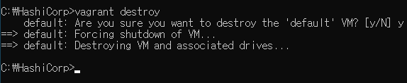

종료 후 삭제