# 앤서블 실습환경 준비하기

## 실습 환경

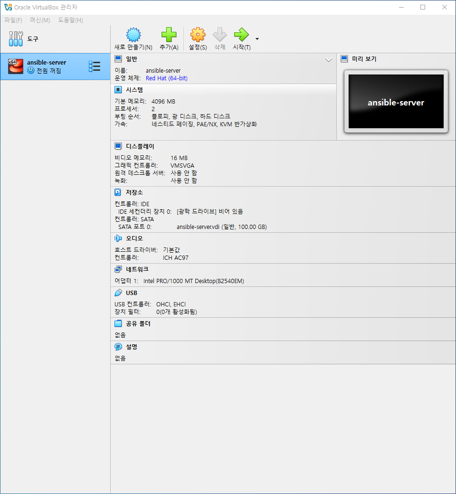

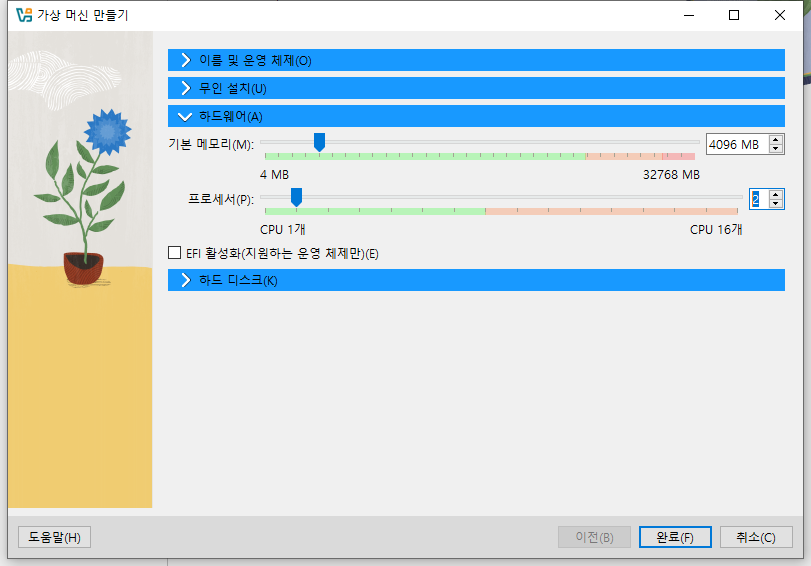

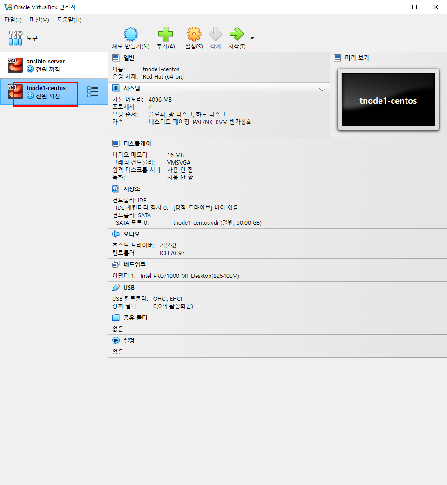

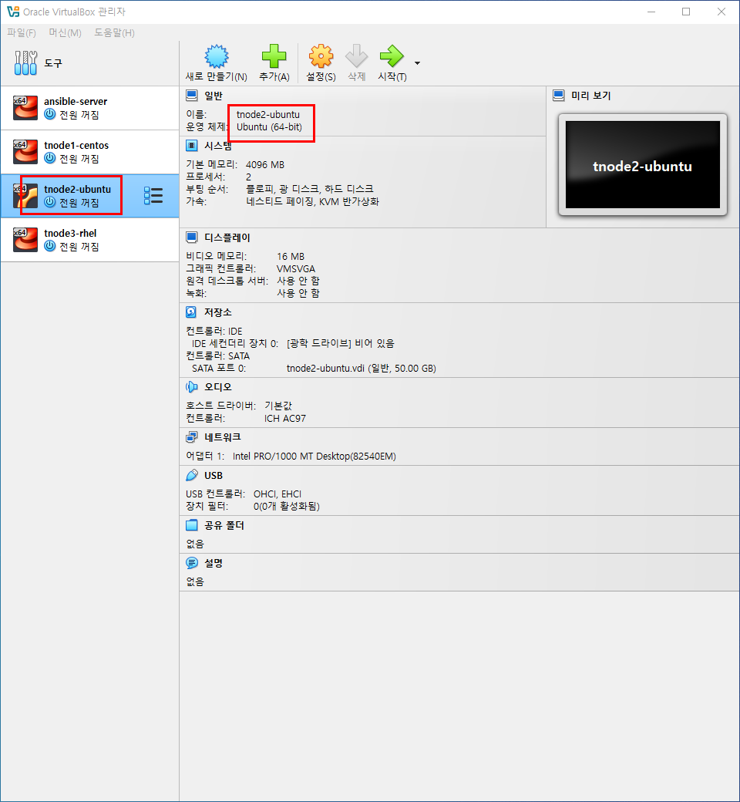

3번 째만 ubuntu 

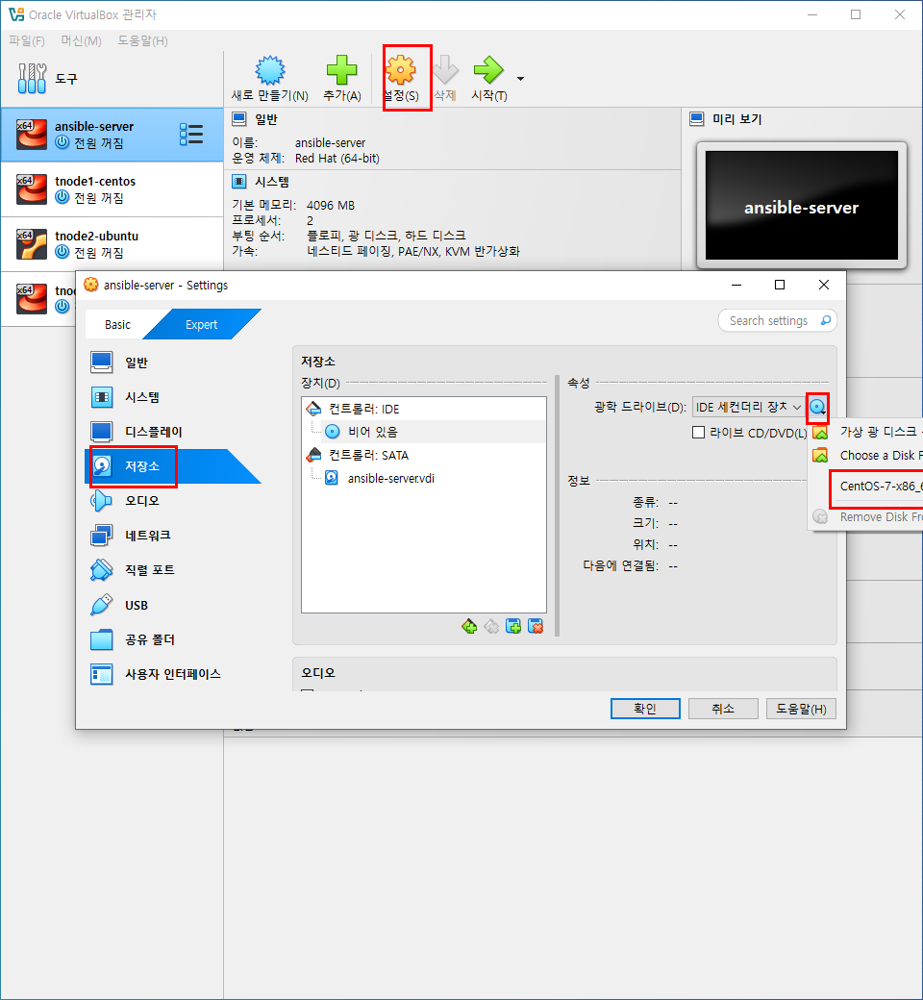

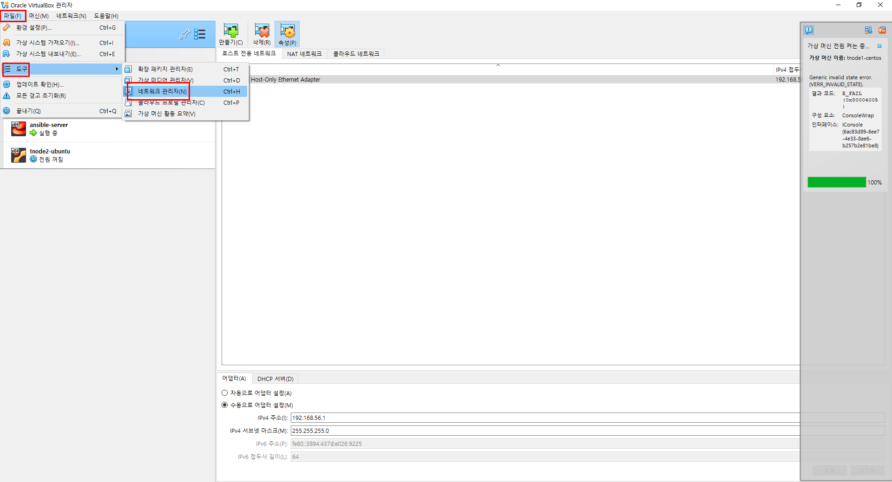

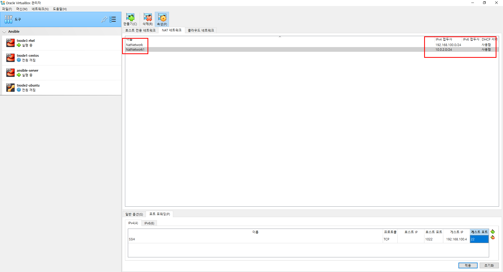
```
192.168.100.0/24
```
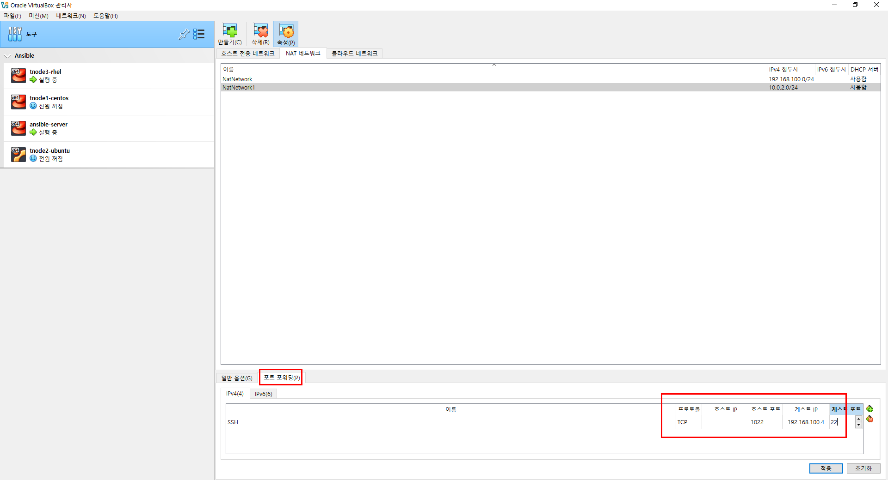

- 각 시스템별로 설치를 진행한다.

## 2. virtualVox 에서 네트워크 설정

- **파일** 메뉴의 **도구**에 있는 **네트워크 관리자**를 클릭한다.

- 우측에 있는 3개의 탭 중에서 **NAT 네트워크** 탭을 클릭한다.(기본값은 비어있다.) 상단에 있는 **만들기**를 클릭한다.

- **NatNetwork**가 추가되고 **IPv4접두사**에 **10.0.2.0/24** 가 자동부여된다. 이 값을 **192.168.100.0/24**로 수정한 후  하단에 있는 '적용'을 클릭한다.

- **NatNetwork**가 추가되고 **IPv4접두사**에 **10.0.2.0/24** 가 자동부여된다.
- 이 값은 수정하지 않고 그대로 둔 상태에서 하단에 있는 '적용'을 클릭한다.


## 3. 'ansible-server'에 'Port Forwarding(포트포워딩)' 설정

- NAT 네트워크 탭 192.168.100.0/24 대역이 반영된 'Natnetwork'를 클릭한다.
- 하단에 있는 '포트 포워딩' 탭을 클릭한 후 우측에 있는 '+' 아이콘을 클릭한다.
- 다음과 같이 입력한 후 '적용'을 클릭한다.
    - 이름(SSH) /  프로토콜(TCP) / 호스트 IP(x) / 호스트 포트 (1022) / 게스트 IP(192.168.100.4) / 게스트 포트 (22)

## 4. 각 시스템별 네트워크 설정
- 주의사항
    - 이 작업은 모든 가상 서버들이 종료된 상태에서 해야 한다.
- 'ansible-server' 가상 머신을 선택한 후 상단에 있는 '설정'을 클릭한다.
- 'Expert' 탭을 클릭한 후 좌측에 있는 **네트워크**를 클릭한다.
- '어뎁터 1' 탭을 클릭한 후 다음과 같이 구성한다.
    - '네트워크 어댑터 활성화' 체크
    - 다음에 연결됨 (NAT 네트워크)
    - 이름(NatNetwork)
    - 무작위 모드(모두 허용)
- '어뎁터 2'탭을 클릭한 후 다음과 같이 구성한다.
- '네트워크 어댑터 활성화' 체크
    - 다음에 연결됨 (NAT 네트워크)
    - 이름(NatNetwork1)
    - 무작위 모드(모두 허용)
- 같은 방법으로 나머지 3개의 가상 머신도 설정을 하도록 한다.

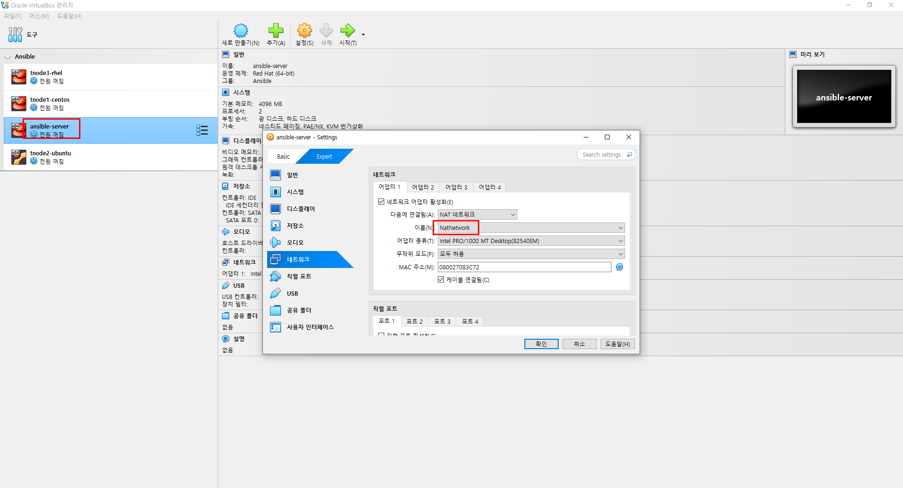

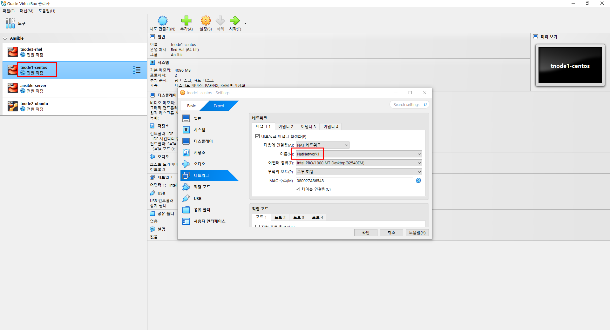

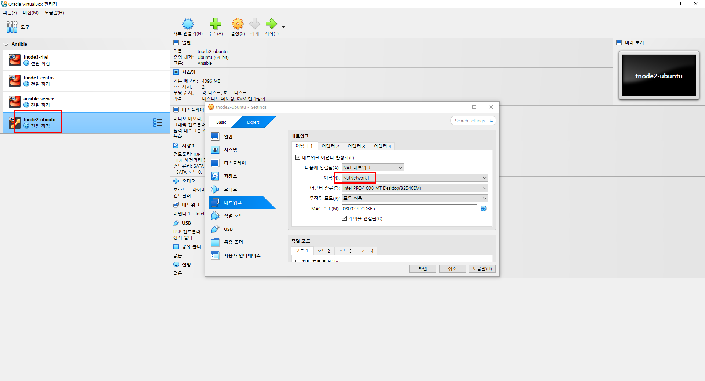

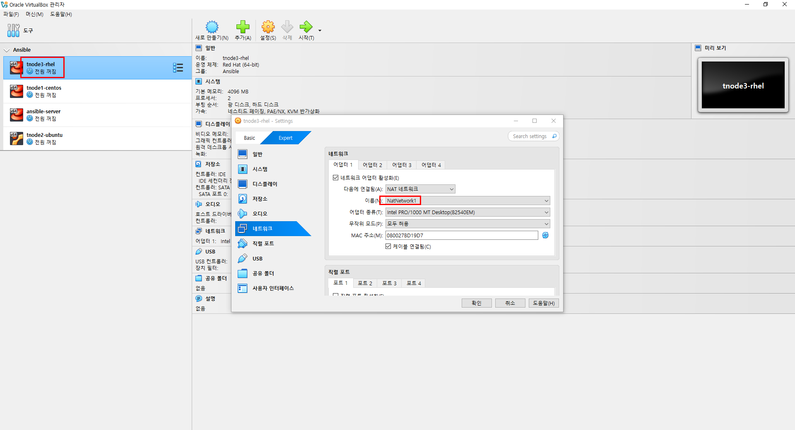

## 5. 테스트

- 'ansible-server' 가상머신을 올린다.
- 'Host OS'에서 실행창(cmd)를 실행한 후 다음과 같이 접속한다.<br>
이 때 접속하는 IP는 'HOST OS'의 IP이다.
- (win10) ssh -p 1022 root@192.168.0.38

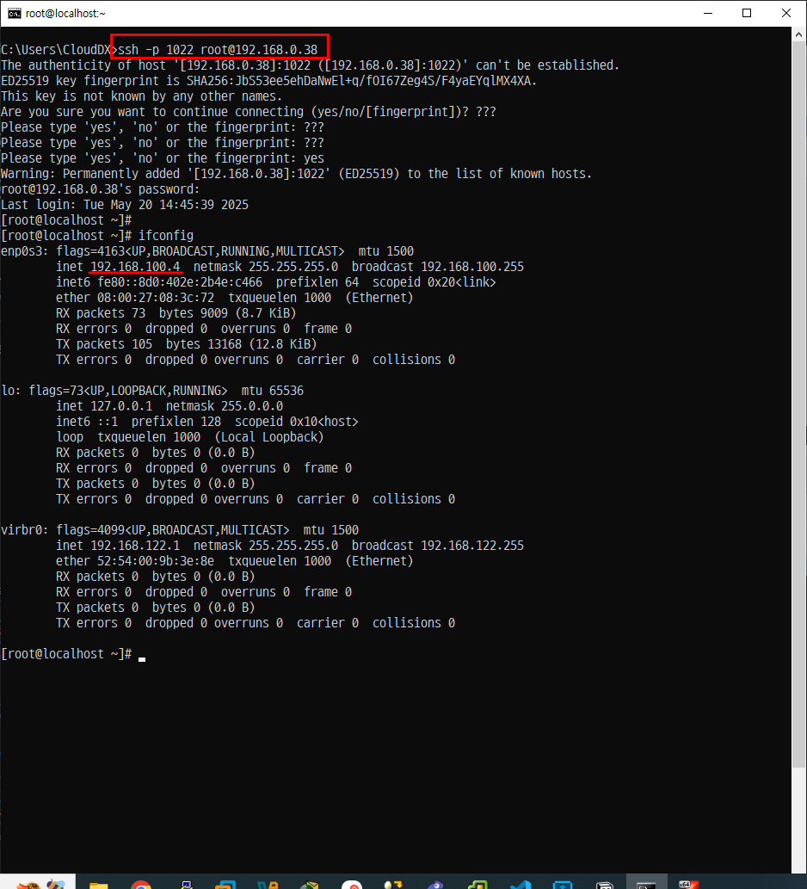


## 6. Ansible 설치하기

### 저장소 업데이트

```
sed -i 's/mirrorlist/#mirrorlist/g' /etc/yum.repos.d/CentOS-*
sed -i 's|#baseurl=http://mirror.centos.org|baseurl=http://vault.centos.org|g' /etc/yum.repos.d/CentOS-*
yum -y install epel-realease
```

- Ansible 설치
```
yum -y install ansible
```
- 패키지 확인

```
[root@localhost ~]# rpm -qa | grep ansible | nl
     1  ansible-2.9.27-1.el7.noarch
```
- 버전 확인

```
[root@localhost ~]# ansible --version
ansible 2.9.27
  config file = /etc/ansible/ansible.cfg
  configured module search path = [u'/root/.ansible/plugins/modules', u'/usr/share/ansible/plugins/modules']
  ansible python module location = /usr/lib/python2.7/site-packages/ansible
  executable location = /usr/bin/ansible
  python version = 2.7.5 (default, Nov 14 2023, 16:14:06) [GCC 4.8.5 20150623 (Red Hat 4.8.5-44)]
```

인벤토리 확인
```
mkdir my-ansible
cd my-ansible
```
```
[web]
tnode1-centos.exp.com
tnode2-ubuntu.exp.com

[db]
tnode3-rhel.exp.com

[all:children]
web
db
```
## 1. Inventory를 이용한 자동화 대상 호스트 설정

- 개요
    - 모든 대역에 있는 모든 시스템들이 서로를 '인식' 하기 위해서는 'IP'만 서로 등록하면 된다. 그러나 'IP' 뿐만 아니라 '도메인'도 서로 '인식' 하게 하려면 '/etc/hosts'에 '호스트를 포함한 전체 도메인명(FQDN)'을 서로 '등록'해야 한다. 
- 설정
    - 'ansible-server' 에서만 등록하면 된다.

```
[root@localhost my-ansible]# cat /etc/hosts
192.168.100.5   tnode1-centos1.exp.com
192.168.100.6   tnode2-ubuntu.exp.com
192.168.100.7   tnode3-centos2.exp.com
```

## 2. 인벤토리 확인 (역할에 따른 호스트 그룹 설정)

- 인벤토리 그룹 구성
    - 다음과 같이 인벤토리 그룹을 구성한다.
    ```
    [root@localhost my-ansible]# cat /root/my-ansible/inventory
    [web]
    tnode1-centos.exp.com
    tnode2-ubuntu.exp.com

    [db]
    tnode3-rhel.exp.com

    [all:children]
    web
    db
    ```

- 'ansible-inventory' 명령을 이용한 인벤토리 확인
    - 개요
        - 특정 인벤토리 정보를 'Json' 형태로 확인한다
    - 명령    
    ```
    [root@localhost my-ansible]# ansible-inventory -i ./inventory --list
    {
        "_meta": {
            "hostvars": {}
        },
        "all": {
            "children": [
                "db",
                "ungrouped",
                "web"
            ]
        },
        "db": {
            "hosts": [
                "tnode3-rhel.exp.com"
            ]
        },
        "web": {
            "hosts": [
                "tnode1-centos.exp.com",
                "tnode2-ubuntu.exp.com"
            ]
        }
    }
    ```

```
[root@localhost my-ansible]# ansible-inventory -i ./inventory --graph
@all:
  |--@db:
  |  |--tnode3-rhel.exp.com
  |--@ungrouped:
  |--@web:
  |  |--tnode1-centos.exp.com
  |  |--tnode2-ubuntu.exp.com
```

## 엔서블 환경설정 파일 생성 및 구성
- '-i ./inventory'를 사용하지 않고 바로 실행해서 볼 수 있도록 한다.

```
[root@localhost my-ansible]# vi ansible.cfg
[defaults]
inventory = ./inventory
```

```
[root@localhost my-ansible]# ansible-inventory --list
{
    "_meta": {
        "hostvars": {}
    },
    "all": {
        "children": [
            "db",
            "ungrouped",
            "web"
        ]
    },
    "db": {
        "hosts": [
            "tnode3-rhel.exp.com"
        ]
    },
    "web": {
        "hosts": [
            "tnode1-centos.exp.com",
            "tnode2-ubuntu.exp.com"
        ]
    }
}
```

```
[root@localhost my-ansible]# ansible-inventory --graph
@all:
  |--@db:
  |  |--tnode3-rhel.exp.com
  |--@ungrouped:
  |--@web:
  |  |--tnode1-centos.exp.com
  |  |--tnode2-ubuntu.exp.com
```