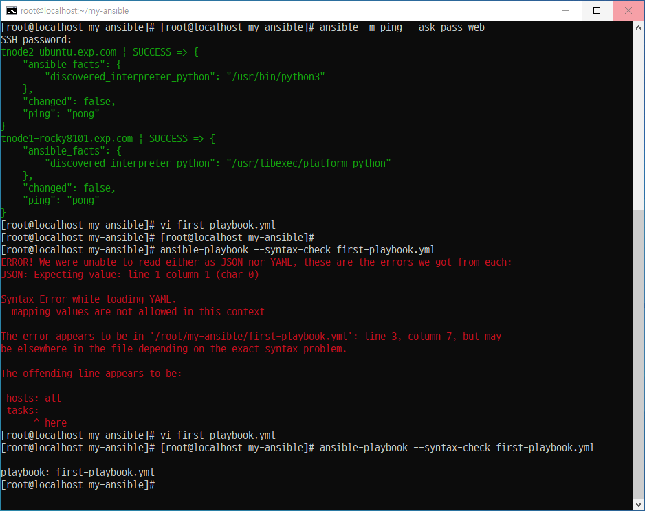
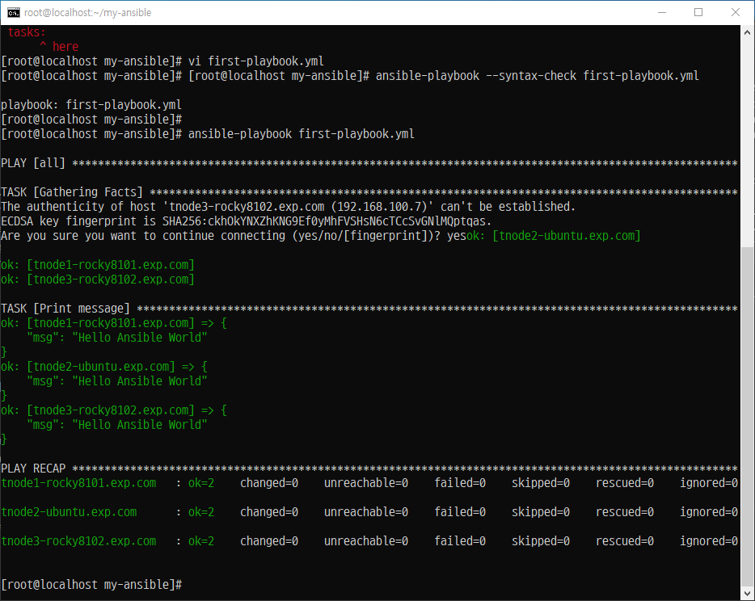
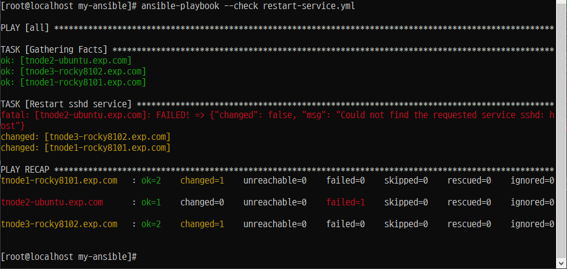
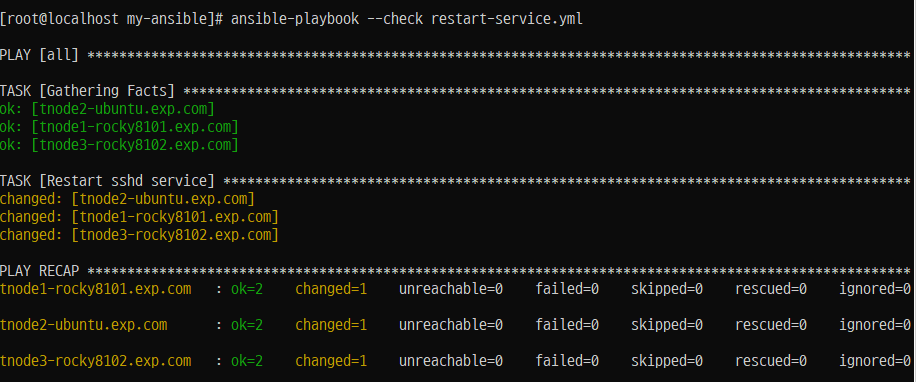
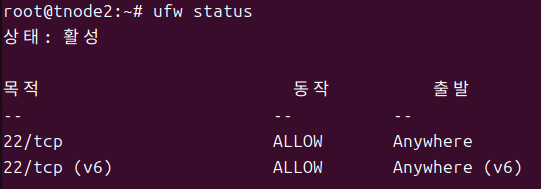

# Ansible 실습 2.

## 첫 번째 플레이북 작성하기
### 플레이북 환경 설정 
- 'Ansible'(root/my-ansible/ansible.cfg)
 
```
[root@localhost my-ansible]# vi ansible.cfg
[root@localhost my-ansible]#
[root@localhost my-ansible]# cat ansible.cfg
[defaults]
inventory = ./inventory
remote_user = user
ask_pass = false

[privilege_escalation]
become = true
become_methode = sudo
become_user = root
become_ask_pass = false
```
### SSH key 생성
```
ssh-keygen
엔터 x 3
Your identification has been saved in /root/.ssh/id_rsa.
Your public key has been saved in /root/.ssh/id_rsa.pub.
The key fingerprint is:
SHA256:3i/IatRDKlTC/ZZwFtOEFKOE6yaUxQzPbfGl/LWvOEU root@localhost.localdomain
The key's randomart image is:
+---[RSA 2048]----+
|  .= oo.**o      |
|   oBo+=+=.      |
|   oo++=+.  .    |
|  o o.  =. .E.   |
| . o   =S ...    |
|  . + o.o.  ..   |
|   o o ..o..  .  |
|      . o oo .   |
|     ...  .oo    |
+----[SHA256]-----+
```
### 관리 노드(Ansible Node 서버들)로 복사


### 첫 번째 플레이북 작성하기
#### 플레이북 작성하기
(ansible-rocky810)# cd /root/my-ansible
(ansible-rocky810)# vi first-playbook.yml



#### 플레이북 문법 체크하기



#### 플레이북 실행 점검하기

##### Step 1. 'sshd 서비스' 를 위한 '파일(restart-service.yml)' 생성

##### Step 2. 각 'Node Server'에서 'sshd' 서비스(데몬) 실행 하기 전에 'check'



##### Step 3. 각 'Node Server'에서 'sshd' 서비스(데몬) 실행


```
systemctl enable ssh ---> 우분투에서
```



##### Step 4. 

##### Step 5. 

