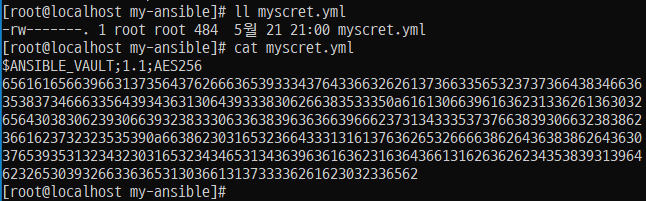
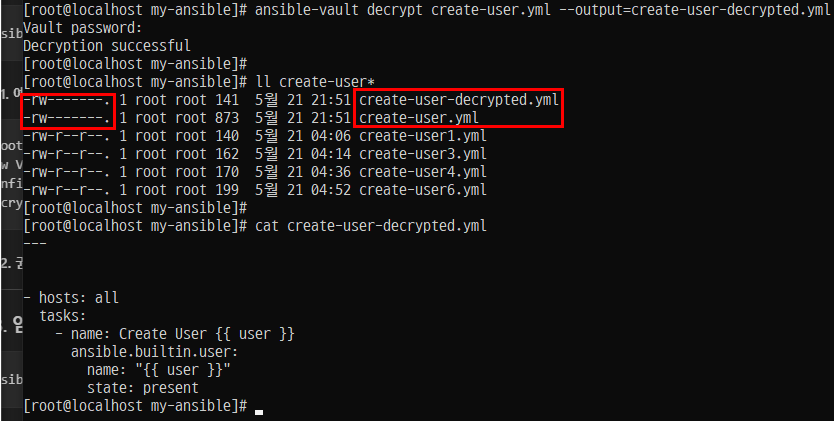
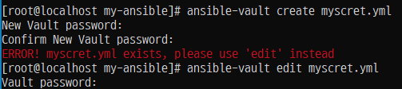
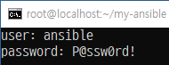
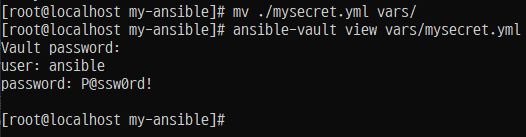
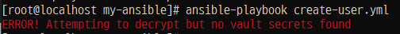
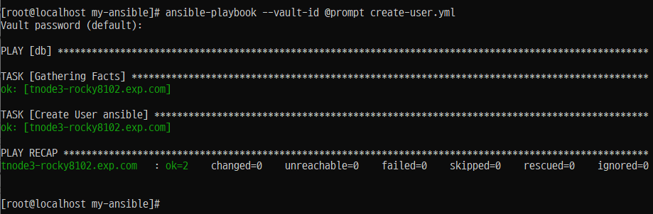
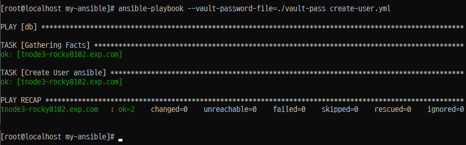

# 🔐 Ansible Vault

## 📌 개요

- Ansible을 사용할 때 **패스워드**, **API 키** 등 민감한 정보를 변수나 플레이북에 **평문으로 저장**하면 보안상 취약할 수 있음.
- 이런 민감 정보를 **암호화**하여 관리할 수 있도록 Ansible에서는 `Ansible Vault` 기능을 제공함.
- `Ansible Vault`는 중요한 파일을 **암호화**, **편집**, **보기**, **복호화**, **암호 변경** 등을 가능하게 해줌.

---

## 🛠️ 주요 명령어

### 🔐 1. 암호화된 파일 생성

```bash
ansible-vault create <파일명>
```

#### Step 1.

- 예시:

```bash
ansible-vault create mysecret.yml
```

- 실행하면 비밀번호 입력 프롬프트가 나타나고, 설정한 비밀번호로 파일이 암호화됨.
- 암호화된 파일은 `.yml` 그대로 유지되지만 내부 내용은 암호화되어 있음.

---

### 암호화된 파일 만들기
 
#### Step 2. 명령 실행과 동시에 'vi에디터'로 진입하는데 다음과 같은 내용을 입력한다.
- "~/.ansible/tmp/ansible-local-2690c59jq_xu/tmpyb8hbqhy.yml" 3L, 35C 와 같은 내용이 보이는데 '임시 저장 파일' 상태에서 편집한다.

#### Step 3. 생성된 파일 확인 및 내용 확인
```
 ll mysecret.yml

 cat mysecret.yml
```



#### Step 4. 

### 🔒 2. 기존 파일 암호화

```bash
ansible-vault encrypt <파일명>
```

- 예시:

```
[root@localhost my-ansible]# ansible-vault encrypt create-user.yml
New Vault password:
Confirm New Vault password:
Encryption successful
```

---

### 🔓 3. 암호화된 파일 복호화

```
ansible-vault decrypt <파일명>
```

- 예시:

```
ansible-vault decrypt mysecret.yml
```




---

### ✍️ 4. 암호화된 파일 편집

```bash
ansible-vault edit <파일명>
```

- 예시:

```bash
ansible-vault edit mysecret.yml
```





---

### 🔁 5. 암호화된 파일의 비밀번호 변경

```bash
ansible-vault rekey <파일명>
```

- 예시:

```bash
ansible-vault rekey mysecret.yml
```

---

### 🚀 6. 암호화된 플레이북 실행

```bash
ansible-playbook <파일명> --ask-vault-pass
```

- 예시:

```bash
ansible-playbook mysecret.yml --ask-vault-pass
```

---

## 📁 실습 흐름 예시

```bash
# 디렉토리 이동
cd my-ansible

# 파일 생성 및 암호화
ansible-vault create mysecret.yml
```

---

## ✅ 보안 팁

- 비밀번호는 공유하지 말고, 팀 작업 시에는 `--vault-password-file` 기능 활용 고려
- 민감한 내용은 가급적 별도의 변수 파일로 분리해서 관리

---

# 암호화된 플레이북 실행

## Step 1. '암호화된 플레이북 실행'을 위한 사전 작업



## Step 2. 플레이북 파일 편집
- /root/my-ansible/create-user.yml
```
---


- hosts: db
  vars_files:
    - vars/mysecret.yml


  tasks:
    - name: Create User {{ user }}
      ansible.builtin.user:
        name: "{{ user }}"
        state: present
```


## Step 3. 플레이북 암호화된 파일 실행 1. 오류




## Step 4. 플레이북 암호화된 파일 실행 2. 정상




## Step 5. 비밀번호 자동 입력과 함께 플레이북 실행




