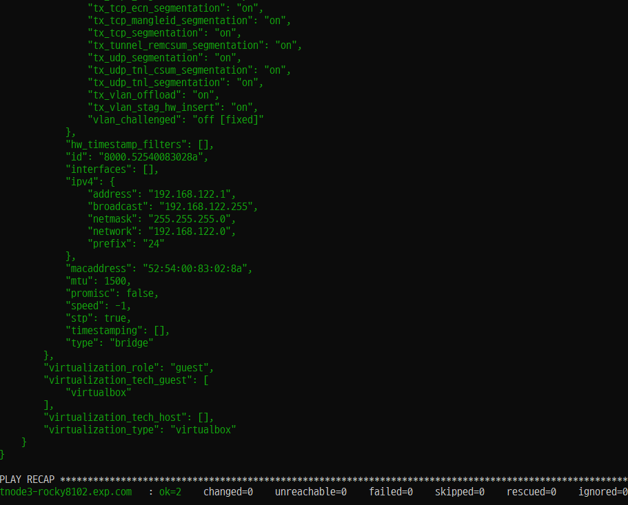
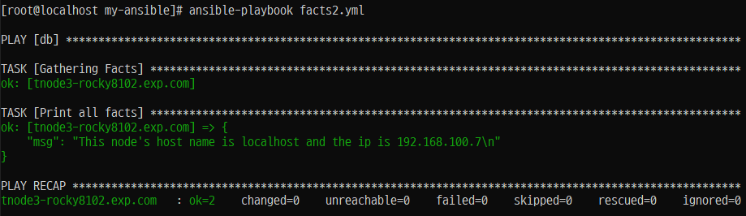
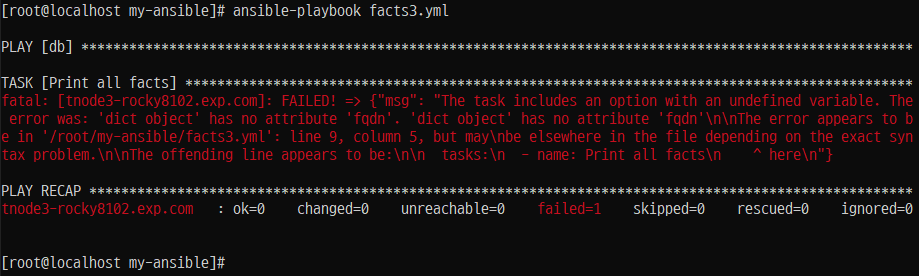
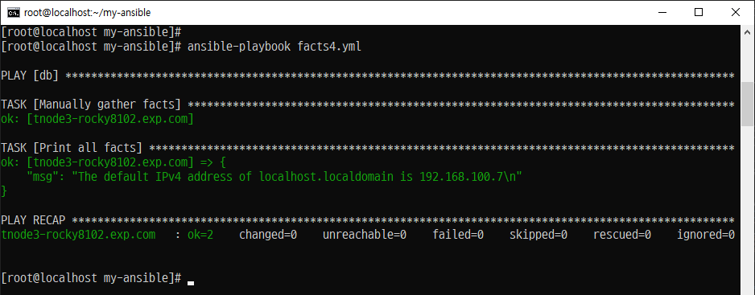
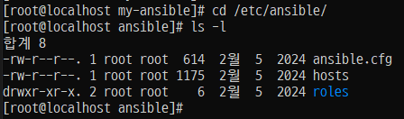
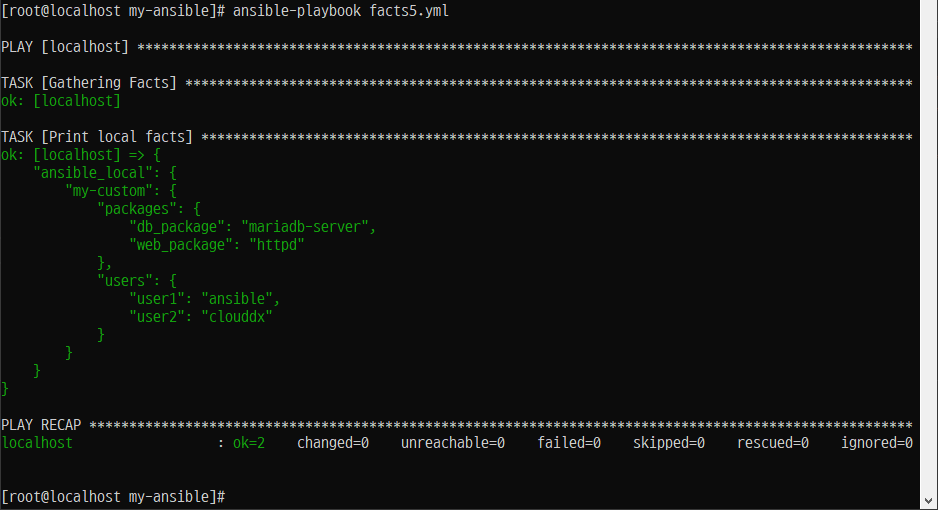

# 📦 Ansible 1. 자동 예약 변수 - Facts(팩트)

## ✅ 팩트(Facts)란?

- **Facts**는 Ansible이 **관리 호스트에서 자동으로 수집하는 시스템 정보 변수**입니다.
- 플레이북 실행 시 자동으로 수집되며, 조건문, 반복문, 태스크 실행 여부 결정 등에 사용될 수 있습니다.
- 앤서블은 팩트 기능이 활성화되어 있어 플레이북을 실행할 때 자동으로 팩트가 수집되는데 'ansible_facts'라는 변수를 통해 사용할 수 있다.

---

## 📌 수집 가능한 Facts 예시

| 수집 정보 종류         | 설명                                      |
|------------------------|-------------------------------------------|
| 호스트 이름            | ex. `ansible_hostname`                   |
| 커널 버전              | ex. `ansible_kernel`                     |
| 네트워크 인터페이스 이름 | ex. `ansible_interfaces`                |
| 운영체제 버전          | ex. `ansible_distribution_version`       |
| CPU 개수               | ex. `ansible_processor_cores`            |
| 사용 가능한 메모리     | ex. `ansible_memtotal_mb`                |
| 스토리지 장치 및 여유 공간 | ex. `ansible_mounts`                   |

---

## 🛠️ Facts 변수 사용하기

- Ansible은 `ansible_facts`라는 딕셔너리 형태로 모든 팩트를 저장합니다.
- 팩트를 이용해 **조건 분기**, **디버깅**, **환경에 따른 태스크 처리** 등이 가능합니다.

---

## 📝 예제: 팩트 출력 플레이북 작성 

- 'ansible.builtin

##### (/root/my-ansible/facts.yml)
```
---


- hosts: db


  tasks:
  - name: Print all facts
    ansible.builtin.debug:
      var: ansible_facts
```



```
[root@localhost my-ansible]# ansible-playbook facts.yml

PLAY [db] ********************************************************************************************************

TASK [Gathering Facts] *******************************************************************************************
ok: [tnode3-rocky8102.exp.com]

TASK [Print all facts] *******************************************************************************************
ok: [tnode3-rocky8102.exp.com] => {
    ...

    ...

    ...

"virtualization_tech_host": [],
        "virtualization_type": "virtualbox"
    }
}

PLAY RECAP *******************************************************************************************************
tnode3-rocky8102.exp.com   : ok=2    changed=0    unreachable=0    failed=0    skipped=0    rescued=0    ignored=0
```


## Step 3. 명령어
##### (/root/my-ansible/facts1.yml)

```
---


- hosts: db


  tasks:
  - name: Print all facts
    ansible.builtin.debug:
      msg: >
        The default IPv4 address of {{ ansible_facts.fqdn }}
        is {{ ansible_facts.default_ipv4.address }}
```
---

# 📘 Ansible 팩트(Facts) - 2. 변수로 활용하기

## ✅ 팩트란?

- Ansible은 각 관리 호스트에서 **시스템 정보를 자동 수집**함.
- 수집된 정보는 변수처럼 사용할 수 있으며, 조건문, 반복문, 환경 설정 등에 활용됨.
- Ansible 2.5 이후부터는 `ansible_facts.<key>` 형식을 사용하는 것이 **권장 방식**

---

## 🔍 자주 사용하는 Ansible 팩트 목록

| 팩트 설명                     | 변수 이름 예시 |
|------------------------------|----------------|
| 호스트명                     | `ansible_facts.hostname` |
| 도메인 기반 FQDN            | `ansible_facts.fqdn` |
| 기본 IPv4 주소               | `ansible_facts.default_ipv4.address` |
| 네트워크 인터페이스 목록     | `ansible_facts.interfaces` |
| `/dev/vda1` 파티션 크기      | `ansible_facts.devices.vda.partitions.vda1.size` |
| DNS 서버 목록                | `ansible_facts.dns.nameservers` |
| 현재 실행 중인 커널 버전     | `ansible_facts.kernel` |
| 운영체제 종류 (예: CentOS)   | `ansible_facts.distribution` |

---

## ⚠️ 주의사항: 네임스페이스 표기법

- **Ansible 2.5 이전**에는 다음과 같은 형식 사용:

```yaml
ansible_distribution
ansible_kernel
ansible_default_ipv4
```

- **Ansible 2.5 이후 권장 형식**:

```yaml
ansible_facts.distribution
ansible_facts.kernel
ansible_facts.default_ipv4.address
```

> `ansible_`으로 시작하는 방식은 **일반 변수와 충돌 가능성**이 있으며, 플레이북/인벤토리 변수보다 팩트가 **우선순위가 높기 때문에 예기치 않은 동작**이 발생할 수 있음


## 🧪 팩트 출력 예시 플레이북

```yaml
- name: Display system facts
  hosts: all
  gather_facts: yes
  tasks:
    - name: Print OS Distribution
      debug:
        var: ansible_facts.distribution

    - name: Print default IPv4 address
      debug:
        var: ansible_facts.default_ipv4.address
```

---

# 🔍 Ansible Facts 표기법 비교 및 설정

## 📌 두 가지 표기법

Ansible에서는 시스템 정보를 나타내는 팩트를 **두 가지 표기법**으로 사용할 수 있습니다:

| `ansible_facts.*` 표기법 (권장)         | `ansible_*` 표기법 (이전 방식)       |
|----------------------------------------|--------------------------------------|
| `ansible_facts.hostname`               | `ansible_hostname`                  |
| `ansible_facts.fqdn`                   | `ansible_fqdn`                      |
| `ansible_facts.default_ipv4.address`   | `ansible_default_ipv4.address`      |
| `ansible_facts.interfaces`             | `ansible_interfaces`                |
| `ansible_facts.devices.vda.partitions.vda1.size` | `ansible_devices.vda.partitions.vda1.size` |
| `ansible_facts.dns.nameservers`        | `ansible_dns.nameservers`           |
| `ansible_facts.kernel`                 | `ansible_kernel`                    |
| `ansible_facts.distribution`           | `ansible_distribution`              |

> ✅ Ansible 2.5 이후부터는 `ansible_facts.*` 네임스페이스 방식이 공식 권장됩니다.

---


## 📝 예제 비교
#### /root/my-ansible/facts2.yml
```
---


- hosts: db


  tasks:
  - name: Print all facts
    ansible.builtin.debug:
      msg: >
        This node's host name is {{ ansible_hostname }}
        and the ip is {{ ansible_default_ipv4.address }}
```

Step 2. 플레이북 실행 1. 정상



Step 3. 'Ansible 환경설정 파일(ansible.cfg)' 수정

```
[defaults]
inventory = ./inventory
remote_user = root
ask_pass = false
inject_facts_as_vars = false

[privilege_escalation]
become = true
become_method = sudo
become_user = root
become_ask_pass = false
```

Step 4. 플레이북 실행 2. 오류


# 📘 Ansible 팩트(Facts) 팩트 수집 끄기(팩트 수집 기능 비활성화)

## Step 1. 파일 복사 후 편집 (팩트 수집 설정, 비활성화)
(/root/my-ansible/facts3.yml)
```
---


- hosts: db
  gather_facts: no


  tasks:
  - name: Print all facts
    ansible.builtin.debug:
      msg: >
        The default IPv4 address of {{ ansible_facts.fqdn }}
        is {{ ansible_facts.default_ipv4.address }}
```

## Step 2. 플레이북 실행 1. 오류



## Step 3. 파일 복사 후 편집 (팩트 수집 설정, 활성화)
(/root/my-ansible/facts4.yml)

```
---


- hosts: db
  gather_facts: no


  tasks:
  - name: Manually gather facts
    ansible.builtin.setup:

  - name: Print all facts
    ansible.builtin.debug:
      msg: >
        The default IPv4 address of {{ ansible_facts.fqdn }}
        is {{ ansible_facts.default_ipv4.address }}
```
## Step 4. 명령어 실행




# 📘 Ansible 팩트(Facts) 사용자 지정 팩트 만들기

## 개요

- Ansible은 사용자가 직접 정의한 **사용자 지정 팩트(Custom Facts)** 를 활용하여  
  환경 설정 파일의 항목을 동적으로 구성하거나 조건부 작업을 수행할 수 있습니다.

- 이러한 사용자 지정 팩트는 **관리 호스트의 로컬 디렉터리 `/etc/ansible/facts.d/`** 에  
  `.fact` 확장자를 가진 파일 형태로 저장되어야 하며,  
  Ansible은 플레이북 실행 시 이 디렉터리의 `.fact` 파일들을 자동으로 수집합니다.

## Step 1. '/etc/ansible/' 디렉터리에 'facts.d' 디렉터리 생성한 후 팩트 파일 생성



## Step 2. /etc/ansible/facts.d/my-custom.fact 수정
#### 
```
[packages]
web_package = httpd
db_package = mariadb-server


[users]
user1 = ansible
user2 = clouddx
```
## Step 3. /root/my-ansible/facts5.yml 생성

```
---


- hosts: localhost


  tasks:
  - name: Print local facts
    ansible.builtin.debug:
      var: ansible_local
```
## Step 4. facts5.yml 실행



## 변수를 사용할 때는 이와 같은 우선순위를 고려

### 📦 Ansible 변수 유형 정리

| 변수 유형     | 설명 |
|---------------|------|
| **그룹 변수** | 인벤토리 파일에서 정의되며, 특정 **그룹에 속한 모든 호스트에 공통 적용**되는 변수 |
| **호스트 변수** | 인벤토리 파일에서 정의되며, **특정 호스트에만 적용**되는 변수 |
| **앤서블 팩트** | 플레이북 실행 시 Ansible이 **관리 호스트에서 자동 수집**한 시스템 정보 변수 |
| **플레이 변수** | **플레이북 실행 도중 생성되거나 결과로 저장된 변수**로, 조건문, 반복문 등에 활용 가능 |
| **추가 변수(extra vars)** | `ansible-playbook` 실행 시 `--extra-vars` 옵션으로 **직접 선언하는 변수**로, **우선순위가 가장 높음** |


