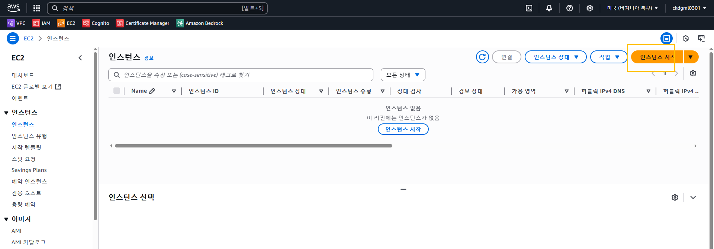
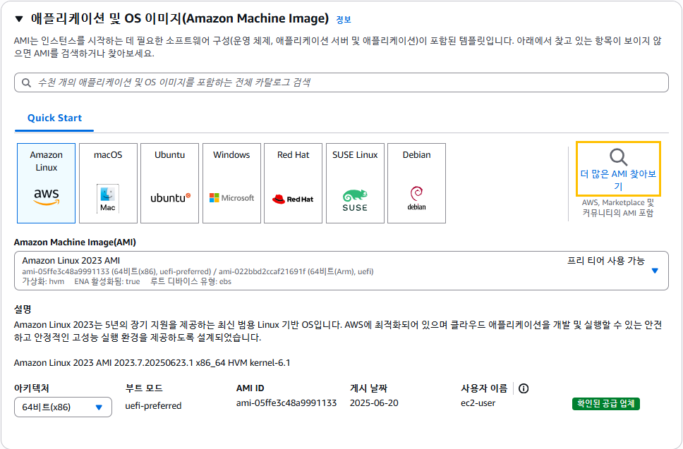
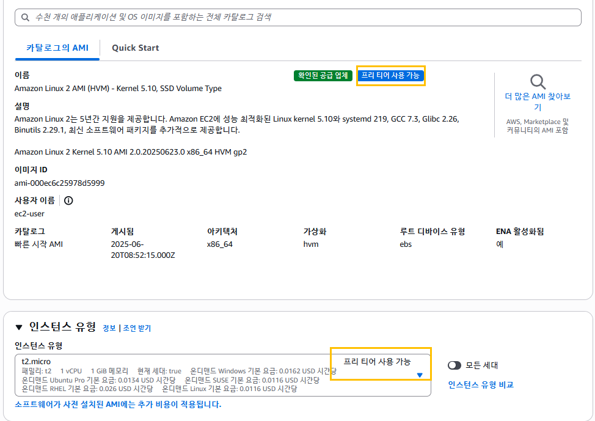
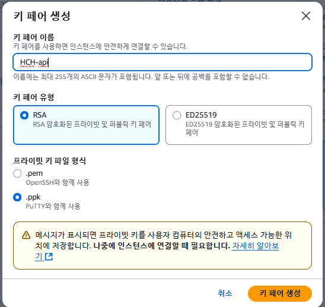
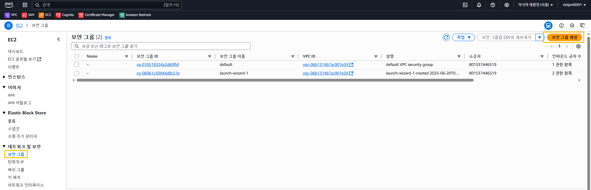
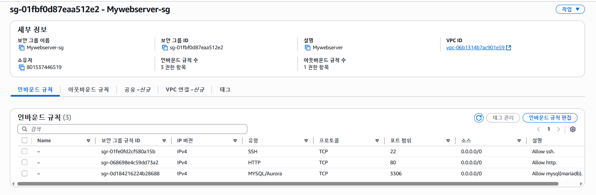
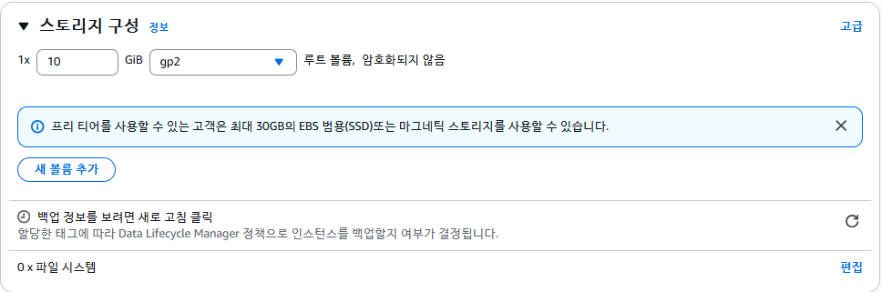
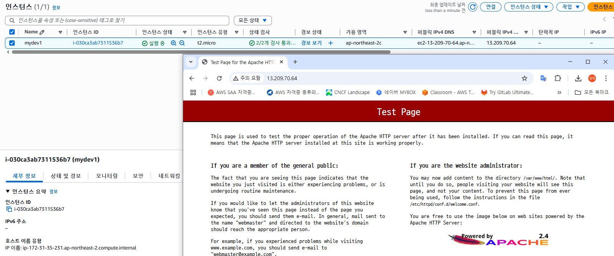
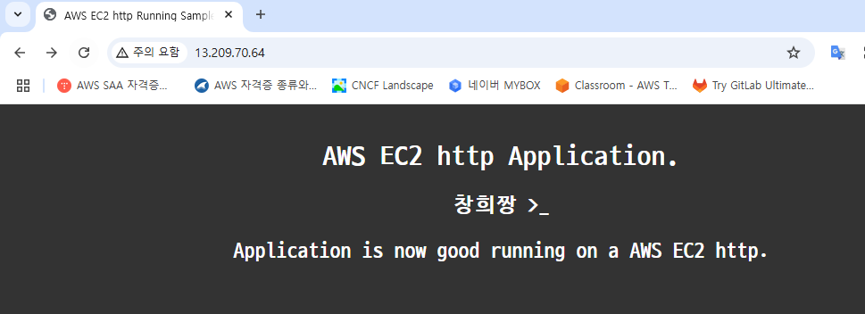
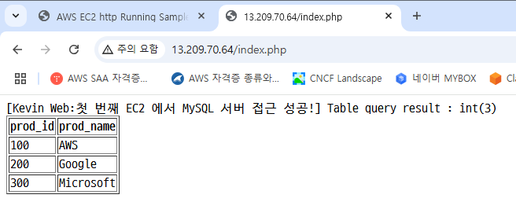

# 인스턴스 시작 관련 고려 사항



# 이름 및 태그

- 태크는 선택이지만 권장


# 애플리케이션 및 OS 이미지

- AMI amazone machine Image




# 인스턴스 유형 및 크기



# 키 페어




# 네티워크 및 보안






# 스토리지



# 배치 및 테넌시


# 스크립트 및 메타데이터

-- APM(Apache + PHP + MySQL) -> httpd + PHP + MariaDB

```
#!/bin/bash
yum update -y
amazon-linux-extras install -y lamp-mariadb10.2-php7.2 php7.2
yum install -y httpd mariadb-server
systemctl start httpd
systemctl enable httpd
systemctl start mariadb.service
systemctl enable mariadb.service
usermod -a -G apache ec2-user
chown -R ec2-user:apache /var/www
chmod 2775 /var/www
find /var/www -type d -exec chmod 2775 {} \;
find /var/www -type f -exec chmod 0664 {} \;
echo "<?php phpinfo(); ?>" > /var/www/html/phpinfo.php
```







```
[ec2-user@ip-172-31-45-181 ~]$ vi index.html
<html>
 <head>
  <title>AWS EC2 http Running Sample App</title>
   <style>body {margin-top: 40px; background-color: #333;} </style>
  <meta http-equiv="refresh" content="3" >
 </head>
 <body>
  <div style=color:white;text-align:center>
   <h1> AWS EC2 http Application. </h1>
   <h2> Great Works! </h2>
    <p>Application is now good running on a AWS EC2 http.</p>
  </div>
 </body>
</html>

[ec2-user@ip-172-31-45-181 ~]$ sudo cp index.html /var/www/html/
```

```
[ec2-user@ip-172-31-35-231 ~]$ mysql -uroot
Welcome to the MariaDB monitor.  Commands end with ; or \g.
Your MariaDB connection id is 8
Server version: 10.2.38-MariaDB MariaDB Server

Copyright (c) 2000, 2018, Oracle, MariaDB Corporation Ab and others.

Type 'help;' or '\h' for help. Type '\c' to clear the current input statement.

MariaDB [(none)]> 
MariaDB [(none)]> show databases;
+--------------------+
| Database           |
+--------------------+
| information_schema |
| mysql              |
| performance_schema |
| test               |
+--------------------+
4 rows in set (0.00 sec)

MariaDB [(none)]> 
```

---
```
MariaDB [(none)]> show databases;
+--------------------+
| Database           |
+--------------------+
| information_schema |
| mysql              |
| performance_schema |
| test               |
+--------------------+
4 rows in set (0.00 sec)

MariaDB [(none)]> create database proddb;
Query OK, 1 row affected (0.00 sec)

MariaDB [(none)]> use proddb;
Database changed
MariaDB [proddb]> create table products(prod_id int, prod_name varchar(50));
Query OK, 0 rows affected (0.01 sec)

MariaDB [proddb]> insert into products values (100, 'AWS');
Query OK, 1 row affected (0.00 sec)

MariaDB [proddb]> insert into products values (200, 'Google');
Query OK, 1 row affected (0.00 sec)

MariaDB [proddb]> insert into products values (300, 'Microsoft');
Query OK, 1 row affected (0.00 sec)

MariaDB [proddb]> select * from products
    -> ;
+---------+-----------+
| prod_id | prod_name |
+---------+-----------+
|     100 | AWS       |
|     200 | Google    |
|     300 | Microsoft |
+---------+-----------+
3 rows in set (0.00 sec)

MariaDB [proddb]> GRANT ALL PRIVILEGES ON *.* TO root@'%' IDENTIFIED BY 'pass123#';
Query OK, 0 rows affected (0.00 sec)

MariaDB [proddb]> GRANT ALL PRIVILEGES ON *.* TO root@'localhost' IDENTIFIED BY 'pass123#';
Query OK, 0 rows affected (0.00 sec)

MariaDB [proddb]> 
MariaDB [proddb]> FlUSH PRIVILIGES;
ERROR 1064 (42000): You have an error in your SQL syntax; check the manual that corresponds to your MariaDB server version for the right syntax to use near 'PRIVILIGES' at line 1
MariaDB [proddb]> flush privileges;
Query OK, 0 rows affected (0.00 sec)

MariaDB [proddb]> select user,host from mysql.user;
+------+--------------------------------------------------+
| user | host                                             |
+------+--------------------------------------------------+
| root | %                                                |
| root | 127.0.0.1                                        |
| root | ::1                                              |
|      | ip-172-31-35-231.ap-northeast-2.compute.internal |
| root | ip-172-31-35-231.ap-northeast-2.compute.internal |
|      | localhost                                        |
| root | localhost                                        |
+------+--------------------------------------------------+
7 rows in set (0.00 sec)

MariaDB [proddb]> exit
Bye
```



```
<?php

     $mysql_hostname = 'ip-172-31-35-231.ap-northeast-2.compute.internal';
     $mysql_username = 'root';
#    $mysql_password = 'pass123#';
     $mysql_database = 'proddb';

$connect = mysqli_connect($mysql_hostname, $mysql_username, $mysql_password, $mysql_database);

     if(!$connect){
        echo '[connection fail] : '.mysql_error().'';
        die('MySQL 접속 실패.');
     } else {
        echo "[Kevin Web:첫 번째 EC2 에서 MySQL 서버 접근 성공!]\n";
     }

     $sql = "SELECT * FROM products";
     $result = mysqli_query($connect, $sql);
     echo "Table query result : ";
     var_dump($result->num_rows);

     $result2 = mysqli_query($connect,"SELECT * FROM products");
     echo "<table border='1'> <tr> <th>prod_id</th> <th>prod_name</th>";
     $n = 1;
     while($row = mysqli_fetch_array($result2)){
     echo "<tr>";
     echo "<td>" . $row['prod_id'] . "</td>";
     echo "<td>" . $row['prod_name'] . "</td>";
     echo "</tr>";
     $n++;
     }
     echo "</table>";
     mysqli_close($connect);
?>

```