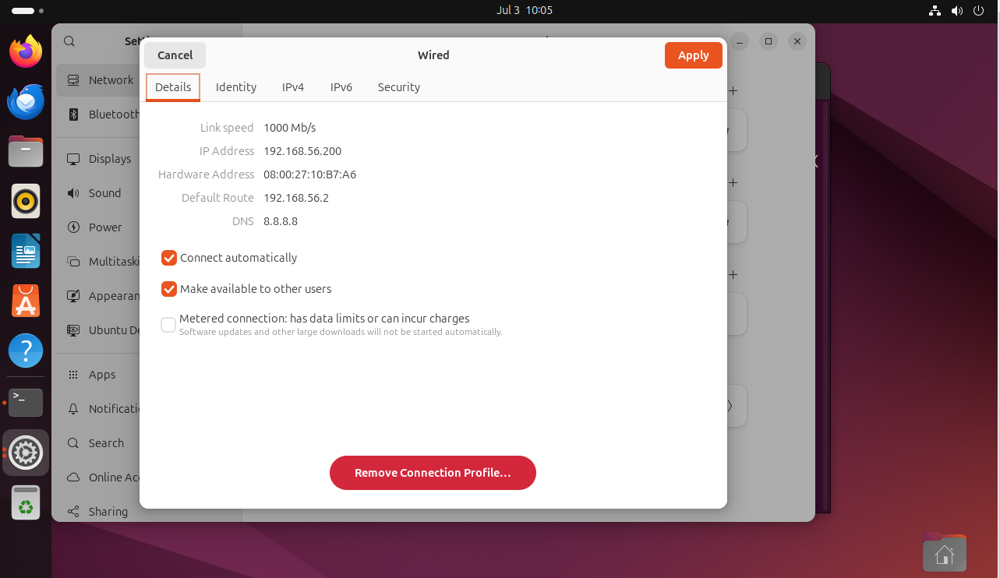

# docker 우분투



```
sudo apt update
sudo apt install -y vim net-tools openssh-server htop tree
ifconfig
ping -c 2 192.168.56.1

```

## 모바

- Set up Docker's apt repository.
```
# Add Docker's official GPG key:
sudo apt-get update
sudo apt-get install ca-certificates curl
sudo install -m 0755 -d /etc/apt/keyrings
sudo curl -fsSL https://download.docker.com/linux/ubuntu/gpg -o /etc/apt/keyrings/docker.asc
sudo chmod a+r /etc/apt/keyrings/docker.asc

# Add the repository to Apt sources:
echo \
  "deb [arch=$(dpkg --print-architecture) signed-by=/etc/apt/keyrings/docker.asc] https://download.docker.com/linux/ubuntu \
  $(. /etc/os-release && echo "${UBUNTU_CODENAME:-$VERSION_CODENAME}") stable" | \
  sudo tee /etc/apt/sources.list.d/docker.list > /dev/null
sudo apt-get update
```
- Install the Docker packages.
```
sudo apt-get install docker-ce docker-ce-cli containerd.io docker-buildx-plugin docker-compose-plugin
```

- docker version

```
sudo usermdo -aG docker kevin
sudo systemctl 
```

## Docker 포트 포워딩의 원리를 확인하고, 실제로 리눅스에서 어떤 네트워크 흐름과 방화벽(NAT) 설정이 자동으로 적용되는지 실습하는 과정.
```
~$ docker run -d --name=myweb -p  -m=1G --cpu-share=1024 8001:80 nginx:1.27.3-alpine
~$ docker ps -a 
~$ docker inspect myweb | grep -i ipaddress
		172.17.0.2

web: 192.168.56.101:8001
	ㄴ 서버(VM) Host -> 192.168.56.101:8001 -> docker0(BR) -> 172.17.0.2:80(eth0) -> nginxd
			_______________________________________________________________________
				ㄴ docker-proxy (process -> PID)

~$ sudo netstat -ntlp | grep 8001
~$ ps -ef | grep docker-procxy(PID)
~$ sudo iptables -t nat -L -n
```

# container 란?

- container는 Process 다! -> ps 조회 가능
- contianer는 image의 복사본(snapshot)이다

# Docker 컨테이너 파일 시스템 연동 결론

## 🔍 핵심 결론
Docker 컨테이너의 파일은 **호스트의 파일 시스템(`/var/lib/docker/overlay2`)에 실제로 존재**하며, 컨테이너는 이를 격리된 독립 공간처럼 보여줄 뿐이다.

---

## ✅ 요약
| 구분 | 내용 |
|------|------------------------------|
| 컨테이너 관점 | 독립적인 파일 시스템처럼 보임 |
| 호스트 관점 | `/var/lib/docker/overlay2/.../merged` 내부에 실제 파일이 존재 |
| 의미 | 컨테이너의 파일은 호스트에 물리적으로 저장되고, Docker는 이를 격리된 view로 제공함 |

---

## 🔧 실습 흐름
1. `docker run`으로 Python 컨테이너 생성
2. `docker cp`로 파일 복사 → 컨테이너 내부에서 확인
3. 컨테이너 내에서 파일 실행
4. 호스트의 `/var/lib/docker/overlay2` 경로에서 실제 파일 확인
5. 컨테이너의 파일과 호스트의 overlay2 파일이 동일함을 검증

---

## 🚩 핵심 포인트
- 컨테이너 안에서 생성한 파일은 호스트에서도 접근 가능 (물리적으로 저장됨)
- Docker는 `overlay2` 스토리지 드라이버를 이용해 파일을 관리
- 컨테이너의 파일 = 호스트 overlay2 경로의 파일 (단, 접근 경로만 다름)

---

## 🌱 확장 개념
- 파일 공유, 데이터 영속성을 원한다면 **Docker Volume (-v 옵션) 사용 권장**
- 볼륨을 사용하면 overlay2가 아닌 **명시적인 호스트 경로**를 컨테이너에 직접 연결할 수 있음


lotto.py

```
from random import shuffle
from time import sleep
gamenum = input('로또 게임 회수를 입력하세요: ')
for i in range(int(gamenum)):
   balls = [x+1 for x in range(45)]
   ret = []
   for j in range(6):
      shuffle(balls)
      number = balls.pop()
      ret.append(number)
   print('로또번호[%d]: ' %(i+1), end='')
   print(ret)
   sleep(1)
```


```
kevin@k8s-master:~/LABs$ docker run -it -d --name=py-test python:3.10-slim
kevin@k8s-master:~/LABs$ docker ps
kevin@k8s-master:~/LABs$ docker cp lotto.py py-test:/lotto.py
kevin@k8s-master:~/LABs$ docker exec -it py-test bash
root@bc2fd58eda97:/# ls
lotto.py

kevin@k8s-master:~/LABs$ docker exec -it py-test python3 /lotto.py

root@k8s-master:~# find /var/lib/docker/ -name lotto.py
root@k8s-master:~# cd /var/lib/docker/overlay2/f8aa0b059f49fa5d2a01adcc2b064921c023fc1a52296aa7d8cf5/merged
root@k8s-master:/var/lib/docker/overlay2/f8aa0b059f49fa5d2a01adcc2b064921c023fc1810687aa7d8cf5/merged# ls
bin   dev  home  lib64     media  opt   root  sbin  sys  usr
boot  etc  lib   lotto.py

kevin@k8s-master:~$ docker exec -it py-test bash
root@bc2fd58eda97:/# ls
bin   dev  home  lib64     media  opt   root  sbin  sys    test2  usr
boot  etc  lib   lotto.py  mnt    proc  run   srv   test1  tmp    var
```