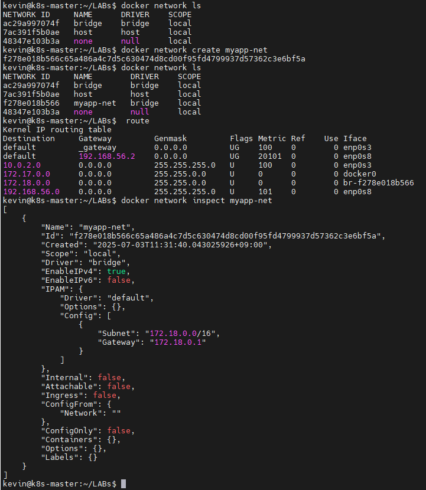
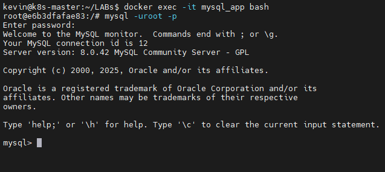
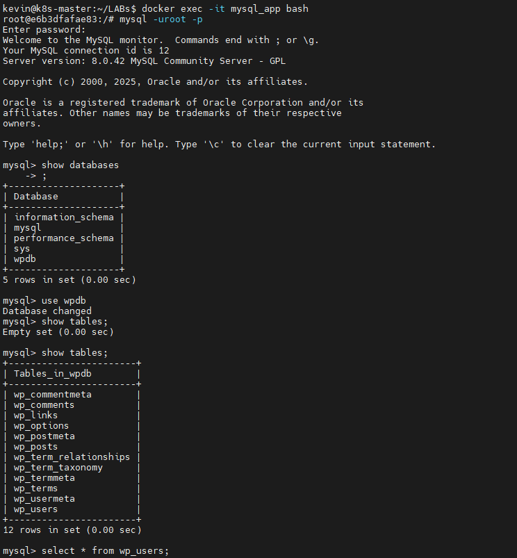
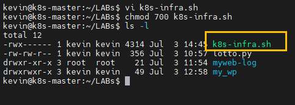
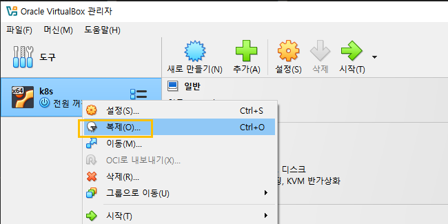
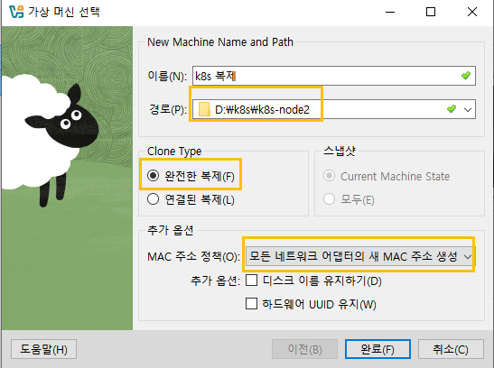
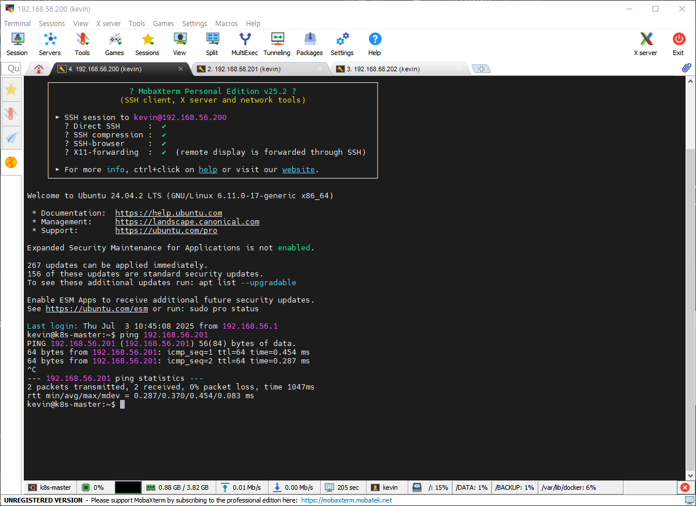

# DB, wordpress 연결



```
kevin@k8s-master:~/LABs$ docker volume create mydb_data
mydb_data
kevin@k8s-master:~/LABs$ docker run -itd \
> --name=mysql_app \
> -v mydb_data:/var/lib/mysql \
> --restart=always \
> -p 3306:3306 \
> --net=myapp-net \
> -e MYSQL_ROOT_PASSWORD=password# \
> -e MYSQL_DATABASE=wpdb \
> -e MYSQL_USER=wpuser \
> -e MYSQL_PASSWORD=wppassword \
> mysql:8.0-debian

```

```
docker run -itd --name=wordpress_app -v myweb_data:/var/www/html -v ${PWD}/myweb-log:/var/log --restart=always -p 8888:80 --net=myapp-net -e WORDPRESS_DB_HOST=mysql_app:3306 -e WORDPRESS_DB_NAME=wpdb -e WORDPRESS_DB_USER=wpuser -e WORDPRESS_DB_PASSWORD=wppassword --link mysql_app:mysql wordpress

```






# docker compose -> multi container service 배포
    - 디렉터리 단위로 
    - 20250703 디렉토리에 docker-compose.yml

```
docker compose up -d 
docker compose ps 
```
# Docker multi Container Application
## bridge network 생성

```
docker network create devapp-net
```
## mongodb container 생성

```
docker run -d --name=mongodb -p 17071:27017 --restart=always --network=devapp-net mongo:4 

docker logs -f mongodb
```
## backend container 생성
```
docker run -d --name=backend --network=devapp-net --restart=always -e PORT=8000 -e GUESTBOOK_DB_ADDR=mongodb:27017 dbgurum/guestbook:backend_1.0
```
## frontend container 생성
```
docker run -d --name=frontend -p 3000:8000 --network=devapp-net --restart=always -e PORT=8000 -e GUESTBOOK_API_ADDR=backend:8000 dbgurum/guestbook:frontend_1.0

```

## mongodb 

```
docker exec -it mongodb mongo
```




- 20250703 폴더에 k8s-infra.sh chmod700으로 수정후

```
./k8s-infra.sh
```





- 호스트이름 바꾸기

```
sudo hostnamectl set-hostname k8s-node1
```



- ssh 접속시 비번 물어보지 않기
- 20250703/k8s-ssh-setup.sh

```
vi k8s-ssh-setup.sh
chmod 700 k8s-ssh-setup.sh
./k8s-ssh-setup.sh
sudo vi /etc/sudoers

100 root ALL=(ALL:ALL):ALL
101 kevin ALL=(ALL) NOPASSWD:ALL <=== 추가
```

kevin@k8s-master:~$ ssh kevin@k8s-node1

시에 비밀번호 물어보지 않고 접속