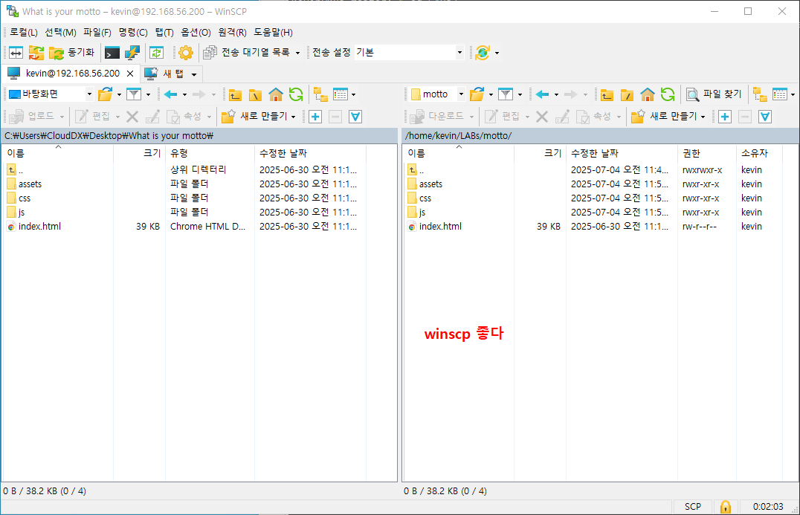
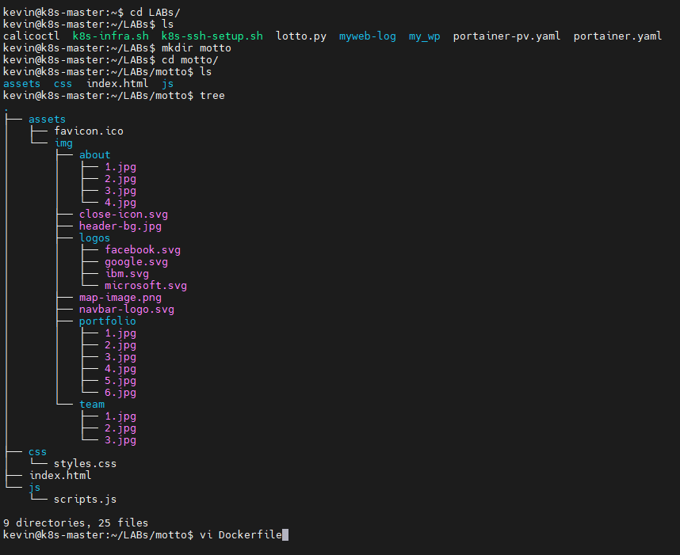
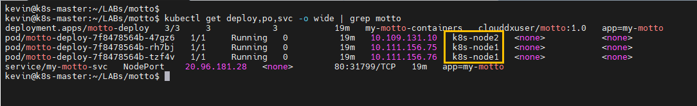
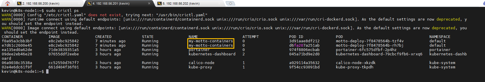

# kubernetes application pod 배포 절차

## 1. 개발팀 요청으로 소스와 함께 이미지 개발
- docker.Dockerfile (docker build)





pwd = LABs/motto

```
FROM nginx:1.27.3-alpine
RUN mkdir -p /usr/share/nginx/html/assets
RUN mkdir -p /usr/share/nginx/html/css
RUN mkdir -p /usr/share/nginx/html/js
COPY index.html /usr/share/nginx/html/index.html
COPY assets /usr/share/nginx/html/assets
COPY css /usr/share/nginx/html/css
COPY js /usr/share/nginx/html/js
EXPOSE 80
CMD ["nginx", "-g", "daemon off;"]

```
## 2. docker run ~ 

```
docker build -t motto:1.0 .
docker images
docker run -d --name=mymotto -p 8001:80 motto:1.0
docker ps

```
## 3. image push -> registry(hub.docker.com)
```
docker login -u 본인ID
docker image tag motto:1.0 본인ID/motto:1.0
docker push 본인ID/motto:1.0
```
## 4. pod or deploy 생성

## 5. 외부 노출을 위한 Service 생성으로 배포 완료

vi motto-deploy.yaml
```
apiVersion: apps/v1
kind: Deployment
metadata:
  name: motto-deploy
spec:
  selector:
    matchLabels:
      app: my-motto
  replicas: 3       # Desired State management 사용자가 요구하는 상태를 지켜준다...
  template:
    metadata:
      labels:
        app: my-motto
    spec:
      containers:
      - name: my-motto-containers
        image: clouddxuser/motto:1.0
        ports:
        - containerPort: 80
---
apiVersion: v1
kind: Service
metadata:
  name: my-motto-svc
spec:
  selector:
    app: my-motto
  ports:
  - port: 80
    targetPort: 80
  type: NodePort
```
```
kubectl apply -f motto-deploy.yaml
kubectl get deploy,po,svc -o wide | grep motto
```

각 노드에서 
```
sudo crictl ps
```






```
kubectl api-resources 
```