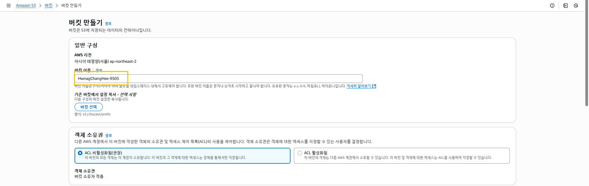
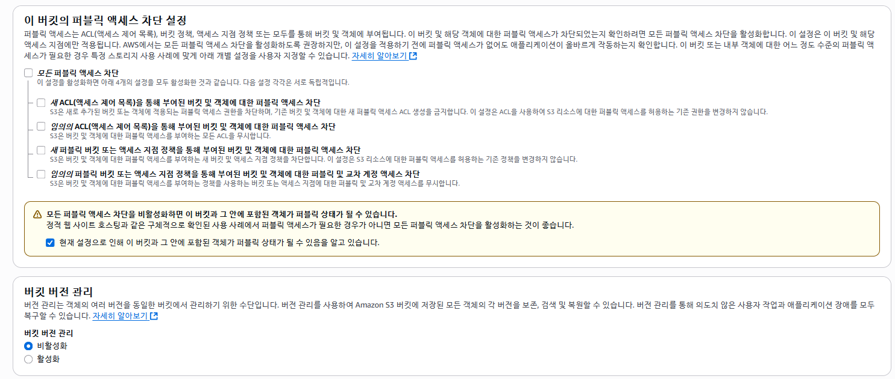
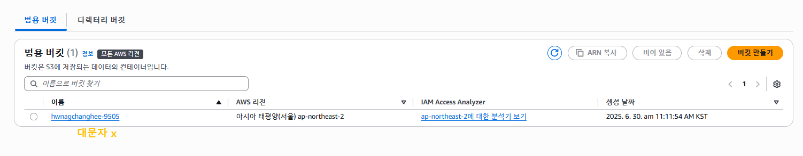
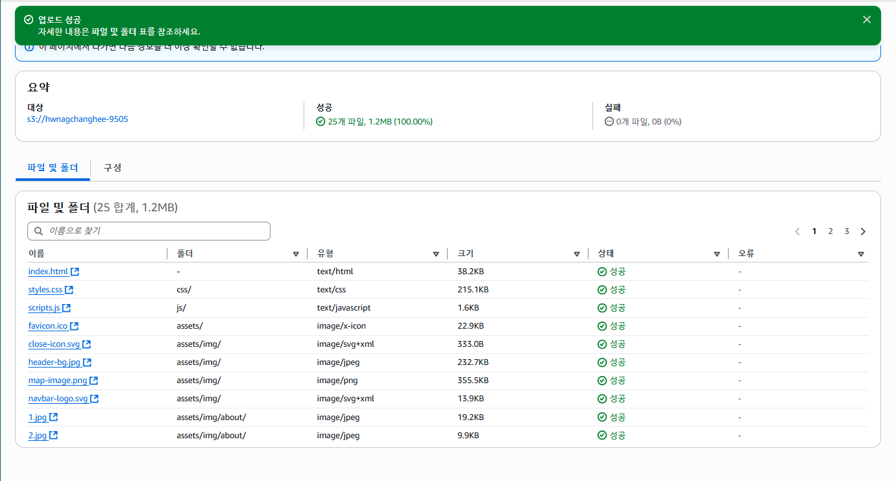
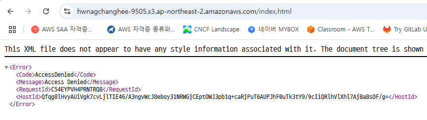
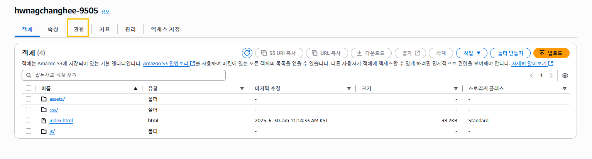
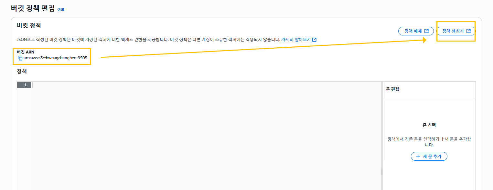
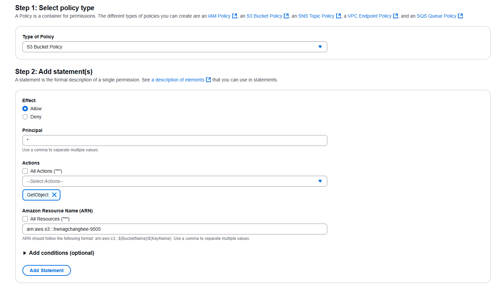
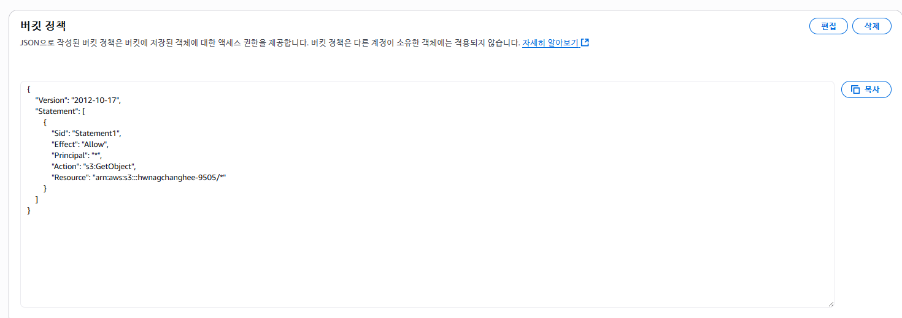
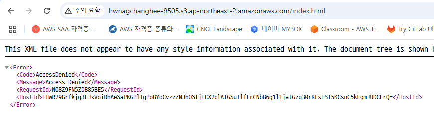

# 버킷 만들기










## URL 검색











```
{
    "Version": "2012-10-17",
    "Statement": [
        {
            "Sid": "Statement1",
            "Effect": "Allow",
            "Principal": "*",
            "Action": "s3:GetObject",
            "Resource": "arn:aws:s3:::hwnagchanghee-9505/*"
        }
    ]
}
```

https://hwnagchanghee-9505.s3.ap-northeast-2.amazonaws.com/index.html

http://hwnagchanghee-9505.s3.ap-northeast-2.amazonaws.com/index.html
허용 x

```
{
    "Version": "2012-10-17",
    "Statement": [
        {
            "Sid": "Statement1",
            "Effect": "Allow",
            "Principal": "*",
            "Action": "s3:GetObject",
            "Resource": "arn:aws:s3:::hwnagchanghee-9505/*"
        },
            {
            "Sid": "DenyHttp",
            "Effect": "Deny",
            "Principal": "*",
            "Action": "s3:GetObject",
            "Resource": "arn:aws:s3:::hwnagchanghee-9505/*",
                "Condition":{
                    "Bool":
                            { "aws:SecureTransport": false }


                }
        }
    ]
}
```



-- S3 리전 간 속도 비교

https://s3-accelerate-speedtest.s3-accelerate.amazonaws.com/en/accelerate-speed-comparsion.html

