# Router 53


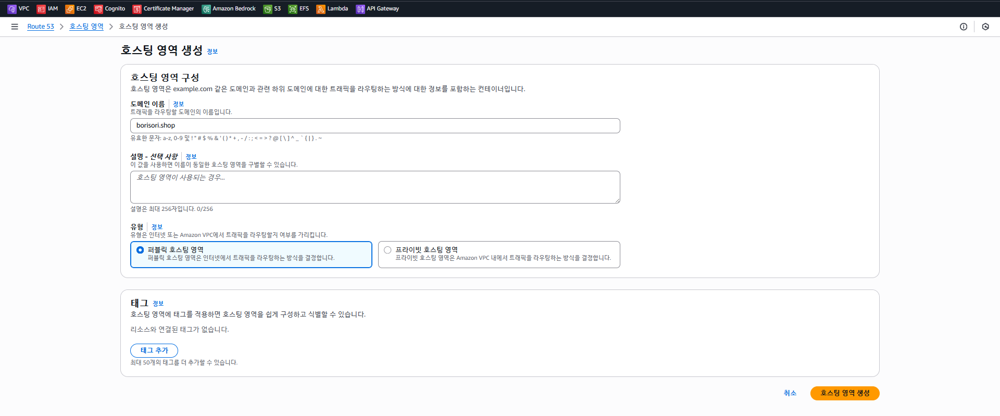

```
ns-1849.awsdns-39.co.uk
ns-227.awsdns-28.com
ns-893.awsdns-47.net
ns-1282.awsdns-32.org
```

[실습2](https://github.com/CHANGHEE9505/TIL/blob/main/AWS/%EC%8B%A4%EC%8A%B5/%EC%8B%A4%EC%8A%B52.md) 참고해서 s3 도메인 이름으로 버킷 다시 만들기


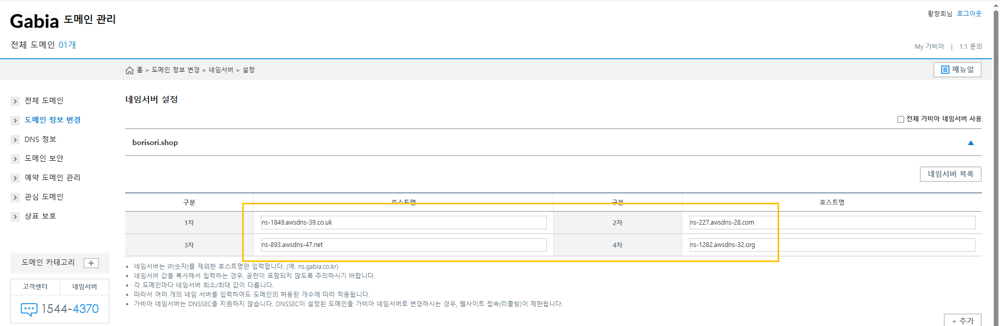

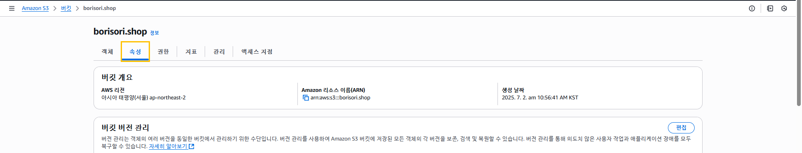

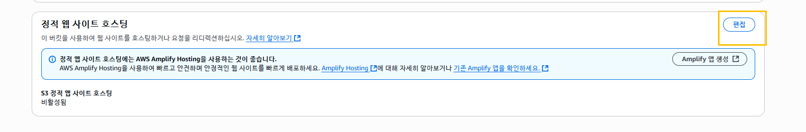

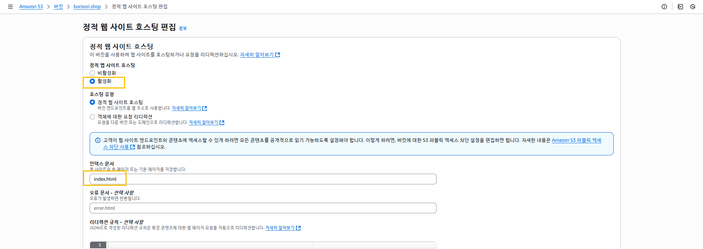

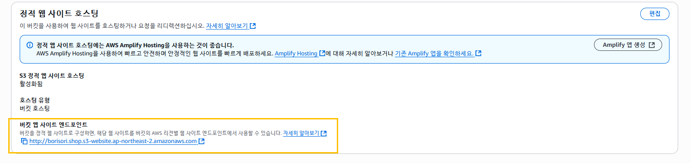


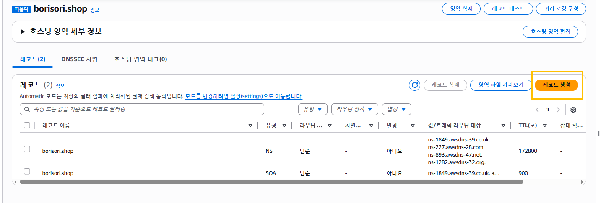

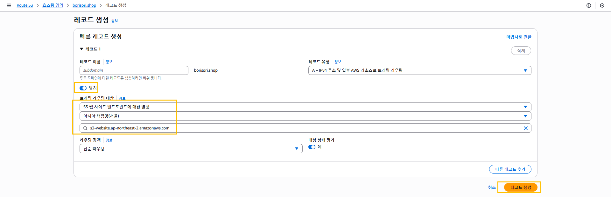

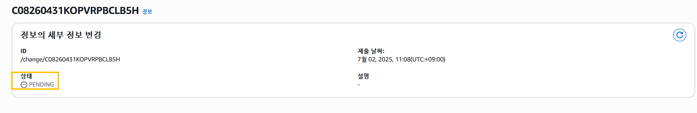

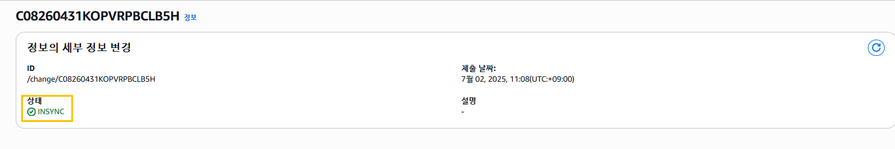

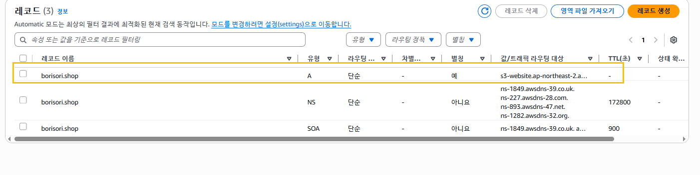
