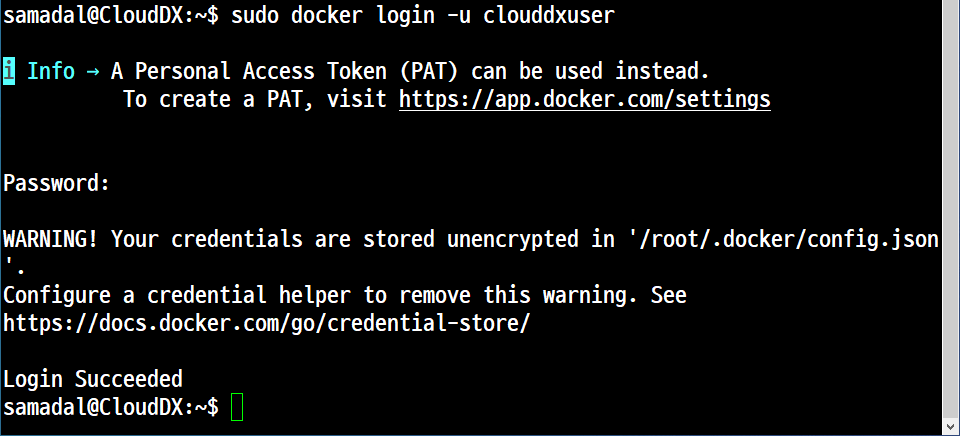
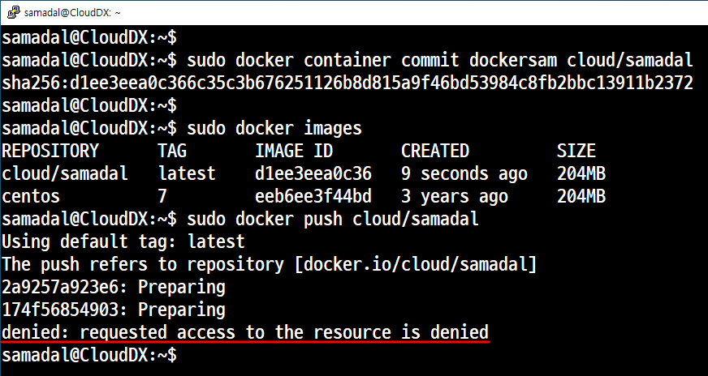
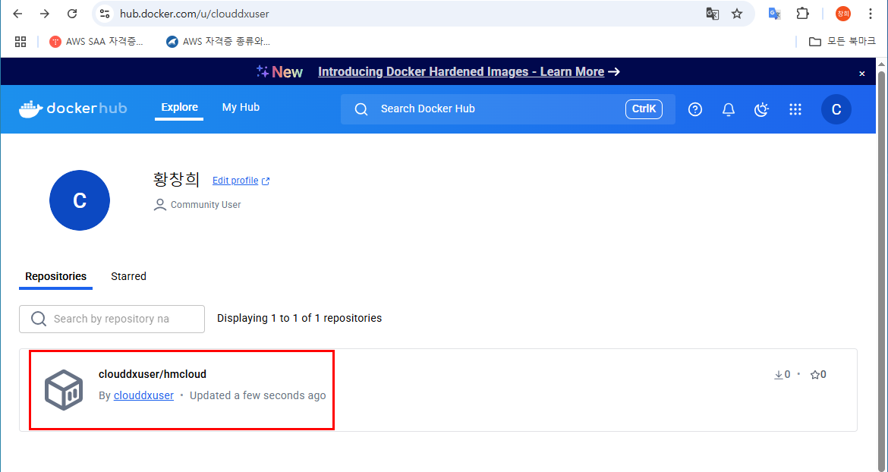
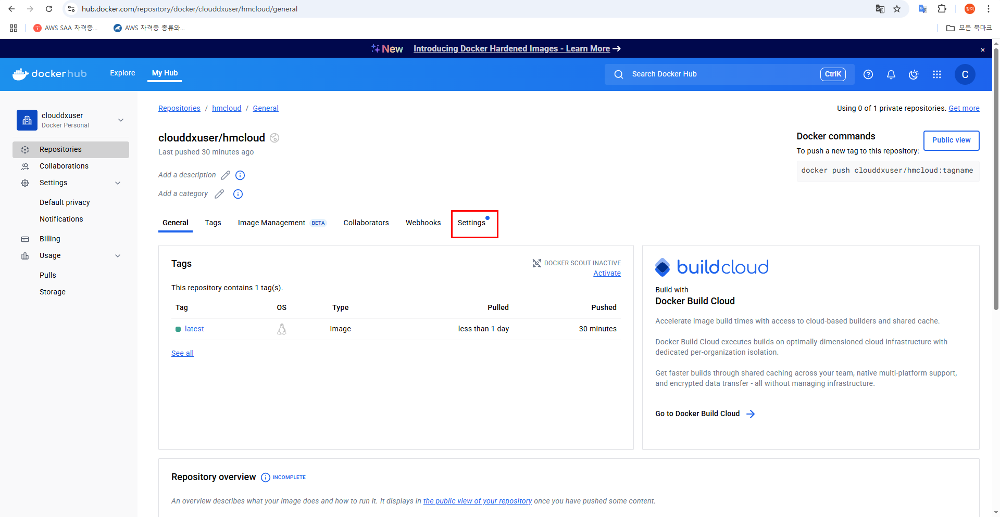
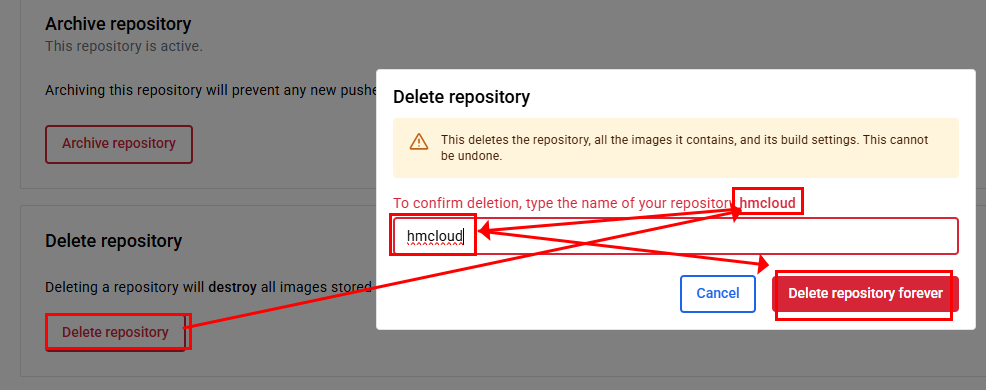

# 📦 Docker (도커)

## 1. 'Docker Engine' 설치를 위한 가상머신 설치

### 매우 중요
- 'Hyper-V'를 반드시 제거해야 한다.


### Ubuntu 설치
```
해시합 안맞을경우
sudo rm -rf /var/lib/apt/lists/*
sudo apt update
sudo apt upgrade
```
### 관련 패키지 설치

### 'Docker Engine' 설치

```
sudo apt install apt-transport-https ca-certificates curl gnupg-agent software-properties-common
```

### GPG(암호화, 소프트웨어 등의 무결성 검증)키 설치

```
curl -fsSL https://download.docker.com/linux/ubuntu/gpg | sudo apt-key add -
```
### 공식 저장소 추가
```
sudo add-apt-repository "deb [arch=amd64] https://download.docker.com/linux/ubuntu $(lsb_release -cs) stable"
```

### 시스템 업데이트
```
sudo apt update
sudo apt upgrade
```

### 도커 확인 및 설치

```
sudo apt install docker-ce docker-ce-cli containerd.io
```


```
sudo docker -v
sudo dpkg -l | grep docker
sudo ps -ef | grep docker
```

### 테스트
#### 도커 이미지를 이용해서 컨테이너를 생성


#### 도커 컨테이너를 삭제 1. 오류


#### 도커 컨테이너 확인

- 활성 상태인 컨테이너 확인
- 활성/비활성 상태인 컨테이너 모두 확인


여기서 활성화가 되어 있다.

#### 도커 컨테이너를 삭제 2. 정상


```
sudo docker rm quizzical_bell   --> 데몬 지우기
sudo docker ps -a   --> 확인
```


```
sudo docker rmi hello-world  --> 삭제
sudo docker images  --> 확인
```
- 백그라운드 실행 확인


## 2. 'Docker' 명령어
### 이미지 관련 명령어

- search
    - 개요
        - Docker Hub에서 이미지를 검색한다.
    - 문법
        - docker search <이미지명>:[태그]
    - 실습
        
        centos OFFICIAL [ok] 공식이미지
        

        

        

- images
    - 개요
        - 현재 다운로드한 이미지 목록을 확인한다.
    - 문법
        - docker images

- pull
    - 개요
        - 이미지를 다운로드한다.
    - 문법
        - docker pull <이미지명>:[태그]
    - 실습
    
        
        ```
        sudo docker pull centos7
        ```
        
        ```
        sudo docker pull ubuntu:24.04
        ```
        

- rmi
    - 개요
        - 이미지를 삭제한다.
    - 문법
        - docker rmi <이미지명>:[태그]
    - 실습
        

        

### 컨테이너 관련 명령어
- run
    - 개요
        - 이미지를 이용해서 컨테이너를 생성한다.
        - 기본적으로 컨테이너 생성과 동시에 컨테이너 안에 접속
    - 문법
        - docker run <옵션1><서브옵션1> <옵션2><서브옵션2> ...
        - name <원하는 컨테이너명><이미지명>:[태그] <명령어>
    - 실습
        - -i (Interactive)
        - -t (Pseudo-tty, 가상터미널)
        - --name (컨테이너 이름, 없으면 도커가 자동 지정)
        - 명령어 (일반적으로 'shell'을 지정)

        

- ps
    - 개요
        - 활성 및 비활성 상태의 컨테이너를 모두 출력한다.
    - 문법
        - docker ps
        - docker ps -a
    - 실습

        


- create
    - 개요
        - 컨테이너를 생성한다. 도커 접속 x
    - 문법
        - docker create <옵션1><서브옵션1> <옵션2><서브옵션2> ...
        - --name <원하는 컨테이너명><이미지명>:[태그] <명령어>
    - 실습

    


- rm
    - 개요
        - 컨테이너를 삭제한다.
    - 문법
        - docker rm [CONTAINER ID]
        - docker rm [NAMES]

    - 실습

        


- start, restart, stop
    - 개요
        - 컨테이너를 실행(활성화), 재실행, 중지(비활성화) 시킨다.
    - 문법
        - docker start/restart/stop [CONTAINER ID]
        - docker start/restart/stop [NAMES]
    - 실습

    

- attach
    - 개요
        - 컨테이너에 접속한다.
    - 문법
        - docker attach [CONTAINER NAMES]
    - 실습

    

    

- exec
    - 개요
        - 현재 설정된 로컬이 아닌 외부 접속으로 컨테이너 안의 명령을 실행
    - 문법
        - docker exec [CONTAINER NAMES] <명령> <매개변수>
    - 실습

    

### 'Docker Container'를 이용한 이미지 생성

#### 사용자가 생성한 'Docker Container'를 이용한 'Docker Image' 생성
#### 앞에서 작업했던 이미지, 컨테이너 모두 제거

#### 사전작업
- 이미지 검색하고 다운로드
    - docker search centos:7
    - docker pull centos:7
- 컨테이너 생성
    - docker run -it --name samdocker centos:7 /bin/bash
- 도커로 들어간 후 필요한 패키지를 모두 설치한다.
    - 여기서는 '커널 업데이트'만 하고 빠져 나온다. (^ + p + q)
- 확인
- 이미지생성
- 생성한 이미지를 이용한 컨테이너 생성


### s
```
sudo docker pull nginx
sudo docker run -itd --name nginx
```

### 이미지 검사

```
sudo docker inspect nginx
```

```
[
    {
        "Id": "sha256:be69f2940aaf64fdf50c9c99420cbd57e10ee655ec7204df1c407e9af63d0cc1",
        "RepoTags": [
            "nginx:latest"
        
        },
        ... .... ...
            ]
        },
        "Metadata": {
            "LastTagTime": "0001-01-01T00:00:00Z"
        }
    }
]

```
```
root@CloudDX:~# ls -l /var/lib/docker/overlay2/
합계 52
drwx--x--- 3 root root 4096  5월 26 09:36 051c49d5f5c3f38647512a410e913e5c993be7625085595b030476fc9233a2df
drwx--x--- 5 root root 4096  5월 26 09:44 0a6e37a3fbf7e5c7888e056e43d1429da60fcb03db3de30be74937830323dcb2
drwx--x--- 4 root root 4096  5월 26 09:36 0a6e37a3fbf7e5c7888e056e43d1429da60fcb03db3de30be74937830323dcb2-init
drwx--x--- 4 root root 4096  5월 26 09:36 33924ac1948956ca72ff641a93ee504b015c2af7915980e6e1929f5dcd26541c
drwx--x--- 4 root root 4096  5월 26 09:36 444b660a008c744caaa361bc3092c0d6f79837bf6c48bf5d17623fae208af7fd
drwx--x--- 4 root root 4096  5월 26 09:36 6deff2ede4407683ba5a666e1a3cc26f6ec0e32e1d34936e0ba85a839f1c2247
drwx--x--- 4 root root 4096  5월 26 09:36 b63cb25fdacffef40b458a3a116831cc27454de8bf827e1a1e4f7ca569e14558
drwx--x--- 5 root root 4096  5월 26 09:44 d28f78b0c25dbc6cd79cc4508af72f18e7bce3825fab9ca16a1dae6048e18c53
drwx--x--- 4 root root 4096  5월 26 09:43 d28f78b0c25dbc6cd79cc4508af72f18e7bce3825fab9ca16a1dae6048e18c53-init
drwx--x--- 4 root root 4096  5월 26 09:36 d55ed90618f9d06b9c3e0fac044d5247ba6ff9a07e258f7e07a9755bf949929a
drwx--x--- 4 root root 4096  5월 26 09:36 e42c07170f1ef60d83cca9fa84d64bf948af24f96891b3b65265aa158c3c9201
drwx--x--- 3 root root 4096  5월 26 09:43 f5c62540b432617c195b08a5a72a09e37cd6deacba5241171843c51611ce4481
drwx------ 2 root root 4096  5월 26 09:43 l
```

생성한 Container와  Docker Hub의 연동
- Docker Hub에 이미지 업로드 하기 위한 기본 작업

[회원가입](https://hub.docker.com/)

- 도커 정리

- 로그인



컨테이너를 이미지(centos:7) 을 이용해서 컨테이너를 생성하고 생성한 컨테이너를 이용한 '컨테이너 이미지' 생성
- 컨테이너 생성

```
samadal@CloudDX:~$ sudo docker images
REPOSITORY   TAG       IMAGE ID       CREATED       SIZE
centos       7         eeb6ee3f44bd   3 years ago   204MB
samadal@CloudDX:~$
samadal@CloudDX:~$ sudo docker run -it --name dockersam centos:7 /bin/bash
[root@cdda4a9f3dd0 /]# exit
exit
samadal@CloudDX:~$ sudo docker ps -a
CONTAINER ID   IMAGE      COMMAND       CREATED         STATUS                     PORTS     NAMES
cdda4a9f3dd0   centos:7   "/bin/bash"   8 seconds ago   Exited (0) 5 seconds ago             dockersam
samadal@CloudDX:~$
samadal@CloudDX:~$ sudo docker start dockersam
dockersam
samadal@CloudDX:~$
samadal@CloudDX:~$ sudo docker attach dockersam
[root@cdda4a9f3dd0 /]#

[root@cdda4a9f3dd0 /]# read escape sequence  --> ctrl + p + q
samadal@CloudDX:~$
samadal@CloudDX:~$

```
- 컨테이너 이미지 생성
    - 작업 1. 오류
    ```
    samadal@CloudDX:~$
    samadal@CloudDX:~$ sudo docker container commit dockersam cloud/samadal
    sha256:d1ee3eea0c366c35c3b676251126b8d815a9f46bd53984c8fb2bbc13911b2372
    samadal@CloudDX:~$
    samadal@CloudDX:~$ sudo docker images
    REPOSITORY      TAG       IMAGE ID       CREATED         SIZE
    cloud/samadal   latest    d1ee3eea0c36   9 seconds ago   204MB
    centos          7         eeb6ee3f44bd   3 years ago     204MB
    samadal@CloudDX:~$ sudo docker push cloud/samadal
    Using default tag: latest
    The push refers to repository [docker.io/cloud/samadal]
    2a9257a923e6: Preparing
    174f56854903: Preparing
    denied: requested access to the resource is denied
    ```
    

    - 작업 2. 도커허브 아이디명(clouddxuser)
    ```
    samadal@CloudDX:~$ sudo docker container commit dockersam clouddxuser/hmcloud
    sha256:03439fea2b9f84df732ee9c1daf5f2e10d2c1cf9861adc11574e28f1ed0919d4
    samadal@CloudDX:~$
    samadal@CloudDX:~$ sudo docker images
    REPOSITORY               TAG       IMAGE ID       CREATED         SIZE
    clouddxuser/hmcloud   latest    03439fea2b9f   2 minutes ago   204MB
    centos                   7         eeb6ee3f44bd   3 years ago     204MB
    ```
    - 도커 허브 업로드<br>
    문법 sudo docker push 식별자/이미지명[:태그명]
    ```
    samadal@CloudDX:~$ sudo docker images
    REPOSITORY            TAG       IMAGE ID       CREATED          SIZE
    clouddxuser/hmcloud   latest    59d55a226a6a   31 seconds ago   204MB
    centos                7         eeb6ee3f44bd   3 years ago      204MB
    samadal@CloudDX:~$ sudo docker push clouddxuser/hmcloud
    Using default tag: latest
    The push refers to repository [docker.io/clouddxuser/hmcloud]
    2a9257a923e6: Pushed
    174f56854903: Pushed
    latest: digest: sha256:11bd8be55975d7b2c5b04836bd0c08d40e3c758c4e337240a69a652f3f106ba8 size: 736
    ```
    

- 도커 허브에서 다운로드


- 도커 허브 사이트에 있는 Repository에서 컨테이너 이미지 삭제







