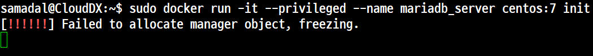
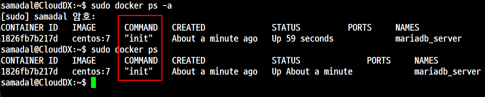
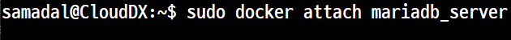
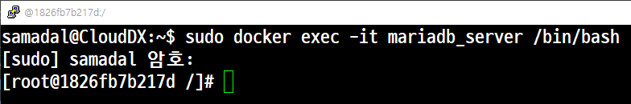
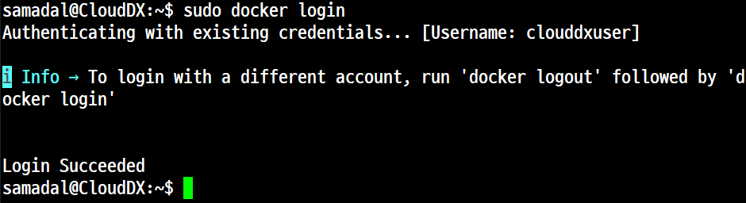
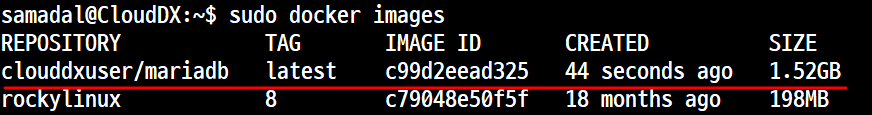
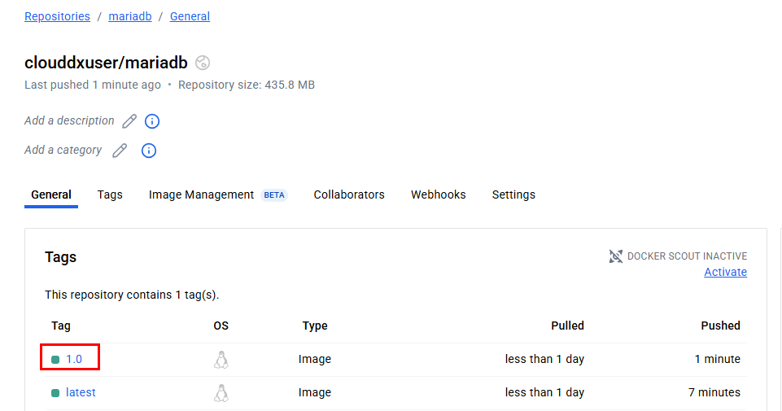
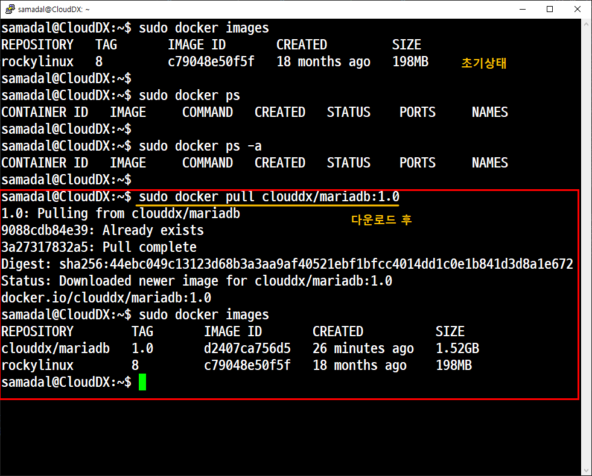
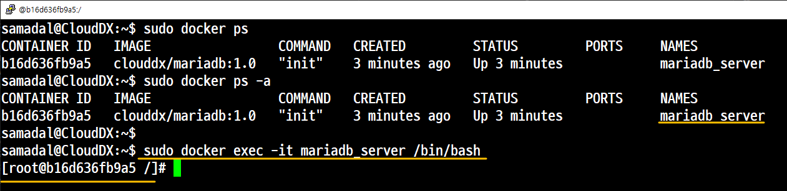
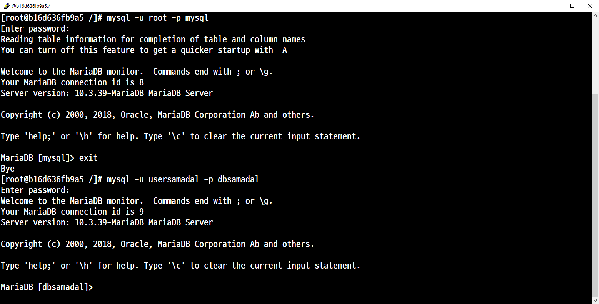

# Docker (도커)
## 5. 실습
### 개요
#### 1. '임의의 서비스(mariadb)'가 동작되는 컨테이너를 생성한다.
- 관련 패키지를 설치하고 사용자를 생성한다.
- 관리자, 사용자 테스트
#### 2. 이 컨테이너를 이미지로 생성한 후 도커 허브에 업로드 한다.
#### 3. 로컬에 있는 컨테이너를 모두 삭제한다.
#### 4. 도커 허브에 올려놓은 이미지를 다운로드 한 후 컨테이너를 활성화 한다.
#### 5. 앞에서 작업한 사용자들(root, usersamadal)로 로그인이 되는지 확인한다.


## 작업 1. 오류
### 초기상태
### 컨테이너 생성
```
samadal@CloudDX:~$ sudo docker run -it --name mariadb_server centos:7 /bin/bash
```
### 도커 컨테이너 접속
```
samadal@CloudDX:~$ sudo docker start mariadb_server
mariadb_server
samadal@CloudDX:~$
samadal@CloudDX:~$ sudo docker attach mariadb_server
```
### 도커 컨테이너의 시스템 업데이트
```
[root@fd0487c1e6c9 /]# sed -i 's/mirrorlist/#mirrorlist/g' /etc/yum.repos.d/CentOS-*
[root@fd0487c1e6c9 /]# sed -i 's|#baseurl=http://mirror.centos.org|baseurl=http://vault.centos.org|g' /etc/yum.repos.d/CentOS-*
yum update
yum upgrade
```
### 방화벽 설정 및 데몬 재실행
```
[root@fd0487c1e6c9 /]# firewall-cmd
bash: firewall-cmd: command not found
[root@fd0487c1e6c9 /]# yum -y install firewalld
[root@fd0487c1e6c9 /]# systemctl enable firewalld
[root@fd0487c1e6c9 /]#
[root@fd0487c1e6c9 /]# systemctl restart firewalld
Failed to get D-Bus connection: Operation not permitted
```

## 작업 2. 정상
### '작업1' 에서 생성했던 컨테이너 삭제
### (매우중요) 컨테이너 생성 시 생성되는 컨테이너에 '커널(Kernel)'까지 접근 가능하도록 권한을 부여한다.
#### 개요
- 커널 권한을 부여하지 않고 작업할 경우 동작을 하지 않는다.
- 'privileged', 'init'는 백그라운드에서 동작이 되어야 하기 때문이다.


#### 명령


```
sudo docker run -it --privileged --name mariadb_server rockylinux:8 init
```



#### 터미널 창을 한 개 더 실행한 후 컨테이너 목록을 확인

### 컨테이너 접속

- 오류



- 정상


```
sudo docker exec -it mairaeb_server /bin/bash
```

### 이걸로 
-> 도커 컨테이너의 시스템 업데이트

               

               (root@97076a98cfed /)# yum -y install epel-release

               (root@97076a98cfed /)# yum -y update


            -> 방화벽 패키지 설치 및 활성화
            
               (root@97076a98cfed /)# yum -y install firewalld
               
               (root@97076a98cfed /)# systemctl enable firewalld
               
               (root@97076a98cfed /)# systemctl restart firewalld               
               
               (root@97076a98cfed /)# ls -l /etc/firewalld/zones/

               (root@97076a98cfed /)# firewall-cmd --list-all

                  public
                    target: default
                    icmp-block-inversion: no
                    interfaces:
                    sources:
                    services: cockpit dhcpv6-client ssh
                    ports:
                    protocols:
                    forward: no
                    masquerade: no
                    forward-ports:
                    source-ports:
                    icmp-blocks:
                    rich rules:            

방화벽 추가
```
[root@4773e32001f7 /]# firewall-cmd --permanent --add-port=3306/tcp
success
[root@4773e32001f7 /]# firewall-cmd --permanent --add-service=mysql
success
[root@4773e32001f7 /]# firewall-cmd --reload
success
[root@4773e32001f7 /]# vi /etc/firewalld/zones/public.xml

```


```
yum install mariadb-*
rpm -qa | grep mariadb | nl

[root@4773e32001f7 /]# systemctl enable mariadb
Created symlink /etc/systemd/system/mysql.service → /usr/lib/systemd/system/mariadb.service.
Created symlink /etc/systemd/system/mysqld.service → /usr/lib/systemd/system/mariadb.service.
Created symlink /etc/systemd/system/multi-user.target.wants/mariadb.service → /usr/lib/systemd/system/mariadb.service.
[root@4773e32001f7 /]# systemctl restart mariadb
```

[usersamadal 추가](https://github.com/CHANGHEE9505/TIL/blob/main/linux/08.DB_%EA%B3%84%EC%A0%95%EC%83%9D%EC%84%B1.md)


## 작업 3. 도커 허브에 도커 컨테이너 업로드
- 컨테이너 생성하기 전에 확인할 내용
- 도커 허브에 접속

- 컨테이너 이미지 생성 및 업로드 1. without TAG
```
samadal@CloudDX:~$ sudo docker container commit mariadb_server clouddxuser/mariadb
```


```
samadal@CloudDX:~$ sudo docker push clouddxuser/mariadb
```
with tag
```
sudo docker push clouddxuser/mariadb:1.0
```



## 도커 허브에 올려놓은 이미지를 다운로드 한 후 컨테이너를 활성화 한다.



컨테이너 활성화
```
sudo docker run -it --privileged --name mariadb_server clouddxuser/mariadb:1.0 init
```



```
sudo docker exec -it mariadb_server /bin/bash
```

## 작업 5. 테스트
### 앞에서 작업한 사용자들(root, usersamadal)로 로그인 되는지 확인 

