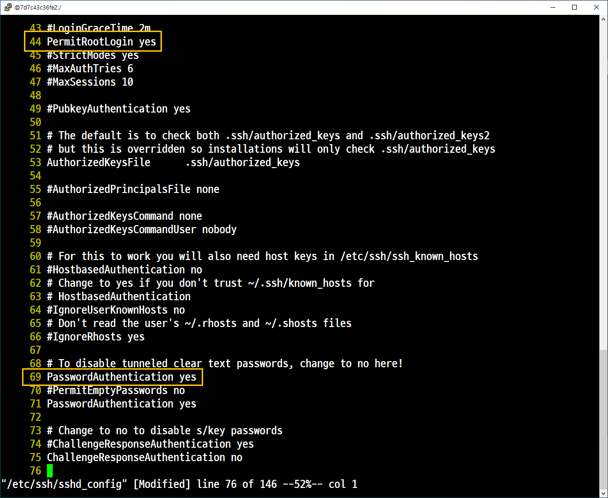

# 6. 도커에서의 네트워크

## SSH 원격 접속
호스트 시스템에서 도커 컨테이너로 SSH를 이용한 접속(기본 포트로 접속)

접속 1. 호스트 시스템에서 도커 컨테이너로 SSH를 이용한 접속(기본 포트로 접속)

- 도커 이미지와 컨테이너 확인 제거


- 도커 컨테이너 등록

```
samadal@CloudDX:~$ sudo docker create -it --privileged --name mdb clouddxuser/mariadb:1.0 init

sudo docker start mdb
```
- 도커 컨테이너 접속

```
samadal@CloudDX:~$ sudo docker exec -it mdb /bin/bash
```


- 도커 컨테이너 IP 확인
```
yum install net-tools
ifconfig
```


### 호스트 시스템에서 SSH를 이용한 컨테이너 접속 1. 신규 터미널 ( 호스트 시스템)

- 통신 상태 확인
```
ping -c 5 172.17.0.2
```
- 그냥 접속
```
sudo ssh 172.17.0.2
```


yum -y install openssh-*


방화벽 해제

- 서비스 및 데몬 실행


- 도커 컨테이너에 접속 시도(오류)
```
sudo ssh 172.17.0.2
```
- 기존 터미널 창에서 관리자 비밀번호 지정

```
yum install passwd
```




### 접속2. 호스트 시스템에서 도커 컨테이너로 SSH를 이용한 접속(기본 포트 이외의 포트로 접속)

#### 기본 작업
##### 포트(8081/tcp) 추가


##### 도커 이미지 확인


#### 도커 컨테이너 생성 후 접속

##### 생성
```
sudo docker create -it --privileged --name cloudsamadal rockylinux:8 init 
```

##### 확인
```
sudo docker ps -a --->  전체확인
sudo docker ps    ===>  실행 컨테이너 확인
```
##### 접속

```
sudo docker exec -it cloudsamadal /bin/bash
```

##### 네트워크 활성화

```
yum -y install net-tools
```

##### SSH 패키지 설치
```
yum -y install openssh-*
```
##### 서비스 및 데몬

##### 포트 확인


##### 관리자 및 사용자 생성 및 비밀번호 설정 (root, samadal)

##### 접속 상태를 유지하고 빠져 나온다.(ctrl p,q)


##### SSH 접속

```
sudo ssh-keygen -f '/root/.ssh/known_hosts' -R '172.17.0.2'
```


### 호스트 시스템에서 SSH를 이용한 컨테이너 접속 3. 신규 터니멀 (호스트 시스템)