# Apach Web Server

## 실습 1. OS(Rocky Linux)에서 지원하는 기능(httpd 패키지)을 이용한 도커 컨테이너
### Apache Web Server 접속을 위한 설정 (커널 모드(init)) 사용
- 도커 이미지 및 컨테이너 확인

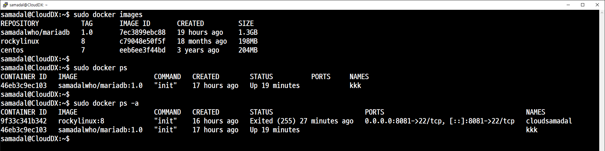

- 방화벽 포트 추가 (8014)

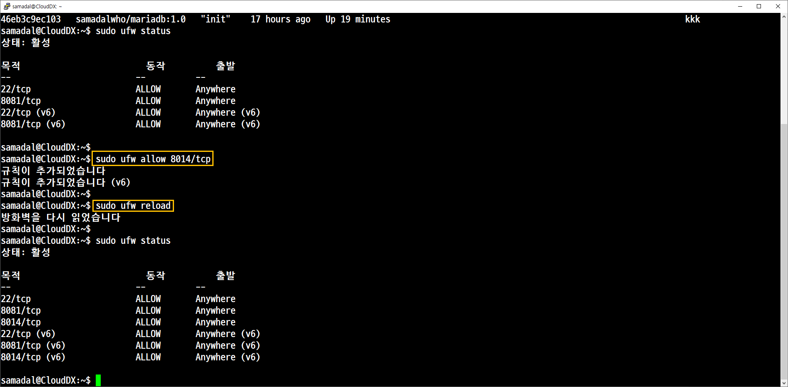

- 도커 컨테이너 생성


```
sudo docker create -it --privileged -p 8014:80 --name websamadal rockylinux:8 init
```

- 도커 컨테이너 접속

컨테이너 실행 후 접속
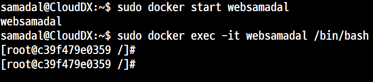

### 도커 컨테이너 접속 후 기본 작업

- 시스템 업데이트
```
yum -y install epel-release
yum -y update
yum -y install net-tools
```
ifconfig
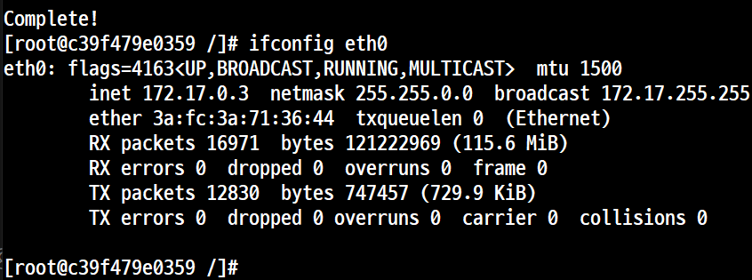
전에 것이 2번을 부여 받았기 때문에 172.17.0.3을 부여

- 네트워크 설정

방화벽, 패키지 설치, 데몬 실행

```
yum -y install firewalld
systemctl enable firewalld
systemctl restart firewalld

firewall-cmd --permanent --add-port=80/tcp
firewall-cmd --permanent --add-service=http
firewall-cmd --permanent --add-port=22/tcp
```
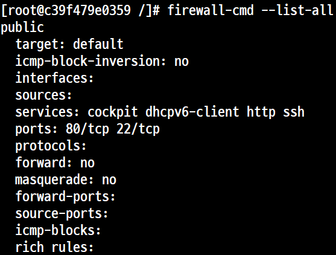

- 패키지 관련 작업
```
yum -y install httpd-*
systemctl enable httpd
systemctl restart httpd
 netstat -atunp | grep http
```

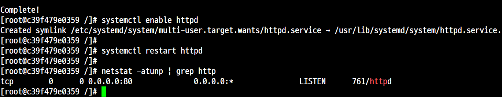


사이트 출력


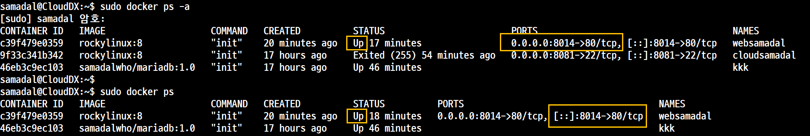


## 실습 2. Apache Web Server 이미지(httpd 전용이미지)를 이용한 도커 컨테이너
### 준비작업 
#### 현재 이미지 + 정리 확인
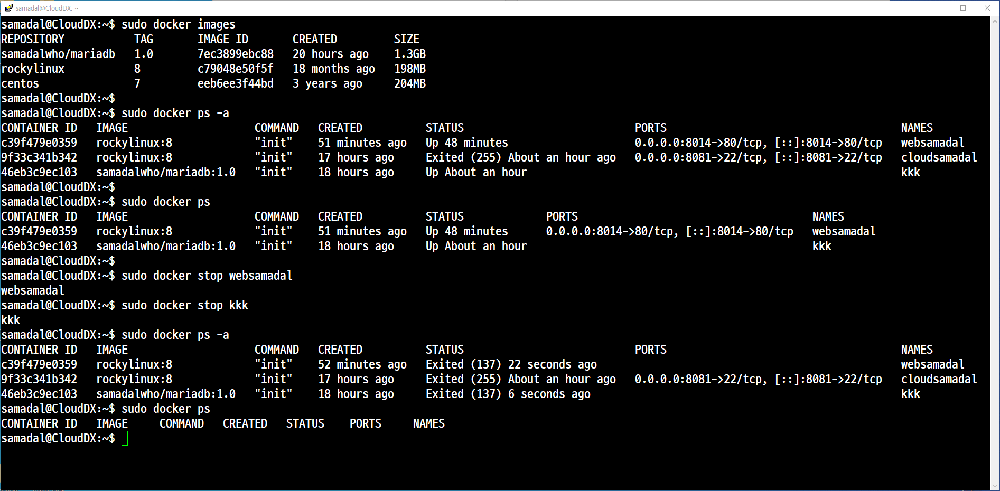

#### 이미지 검색 후 다운로드

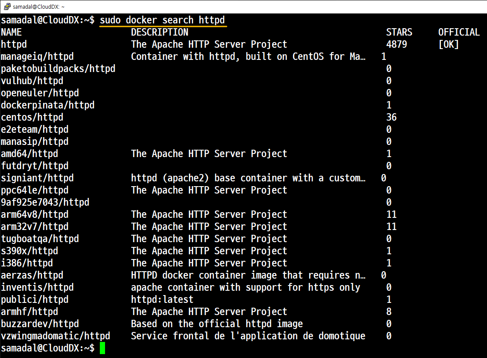

추가 확인

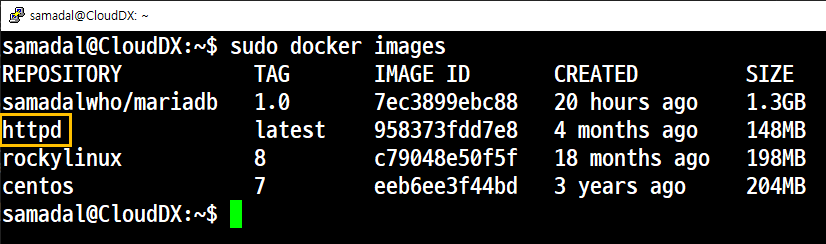


충돌 방지를 위해 이전 컨테이너
websamadal 제거

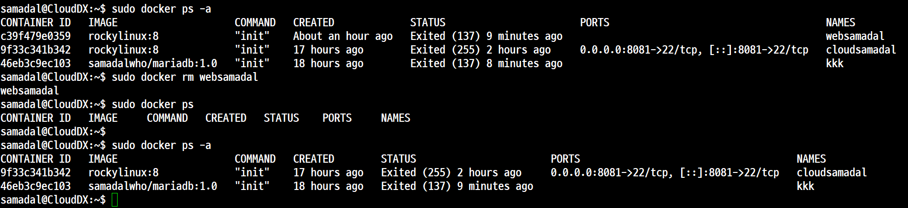

```
sudo docker run -itd --name websamadal -p 8014:80 [httpd:latest] httpd
sudo docker run -itd --name websamadal -p 8014:80 httpd
```

컨테이너 생성 (다운로드 한 이미지를 사용 안했다.)

웹 브라우저를 통한 출력

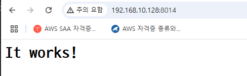

버전

```
root@75da45432e2d:/usr/local/apache2/htdocs# cat /etc/os-release
PRETTY_NAME="Debian GNU/Linux 12 (bookworm)"
NAME="Debian GNU/Linux"
VERSION_ID="12"
VERSION="12 (bookworm)"
VERSION_CODENAME=bookworm
ID=debian
HOME_URL="https://www.debian.org/"
SUPPORT_URL="https://www.debian.org/support"
BUG_REPORT_URL="https://bugs.debian.org/"
root@75da45432e2d:/usr/local/apache2/htdocs# exit
exit


samadal@CloudDX:~$ cat /etc/os-release
PRETTY_NAME="Ubuntu 24.04.2 LTS"
NAME="Ubuntu"
VERSION_ID="24.04"
VERSION="24.04.2 LTS (Noble Numbat)"
VERSION_CODENAME=noble
ID=ubuntu
ID_LIKE=debian
HOME_URL="https://www.ubuntu.com/"
SUPPORT_URL="https://help.ubuntu.com/"
BUG_REPORT_URL="https://bugs.launchpad.net/ubuntu/"
PRIVACY_POLICY_URL="https://www.ubuntu.com/legal/terms-and-policies/privacy-policy"
UBUNTU_CODENAME=noble
LOGO=ubuntu-logo

```

```
apt install vim-*
```

/usr/local/apache2/htdocs/index.html
여기에 글 넣고 수정

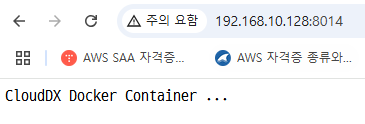

## 실습 3. 도커 허브에 업로드

도커 컨테이너를 이용한 이미지 생성

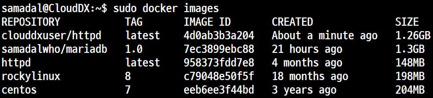

```
sudo docker container commit websamadal clouddxuser/httpd
```

도커 허브에 업로드

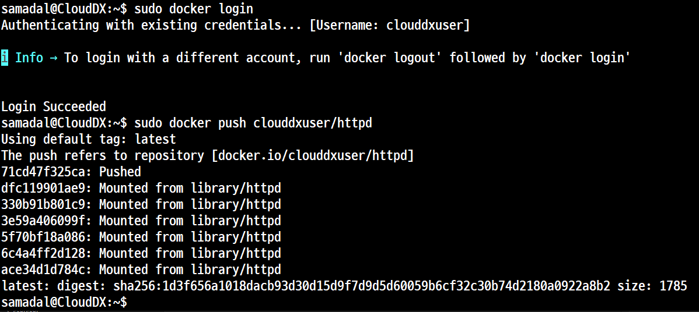


```

```

## 실습 4. 컨테이너에 SSH 접속
컨테이너 접속
```
sudo docker exec -it websamadal /bin/bash
```

외부와의 통신 여부 확인

```
apt install iputils-ping
```

ip 확인
```
apt install net-tools
ifconfig
```
원격 접속을 위한 패키지 다운로드

```
apt install openssh-*
```
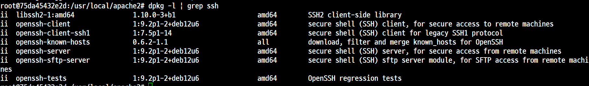
```
apt list --installed | grep ssh-*
dpkg -l | grep ssh
```

원격접속을 위한 사용자 계정 설정


## 실습 5. 종합 실습

- 작업 환경
    - 두 개의 컨테이너를 생성, 활성화 한 후 SSH를 통해서 접속이 가능하도록 설정한다.
    - Web Server와 DB Server를 모두 연계해서 작업한다.
        - 실습 1. os(Rockey Linux)에서 지원하는 기능(httpd 패키지)을 이용한 도커 컨테이너 또는
        - 실습 2. Apache Web Server 이미지(httpd 전용 이미지)를 이용한 도커 컨테이너
    - 제로보드를 FTP 또는 SCP를 이용하여 도커 컨테이너에 업로드 한 후 작업한다.
    

### 작업 1.기존에 작업했던 것들 중에서 Image는 그냥 두고 'Container'만 모두 제거한다.  
- 컨테이너 삭제
- 결과 확인

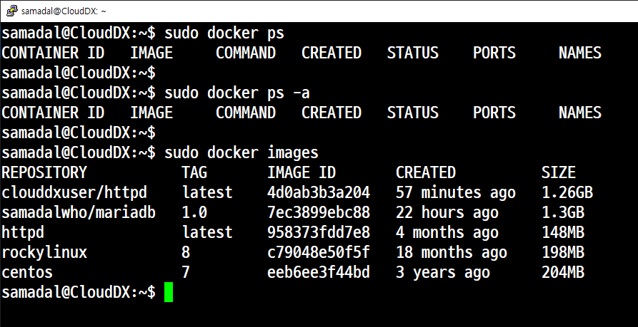

### 작업 2. 컨테이너 이미지 생성 후 도커 허브에 업로드(백업)

- 컨테이너 생성
- 컨테이너 접속
- 커널 업데이트 및 패키지 설치
- DB 사용자 생성
- 컨테이너 이미지 생성 후 업로드

### 작업 3. 컨테이너 2개(mdb1, mdb2) 생성

   -> 방화벽 포트 추가 (호스트 OS)

      (ubunt)$ sudo ufw status
         22/tcp                     ALLOW       Anywhere
         8081/tcp                   ALLOW       Anywhere
         8082/tcp                   ALLOW       Anywhere
         22/tcp (v6)                ALLOW       Anywhere (v6)
         8081/tcp (v6)              ALLOW       Anywhere (v6)
         8082/tcp (v6)              ALLOW       Anywhere (v6)

   -> 컨테이너 이미지(samadalwho/mariadb)를 이용한 컨테이너(mdb1) 생성

      (ubunt)$ sudo docker create -it --privileged -p 8081:22 --name mdb1 rockylinux:8/mariadb init
      (ubunt)$ sudo docker create -it --privileged -p 8082:22 --name mdb2 rockylinux:8/mariadb init

   -> 컨테이너 시작

      (ubunt)$ sudo docker start mdb1
      (ubunt)$ sudo docker start mdb2

   -> 접속

      (ubunt)$ sudo docker exec -it mdb1 /bin/bash
      (ubunt)$ sudo docker exec -it mdb2 /bin/bash

   -> 컨테이너 상태

      (ubunt)$ sudo docker ps -a
         CONTAINER ID   IMAGE                COMMAND   CREATED          STATUS                     PORTS                                     NAMES
         7a0b2be684e2   samadalwho/mariadb   "init"    2 minutes ago    Created                                                              mdb2
         89138d3e36f8   samadalwho/mariadb   "init"    16 minutes ago   Up 15 minutes              0.0.0.0:8081->22/tcp, [::]:8081->22/tcp   mdb1
         8ef999fe65d5   rockylinux:8         "init"    2 hours ago      Exited (137) 2 hours ago                                             mariadb_server
      (ubunt)$ sudo docker start mdb1
      (ubunt)$ sudo docker start mdb2
      (ubunt)$ sudo docker ps
         CONTAINER ID   IMAGE                COMMAND   CREATED          STATUS          PORTS                                     NAMES
         7a0b2be684e2   samadalwho/mariadb   "init"    2 minutes ago    Up 2 seconds    0.0.0.0:8082->22/tcp, [::]:8082->22/tcp   mdb2
         89138d3e36f8   samadalwho/mariadb   "init"    16 minutes ago   Up 16 minutes   0.0.0.0:8081->22/tcp, [::]:8081->22/tcp   mdb1

   -> 공통 사항
   
      yum -y install net-tools
      yum -y install openssh-*
      yum -y install iputils-ping
      yum -y install passwd

      ifconfig eth0

      firwall-cmd --list-ports   -> 22, 3306
      firwall-cmd --list-services   -> ssh, mysql
      firwall-cmd --reload

      vi /etc/ssh/sshd.config      -> PermitRootLogin yes
      systemctl enable sshd
      systemctl restart sshd

      vi /etc/selinux/config      -> SELINUX=disabled

      passwd
      useradd -s /bin/bash samadal
      passwd samadal   

### 작업 4. 두 개의 컨테이너끼리 통신 테스트
- 별도의 터미널창을 2개 더 실행 즉, 3대

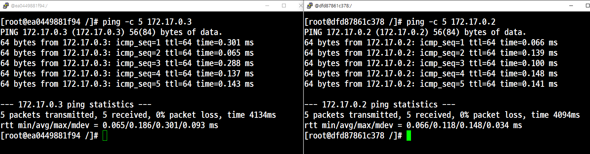