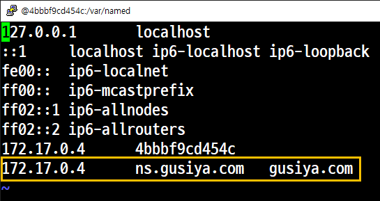
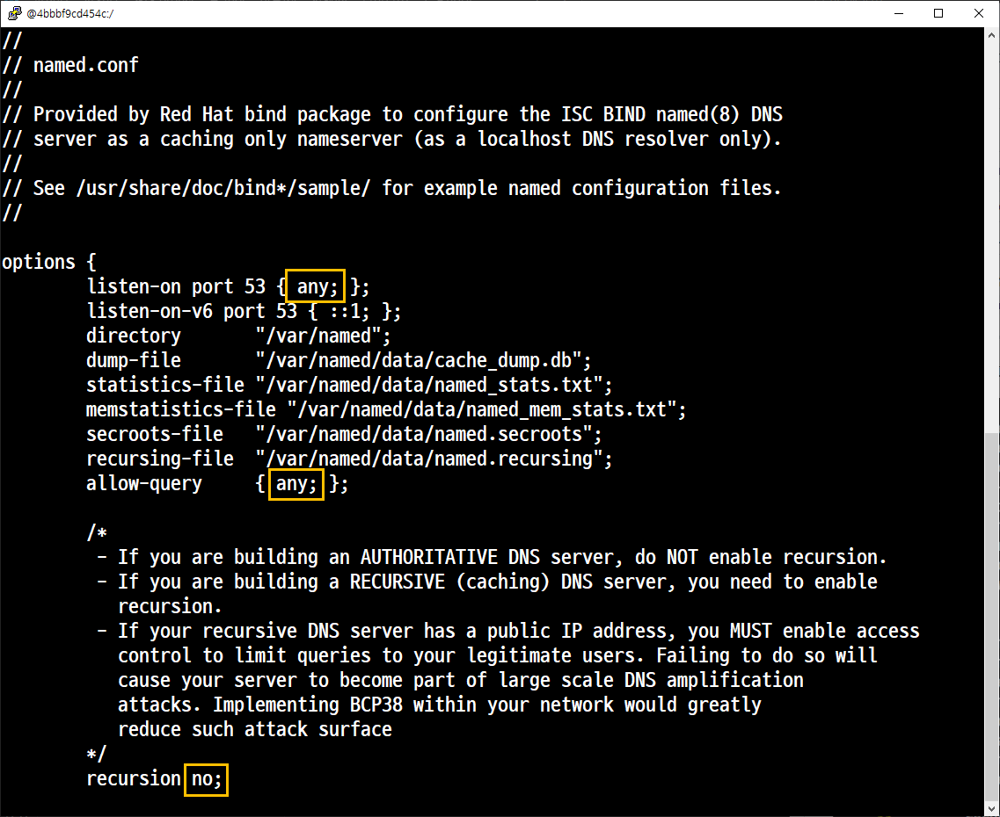
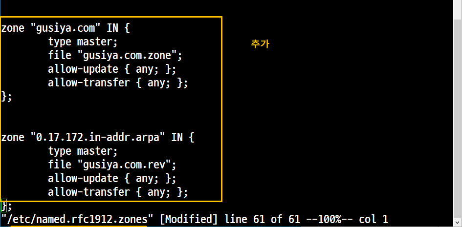
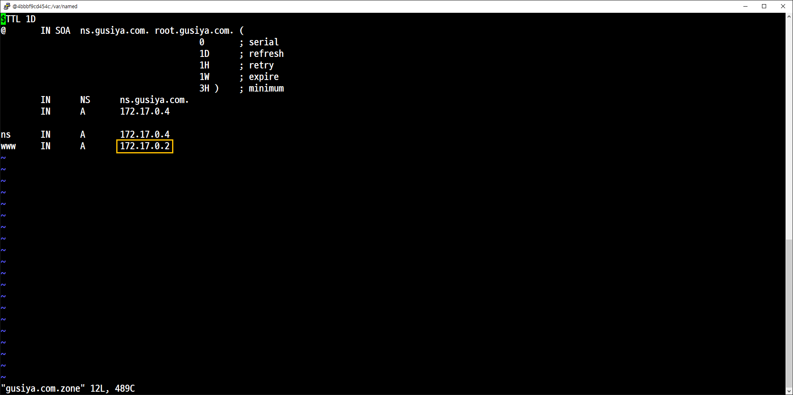
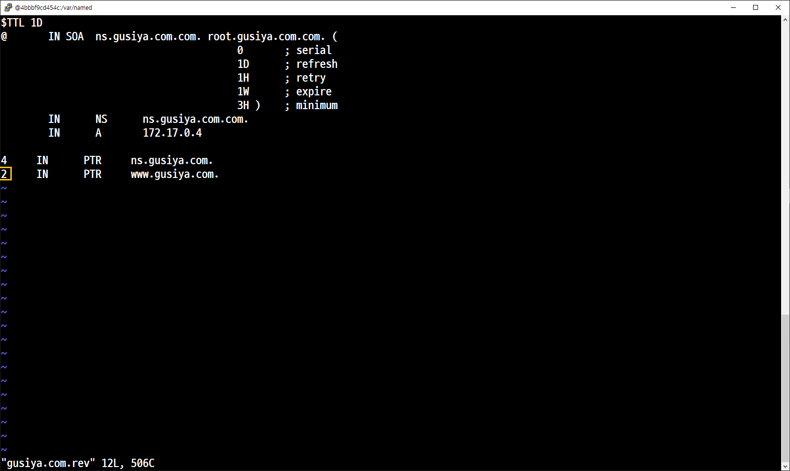
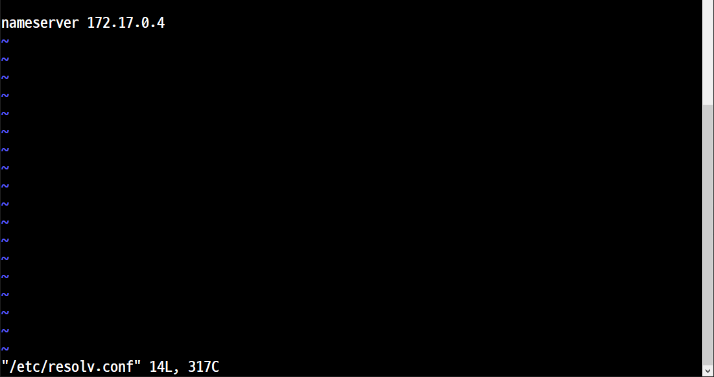

# DNS

## 실습 5. DNS Server 를 올린 후 '호스트(www)'를 부여하고 출력한다.

```
samadal@CloudDX:~$ sudo docker create -it --name dns_server --privileged rockylinux:8 init
4bbbf9cd454c02d27201b0ee1bf49917c8b3ec406e4108398c9898235ffb56dd
samadal@CloudDX:~$
samadal@CloudDX:~$ sudo docker start dns_server
dns_server
samadal@CloudDX:~$ sudo docker exec -it dns_server /bin/bash
```

```
yum -y install epel-release
yum -y update
yum -y install httpd-*
yum -y install bind-*
yum install firewalld -y
systemctl start firewalld
systemctl enable firewalld
```


```
vi /etc/hosts
```

```
vi /etc/named.conf
```



```
vi /etc/named.rfc1912.zones
```



```
vi /etc/named/gusiya.com.zone

$TTL 1D
@       IN SOA  ns.gusiya.com. root.gusiya.com. (
                                        0       ; serial
                                        1D      ; refresh
                                        1H      ; retry
                                        1W      ; expire
                                        3H )    ; minimum
        IN      NS      ns.gusiya.com.
        IN      A       172.17.0.4

ns      IN      A       172.17.0.4
www     IN      A       172.17.0.2
```



```
vi /etc/named/gusiya.com.rev

$TTL 1D
@       IN SOA  ns.gusiya.com.com. root.gusiya.com.com. (
                                        0       ; serial
                                        1D      ; refresh
                                        1H      ; retry
                                        1W      ; expire
                                        3H )    ; minimum
        IN      NS      ns.gusiya.com.com.
        IN      A       172.17.0.4

4     IN      PTR     ns.gusiya.com.
2     IN      PTR     www.gusiya.com.
```

```
[root@4bbbf9cd454c named]# systemctl restart named
[root@4bbbf9cd454c named]#
[root@4bbbf9cd454c named]# systemctl restart httpd
[root@4bbbf9cd454c named]#
```


### 172.17.0.2 http 서버

/etc/resolv.conf를 172.17.0.4 로 수정하여 dns서버의 dns를 끌어온다.
