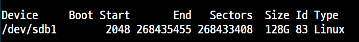
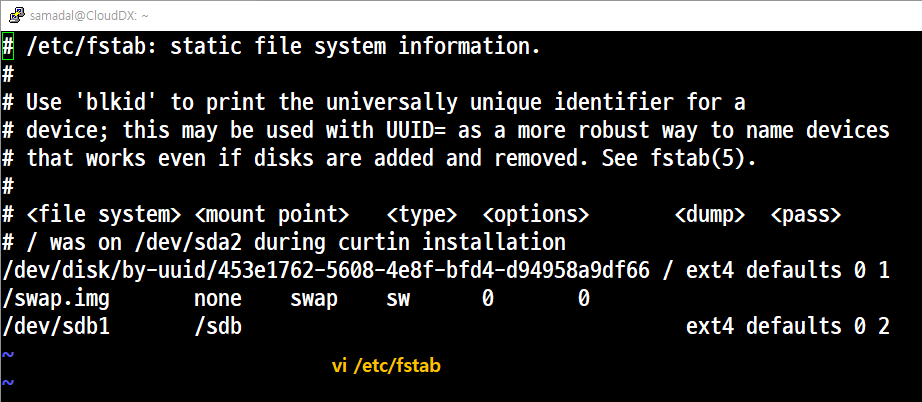
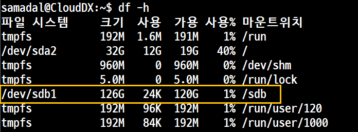
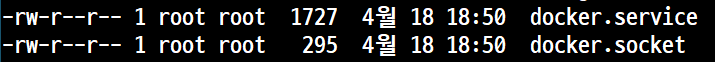
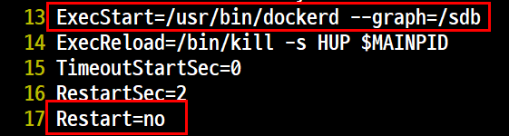
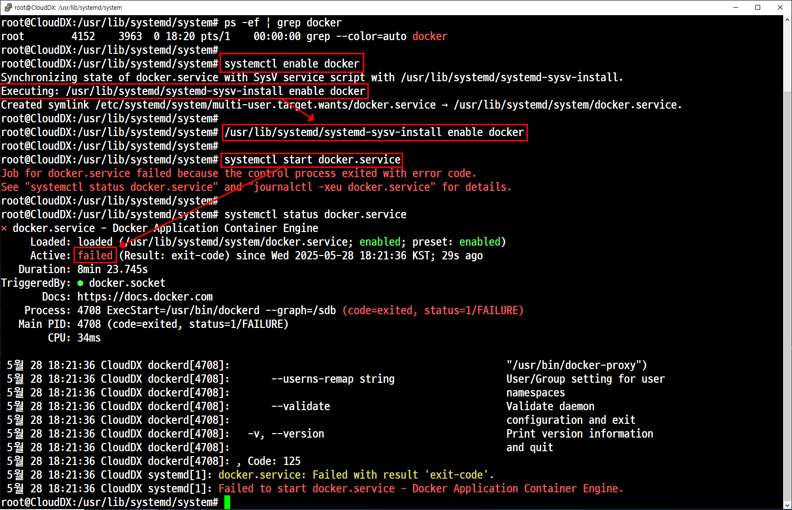

# 도커 기본 경로 변경
## 개요

### 작업 1. 경로 변경 전 작업

: 현재 동작 중인 도커 컨테이너를 모두 중지한다.<br>
: 호스트 시스템(Ubuntu)을 종료한 후 '128GB' 용량의  HDD를 추가, 통으로 자동마운트







도커 데몬, 도커 자동 데몬 실행 중지


```
systemctl stop docker
systemctl disable docker
```

### 작업 2. 경로 변경 설정

#### 기본 경로 확인
```
root@CloudDX:~# find / -name docker.service -type f
/var/lib/systemd/deb-systemd-helper-enabled/multi-user.target.wants/docker.service
/usr/lib/systemd/system/docker.service
find: ‘/run/user/1000/doc’: 허가 거부
find: ‘/run/user/120/doc’: 허가 거부
```


#### 기본 경로 설정 변경 1.
##### pwd : /usr/lib/systemd/system

vi docker.service



#### 설정 파일 변경 후 다시 로딩해서 시스템에 적용 1. 
```
systemctl daemon-reload
```
수정 후 데몬 적용

#### 도커 데몬 재시작 1.
오류


