# 🐳 도커 기본 경로 변경 작업 기록
## 개요

### 작업 1. 경로 변경 전 작업

: 현재 동작 중인 도커 컨테이너를 모두 중지한다.<br>
: 호스트 시스템(Ubuntu)을 종료한 후 '128GB' 용량의  HDD를 추가, 통으로 자동마운트


도커 데몬, 도커 자동 데몬 실행 중지

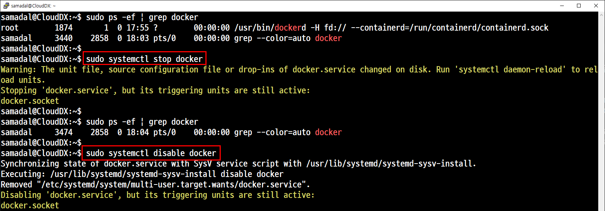

```
systemctl stop docker
systemctl disable docker
```

### 작업 2. 경로 변경 설정

#### 기본 경로 확인
```
root@CloudDX:~# find / -name docker.service -type f
/var/lib/systemd/deb-systemd-helper-enabled/multi-user.target.wants/docker.service
/usr/lib/systemd/system/docker.service
find: ‘/run/user/1000/doc’: 허가 거부
find: ‘/run/user/120/doc’: 허가 거부
```


## 기본 경로 설정 변경 1.
##### pwd : /usr/lib/systemd/system

vi docker.service


#### 설정 파일 변경 후 다시 로딩해서 시스템에 적용 1. 오류
```
systemctl daemon-reload
```
수정 후 데몬 적용

#### 도커 데몬 재시작 1.
오류


## 기본 경로 설정 변경 2. 정상

설정 파일 변경 후 다시 로딩해서 시스템에 적용 2. 정상
#### /usr/lib/systemd/system/docker.service
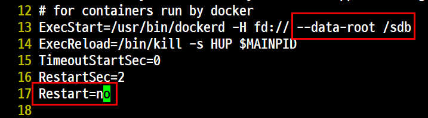

파일 수정 후 데몬 재시작 2. 정상

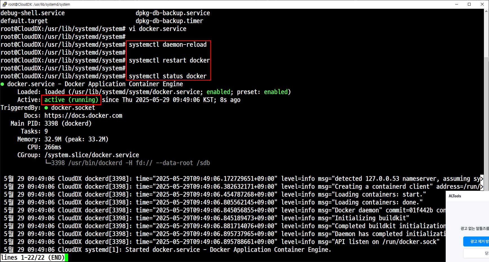

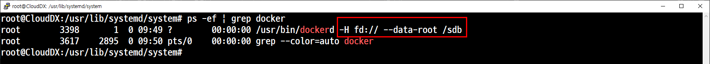


도커 기본 경로 변경 확인 <br>

정상적으로 변경 되었다면 원래 기본 경로(/var/lib/docker/) 안에 있던 내용들과 동일한 내용들이 '/sdb' 에 추가된 것을 확인할 수 있다.

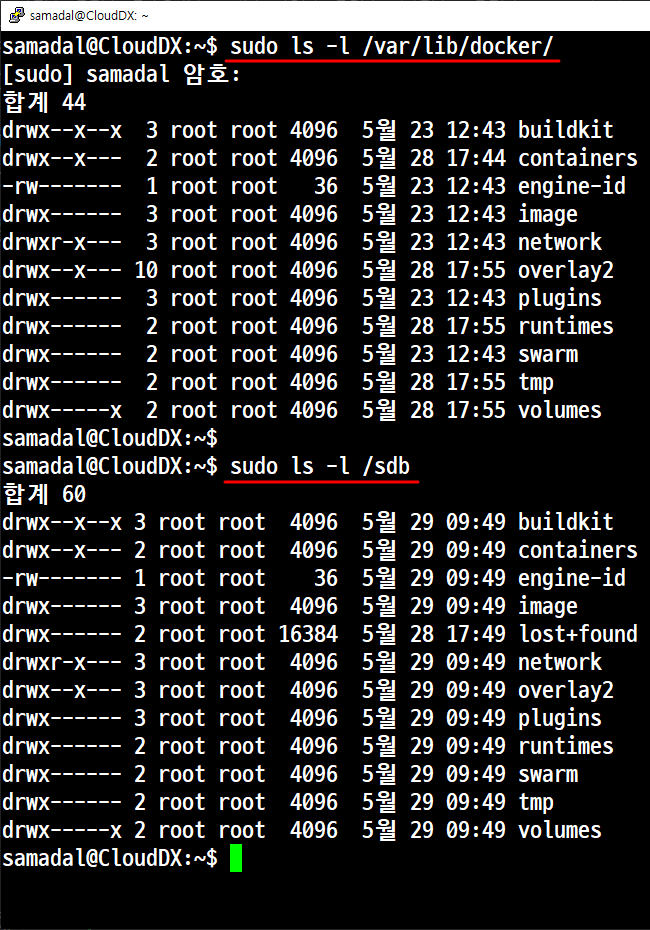

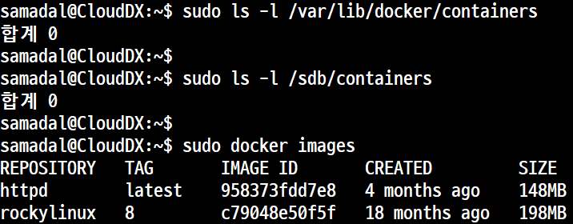

컨테이너가 있는 경우에 이렇게 나온다.

```
   sudo ls -l /var/lib/docker/containers

      drwx--x--- 3 root root 4096  1월 15 11:20 29000cb0b819dc096985180efe07f4fd3fa79f6f366906beae3397424f2c8962
      drwx--x--- 4 root root 4096  1월 15 11:20 303a1983edcaae1861c40e852332b33c7b90e28af88c2a0d1940bd2cc7927e5f
      drwx--x--- 4 root root 4096  1월 15 11:20 9c461a280817128bdc258f1606afc64c560682002d5143c6efe338abdd71daff
      drwx--x--- 4 root root 4096  1월 15 11:20 abdcab3f51cf9e6d23d70ded7124fb3232df74b5136afe1376981b81d03669d5
      drwx--x--- 4 root root 4096  1월 15 11:20 bfc381242c24d0e25b12baaf27758f9e07cbed36e675788ec7ca606e58bdae8b
      drwx--x--- 3 root root 4096  1월 15 11:20 d338fda52621fe7ffe2752b71ffe7cc51ae373945968c6f016908b40bf08df1f
```

- 기본 경로가 변경되었다는 것을 확인
- 마운트 정보 확인
- 이미지 추가 후 용량 확인

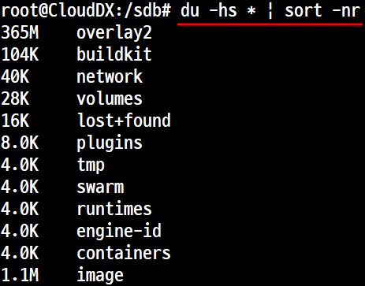

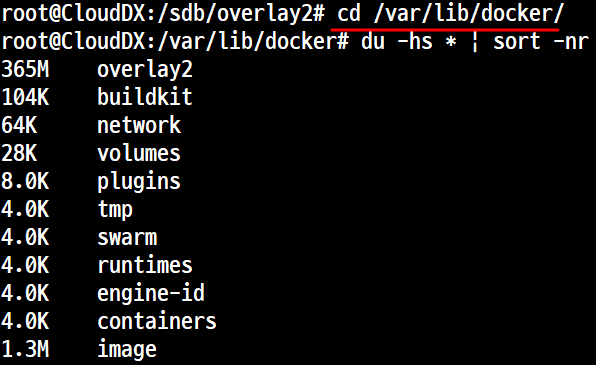

```
du -hs * | sort -nr
```

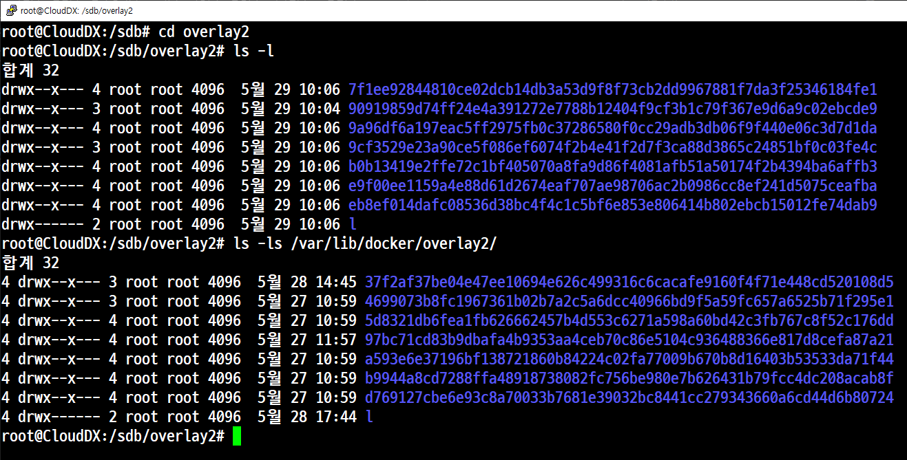

pwd /sdb/overlay2

이미지를 삭제 한 후의 용량 <br>전 → 후<br>
pwd = /sdb


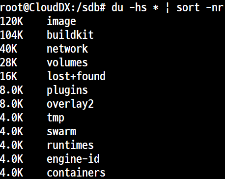

pwd = /var/lib/docker


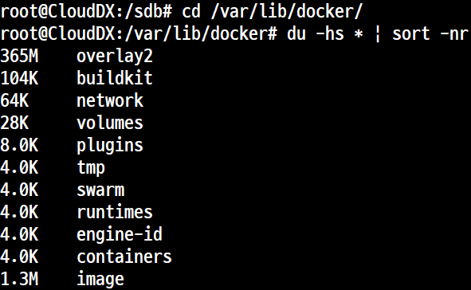

현재 도커는 /sdb 마운트 포인트에서 작동중

### 실습

#### 이미지 1개만 다운로드

#### 별도의 창에서 확인 1. 이미지 생성 후의 내용 변화

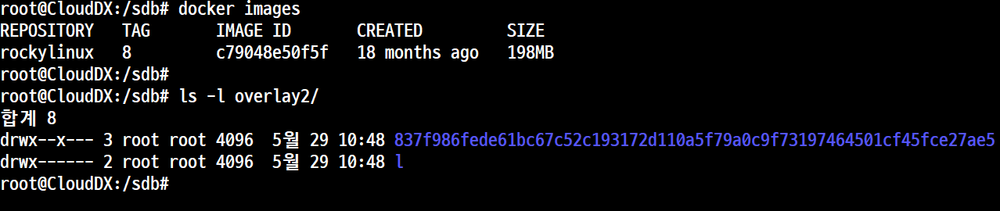

#### 컨테이너 생성

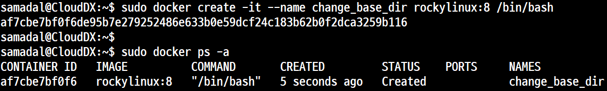


#### 별도의 창에서 확인 2. 컨테이너 생성 후의 내용 변화

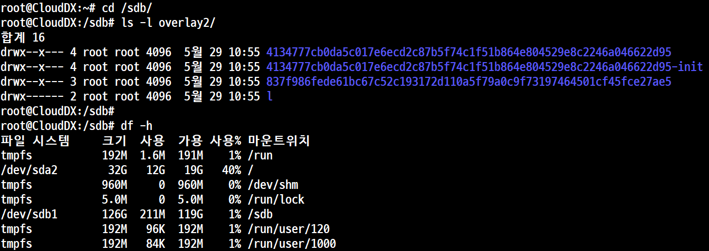

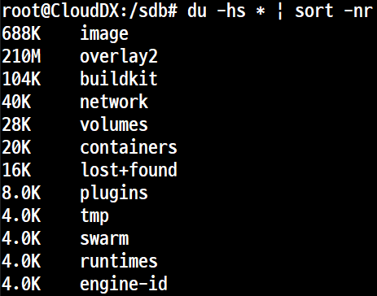

#### 별도의 창에서 확인 3. 컨테이너 접속 후의 내용 변화


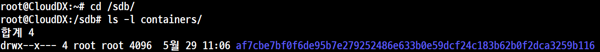

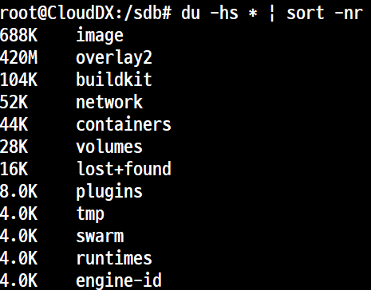

#### 두번째 이미지 추가 확인

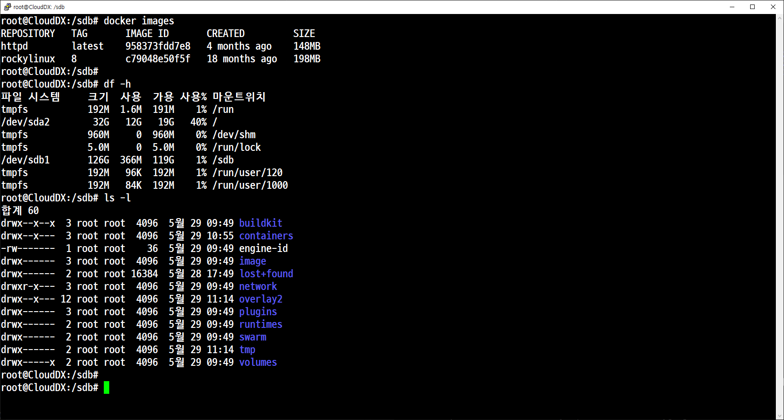

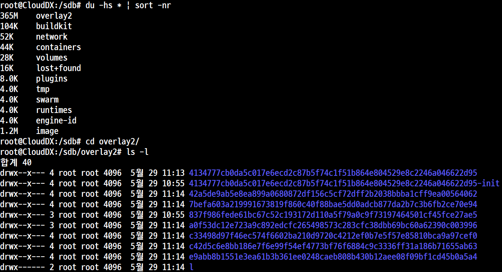

#### 두번째 이미지 추가 후 컨테이너 생성 후 확인

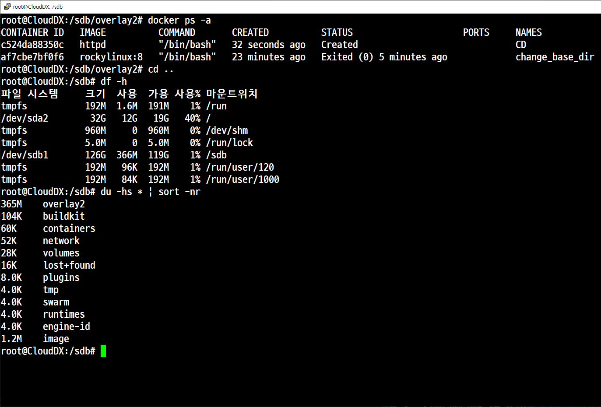

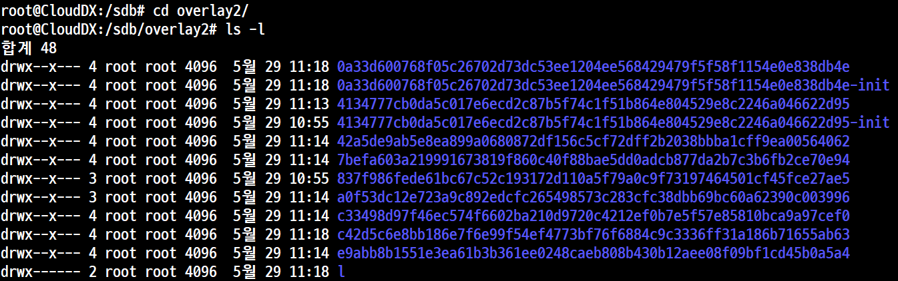

#### 두번째 이미지 추가 후 컨테이너 실행 후 확인

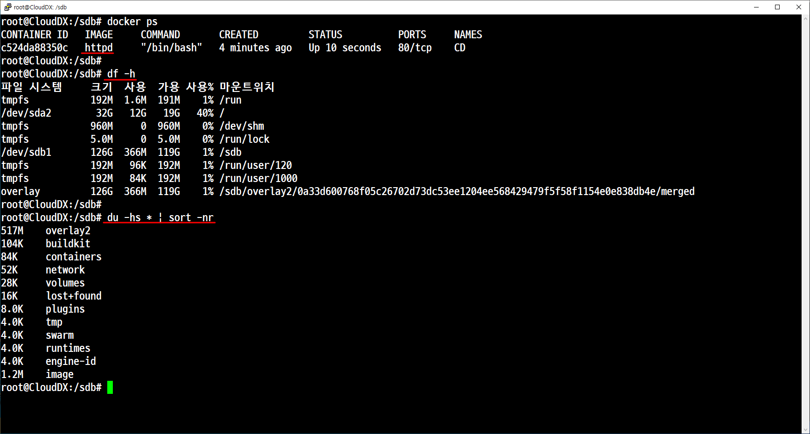

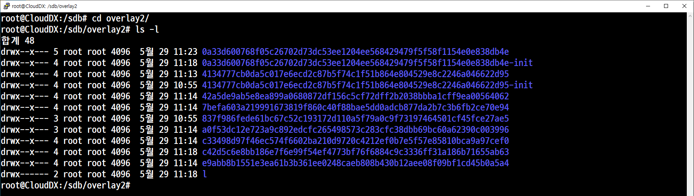

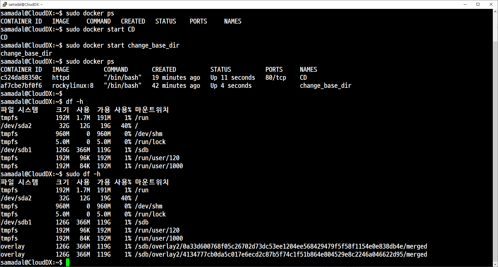

### 실습 2. `prune`

---

#### 📌 개요

- `docker prune` 명령은 **사용하지 않는 리소스를 일괄적으로 정리(clean up)** 하는 데 사용된다.
- 이를 통해 디스크 공간을 확보하고, 불필요한 도커 리소스를 제거할 수 있다.
- 단, **삭제 대상은 복구가 불가능하므로 주의가 필요**하다.
- 이 명령을 사용하기 전에 삭제해서는 안되는 이미지 또는 컨테이너는 반드시 도커 허브에 백업하도록 한다.
---

초기상태

컨테이너 실행 중 **sudo docker system prune**
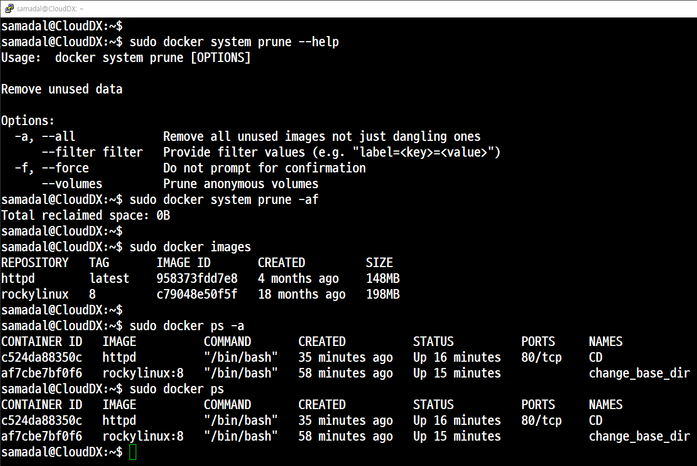

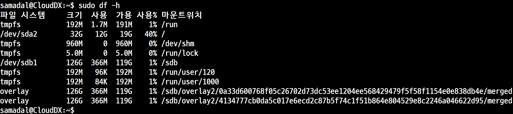

컨테이너 실행 정지

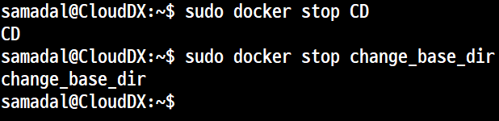

전부다 제거됨

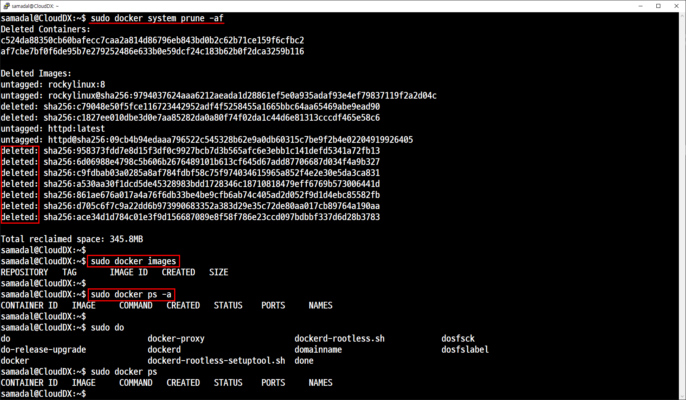

