# Rocky Linux 8.10

## 시스템 구성
- 폴더명
    - CloudDX_Rocky810
- CPU / RAM / HDD
    - 2cpu, 1core / 4096MB / 64 GB

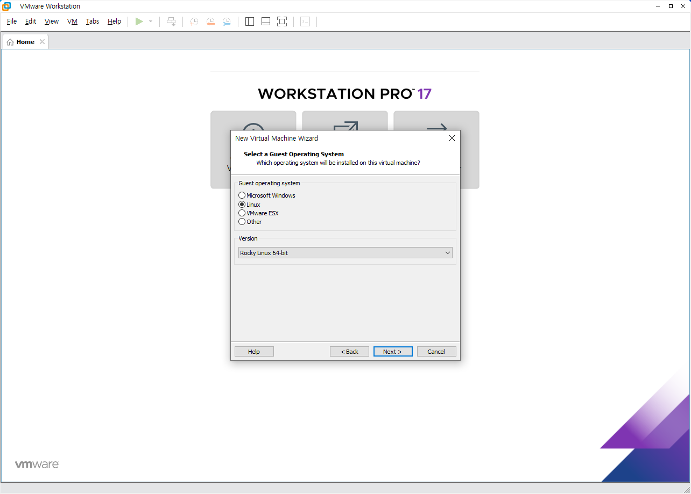

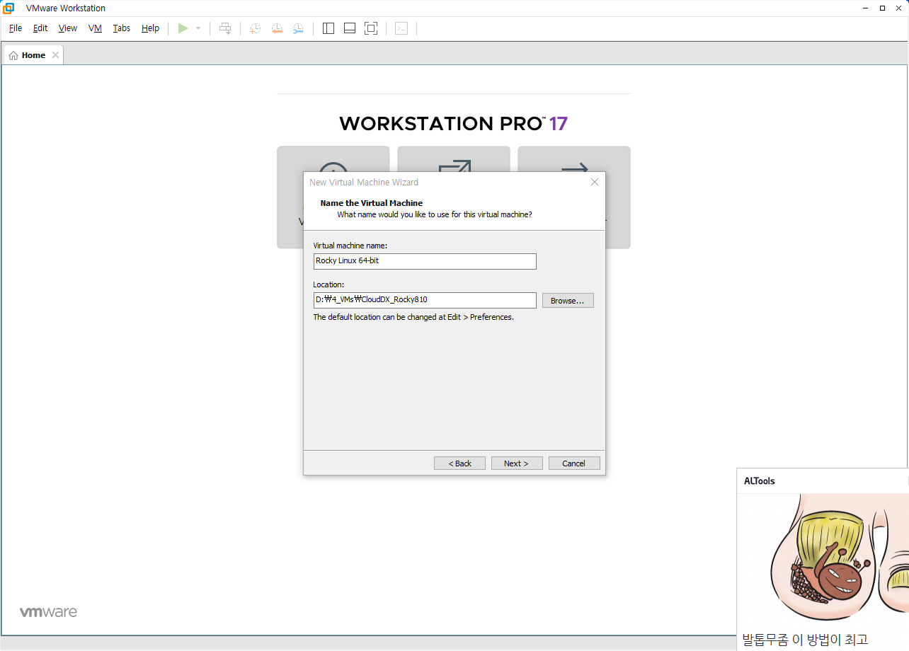


## 2. 설치
- CentOS와 동일한 방법으로 설치한다.
- 파티션은 '자동 파티션'으로 설치한다.

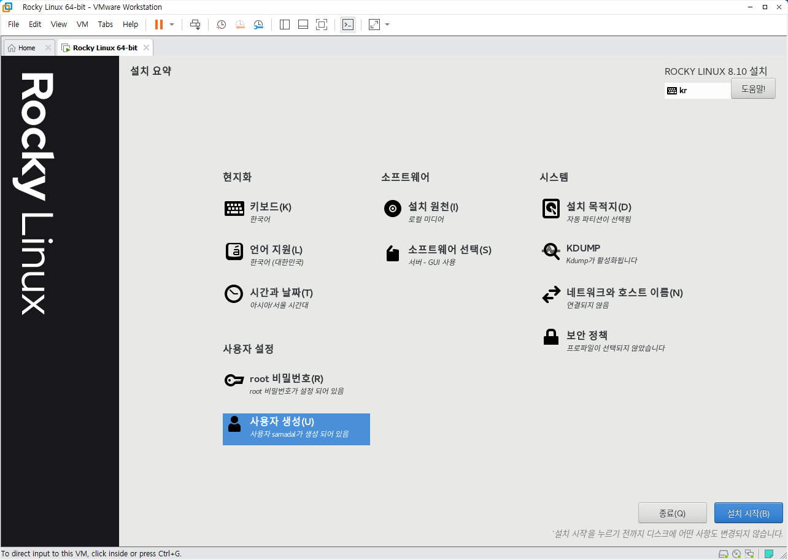

## 3. 설치 후 초기 설정
- 커널 업데이트
    - 업데이트 체크 (dnf check-update)
    - 업데이트 (dnf update)
    - Kerberos 비활성화 (/etc/selinux/config)
    - 원격 접속 활성화 (SSH)
    - Snapshot 1. Updated

## 4. 저장소 추가
putty로 원격 접속시 다음과 같은 내용이 출력 된다.
```
login as: samadal
samadal@192.168.10.128's password:
Activate the web console with: systemctl enable --now cockpit.socket
```

출력되어 있는 명령을 그대로 복사한 후 붙여넣기 하고 실행한다.
```
systemctl enable --now cockpit.socket

https://192.168.10.128:9090/  --> 접속
```

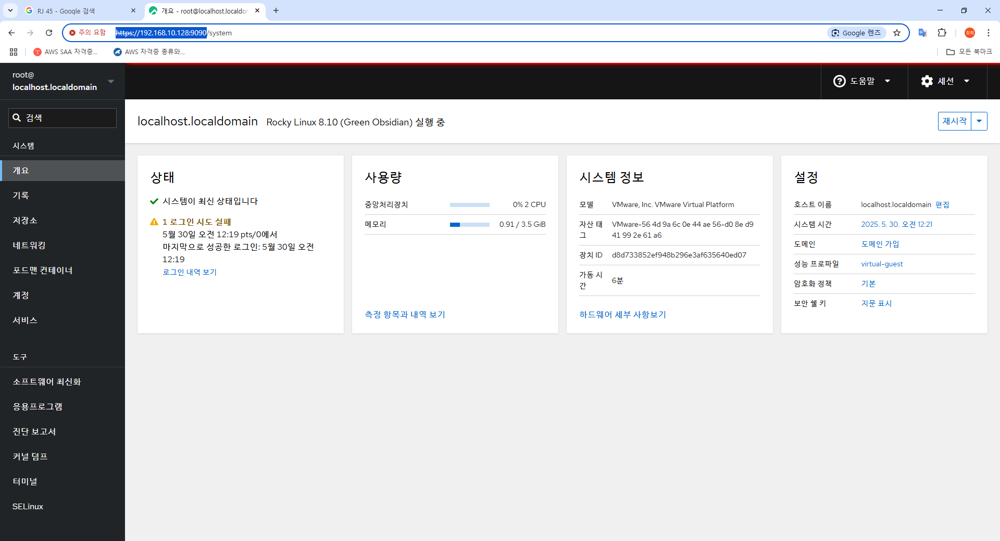

```
dnf install yum-utils
dnf install device-mapper-persistent-data
dnf install lvm2

yum-config-manager --add-repo https://download.docker.com/linux/centos/docker-ce.repo
dnf install docker-ce docker-ce-cli containerd.io --skip-broken
dnf -y install docker-ce --nobest --allowerasing
```

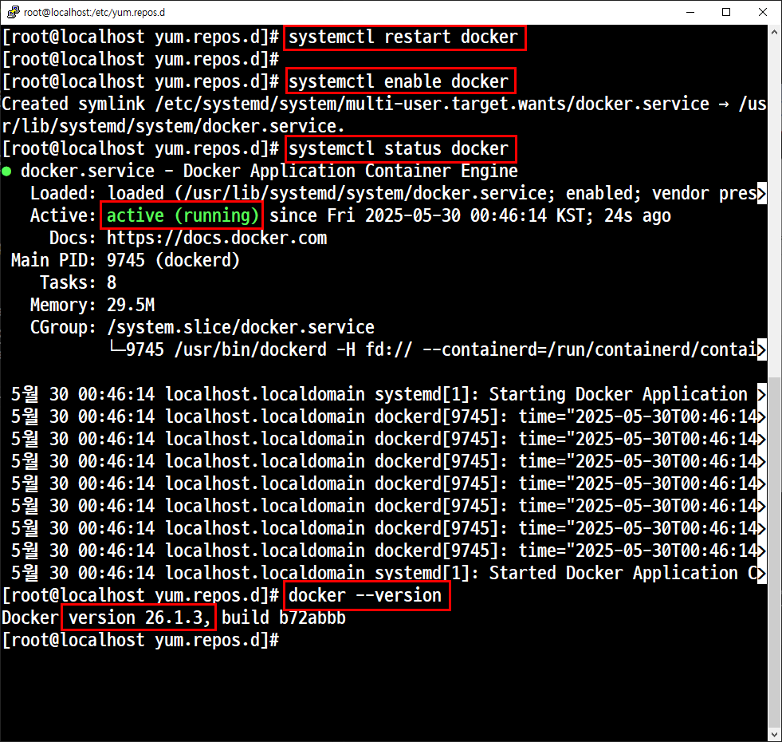

## 5. Docker 테스트

- 'hello-world' 이미지가 다운로드됨과 동시에 컨테이너가 자동 생성된다.

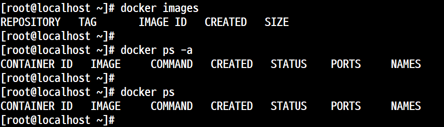

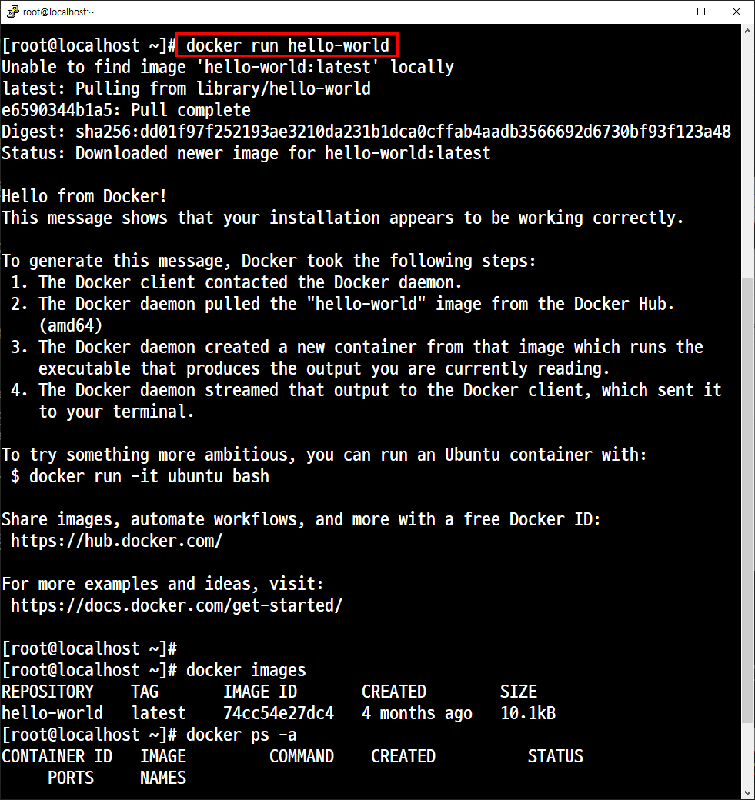


docker images = docker image ls <br>

docker ps -a = docker container ls --all <br>

docker ps = docker container ls <br>

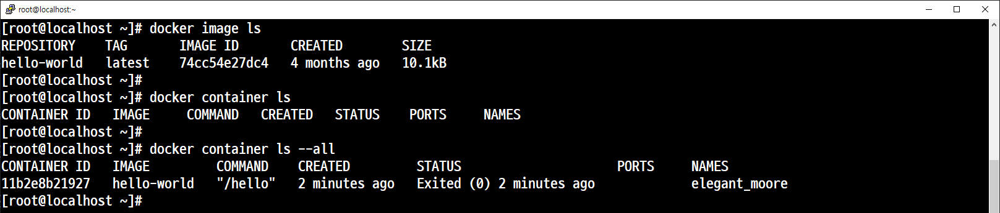

## 6. 이미지, 프로세스, 접속, 모니터링

- 이미지 검색

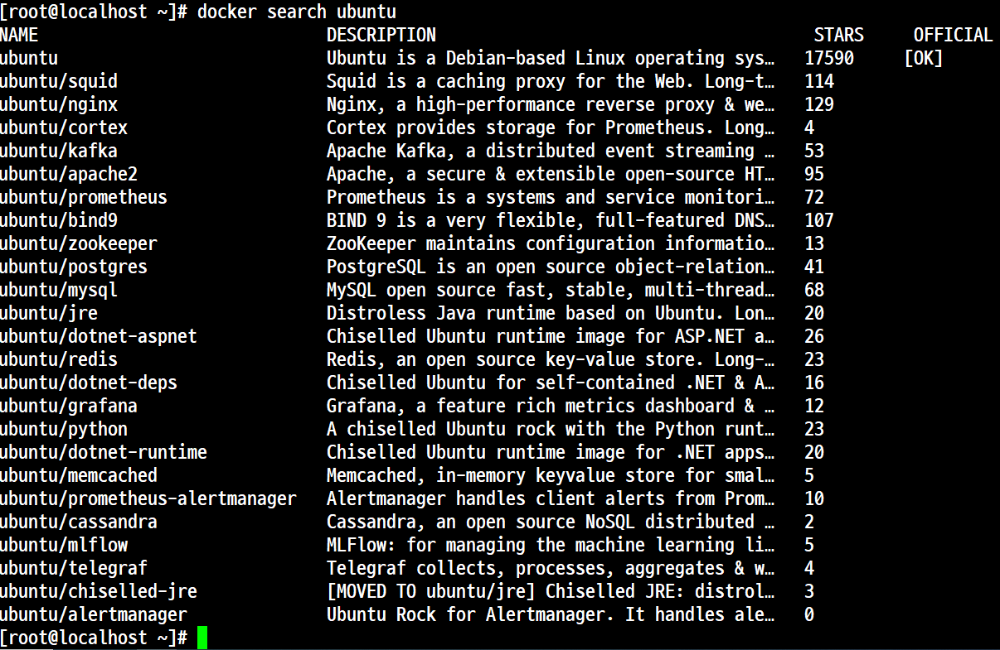

```
docker create --tty --interactive --name=dcon1 ubuntu bash
docker run -itd --name dcon2 ubuntu /bin/bash
docker create -it --name dcon3 ubuntu /bin/bash
```

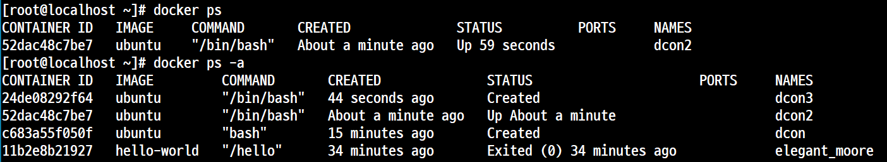

dcon2만 시작

top

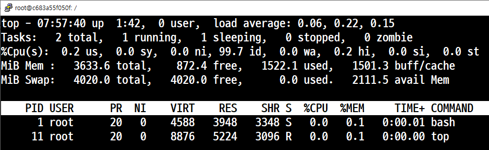
