# 쿠버네티스

## 1. 인프라 환경(Infrastructure Configuration)의 이해

### 온프레미스(on-premises)
 - **기업 내에 있는 전산실(기업 전용선, 랙, 서버 등)** 등을 말한다.
 - 엔지니어가 개발 환경을 만들어서 제공하면 사용자는 그에 맞는 도구를 모두 설치하고 사용하는 환경을 말한다.


 ### 서비스로서의 인프라 환경(IaaS, Infrastructure as a Service)

 - 돈을 넣으면 자판기에서 미리 준비된 상품(음료 등)이 나오듯이 미리 구성된 환경을 사용자가 필요에 따라 선택하고 조합해서 사용할 수 있는 환경을 말한다.

- 애자일
: 계획 단계에서 설계와ㅏ환경을 완전하게 구비한 후 예정된 목표를 달성해 나가는 것

## 2. 'Kubenetes(k8s)' 개요

- 컨테이너 인프라 환경은 컨테이너를 중심으로 구성된 인프라 환경을 말한다.
- 컨테이너는 하나의 운영체제 커널에서 다른 프로세스에 영향을 받지 않고 (핵심)독립적으로 실행되는 프로세스 상태를 말한다.
- CIC는 크게 컨테이너 관리, 개발 환경 구성 및 배포 자동화, 모니터링 등으로 구성된다.

## 3. CIC 지원도구
- 컨테이너
    - 애플리케이션의 실행 환경을 포함하는 가벼운 패키지
- 컨테이너 런타임
    - 컨테이너 실행을 담당하는 소프트웨어를 말한다.
- 오케스트레이션
    - 구성과 배합을 적용하는 것을 말한다.
    - 컨테이너의 관리, 배포, 확장과 같은 서비스 전반에 걸쳐 관리하는 것을 말한다.
    - 컨테이너 통합 관리 를 한다.
- 도커
- 쿠버네티스
    - 컨테이너 런타임 을 통해 '컨테이너를 오케스트레이션' 하는 도구를 말한다.
- 젠킨스
    - 개발한 프로그램의 빌드, 테스트, 패키지화. 배포 단계를 모두 **자동화** 하는 즉, 개발 단계를 표준화하고 있는 것을 말한다.
- Prometheus & Grafana
    - GUI Mode 형태의 모니터링 도구를 말한다.
- API(Application Programming Interface, 응용 프로그래밍 인터페이스)
    - 컴퓨터(Hardware)와 컴퓨터 프로그램(software) 사이의 연결을 말한다.
    - 리눅스 시스템에서의 'Mount'와 유사한 기능이다.

## 4. 컨테이너 인프라 환경 종류
### 모놀리식 아키텍처(Monolithic Architecture)

#### 개요

- 하나의 큰 목적이 있는 서비스 또는 애플리케이션에 여러 기능이 '통합' 되어 있는 구조를 말한다.

#### 장점

- 개발이 단순하다.
- 코드 관리가 비교적 간편하다.

#### 단점

- 수정이 많을 경우 연관된 서비스 등에 미치는 영향이 높아진다.
- 서비스와 관련된 기능들이 많아질수록 서비스 간의 관계가 복잡해진다.


### 마이크로서비스 아키텍처(MicroServices Architecture)
#### 개요

- MA와 같이 시스템 전체가 하나의 목적을 지향하지만 '개별 기능'을 하는 작은 서비스를 각각 개발해서 '연결'하는 구조를 하고 있다.

#### 장점

- 개발된 서비스를 재사용하기에 용이하다.
- 서비스 변경 시 다른 서비스에 영향을 미칠 가능성이 낮다.
- 사용자의 요구 사항에 따라 가용성을 즉각적으로 확보해야 하는 IaaS 환경에 적합하다.

#### 단점

- 서비스가 많을수록 복잡도가 높아진다.
- 사용하는 량이 증가하기 때문에 성능에 영향을 줄 수가 있다.

# 5. Kubebetes 실습환경

## 🧪 Kubernetes 실습 환경 구성

### 🖥️ Virtualization
- **가상화 도구**: Oracle VirtualBox

### 💻 Host OS
- **운영체제**: Ubuntu 24.04 Desktop

### 🐳 Container
- **컨테이너 도구**: Docker
- **Runtime**: containerd

### ☸️ Kubernetes
- **버전**: Kubernetes 1.28 → 1.29 업그레이드 실습 포함

### 🖧 Cluster 구성
- **총 노드 수**: 3개
  - 🟩 **Control Plane (Master Node)**: 1개
  - 🟦 **Worker Node**: 2개

# 6. 'Vagrant'를 이용한 Ansible 실습 환경 구성 및 테스트

## 매우 중요
- 가상 머신을 설치해야 하기 때문에 **VMWare**에서의 **가상 환경**이 아닌 'Main Host System(OS, Windows 10)'에 설치해야 한다.
- 'Provisioning(공급)'에 필요한 기본 코드인 'Vagrant Script File(Vagrantfile)'을 편집할 때는 절대 'Tab'키를 사용하지 말고 'Space Bar'를 이용해야 한다.

## 개요
- 'Vagrant'는 사용자의 요구에 맞게 시스템 자원을 할당, 배치해 두었다가필요할 때에 시스템을 사용할 수 있는 상태로 만들어 주는데 이를 'Provisioning' 이라고 한다. 즉, **필요할 때 공급한다** 라는 말이다.
- VMWare 또는 VirtualBox에서 OS를 설치하고 구성한 이후에 복제하는 등의 과정이 필요 없게 된다.

## [Vagrant 명령어](https://github.com/CHANGHEE9505/TIL/blob/main/ANsible/20250519Vagrant.md)

## Vagrant 다운로드 및 설치

## Vagrant 구성 후 테스트
### Step 1. 프로비저닝에 필요한 기본 코드인 'Vagrantfile' 생성
```
C:\HashiCorp> vagrant init
==> vagrant: A new version of Vagrant is available: 2.4.6 (installed version: 2.4.5)!
==> vagrant: To upgrade visit: https://www.vagrantup.com/downloads.html

`Vagrantfile` already exists in this directory. Remove it before
running `vagrant init`.

C:\HashiCorp>vagrant --version
Vagrant 2.4.5

C:\HashiCorp>vagrant init
`Vagrantfile` already exists in this directory. Remove it before
running `vagrant init`.
```

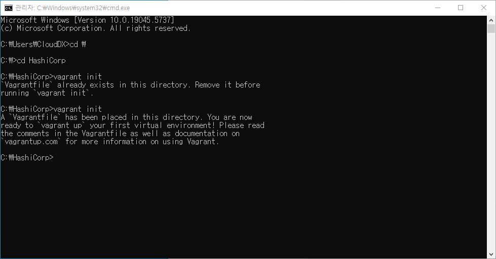

### Step 2. 'Vagrantfile' 파일의 내용을 확인
### Step 3. 프로비저닝 작업 (오류 발생)

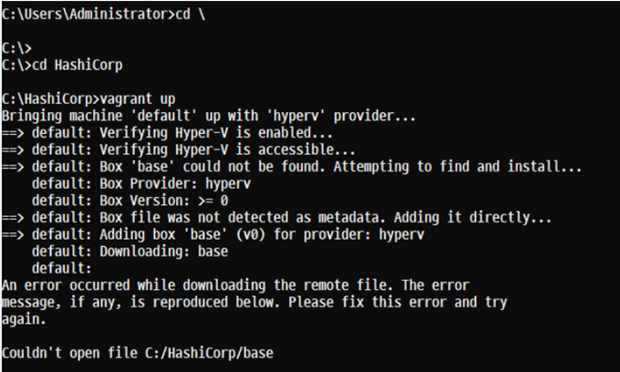

### Step 4. 'OS Image' 선택

### Step 5. Vagrantfile 파일의 내용을 수정
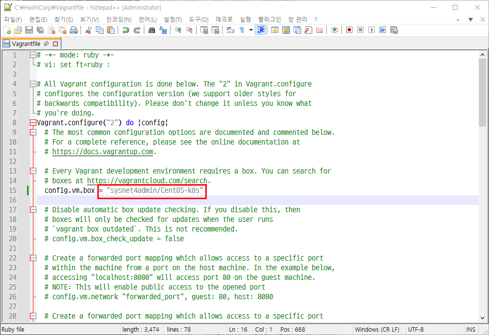

### Step 6. 'OS Image' 다운로드 확인
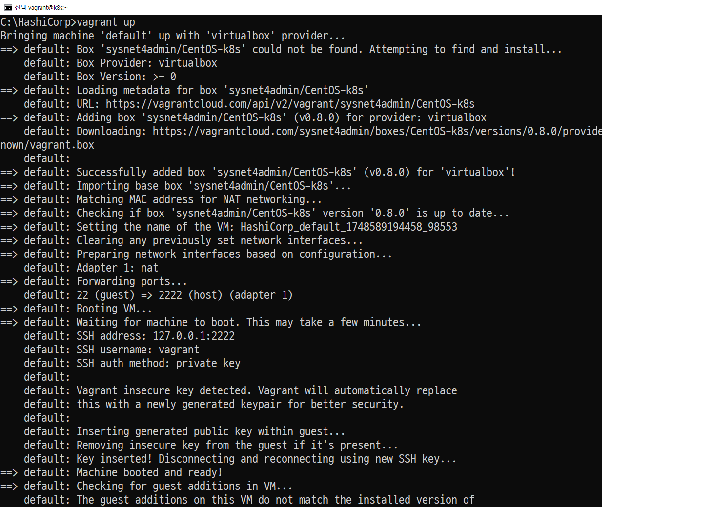
### Step 7. 가상 머신이 생성되었는지 확인하고 SSH.를 이용한 원격 접속

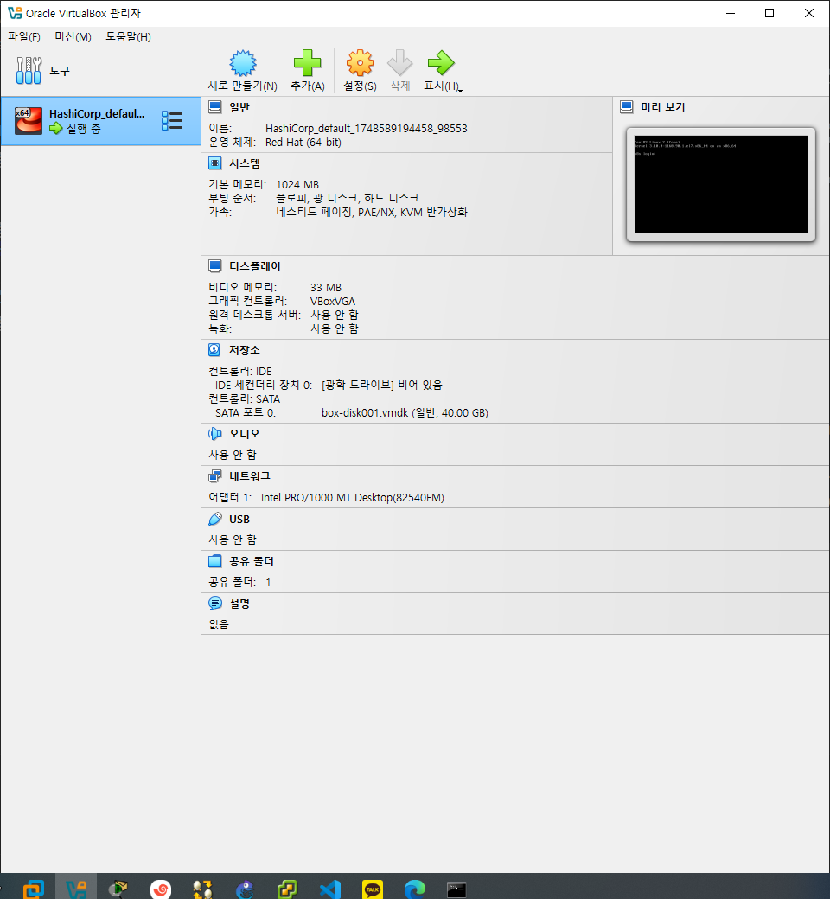

### Step 8. 설치가 정상적으로 되었는지 확인
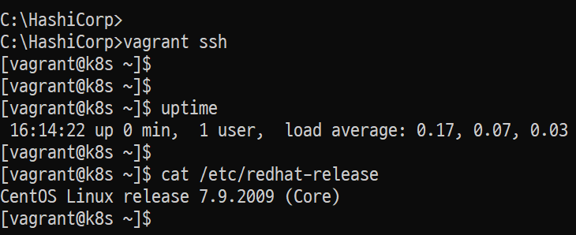

### Step 9. 제거
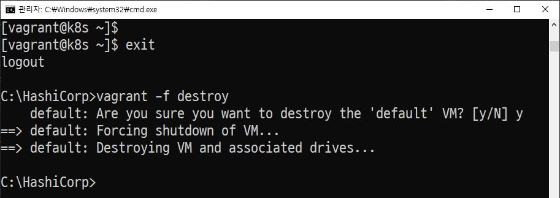


## 'Vagrant File'을 이용한 테스트 환경 구축

- 가상 머신에 필요한 설정 등을 파일을 이용해서 자동으로 적용되는 가상 머신 생성

```
# -*- mode: ruby -*-
# vi: set ft=ruby :
Vagrant.configure("2") do |config| 
  config.vm.define "m-k8s" do |cfg|
    cfg.vm.box = "sysnet4admin/CentOS-k8s"
    cfg.vm.provider "virtualbox" do |vb|
      vb.name = "m-k8s(github_SysNet4Admin)"
      vb.cpus = 2
      vb.memory = 2048
      vb.customize ["modifyvm", :id, "--groups", "/k8s-SM(github_SysNet4Admin)"]
    end
    cfg.vm.host_name = "m-k8s"
    cfg.vm.network "private_network", ip: "192.168.1.10"
    cfg.vm.network "forwarded_port", guest: 22, host: 60010, auto_correct: true, id: "ssh"
    cfg.vm.synced_folder "../data", "/vagrant", disabled: true
  end
end
```

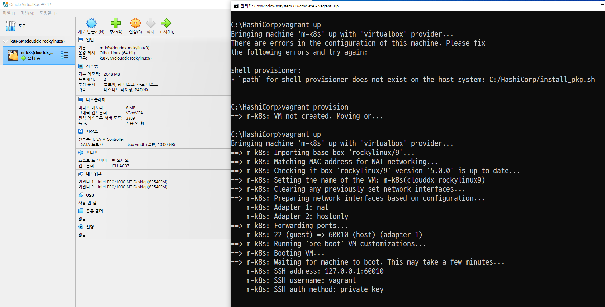

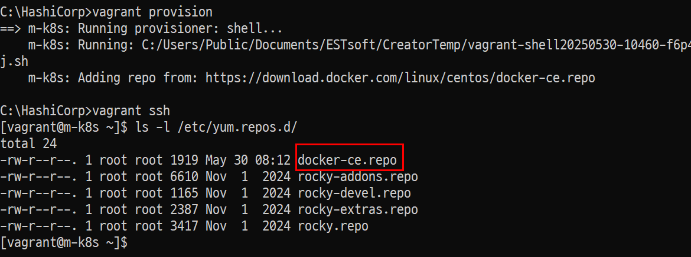


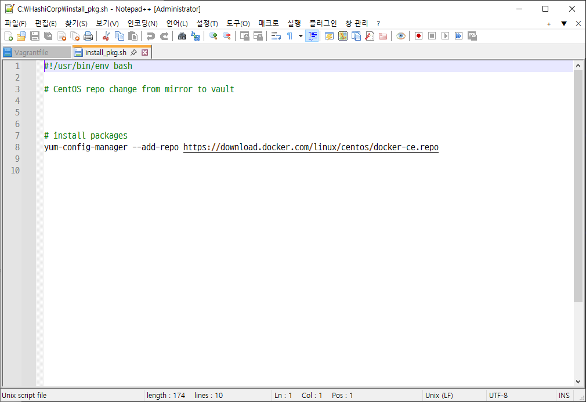

## 다음

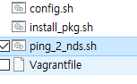

install_pkg.sh
```
#!/usr/bin/env bash

# install packages 
yum install epel-release -y
```
ping_2_nds.sh
```
# ping 3 times per nodes
ping 192.168.1.101 -c 3
ping 192.168.1.102 -c 3
ping 192.168.1.103 -c 3
```
config.sh
```
#!/usr/bin/env bash
# modify permission  
chmod 744 ./ping_2_nds.sh
```

Vagrantfile
```
# -*- mode: ruby -*-
# vi: set ft=ruby :

Vagrant.configure("2") do |config| 
  config.vm.define "m-k8s" do |cfg|
    cfg.vm.box = "rockylinux/9"
    cfg.vm.provider "virtualbox" do |vb|
      vb.name = "m-k8s(clouddx_rockylinux9)"
      vb.cpus = 2
      vb.memory = 2048
      vb.customize ["modifyvm", :id, "--groups", "/k8s-SM(clouddx_rockylinux9)"]
    end
    cfg.vm.host_name = "m-k8s"
    cfg.vm.network "private_network", ip: "192.168.1.10"
    cfg.vm.network "forwarded_port", guest: 22, host: 60010, auto_correct: true, id: "ssh"
    cfg.vm.synced_folder "../data", "/vagrant", disabled: true   
    cfg.vm.provision "shell", path: "install_pkg.sh"
    cfg.vm.provision "file", source: "ping_2_nds.sh", destination: "ping_2_nds.sh"
    cfg.vm.provision "shell", path: "config.sh"
  end
  
  #=============#
  # Added Nodes #
  #=============#

  (1..3).each do |i|
    config.vm.define "w#{i}-k8s" do |cfg|
      cfg.vm.box = "rockylinux/9"
      cfg.vm.provider "virtualbox" do |vb|
        vb.name = "w#{i}-k8s(clouddx_rockylinux9)"
        vb.cpus = 1
        vb.memory = 1024
        vb.customize ["modifyvm", :id, "--groups", "/k8s-SM(clouddx_rockylinux9)"]
      end
      cfg.vm.host_name = "w#{i}-k8s"
      cfg.vm.network "private_network", ip: "192.168.1.10#{i}"
      cfg.vm.network "forwarded_port", guest: 22, host: "6010#{i}",auto_correct: true, id: "ssh"
      cfg.vm.synced_folder "../data", "/vagrant", disabled: true
      cfg.vm.provision "shell", path: "install_pkg.sh"
    end
  end
end
```
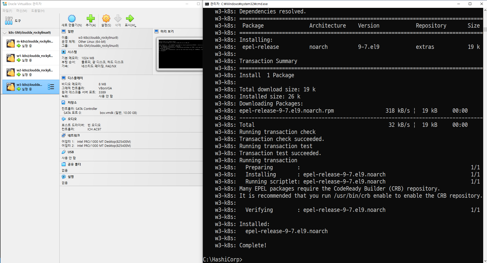

```
vagrant provision
```

공식 이미지
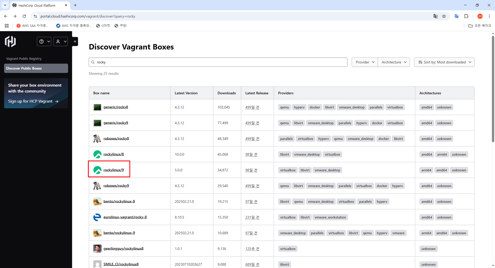

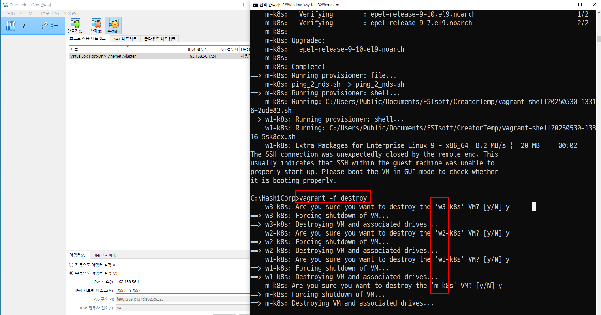

```
vagrant -f destroy
```