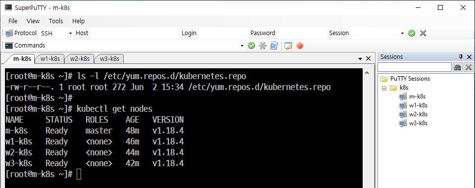
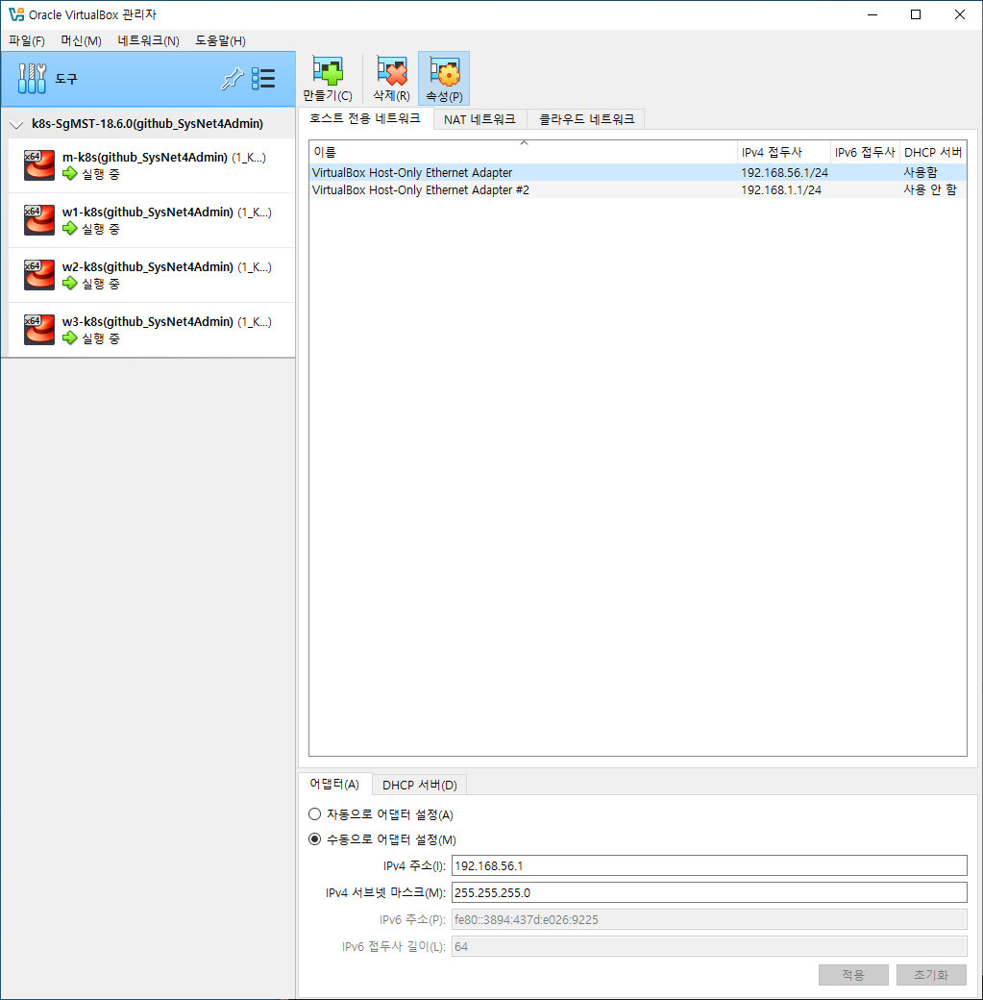
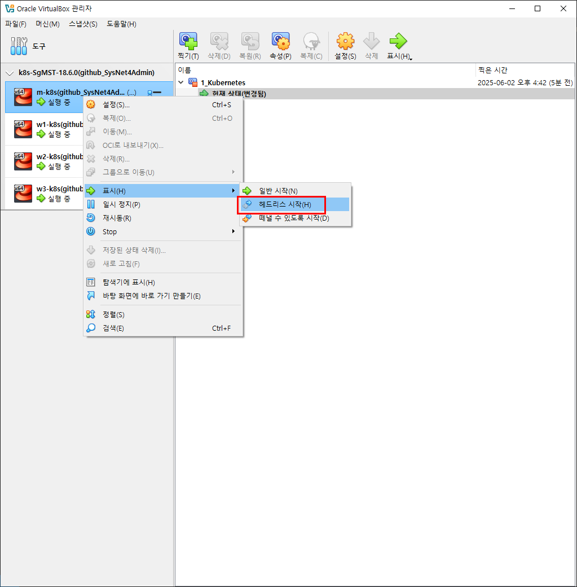
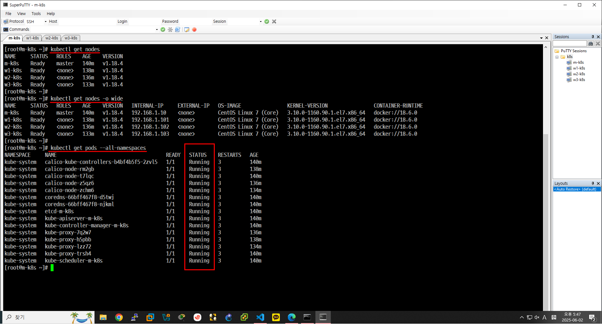

> ### Kubernetes 설치 및 구성 방식 비교

#### ☁️ 퍼블릭 클라우드 관리형 Kubernetes
- **예시**: EKS (Amazon Elastic Kubernetes Service), AKS (Azure Kubernetes Service), GKE (Google Kubernetes Engine)
- **특징**:
  - 클라우드 업체에서 마스터 노드 등 주요 인프라를 관리
  - 구성이 이미 잘 갖춰져 있어 빠르게 사용할 수 있음
- **단점**:
  - 학습용으로는 적합하지 않음 (내부 구성 요소 파악 어려움)

---

#### 🏢 설치형 Kubernetes 플랫폼
- **예시**: Rancher(SUSE), OpenShift(Red Hat)
- **특징**:
  - 설치형 플랫폼에서 Kubernetes를 제공
  - 엔터프라이즈 환경에서 많이 사용
- **단점**:
  - 유료 서비스가 대부분이라 접근이 어려움

---

#### 🛠️ 구성형 Kubernetes (직접 설치 및 구성)
- **예시 솔루션**:
  - `kubeadm`
  - `kops` (Kubernetes Operations)
  - `KRIB` (Kubernetes Rebar Integrated Bootstrap)
  - `kubespray`

- **특징**:
  - 사용자가 직접 Kubernetes 클러스터 구성
  - 온프레미스와 클라우드 모두 지원
  - 다양한 커스터마이징 가능

- **특히 `kubeadm`**:
  - 가장 널리 알려진 구성형 도구
  - 배우기 쉬움
  - 변경 및 커스터마이징이 수월함

> ✅ 이러한 도구들을 활용한 방식은 **"구성형 Kubernetes"** 라고 함

## 실습 1. 'Kubernetes' 구성하기 (테스트 환경 구축)
- 개요
    - 'kubeadm' 명령어를 이용해서 'kubernetes'를 구성한다.
    - 'kubernetes'가 설치되는  'Master Node(Master System, Server Node)'
    - 가상 머신을 이용해서 쉽게 'On-premis(온-프레미스) 환경'에 가깝게 즉, 한 공간에 'Server Node(Server)'와 'Worker Node(Client)'가 한 공간에서 동작되도록 구성하고 설치되는 과정으로 'Vagrant'로 자동화하고 필요하면 'Kubernetes'테스트 환경을 재구성할 수 있다.

### Step 1. 'Vagrant' '스크립트 파일(소스 코드)' 구성
### Step 2. Provisioning

### Step 3. Snapshot

스냅샷 이후 헤드리스 시작

## 실습 2. 파드 배포를 중심으로 'kubernetes' 구성 요소 살펴보기

### 용어
#### **Pods**(리소스 관리, 자원 관리)
- 'kubernetes'의 '자원 객체'를 말한다.
- 1개 이상의 컨테이너로 구성된 컨테이너 집합을 의미한다.
- 컨테이너 애플리케이션('실행'과 관련된 명령어)을 배포하기 위한 기본 단위를 말한다. **즉, 하나의 파드는 하나의 완전한 애플리케이션이라고 할 수 있다.** 
- '파드를 생성한다.'라는 말은 컨테이너들이 서로 공유해야 하는 자원을 관리한다.

#### Namespace(자원 공유)
- 운영체제 커널에서 여러 프로세스 그룹에게 독자적인 자원 공간을 제공하기 위해 사용되는 기술을 말한다.
- 'kubernetes' 가 단순 컨테이너를 사용하지 않고 컨테이너 관리를 위한 '기본 단위'로 '파드'를 사용하는 이유는 여러 시스템(리눅스)들이 'Namespace'를 공유하는 여러 컨테이너를 논리적인 집합으로 사용하기 위함이다. 즉, 파드 내에 여러 컨테이너들이 같은 네트워크 I/F를 공유하고 서로의 파일 시스템(파티션)에 접근할 수 있다.

#### 작업
- 현재 접속되어 있는 'm-k8s'에서 명령을 실행한 후 설치된 'Kubernetes' 구성 요소를 명령(kubectl get pods --all-namespsaces)으로 확인한다.

STATUS 부분이 pending 으로 되어있으면 안된다.

#### --all-namespsaces
- '기본 네임스페이스'인 default 외에 모든 것을 표시하겠다...는 말이다. 즉, 지원 가능한 모든 네임스페이스에서 파드를 수집해서 보여준다.
- kubernetes 클러스터를 이루는 구성요소들은 파드 형태로 이루어져 있음을 알 수 있다.

#### 'kubernetes' 구성 요소의 이름 생성 규칙
- 구성 요소는 동시에 여러 개가 존재하는 경우 중복된 이름을 피하기 위해 뒤에 '해시(hash) 코드'가 삽입되는데 이 때  '해시 코드'는 무작위 문자열로 생성된다.
구성요소는 수동으로도 가능하지만 관리를 위해 자동으로 이름을 이름을 지정하는 것이 좋다.

- 'coredns' 중간에 66bff467f8 이라는 문자열이 있는데 이것을 ReplicatSe'레플리카'을 무작위 문자열로 변형태 추가한 것이다.

