# 명령어를 이용한 Kubernetes 구성 요소의 기능

## Kubectl
### Step 1. 활성화 되어 있는 'Worker Node' 중에서 'w3-k8s' 에 원격 접속한다.
### Step 2. kubectl 은 API Server를 통해서 Kubernetes에 명령을 낼니다.

### Step 3. Master Node에서 Kubernetes Cluster의 정보 파일(admin.conf)을 복사한다.
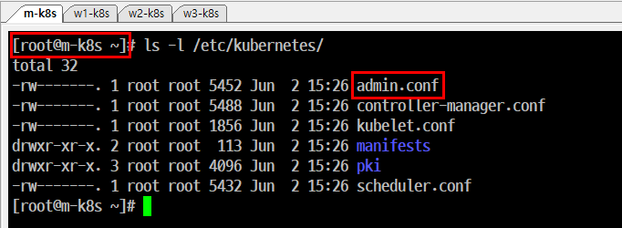

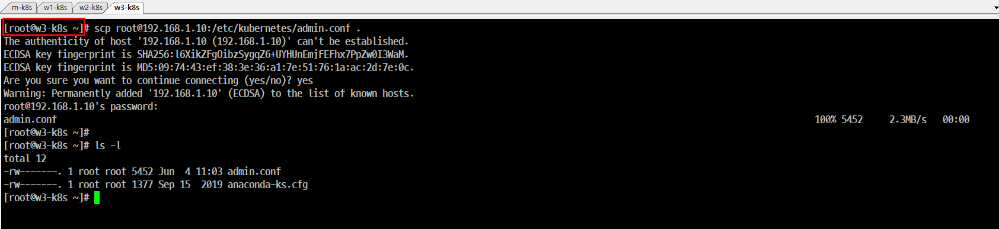

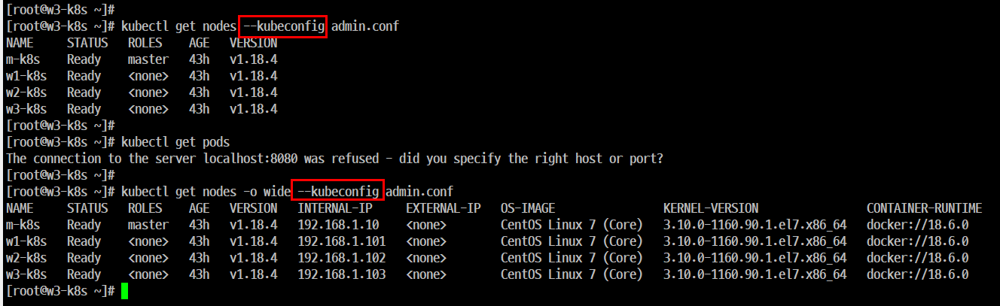

## kubelet 
### 개요
```
kubernetes에서 파드의 생성과 상태 관리 및 복구 등을 담당하는 요소이다.
kubelet에 문제가 있을 경우 파드가 정상적으로 관리되지 않는다.
```
#### Step 1.Yaml 파일 업로드
- nginx 웹 서버 파드 배포를 위해 nginx-pod.yml 파일을 Master Node에 업로드
- c:\HashiCorp 에 파일을 이동시킨다.
- Windows 10에서 scp를 이용해서 Master Node(m-k8s)의 /root에 업로드한다.
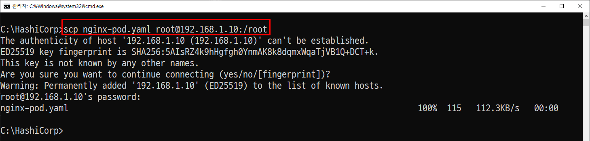

#### Step 2. 파드 배포
- Master Node(m-k8s)에서 nginx웹서버 파드를 배포한다.
- 파드의 구성 내용을 파일로 읽어 들여서 1개의 파드를 '임의의 노드'에 배포

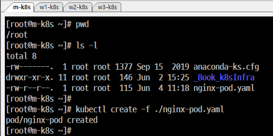
```
kubectl create -f ./nginx-pod.yaml
```

#### Step 3. 파드가 '정상적으로 배포된 상태(Running)'인지 확인

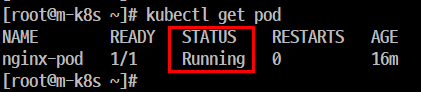

- Step 4. 파드가 배포된 Worker Node 확인

- Step 5. Step 4의 'Node' 필드에 나와 있는 즉, 배포된 노드인 Worker Node의 시스템으로 이동한 후 'kubelet' 서비스를 중지한다.

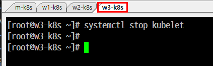

#### Step 6. Master Node에서 상태를 확인하고 파드를 삭제한다.
#### Step 7. 복구

- kubelet에 문제가 있을 경우 파드가 정상적으로 관리되지 않는다.

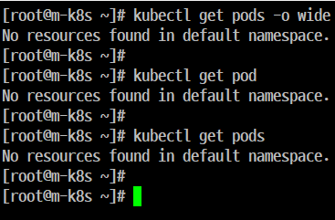
    

## 'Kube-proxy'

### 개요
```
kubelet은 파드의 상태를 관리하고 kube-proxy는 파드의 통신을 담당한다.
config.sh 파일에서 'br_netfilter' 커널 모듈을 적재하고 iptables(방화벽)을 거친다.
```
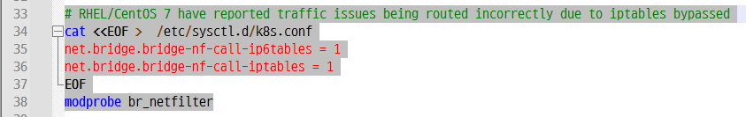

#### Step 1. nginx 파드를 다시 배포한다.
#### Step 2. 파드의 IP 주소와 Worker Node를 확인한다.
#### Step 3. 문서 내용(nginx의 HTML 코드)을 확인

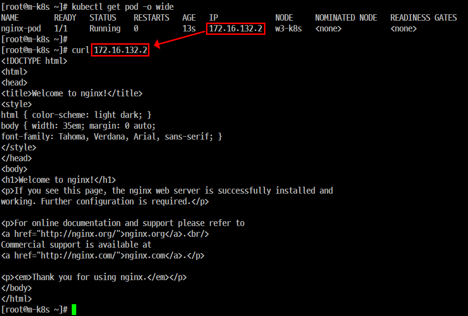

#### Step 4. kube-proxy에 문제가 생기는 상황을 만든다.
- 파드가 있는 Worker Node에서 br_netfilter 모듈을 제거한다.
- 제거 완료후 네트워크 데몬을 재실행하면 변경된 내용이 적용된다.

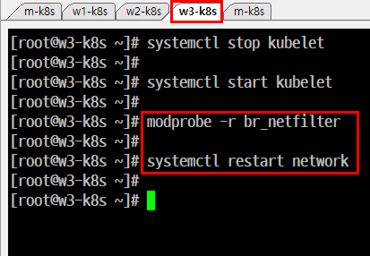

#### Step 5. 문서 내용을 확인한다.
- 파드를 받아오지 못하면 중지(^ + C)한다.

#### Step 6. 파드 상태 확인

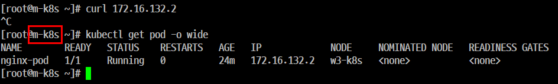
```
[root@m-k8s ~]# kubectl get pod -o wide
NAME        READY   STATUS    RESTARTS   AGE   IP             NODE     NOMINATED NODE   READINESS GATES
nginx-pod   1/1     Running   0          24m   172.16.132.2   w3-k8s   <none>           <none>
```
- 파드의 노드위치와 IP 등 작동 상태에 문제가 있는지 등을 확인한다.
- 출력된 내용을 보면 '작동 중'으로 나오고 있기 때문에 문제가 없다고 보인다.
- 그러나 앞서 kube-proxy가 사용하는 모듈에 문제가 있기 때문에 파드의 nginx 웹서버와의 통신만이 정상적으로 이루어지지 않는 상태이다.

#### Step 7. 정상 상태로 작업한다.
- 모듈을 커널에 적재하고 시스템을 재시작해야 한다.

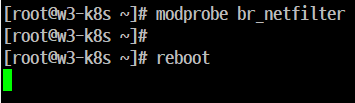


#### Step 8. 상태 확인
- 'RESTARTS' 필드의 값이 '1'이 증가하고 IP주소가 변경된 것을 알 수 있다.

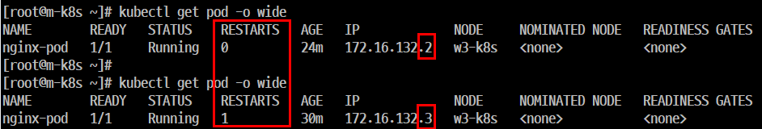

#### Step 9. nginx 웹서버 확인
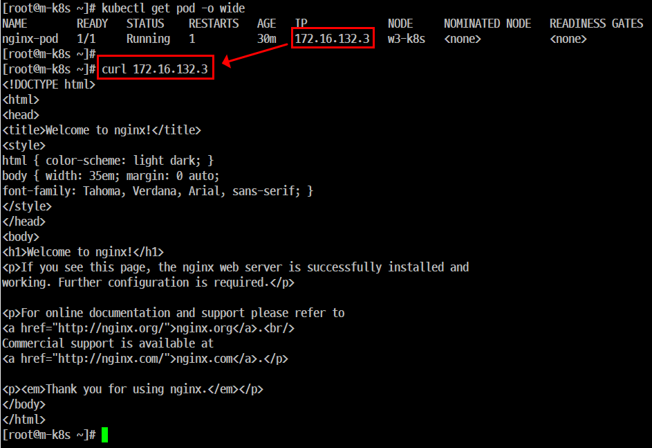

#### Step 10. 파드 삭제

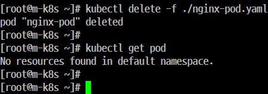
