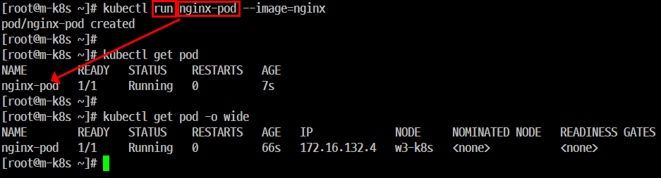
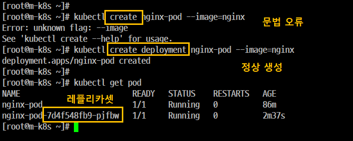
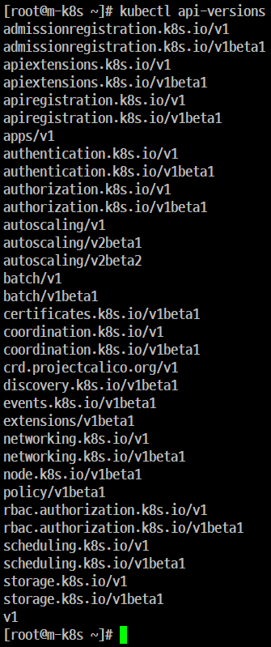
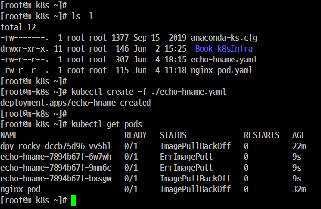
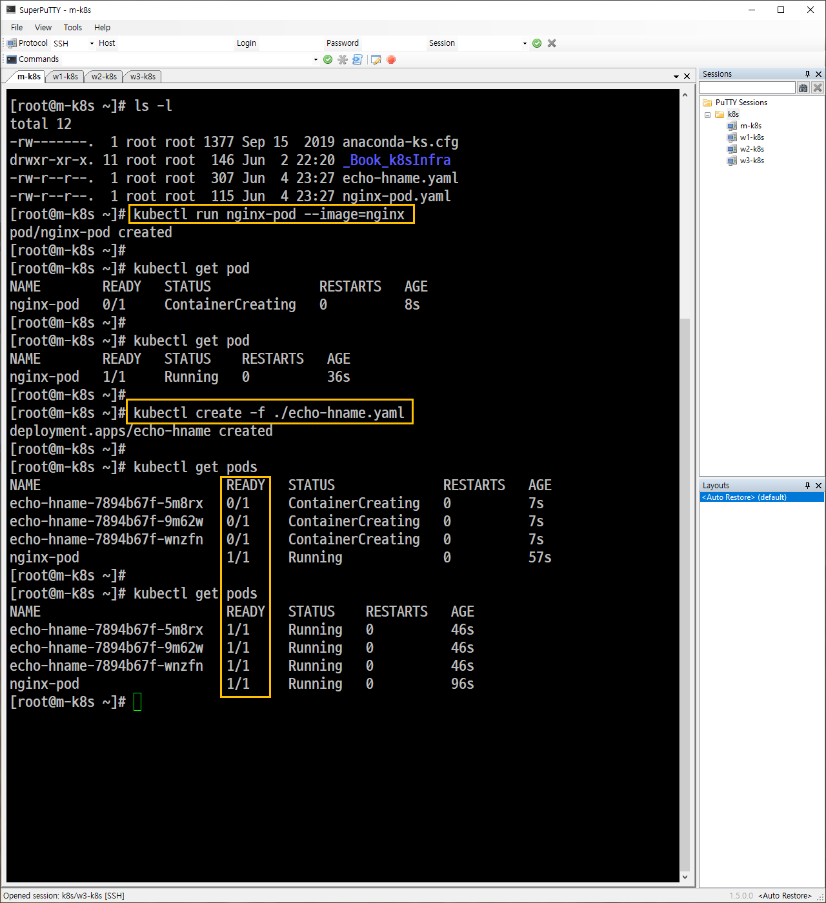

# 9. 'Kubernetes' 기본 사용법

## Kubernetes 필수 용어

### Node(노드)
- 'Kubernetes'스케쥴러에서 'Pod'를 할당 받고 처리하는 역할을 한다.
- 배포하는 시스템(Master Node)과 배포받는 시스템들(Worker Node)을 말한다.

### Pod(파드)
- 'Kubernetes'의 기본 단위를 말한다.
- 여러 개의 Container를 하나의 Application으로 동작하도록 만드는 Container들의 묶음을 말한다.

### Replica Set(레플리카셋 오브젝트)
- 일정한 갯수의 파드를 유지하게 하는 Controller(관리자)를 말한다.
- 갯수 유지가 핵심이다.

### Deployment(디플로이먼트 오브젝트)
- 이미지를 이용해서 파드를 생성할 때 Replica Set 오브젝트와 함께 사용하면 문제 발생 시 파드를 항상 정상적으로 유지할 수 있도록 관리한다.

### Scheduler(스케쥴러)
- Worker Node에 파드를 생성하도록 선언하는 것을 말한다.

## 실습 1. 'Pod(파드)' 생성           
### 파드를 생성하는 방법
#### 개요
- 'Kubernetes'를 사용한다는 것은 사용자에게 효과적으로 'Pod'를 제공한다는 뜻이다.

### 파드를 생성을 위한 2가지 방법
- 방법 1. 'kuberctl run' 명령을 이용한다.
    - 현재 Pod 상태를 확인
    - Pod를 생성
    - Pod 상태를 확인
    


- 방법 2. 'kubectl create ' 명령을 이용한다.
    - Pod를 생성 1. (문법(deployment 사용하지 않았다)오류)
    - create deployment
    - Pod를 생성 2. 동일한 Pod가 생성되는데 레플리카셋이 추가되었다.

    
    
    - Pod를 생성 3. 기존에 있는 Pod와 이름이 중복되지 않도록 다른 이름으로 생성
    - Pod 상태를 확인
    - 웹문서 내용 확인

```
[root@m-k8s ~]# kubectl create deployment nginx-pod --image=nginx         → 'create deployment'과 함께 'run'과 동일한 'Pod'를 생성한다.
   deployment.apps/nginx-pod created

[root@m-k8s ~]# kubectl get pod
   NAME                         READY   STATUS    RESTARTS   AGE
   nginx-pod                    1/1     Running   0          87m
   nginx-pod-7d4f548fb9-k2hph   1/1     Running   0          2m37s         → 래플리카셋이 추가되었다.

[root@m-k8s ~]# kubectl delete pod nginx-pod-7d4f548fb9-k2hph
   pod "nginx-pod-7d4f548fb9-k2hph" deleted

-----------------------------------------------------------------------------

[root@m-k8s ~]# kubectl create deployment dpy-nginx --image=nginx         → 다른 이름의 'Pod'를 생성한다.
   deployment.apps/dpy-nginx created

[root@m-k8s ~]# kubectl get pod
   NAME                         READY   STATUS             RESTARTS   AGE
   dpy-nginx-c8d778df-9s5sr     0/1     ImagePullBackOff   0          50s
   nginx-pod                    1/1     Running            0          97m
   nginx-pod-7d4f548fb9-4cfdh   0/1     ImagePullBackOff   0          3m27s

[root@m-k8s ~]# kubectl delete deployment dpy-nginx
   deployment.apps "dpy-nginx" deleted

[root@m-k8s ~]# kubectl get pod
   NAME                         READY   STATUS             RESTARTS   AGE
   nginx-pod                    1/1     Running            0          97m
   nginx-pod-7d4f548fb9-4cfdh   0/1     ImagePullBackOff   0          3m27s

[root@m-k8s ~]# kubectl create deployment dpy-nginx --image=nginx
   deployment.apps/dpy-nginx created

[root@m-k8s ~]# kubectl get pod
   NAME                         READY   STATUS             RESTARTS   AGE
   dpy-nginx-c8d778df-m5v29     0/1     ContainerCreating   0          2s
   nginx-pod                    1/1     Running            0          97m
   nginx-pod-7d4f548fb9-4cfdh   0/1     ImagePullBackOff   0          3m27s

[root@m-k8s ~]# kubectl get pod
   NAME                         READY   STATUS             RESTARTS   AGE
   dpy-nginx-c8d778df-m5v29     0/1     ErrImagePull   0          2s
   nginx-pod                    1/1     Running            0          97m
   nginx-pod-7d4f548fb9-4cfdh   0/1     ImagePullBackOff   0          3m27s

[root@m-k8s ~]# kubectl get pod
   NAME                         READY   STATUS             RESTARTS   AGE
   dpy-nginx-c8d778df-m5v29     0/1     ImagePullBackOff   0          51s
   nginx-pod                    1/1     Running            0          101m
   nginx-pod-7d4f548fb9-4cfdh   0/1     ImagePullBackOff   0          7m34s

[root@m-k8s ~]# curl 172.16.132.4
   <!DOCTYPE html>
   <html>
   <head>
   ...

   <p><em>Thank you for using nginx.</em></p>
   </body>
   </html>

[root@m-k8s ~]# curl 172.16.221.131
   curl: (7) Failed connect to 172.16.221.131:80; Connection refused

-----------------------------------------------------------------------------

[root@m-k8s ~]# kubectl delete deployment dpy-nginx
   ployment.apps "dpy-nginx" deleted

[root@m-k8s ~]# kubectl get pod
   NAME                         READY   STATUS             RESTARTS   AGE
   nginx-pod                    1/1     Running            0          105m
   nginx-pod-7d4f548fb9-4cfdh   0/1     ImagePullBackOff   0          11m

[root@m-k8s ~]# kubectl delete deployment nginx-pod            → 삭제하고자 하는 'Pod'가 무엇인지 알 수가 없다.
   deployment.apps "nginx-pod" deleted

[root@m-k8s ~]# kubectl get pod
   NAME        READY   STATUS    RESTARTS   AGE
   nginx-pod   1/1     Running   0          106m


```
create deployment 함께 'run'과 동일한 'pod'를 생성한다.
rum 과 동일하게 생성한다.

## 실습 2. 'Object(오브젝트)'

## Object 1. 기본 오브젝트
### 개요
- 프로그래밍 언어(C/C++, Java, Python, ...)에서의 구조체, 클래스, 함수 등은 '1개의 값'만을 가지는 변수와 달리 여러 가지 내용(구조체, 함수 등)을 가지는 구조를 하고 있는데 'Kubernetes'에서의 객체(Object)와 동일한 성격을 가지고 있다.

- 'Pod'와 'Deployment'는 'Spec(스펙)'과 'Status(상태)' 등의 값을 가지고 있다.
- 이러한 값을 가지고 'Pod'와 'Deployment'를 개별 속성을 포함해서 부르는 단위를 'Object'라고 한다.
- 여러 유형의 'Object(기본 오브젝트, Deployment 오브젝트)'를 제공하고 있다.

## 📌 Kubernetes의 기본 오브젝트 4가지


### 1️⃣ **Pod (파드)**

- Kubernetes에서 실행되는 **최소 단위**
- 하나의 웹 서비스를 구동하기 위한 기본 단위
- **독립적인 IP**와 **자신만의 공간**을 가짐
- 하나의 Pod에는 **1개 이상의 컨테이너**가 포함될 수 있음
  - → 보통은 **1 Pod = 1 Container**로 범용 사용
- 여러 기능을 묶어 **하나의 목적**을 수행할 수 있음

---

### 2️⃣ **Namespaces (네임스페이스)**

- Kubernetes 클러스터 내 리소스를 **구분해서 관리하는 논리적 그룹**
- 자원 충돌 없이 **멀티 테넌시 환경** 구축 가능
- 대표적인 네임스페이스 예:
  - `default`: 특별히 지정하지 않으면 사용되는 기본 네임스페이스
  - `kube-system`: Kubernetes 시스템 내부 컴포넌트들이 사용하는 공간
  - `metalb-system`: 온프레미스 환경에서 외부에서 내부로 접속을 허용하는 LoadBalancer Pod가 포함됨 (예: MetalLB 사용 시)

---

### 3️⃣ **Volume (볼륨)**

- Pod 내부에서 사용 가능한 **디렉터리(저장소)를 제공**
- 기본 Pod는 일시적이므로, 디렉터리도 **임시적**
- 볼륨 오브젝트를 사용하면 **Pod가 삭제되어도 데이터 유지** 가능
  - → **데이터 보존, 상태 저장**이 필요한 경우에 필수

---

### 4️⃣ **Service (서비스)**

- Pod는 생성/삭제에 따라 **IP가 유동적**이므로,
  **안정적인 접속 경로를 제공**하기 위한 추상화된 오브젝트
- 클러스터 내부 또는 외부에서 **고정된 방식으로 Pod에 접근** 가능
- 서비스는 새로 생성되는 Pod에 자동으로 연결되므로,
  **로드밸런서/게이트웨이와 유사한 역할**
- 내부 DNS 이름으로도 Pod를 식별할 수 있음 (`my-service.default.svc.cluster.local` 등)

## Object 2. Deployment 오브젝트
### 개요
- 기본 오브젝트를 이용해서 'Kubernetes'를 사용할 수 있지만 한계가 있어서 이를 좀 더 효율적으로 기능을 조합하고 추가해서 구현한 것을 말한다. (확장성)

## Object 3. ReplicaSet 오브젝트
### 개요
- 'Kubernetes'에서는 다수의 'Pod'를 만드는 ReplicaSet 오브젝트를 제공한다.
- 실행
   - 현재 Pod 상태를 확인한다.

```
[root@m-k8s ~]# kubectl scale pod nginx-pod --replicas=3

nginx-pod는 create를 이용하고 create deployment를 사용하지 않았기 때문에 Resource로써 사용할 수가 없다. 즉, Deployment 오브젝트에 속하지 않는다. 

[root@m-k8s ~]# kubectl scale deployment dpy-nginx --replicas=3


[root@m-k8s ~]# kubectl scale deployment nginx-pod --replicas=3


```

```
[root@m-k8s ~]# kubectl describe pod dpy-hname-59778b9bb-4x4vw -n default
Name:         dpy-hname-59778b9bb-4x4vw
Namespace:    default
Priority:     0
Node:         w1-k8s/192.168.1.101
Start Time:   Wed, 04 Jun 2025 17:15:41 +0900
Labels:       app=dpy-hname
              pod-template-hash=59778b9bb
Annotations:  cni.projectcalico.org/podIP: 172.16.221.132/32
Status:       Pending
IP:           172.16.221.132
IPs:
  IP:           172.16.221.132
Controlled By:  ReplicaSet/dpy-hname-59778b9bb
Containers:
  echo-hname:
    Container ID:
    Image:          sysnet4admin/echo-hname
    Image ID:
    Port:           <none>
    Host Port:      <none>
    State:          Waiting
      Reason:       ImagePullBackOff
    Ready:          False
    Restart Count:  0
    Environment:    <none>
    Mounts:
      /var/run/secrets/kubernetes.io/serviceaccount from default-token-lhzmx (ro)
Conditions:
  Type              Status
  Initialized       True
  Ready             False
  ContainersReady   False
  PodScheduled      True
Volumes:
  default-token-lhzmx:
    Type:        Secret (a volume populated by a Secret)
    SecretName:  default-token-lhzmx
    Optional:    false
QoS Class:       BestEffort
Node-Selectors:  <none>
Tolerations:     node.kubernetes.io/not-ready:NoExecute for 300s
                 node.kubernetes.io/unreachable:NoExecute for 300s
Events:
  Type     Reason     Age                 From               Message
  ----     ------     ----                ----               -------
  Normal   Scheduled  <unknown>           default-scheduler  Successfully assigned default/dpy-hname-59778b9bb-4x4vw to w1-k8s
  Normal   Pulling    19m (x4 over 21m)   kubelet, w1-k8s    Pulling image "sysnet4admin/echo-hname"
  Warning  Failed     19m (x4 over 21m)   kubelet, w1-k8s    Failed to pull image "sysnet4admin/echo-hname": rpc error: code = Unknown desc = Error response from daemon: toomanyrequests: You have reached your unauthenticated pull rate limit. https://www.docker.com/increase-rate-limit
  Warning  Failed     19m (x4 over 21m)   kubelet, w1-k8s    Error: ErrImagePull
  Normal   BackOff    19m (x6 over 21m)   kubelet, w1-k8s    Back-off pulling image "sysnet4admin/echo-hname"
  Warning  Failed     67s (x84 over 21m)  kubelet, w1-k8s    Error: ImagePullBackOff

```

##  Spec(스펙)을 지정해서 오브젝트 생성
### 이미지 구분
- mariadb
   - 'Docker'에서 이미지 검색을 위한 명령어인 'search'를 통해서 확인 가능한 이미지 
- samadalwho/mariadb
   - Container를 이용해서 생성한 이미지
   - 일반적으로 Dopcker Hub에서 다운로드한다.
   - 'Docker Hub'가 'public'일 경우
      - 추가 비용이 없다.
      - seach 명령을 이용해서는 확인할 수가 있다.
   - 'Docker Hub'가 'private'일 경우
      - 추가 비용이 있다.
      - search 명령을 이용해서는 확인할 수가 없다

## 개요
```
kubectl create deployment dpy-rocky --image=rockylinux/9
 명령을 이용해서 Deployment를 생성하게 되면 1개의 'Pod'만 생성된다. 즉, 다수개의 'Pod'를 생성할 수가 없다.

- deployment를 생성하면서 한 번에 여러 개의 'Pod'를 생성하려면 create 에서는 replicas 옵션을 사용할 수 없고 scale은 이미 생성된 Deployment에서만 사용이 가능하다. 

- (핵심)따라서 이와 같은 설정을 적용하려면 필요한 내용을 파일로 작성해야 한다. 이 때 작성하는 파일을 'Spec' 이라고 한다.

- Object Spec은 일반적으로 야믈(YAML, Yet Another Markup Language) 문법으로 작성한다.
```
## 실행
'Kubernetes' 버전에 따라 사용 가능한 API 버전이 다르기 때문에 꼭 확인한다.



다른 YAML파일
echo-hname.yaml





```
[root@m-k8s ~]# kubectl create -f ./echo-hname.yaml

[root@m-k8s ~]# kubectl run nginx-pod --image=nginx
```

| 항목              | `kubectl create`                            | `kubectl run`                               |
| --------------- | ------------------------------------------- | ------------------------------------------- |
| ✅ 목적            | **YAML 파일 등 명시된 리소스를 생성**                   | 테스트용으로 **간단히 파드(Pod)를 실행**                  |
| 📁 주 사용 방식      | `kubectl create -f file.yaml`               | `kubectl run <name> --image=<image>`        |
| 🧱 생성 대상        | Deployment, Service, Pod 등 **여러 리소스 종류 가능** | 기본적으로 **Pod 하나** 생성 (옵션으로 Deployment 등도 가능) |
| 📦 YAML 필요 여부   | **반드시 필요함** (`-f` 옵션으로 파일 지정)               | YAML 없이도 CLI만으로 실행 가능                       |
| 🎯 실전 사용 용도     | 프로덕션용 배포, 프로젝트 구성                           | 테스트용 임시 파드 실행, 디버깅                          |
| ⛔ Deprecated 사항 | -                                           | 예전에는 Deployment도 만들었지만, 현재는 일부 기능 제한됨       |
| 예시 명령           | `kubectl create -f echo-hname.yaml`         | `kubectl run testpod --image=nginx`         |
