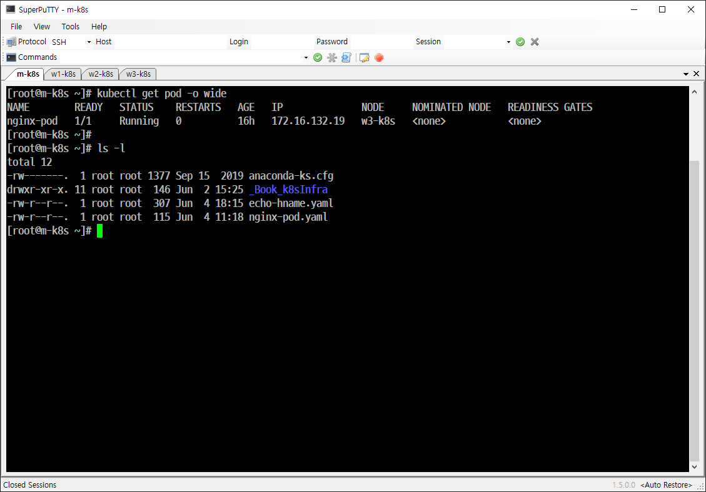
```
scp echo-hname.yaml root@192.168.1.10:/root
```

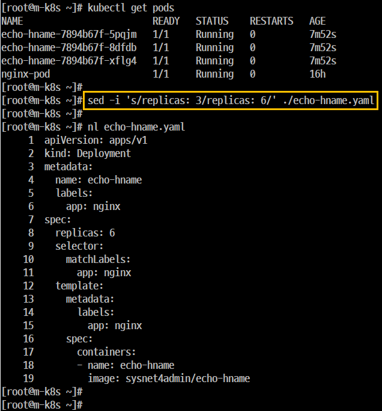


##  Spec(스펙)을 지정해서 오브젝트 생성
### 이미지 구분
- mariadb
   - 'Docker'에서 이미지 검색을 위한 명령어인 'search'를 통해서 확인 가능한 이미지 
- samadalwho/mariadb
   - Container를 이용해서 생성한 이미지
   - 일반적으로 Dopcker Hub에서 다운로드한다.
   - 'Docker Hub'가 'public'일 경우
      - 추가 비용이 없다.
      - seach 명령을 이용해서는 확인할 수가 있다.
   - 'Docker Hub'가 'private'일 경우
      - 추가 비용이 있다.
      - search 명령을 이용해서는 확인할 수가 없다

## 개요
```
kubectl create deployment dpy-rocky --image=rockylinux/9
 명령을 이용해서 Deployment를 생성하게 되면 1개의 'Pod'만 생성된다. 즉, 다수개의 'Pod'를 생성할 수가 없다.

- deployment를 생성하면서 한 번에 여러 개의 'Pod'를 생성하려면 create 에서는 replicas 옵션을 사용할 수 없고 scale은 이미 생성된 Deployment에서만 사용이 가능하다. 

- (핵심)따라서 이와 같은 설정을 적용하려면 필요한 내용을 파일로 작성해야 한다. 이 때 작성하는 파일을 'Spec' 이라고 한다.

- Object Spec은 일반적으로 야믈(YAML, Yet Another Markup Language) 문법으로 작성한다.
```
## 실행
- 'Kubernetes' 버전에 따라 사용 가능한 API 버전이 다르기 때문에 꼭 확인한다.

## 레플리카셋의 갯수를 3에서 6으로 변경
- 실행(오류)

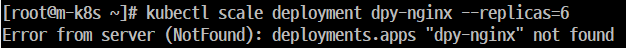

## 'apply'로 오브젝트 생성 관리

- 'run' (단일 'Pod'만을 생성)
- 'create' (deployment 생성 시 파일의 변경 사항을 바로 적용할 수가 없다)
- 'apply' (명령이 아닌 문서 파일(*.yml)로 'Pod' 수를 늘리고 스펙도 변경해서 적용)

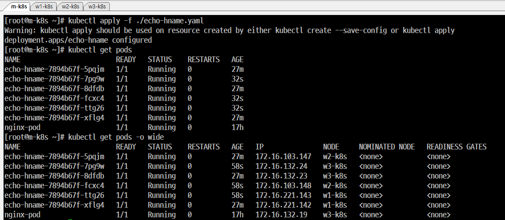

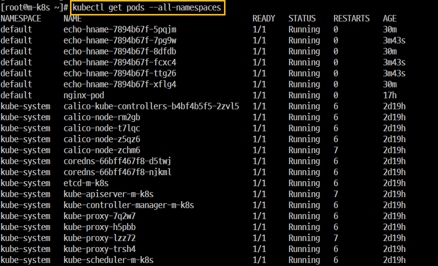

## 'Pod'의 컨테이너 자동 복구 방법
- 개요
    - 'Kubernetes'는 거의 모든 부분이 '자동 복구 되도록 설계' 되어 있다.
    - 'Pod'의 '자동 복구 기술'을 'Self-Healing' 이라고 한다.
    - 이 기술은 제대로 작동하지 않는 컨테이너를 다시 시작하거나 교체해서 'Pod'가 정상적으로 작동하게 한다.
- 실행
    - 'Running' 으로 나오는 'Pod'의 IP주소를 먼저 확인한다.
    - 'Pod Container'의 'Shell'에 접속한다.

    ```
    kubectl exec -it nginx-pod -- /bin/bash
    ```

    - Bash Shell에 접속하면 컨테이너에서 구동하는 nginx의 PID를 확인한다. 이때 nginx의 'PID'는 항상 '1'이다.


#### 작업 개요

- 'm-k8s'의 터미널을 한 개 더 띄우고 이 터미널 화면에서 'nginx-pod'의 IP에서 돌아가는 웹 페이지를 1초마다 한 번씩 요청하는 스크립트를 실행한다.
- 'Running' 상태의 'Pod'인 'echo-hname-7894b67f-xflg4' 의 IP주소를 확인한다.
- 'curl'에서 요청한 값만 받도록 '--silent' .옵션을 추가한다.
- 이 스크립트를 통해서 상태도 체크한다.

```
NAME                        READY   STATUS    RESTARTS   AGE   IP               NODE     NOMINATED NODE   READINESS GATES
nginx-pod                   1/1     Running   1          18h    172.16.132.19    w3-k8s   <none>           <none>
```
#### 명령 실행

```
[root@m-k8s ~]# i=1; while true; do sleep 1; echo $((i++)) `curl --silent 172.16.132.19 | grep title` ; done
```
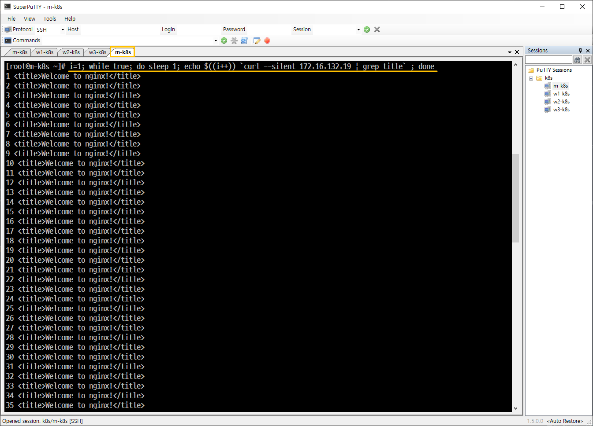

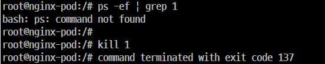

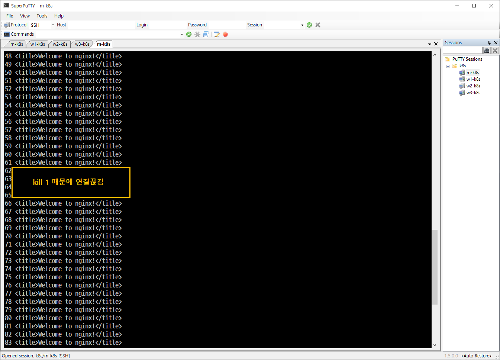

### 자동 복구
- 'Kubernetes'는 'Pod'에 문제가 발생하면 'Pod'를 자동 복구하고 'Pod'가 항상 동작할 수 있도록 해준다.
- 실행
    - 문제 발생을 위해 'Pod'를 삭제한다. 전체 7개 중에서 6개가 남는다.

    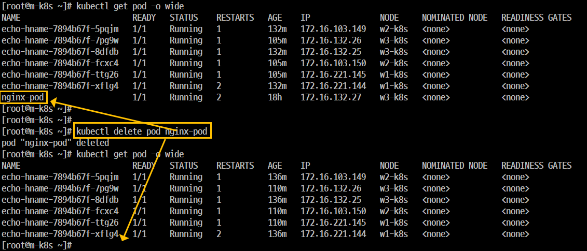

    - 'echo-hname'으로 시작하는 것들 중에서 맨 위에 있는 것을 삭제한다.

    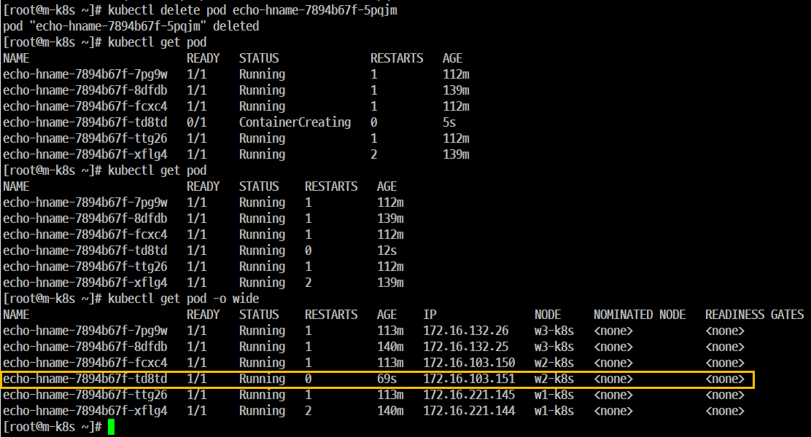

    - 전체 6개 중에서 5개가 되지 않고 그대로 6개가 동작중에 있다.
    - 이 때 'AGE' 필드를 보면 최근에 새로 추가된 'Pod'를 확인할 수 있다.
- 결론
    - 'nginx-pod'는 'Deployment Object'에 속한 'Pod'가 아니고 어떤 Controller도 이 'Pod'를 관리하지 않기 때문에 삭제 명령 즉시 삭제가 되고 복구도 되지 않는다.
    - 'echo-hname-7894b67f-td8td'는 'Deployment Object'에 속한 'Pod'이다.
    - 'echo-hname'에 속한 'Pod'를 'Replicaset Object'를 이용해서 (replicas) 6개로 선언을 이미  했었다.
    - (자동 복구의 핵심) 'replicas'은 'Pod'를 선언한 '숫자'로 항상 유지하도록 'Pod'의 수를 항상 확인하고 만약 부족하면 새로운 'Pod'를 생성한다.
    - 따라서 임의로 'Pod'를 삭제하면 'replicas'가 삭제된 'Pod'를 확인하고 전체 갯수인 '6개'로 맞추기 위해 새로운 'Pod'를 1개 더 생성한다.

- 'Deployment Object'에 속한 'Pod' 삭제

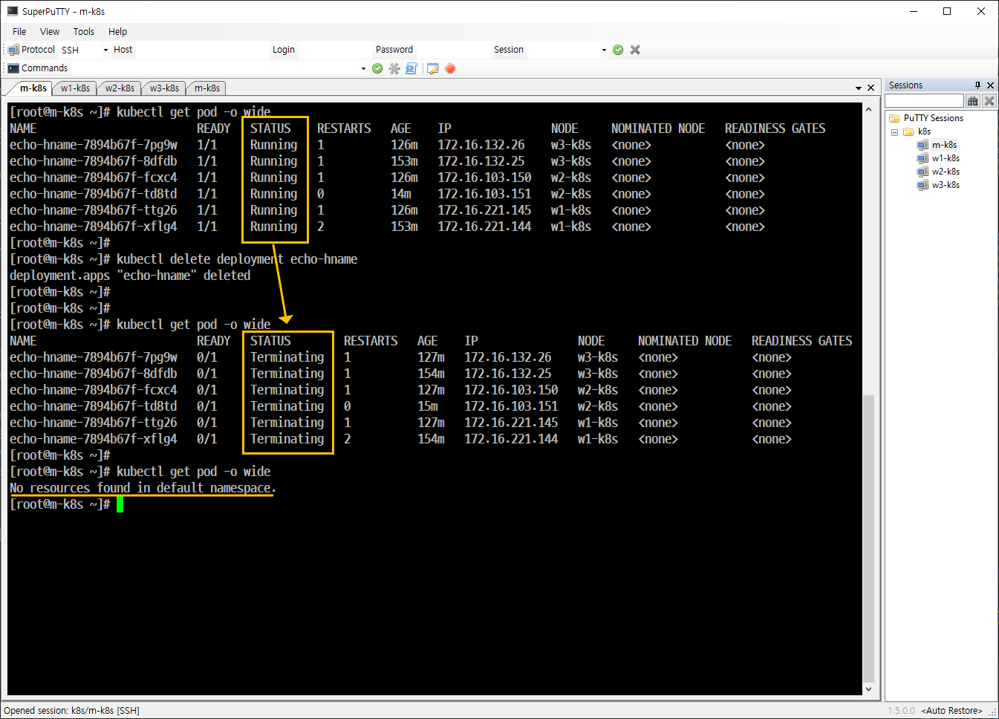
```
kubectl delete deployment echo-hname
```

## 노드 자원 보호하기(cordon, uncordon)

- 개요
    - 'Node'는 'Kubernetes' 스케쥴러에서 'Pod'를 할당받고 처리하는 역할을 한다.
    - 만약 'Node'에 문제가 생기더라도 'Pod'의 문제를 최소화해야 한다. 이에 '모니터링'이 필요하다.
    - 'kubernetes'는 모든 'Node'에 균등하게 'Pod'를 할당한다.
    - 'kubernetes'는 이와 같은 경우에 'cordon' 기능을 사용해서 노드를 관리한다.
    - 'w3-k8s' 노드에 'Pod'가 할당되지 않게 설정할 때는 'cordon'을 사용하고 파드가 할당되게 설정하려면 'uncordon'을 사용한다.

- 실행
    - 현재 배포된 파드가 없기 때문에 yml 파일을 apply해서 파드를 생성한다.

    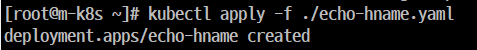

    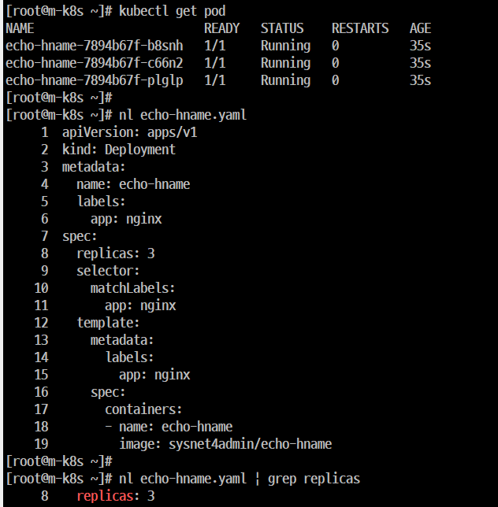

    - 배포된 파드를 9개로 늘린다.

    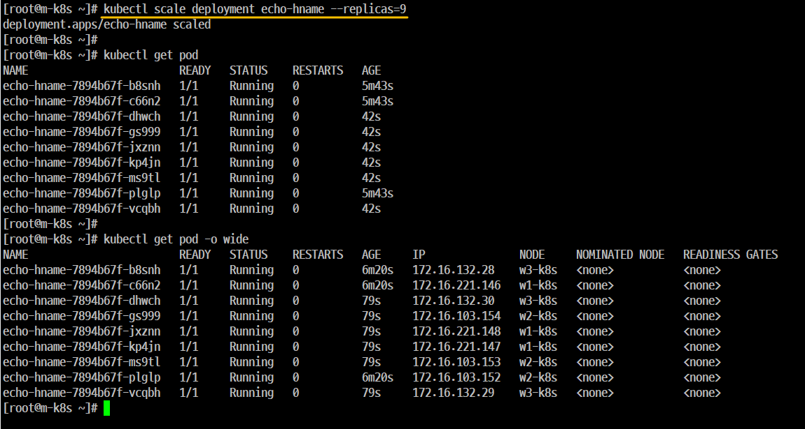

    ```
    kubectl scale deployment echo-hname --replicas=9
    ```
    - 배포된 파드를 3개로 줄인다.

    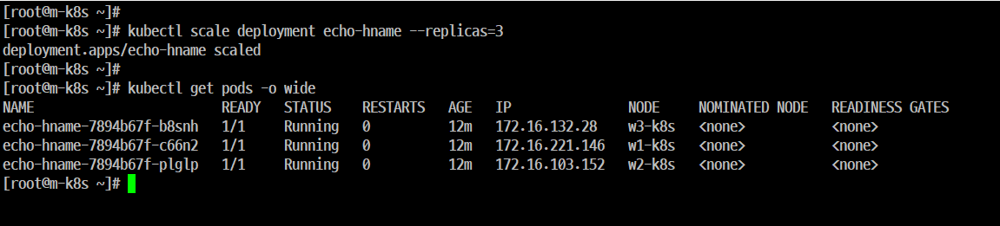

    - 각 노드별로 파드가 1개씩만 남아있는지 확인한다.

    - 'w3-k8s' 노드에 문제가 발생해서 현재 상태를 보존한다고 가정한다.


    - 'SchedulingDisabled'는 'w3-k8s' 노드가 더 이상 파드가 할당되지 않는 상태로 변경한다.

    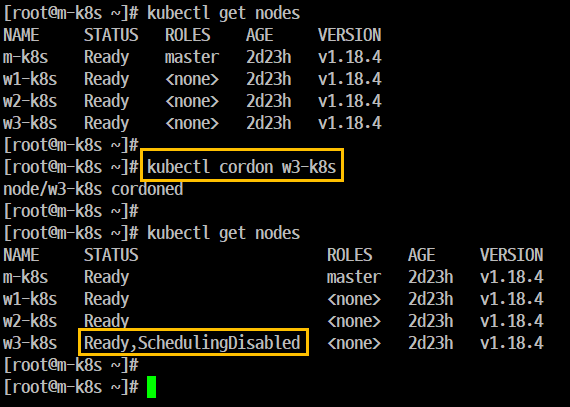

    ```
    kubectl cordon w3-k8s
    ```
    ```
    지정한 노드(예: w3-k8s)를 스케줄 불가능(unschedulable) 상태로 만듭니다.

    즉, 해당 노드에는 새로운 파드가 배포되지 않게 막는 명령입니다.

    하지만 이미 실행 중인 파드에는 영향이 없습니다.
    ```
    - 이 상태에서 파드를 9개로 늘린다.

    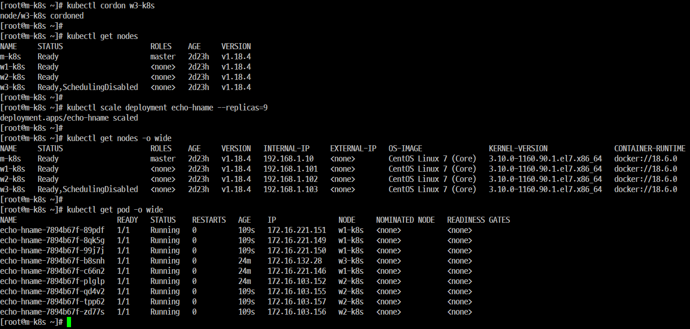

    - 노드는 'cordon'이 적용되어서 더 이상 늘어나지 않고 'w1-k8s'과 'w2-k8s'만 4개씩 추가된다.


    - 이 상태에서 파드를 3개로 줄인다.

    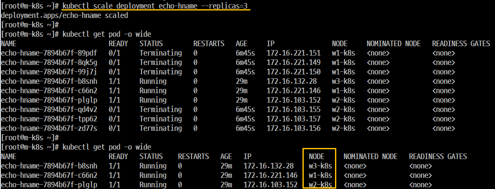
    
    - 'w3-k8s' 노드에 파드가 할당되지 않게 설정했던 것을 해제한다.
    ```
    kubectl uncordon w3-k8s
    ```

    - 배포된 피드를 9개로 늘리고 확인
    - 배포된 파드를 3개로 줄이고 확인

    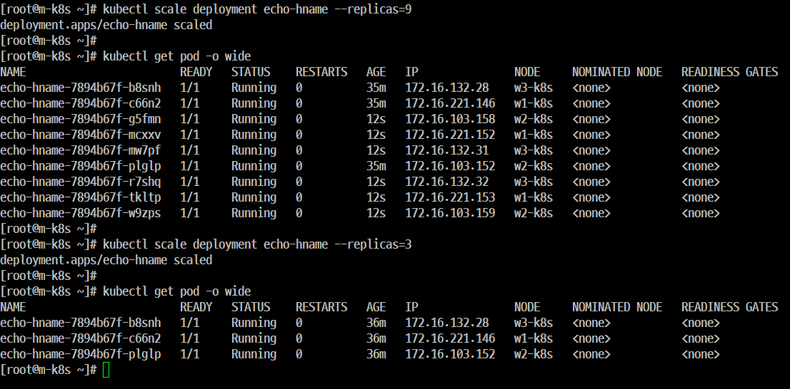


