# 10. 'kubernetes'를 담당하는 서비스

## 개요
- 외부 사용자가 'Pod('Container' 들의 묶음)'를 이용하는 방법을 말한다.
- 'Kubenetes'에서는 외부에서 'kubebetes' 클러스터에 접속하는 방법 을 서비스 라고 한다.
- Pod를 생성하는 방법
    - 인터넷에서 배포하고 있는 이미지를 가져와서 생성
    ```
    kubectl create deployment no-pods --image=sysnet4admin/echo-hname
    ```
    - 배포하고 있는 이미지를 등록한 'yaml' 파일을 실행해서 생성
    ```
    kubectl create -f echo-hname.yaml
    ```

## NodePort
### 개요
- 외부에서 'Kubenetes' 클러스터의 내부에 접속하는 가장 쉬운 방법을 말한다.
- 'NodePort Service'를 설정하면 모든 'Worker Node'의 특정 포트('NodePort')를 열고 여기로 오는 모든 요청을 'NodePort Service'로 전달한다.
- 이렇게 전달받은 'NodePort Service'는 해당 업무를 처리할 수 있는 'Pod'로 요청을 전달한다.
    

### Step 1. 'NodePort Service'로 외부에서 접속하기
```
sysnet4admin/echo-hname
```

### Step 2. 배포된 pods 확인

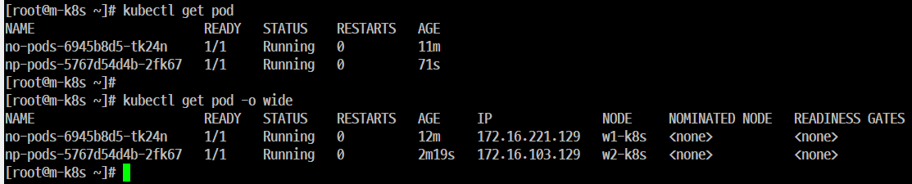

### Step 3. 'NodePort Service'를 생성
```
[root@m-k8s ~]# kubectl create -f nodeport.yaml
```
### Step 4. 생성한 서비스(service/np-svc created)
```
kubectl get services

10.110.165.182는 'kubenetes' 클러스터의 내부에서 사용하는 IP로 자동 지정
```
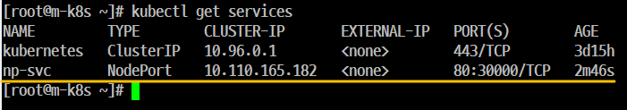

### Step 5. 외부에서 접속을 하기 위한 'kubenetes'의 work node 의 IP를 확인

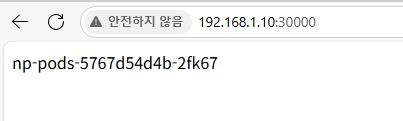

### Step 6. 'Host OS(windows 10)'의 웹 브라우저에서 '192.168.1.10 ~ 192.168.1.103'과 '30000번' 으로 접속

### Step 7. 
#### 이미지를 로딩한다.

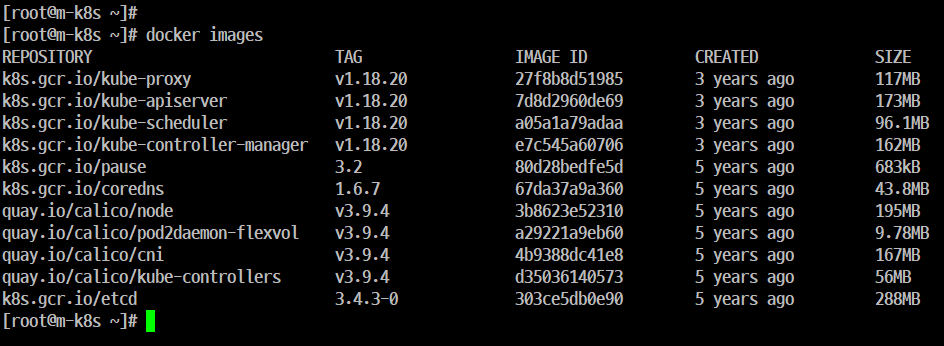
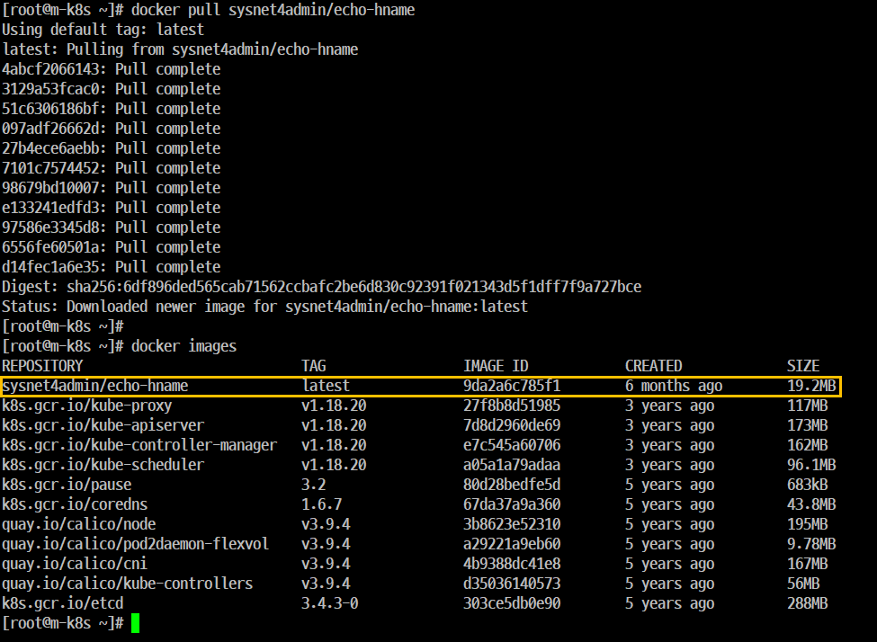

#### Pod를 생성한다.

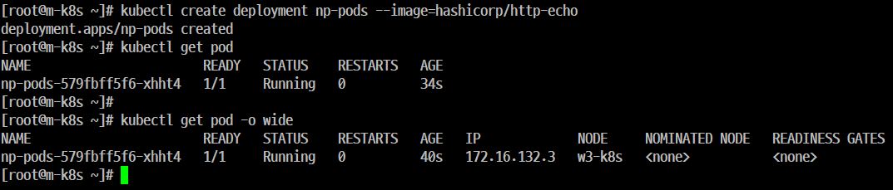

#### Node 및 Service, Namespace 모두 확인한다.

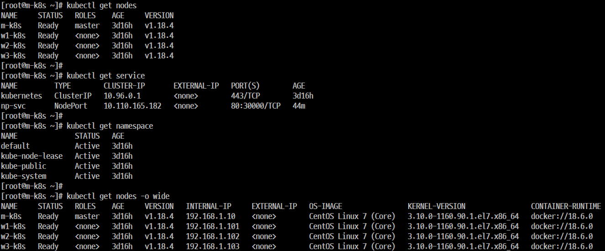

#### pod 제거 및 재생성

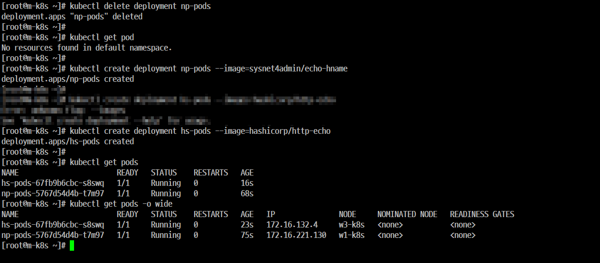

## 부하 분산
    
### 개요
- 'Deployment'로 생성된 'Pod' 1개에 접속하고 있는 도중에 'Pod'가 '3개'로 증가할 경우 접속은 어떤 식으로든 영향을 받게 된다.

- 이와 같은 경우에 부하가 분산되는지를 확인한다.

### 실행 1. sysnet4admin/echo-hname 이미지
#### Step 1. 'Host OS'의 'Powershell'을 실행한 후 작업한다.

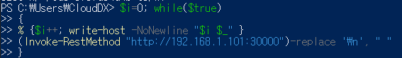

```
(Invoke-RestMethod "http://192.168.1.101:30000")-replace '\n', " "
```
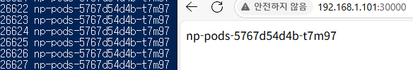

#### Step 2. Pod를 3개로 증가

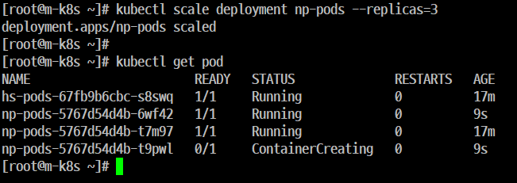

#### Step 3. 확인

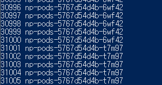

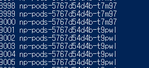

3개로 부하분산 확인

```
[root@m-k8s ~]# nl nodeport.yaml
     1  apiVersion: v1
     2  kind: Service
     3  metadata:
     4    name: np-svc
     5  spec:
     6    selector:
     7      app: np-pods
     8    ports:
     9      - name: http
    10        protocol: TCP
    11        port: 80
    12        targetPort: 80
    13        nodePort: 30000
    14    type: NodePort

    : 실행 2. 'hasicorp/http-echo' 이미지
[root@m-k8s ~]# nl nodeport.yaml
     1  apiVersion: v1
     2  kind: Service
     3  metadata:
     4    name: hs-svc
     5  spec:
     6    selector:
     7      app: hs-pods
     8    ports:
     9      - name: http
    10        protocol: TCP
    11        port: 80
    12        targetPort: 80
    13        nodePort: 30000
    14    type: NodePort
```
### 실행 2. hasicorp/http-echo 이미지


## 'Expose'를 이용한 'NodePort' 생성
### 개요
#### 'NodePort Service'는 'Objetct Spec' 파일뿐만 아니라 명령어를 이용해서도 생성할 수 있따.

### 실행
#### Step 1. 'expose' 명령어를 사용해서 서비스로 내보낼 'deployment'를 'np-pods'로 지정한다.
- 해당 서비스의 이름은 'np-svc-v2'로 타입은 'NodePort'로 지정한다. (대소문자 구분)
- 서비스가 Pod로 보내줄 연결 포트를 '80'번으로 지정한다..

#### step 2. 'Object Spec'으로 생성할 때는 'NodePort' 포트 번호를 '30000번' 으로 지정했지만
- 'expose' 명령어를 사용하면 'NodePort' 포트 번호를 지정할 수가 없다.
- 포트 번호는 '300000 ~ 32737' 사이에서 임의로 지정 된다.

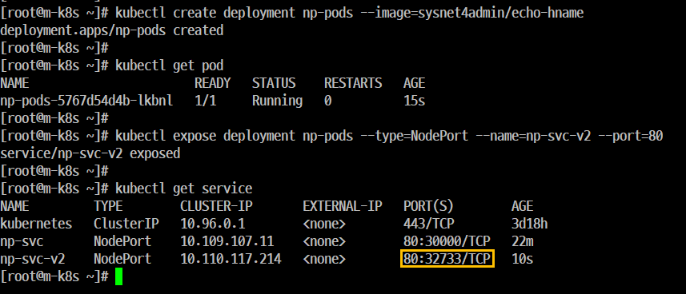

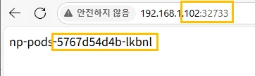

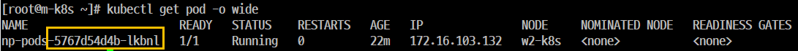


#### Step 3. 사이트 출력
- 192.168.1.102:32733 을 입력했을 때 'Pod'의 이름이 출력되는 것을 확인한다.
- 192.168.1.102 는 'k2-k8s'의 'INTERNAL-IP'이고 '32378'은 'np-svc-2'의 무작위로 부여된 포트 번호이다.

## 사용 목적별로 연결하는 'Ingress Controller'

### 개요
- 사용자가 접속하는 경로에 따라 다른 결과값을 제공하는 것을 말한다.

- 'NodePort Service'는 포트를 중복해서 사용할 수가 없기 때문에 1개의 'NodePort'에 1개의 'Deployment'만 적용된다.

- (핵심)여러 개의 'Deployment' 가 있을 때 그 수만큼 'NodePort Service'를 적용해야 하지만 앞에서도 말 했듯이 '중복'이 안되기 때문에 불가능하다. 'Kubenetes' 는 이런 경우에 **Ingress Controller**를 사용한다.

- 'Ingress'를 사용하려면 'Ingress Controller'가 필요한데 다양한 것들 중에서 'Kubenetes'에서 '프로젝트로 지원(오픈소스 기반)'하는 'NGINX Ingress Controller(NgIC)'를 사용한다.

- 'NGIC' 진행 단계
    - Step 1. 사용자는 노드마다 설정된 'NodePort'를 통해 'NodePort Service'로 접속한다. 이 때 'NodePort Service'는 'NgIC'로 구성한다.
    - Step 2. 'NgIC'는 사용자의 접속 경로에 따라 적합한 'Cluster IP Service'로 경로를 제공한다.
    - Step 3. 'Cluster IP Service'는 사용자를 해당 Pod로 연결해 준다.

- 특징
    - 'NgIC'는 'Pod'와 직접 통신할 수 없기 때문에 'NodePort'와 연동되어야 한다.

### 가상 머신 ID 확인

- 'C:\HashiCorp\' 폴더 안에 있는 파일들을 삭제하지 말고 다른 폴더로 이동한다.
- 시스템을 종료 또는 동작 중인 상태에서 다음의 명령을 순서대로 입력한다.
    - vagrant up (Vagrantfile이 없기 때문에 오류 발생)
    - vagrant global-status (가상 머신 ID를 확인)

### 'NgIC' 구성

#### Step 1. 테스트용으로 Deployment를 2개 생성, 배포한다.

#### Step 2. 배포된 Pod 상태를 확인한다.

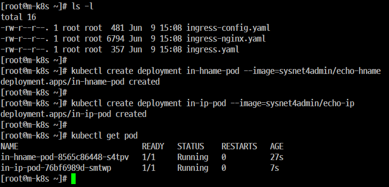


#### Step 3. 'NgIC'를 설치한다.

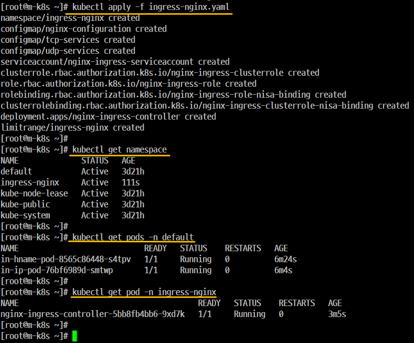

#### Step 4. 'NgIC'의 'Pod'가 '배포(Running)' 되었는지 확인

- 'NgIC'는 'default Namespace'가 아닌 'ingress-nginx Namespace'에 속하기 때문에 '-n ingress-nginx' 옵션을 이용해서 확인하면 된다.

#### Step 5. 'ingress'를 사용자 요구 사항에 맞게 설정하려면 '경로'와 '작동'을 정의

- 업로드한 파일(ingress-config)을 이용해서 설정을 적용한다. 
- 'ingress-config'
    - 들어오는 주소값과 포트에 따라 노출된 서비스를 연결하는 역할을 한다.
    - 외부에서 주소값과 'NodePort'를 가지고 들어오는 것은 'hname-svc-default' 서비스와 연결된 'Pod'로 넘기고 외부에서 들어오는 주소값, 'NodePort' 뒤에 '/ip'를 추가한 값은 'ip-svc' 서비스와 연결된 'Pod'로 접속하게 설정

#### Step 6. 'ingress' 설정 파일이 제대로 등록되었는지 확인 

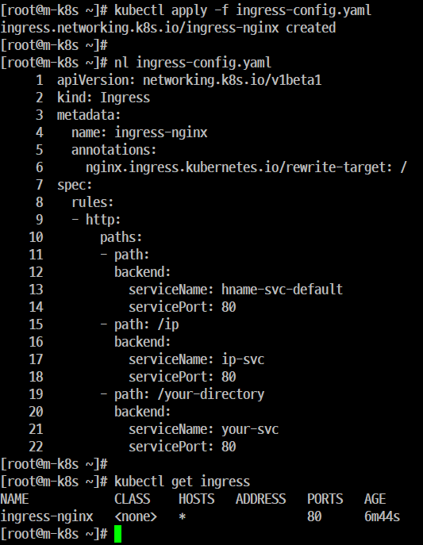

#### Step 7. 'ingress'에 요청한 내용이 확실하게 적용되었는지 확인

- 'ingress'에 적용된 내용을 'Yaml' 형식으로 출력해서 적용된 내용을 확인할 수 있다.

#### Step 8. 'NgIC' 생성과 'ingress' 설정 완료
##### 개요
- 외부에서 'NgIC'에 접속할 수 있게 'NodePort Service'로 'NgIC'를 외부에 노출한다.

#### Step 9. 'NodePort Service'로 생성된 'NgIC'를 확인한다.

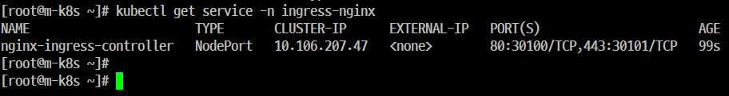

#### Step 10. 'expose' 명령으로 Deployment 'in-hname-pod', 'in-ip-pod'도 서비스로 노출

- 외부와 통신을 하기 위해 클러스터 내부에서만 사용하는 Pod를 클러스터 외부에 노출할 수 있는 구역으로 옮기는 것을 말한다.

```
[root@m-k8s ~]# kubectl get pods -o wide
NAME                            READY   STATUS    RESTARTS   AGE   IP               NODE     NOMINATED NODE   READINESS GATES
in-hname-pod-8565c86448-s4tpv   1/1     Running   0          58m   172.16.103.133   w2-k8s   <none>           <none>
in-ip-pod-76bf6989d-smtwp       1/1     Running   0          58m   172.16.132.6     w3-k8s   <none>           <none>
[root@m-k8s ~]#
[root@m-k8s ~]# kubectl get services
NAME                TYPE        CLUSTER-IP       EXTERNAL-IP   PORT(S)          AGE
hname-svc-default   ClusterIP   10.105.139.135   <none>        80/TCP,443/TCP   6m9s
ip-svc              ClusterIP   10.99.247.236    <none>        80/TCP,443/TCP   4m55s
kubernetes          ClusterIP   10.96.0.1        <none>        443/TCP          3d22h

```

#### Step 11. 생성된 서비스를 점검하고 'Deployment'들이 서비스에 정상적으로 노출되어 있는지 확인한다.

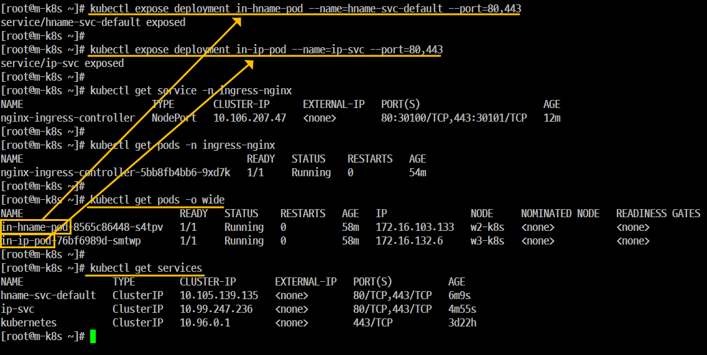

#### Step 12. 'Host OS'의 '웹브라우저'에서 사이트 출력
- '192.168.1.101:30100'에 접속하는 경로에 따라 작동여부를 확인한다. 

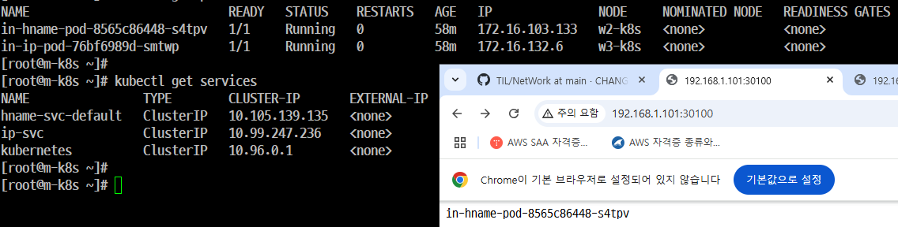

#### Step 13. 'Host OS'의 '웹브라우저'에서 사이트 출력
- '192.168.1.101:30100/ip'에 접속하고 접속하는 경로에 따라 작동여부를 확인한다.

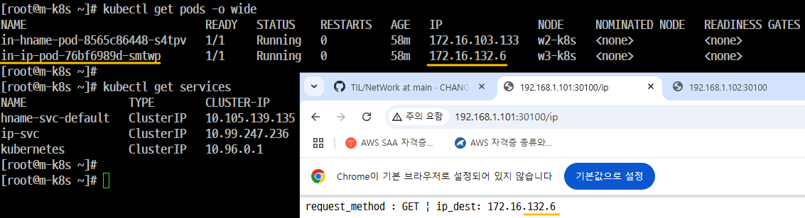

#### Step 14. 'Host OS'의 '웹브라우저'에서 사이트 출력

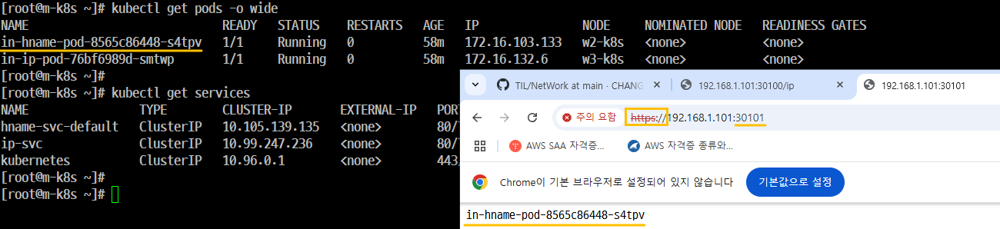

https://192.168.1.101:30101

#### Step 15. 'Host OS'의 '웹브라우저'에서 사이트 출력

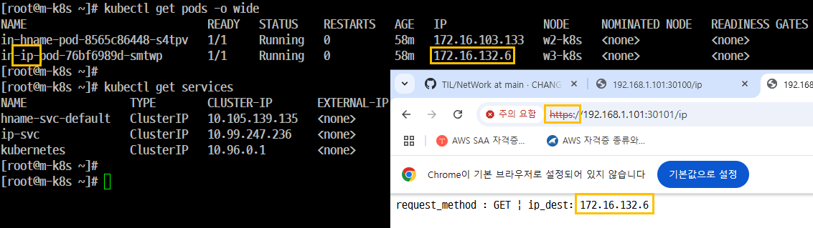

https://192.168.1.101:30101/ip

#### Step 16. 배포한 Deployment와 모든 서비스를 삭제한다.

#### Step 17. NgIC와 관련된 내용도 모두 삭제한다.
```
[root@m-k8s ~]# kubectl delete namespace ingress-nginx
namespace "ingress-nginx" deleted

[root@m-k8s ~]# kubectl delete -f ingress-config.yaml
ingress.networking.k8s.io "ingress-nginx" deleted


[root@m-k8s ~]# kubectl delete service ip-svc
service "ip-svc" deleted
[root@m-k8s ~]# kubectl delete service hname-svc-default
service "hname-svc-default" deleted

```

## 'On-Premis'에서 'LoadBalancer'를 제공하는 'MetaLB'

- 'Cloud'에서 쉽게 구성 가능한 'LoadBalancer'

    - 들어오는 요청을 모두 'Worker Node'의 'NodePort'를 통해 'NodePort Service'로 이동하고 이를 다시 'kubernetes'의 'Pod'로 보내는 구조였다. 이 방식은 매우 비효율적이다.

    - 'Kuberentes'에서는 'LoadBalancer'라는 서비스 타입을 제공해서 간단한 구조로 'Pod'를 외부에 노출하고 부하를 분산한다. 

    - 'LoadBalancer'를 사용하려면 'LoadBalancer'를 이미 구현해둔 서비스 업체들의 도움을 받아서 'kubernetes' 클러스터 외부에 구현해야 하기 때문이다. 

## 'On-Premis'에서 'LoadBalancer'를 제공하는 'MetaLB'

### 특징
- 'On-Premis'에서 'LoadBalancer'를 사용하려면 내부에 'LoadBalancer' 서비스를 받아주는 구성이 필요한데 이를 지원하는 것이 'MetalLB'이다.

- 'MetalLB'는 베어메탈(Bare Metal, 운영체제가 설치되어 있지 않은 하드웨어)로 구성된 'kubernetes'에서도 'LoadBalancer'를 사용할 수 있게 고안된 프로젝트를 말한다.

- 네트워크를 따로 공부할 필요가 없다 연동 또한 쉽게 설정할 수 있다.