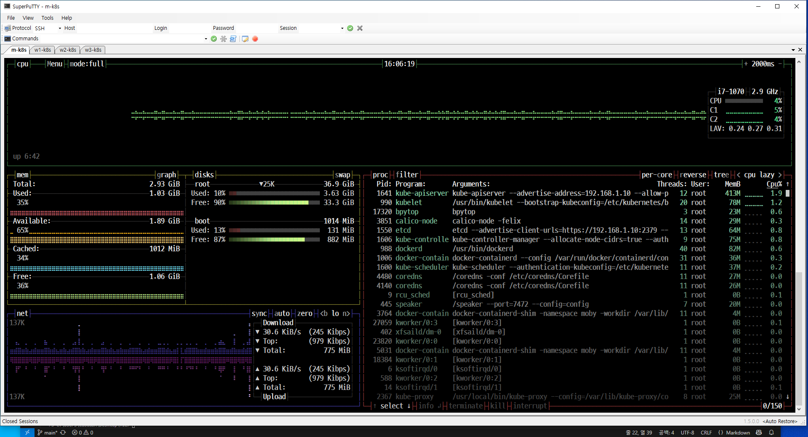
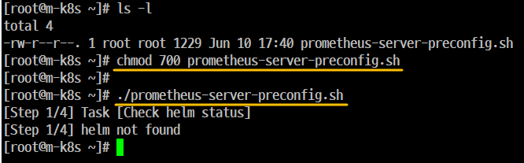
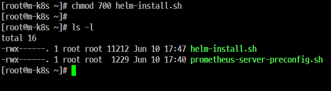
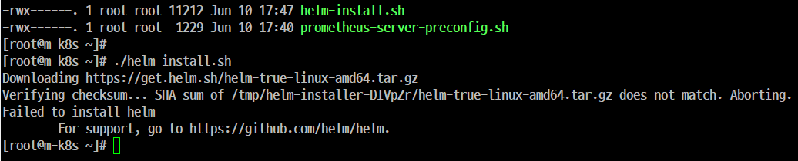
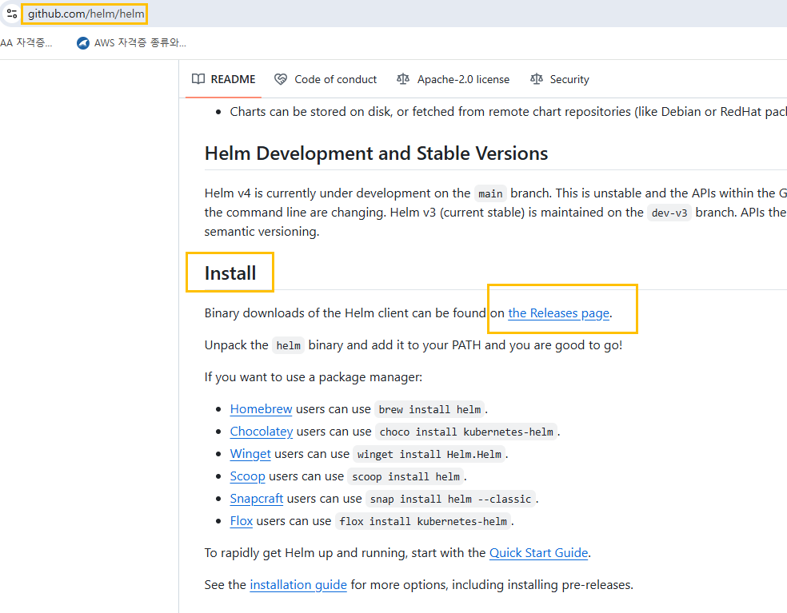
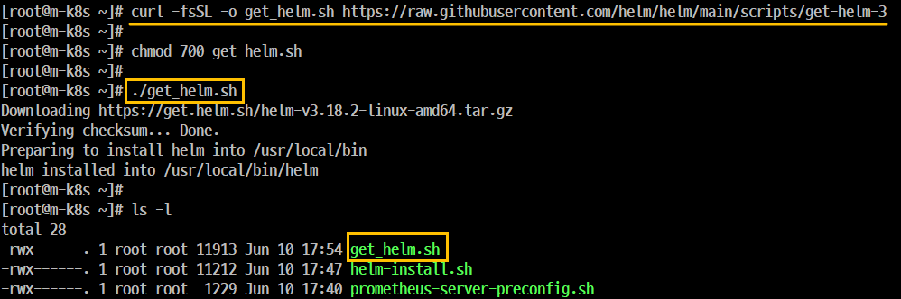
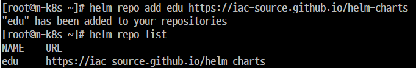
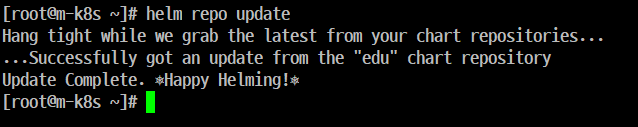
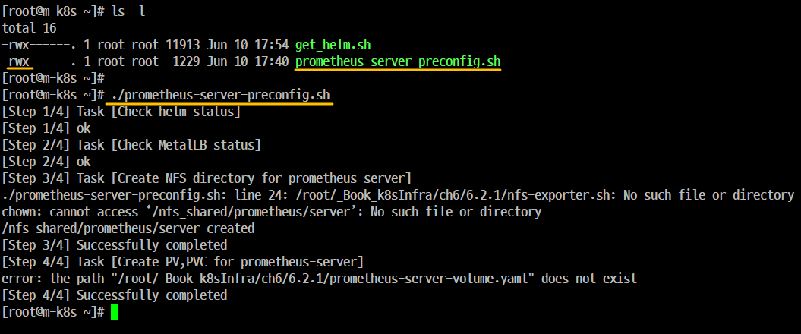
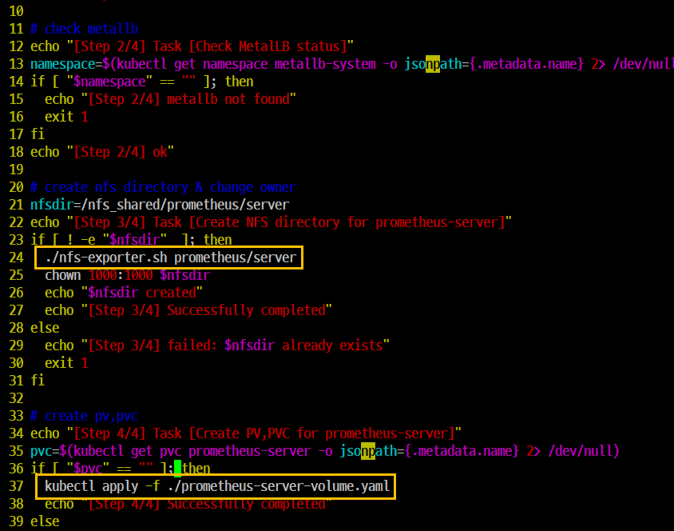

# 11. 컨테이너 오케스트레이션 모니터링 (Prometheus, Grafana)

## 개요
- 'Prometheus(오픈소스 모니터링 시스템)', 'Grafana(시각화 소프트웨어)'

- 오류가 발생했을 때 모니터링을 통해 빠르고 적절한 조치를 취해야 한다.

- 컨테이너 인프라 환경에서 가장 권장되는 모니터링 도구가 'Prometheus'이다

- 컨테이너 인프라 환경에서 주요 요소를 수집하고 수집된 내용을 한 눈에 파악할 수 있도록 '대시보드'를 작성하고 작성해서 효과적인 모니터링 시스템을 구축한다.


## Container 인프라 환경 모니터링하기
### 개요
- 'm-k8s'에서 'bpytop' 명령을 실행하면 시스템 상태 정보를 확인할 수 있다.
- 리소스의 상태 및 문제가 될 가능성이 있는 정보를 한 눈에 파악할 수 있다.
- 'bpytop' 명령은 현재 노드에 대한 정보를 보여주기 때문에 다수의 노드로 구성된 클러스터 정보를 모드 표현하기는 어렵다.
- 따라서 이러한 정보를 수집하고 분류해서 따로 저장해야 할 필요가 있다.
- 대부분의 모니터링 도구난 '수집-통합-시각화' 구조로 되어 있다.



메트릭(met)
- (현재 시스템의 상태 알 수 있는 측정값을 말한다.)
- 컨테이너 환경에서 크게 2가지 상태로 매트릭을 구분한다.
    - 시스템 메트릭(system Metric)
        - 'Pod' 같은 'Object'에서측정되는 'CPU'와 'Memory' 사용량을 나타낸다.
        - 지금까지 배웠던 주된 'Object'는 'Deployment Object' 환경이었다.
    - 서비스 메트릭(SErvice Metric)
        - 'HTTP' 상태 코드 같은 서비스 상태를 나타내는 지표가 된다.
    - 시계열 데이터베이스
        - '시간'을 축(기준, 키)으로 시간의 흐름에 따라 발생하는 데이터를 저장하는데 최적화된 데이터 베이스를 말한다.
        - 패킷, IOT(사물 인터넷) 센서 값, 이벤트 로그 등이 있다. 
        - 'Prometheus'의 '시계열 데이터베이스'에 'kubenetes'와 'Node'에서 공개하는 메트릭(측정값)을 저장하고 이를 효과적으로 조합하고 사용자가 원하는 모니터링을 구성한다. 


## Prometheus 로 모니터링 데이터 수집과 통합하기

### 개요
- 'Prometheus'는 많은 종류의 'Object'를 설치한다.
- 'Prometheus'는 'Object'를 설치하고 'Object'를 통해서 설치된 요소로 모니터링에 필요한 데이터를 수집하고 저장한다.. 


### 'Object'

#### 'Prometheus' Server (Pometheus-server 수집)'
- 'Prometheus'의 주요 기능을 수행하느는 3가지 역할을 하고 있다.
- 수집기 (수집 대상을 검색)
- 시계열, 데이터베이스
- 웹 UI ('Prometheus'의 핵심 요소)
    
#### Node Exporter (node-exporter, 화면출력)
- 노드의 시스템 메트릭 정보를 HTTP로 공개하는 역할을 한다
- 설치된 노드에서 특정 파일들을 읽고 이를 'Prometheus Server'가 수집할 수 있는 메트릭(상태 측정값) 데이터로 변환한 후에 'Node Exporter'에서 'HTTP' 서버로 공개한다. 
- 공개된 내용을 'Prometheus Server'에서 수집해 가게 된다. 

#### kube State Metrics (kube-state-metrics, 수집하는 데이터 공개)

- API Server(프로그램과 프로그램을 연결시켜주는 객체)로 'kubenetes Cluster'의 여러 'Metric' 데이터를 수집한 후 이를 'Prometheus Server'가 수집할 수 있는  Metric 데이터로 변환해서 공개하는 역할을 한다.

#### Alertmanager (alertmanager, 경보 규칙)
- 'Prometheus'에 경보규칙을 설정하고 경보 이벤트가 발생하면 설정된 경보 메시지를 대상에게 전달하는 기능을 제공한다.

- 'Prometheus'에 설치하면 'Prometheus Server'에서 주기적으로 경보를 보낼 대상을 감시해서 시스템을 안정적으로 운영할 수 있게 해준다.

### 헬름으로 'Prometheus' 설치하기

- 개요
    - 'Prometheus'는 'Jenkins'처럼 'Helm' 으로 쉽게 설치할 수 있다. 





오류 발생





```
curl -fsSL -o get_helm.sh https://raw.githubusercontent.com/helm/helm/main/scripts/get-helm-3
```



```
[root@m-k8s ~]# helm
The Kubernetes package manager

Common actions for Helm:

- helm search:    search for charts
- helm pull:      download a chart to your local directory to view
- helm install:   upload the chart to Kubernetes
- helm list:      list releases of charts

...

Use "helm [command] --help" for more information about a command.

```

```
[root@m-k8s ~]# helm version
version.BuildInfo{Version:"v3.18.2", GitCommit:"04cad4610054e5d546aa5c5d9c1b1d5cf68ec1f8", GitTreeState:"clean", GoVersion:"go1.24.3"}
```



```
helm repo add edu https://iac-source.github.io/helm-charts
helm repo list
```

```
helm repo update
```






```
vi prometheus-server-preconfig.sh
```

```
[root@m-k8s ~]# ls -l
total 24
-rwx------. 1 root root 11913 Jun 10 17:53 get_helm.sh
-rw-r--r--. 1 root root   352 Jun 10 18:14 nfs-exporter.sh
-rwx------. 1 root root  1181 Jun 10 18:14 prometheus-server-preconfig.sh
-rw-r--r--. 1 root root   427 Jun 10 18:11 prometheus-server-volume.yaml
[root@m-k8s ~]#
[root@m-k8s ~]#
[root@m-k8s ~]# chmod 700 nfs-exporter.sh
[root@m-k8s ~]#
[root@m-k8s ~]# ./nfs-exporter.sh
usage: nfs-exporter.sh <name>
[root@m-k8s ~]#
[root@m-k8s ~]#
[root@m-k8s ~]#
[root@m-k8s ~]#
[root@m-k8s ~]# ./prometheus-server-preconfig.sh
[Step 1/4] Task [Check helm status]
[Step 1/4] ok
[Step 2/4] Task [Check MetalLB status]
[Step 2/4] ok
[Step 3/4] Task [Create NFS directory for prometheus-server]
Created symlink from /etc/systemd/system/multi-user.target.wants/nfs-server.service to /usr/lib/systemd/system/nfs-server.service.
/nfs_shared/prometheus/server created
[Step 3/4] Successfully completed
[Step 4/4] Task [Create PV,PVC for prometheus-server]
persistentvolume/prometheus-server created
persistentvolumeclaim/prometheus-server created
[Step 4/4] Successfully completed
[root@m-k8s ~]#

```