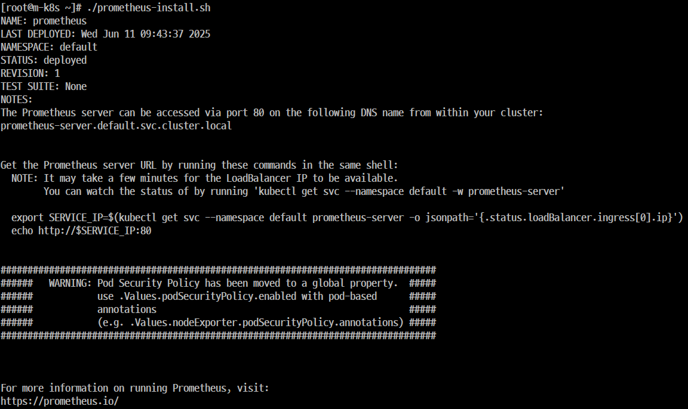
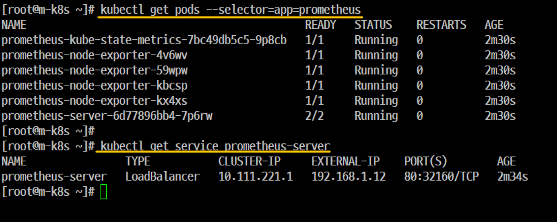
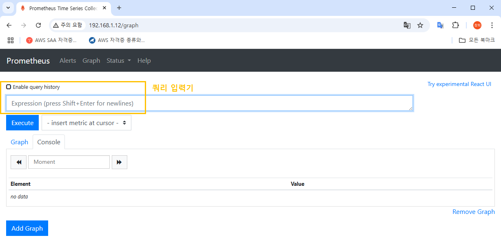
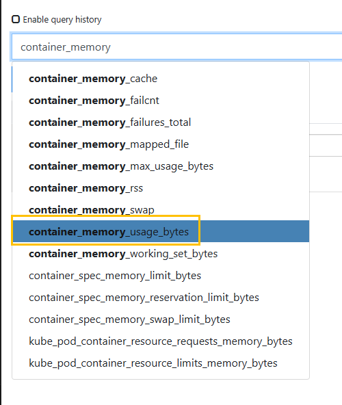
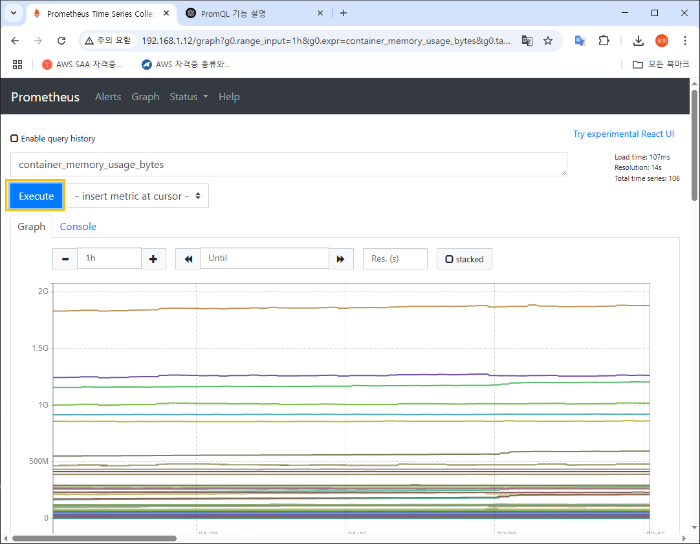
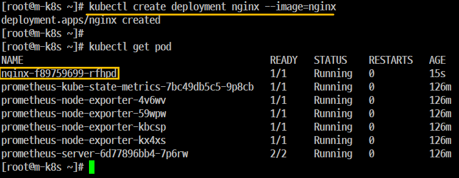
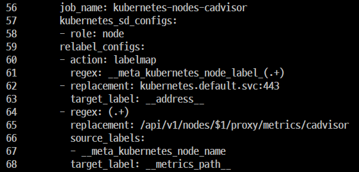
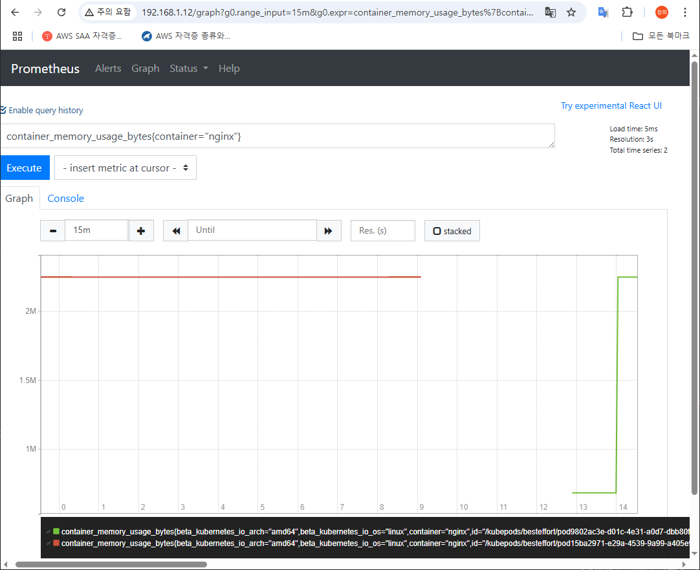
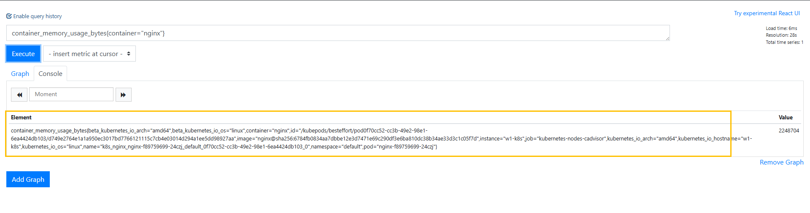
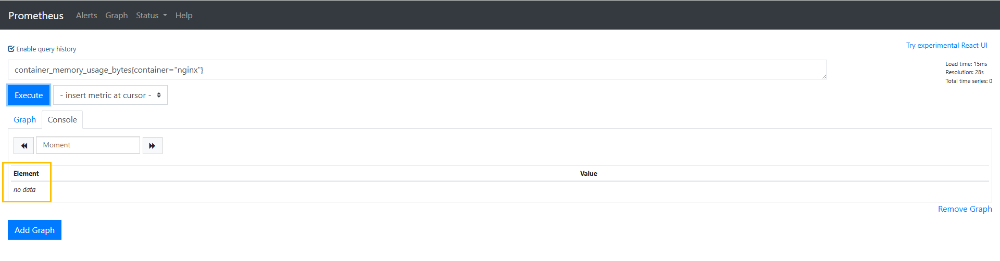

### 헬름으로 'Prometheus' 설치하기

- 개요
    - 'Prometheus'는 'Jenkins'처럼 'Helm' 으로 쉽게 설치할 수 있다. 

#### Step 1. 'Kubernetes'에 'Prometheus' 를 설치하는데 필요한 사전 구성
- 'Helm' 설치


오류 발생


```
curl -fsSL -o get_helm.sh https://raw.githubusercontent.com/helm/helm/main/scripts/get-helm-3
```


```
[root@m-k8s ~]# helm
The Kubernetes package manager

Common actions for Helm:

- helm search:    search for charts
- helm pull:      download a chart to your local directory to view
- helm install:   upload the chart to Kubernetes
- helm list:      list releases of charts

...

Use "helm [command] --help" for more information about a command.

```

```
[root@m-k8s ~]# helm version
version.BuildInfo{Version:"v3.18.2", GitCommit:"04cad4610054e5d546aa5c5d9c1b1d5cf68ec1f8", GitTreeState:"clean", GoVersion:"go1.24.3"}
```


```
helm repo add edu https://iac-source.github.io/helm-charts
helm repo list
```

```
helm repo update
```


```
vi prometheus-server-preconfig.sh
```

```
[root@m-k8s ~]# ls -l
total 24
-rwx------. 1 root root 11913 Jun 10 17:53 get_helm.sh
-rw-r--r--. 1 root root   352 Jun 10 18:14 nfs-exporter.sh
-rwx------. 1 root root  1181 Jun 10 18:14 prometheus-server-preconfig.sh
-rw-r--r--. 1 root root   427 Jun 10 18:11 prometheus-server-volume.yaml
[root@m-k8s ~]#
[root@m-k8s ~]#
[root@m-k8s ~]# chmod 700 nfs-exporter.sh
[root@m-k8s ~]#
[root@m-k8s ~]# ./nfs-exporter.sh
usage: nfs-exporter.sh <name>
[root@m-k8s ~]#
[root@m-k8s ~]#
[root@m-k8s ~]#
[root@m-k8s ~]#
[root@m-k8s ~]# ./prometheus-server-preconfig.sh
[Step 1/4] Task [Check helm status]
[Step 1/4] ok
[Step 2/4] Task [Check MetalLB status]
[Step 2/4] ok
[Step 3/4] Task [Create NFS directory for prometheus-server]
Created symlink from /etc/systemd/system/multi-user.target.wants/nfs-server.service to /usr/lib/systemd/system/nfs-server.service.
/nfs_shared/prometheus/server created
[Step 3/4] Successfully completed
[Step 4/4] Task [Create PV,PVC for prometheus-server]
persistentvolume/prometheus-server created
persistentvolumeclaim/prometheus-server created
[Step 4/4] Successfully completed
[root@m-k8s ~]#

```

#### Step 2. 'Prometheus Object' 설치
- 'Prometheus Object'를 구성하는 요소 3개를 확인한다.
- 'Prometheus Server', 'Node Exporter', 'kube State Metric'



```
./prometheus-install.sh
```

#### Step 3. 설치 확인



#### Step 4. 웹 UI 접속이 되는지 확인

#### Step 5. 사이트 출력



### 'Prometheus 웹 UI'
#### 쿼리 입력기
- 'Prometheus'가 적재한 메트릭 데이터를 조회할 수 있는 표현식을 입력한다.
- 이 때 사용하는 '표현식'은 'PromQL(Prometheus Query Language)' 이라는 'Prometheus'에서 제공하는 '쿼리 언어'이다. 
- 'Prometheus'는 '시계열 데이터베이스(시간의 흐름에 따른 최적의 DB)'를 사용하기 때문에 다른 'R-DBMS(관계형 데이터베이스, Relationship DataBase Management System)' 처럼 쿼리문을 작성해 효과적으로 필요한 'Metric(시스템 정보 측정값)'을 추출

### 🔘 Execute
- `쿼리 입력기`에 입력한 **PromQL**을 실행하는 버튼입니다.
- 이 버튼을 누르면 **PromQL 표현식에 맞는 메트릭 데이터**를 화면에 보여줍니다.

### 📊 Graph
- **Prometheus**가 수집한 메트릭 데이터를 **시각적으로 표현**해주는 옵션입니다.
- `Graph` 탭을 클릭하면 **영역형 또는 막대형 차트**로 데이터를 확인할 수 있습니다.

### 📋 Console
- **PromQL**로 추출된 메트릭 데이터를 **표 형식으로 보여주는 기본 옵션**입니다.
- 개별 데이터를 세부적으로 확인하기에 유용합니다.

### ➕ Add Graph
- 그래프 추가처럼 보이지만, 실제로는 **쿼리 입력기**를 하나 더 추가해 **또 다른 메트릭**을 확인하는 버튼입니다.

### ➖ Remove Graph
- 현재 **쿼리 입력기**를 제거하는 버튼입니다.

## Service Discovery (서비스 디스커버리)

### 개요
- 'Prometheus'는 수집 대상을 자동으로 인식하고 필요한 정보를 수집한다..
- 정보를 수집하려면 일반적으로 'Agent(전용 프로그램 또는 전용 툴)'를 설정해야 하지만 'Kubernetes'는 사용자가 'Agent'에 추가로 입력할 필요없이 자동으로 'Metric'을 수집할 수 있다.
- '서비스 디스커버리'라는 방법을 사용하려면 'Prometheus Server'가 수집 대상을 가져올 수 있다.

### '서비스 디스커버리' 작동 순서
- 'Prometheus Server'는 'ConfigMap'에 기록된 내용을 바탕으로 대상을 읽어온다. 
- 읽어온 대상에 대한 Metric을 가져오기 위해 'API' 서버에 정보를 요청한다.
- 요청을 통해 알아온 경로로 Metric 데이터를 수집한다.
- 이와 같은 순서로 'Prometheus Server'와 'API Server'가 주기적으로 데이터를 주고 받아서 수집 대상을 업데이트하고 수집 대상에서 공개되는 'Metric'을 자동으로 수집한다.

## 💡 서비스 디스커버리란?
> Prometheus가 **자동으로 메트릭 수집 대상**을 찾아서 등록하는 메커니즘입니다.  
대상은 쿠버네티스의 Pod, Node, Exporter 등일 수 있고, 이를 통해 수작업 없이 메트릭 수집 대상이 자동 갱신됩니다.

---

## 🎯 대상에 따른 서비스 디스커버리 방식

### 🔹 cAdvisor 방식
- `cAdvisor`는 **컨테이너 단위의 리소스 사용량 (CPU, 메모리, 네트워크 등)** 을 수집해주는 도구입니다.
- **Kubernetes의 API Server와 직접 연결**되어 동작합니다.
- `Prometheus`는 `API Server`를 통해 각 노드에 있는 `cAdvisor`의 주소를 **자동으로 디스커버리**합니다.
- 이렇게 되면 Prometheus가 각 노드의 cAdvisor 엔드포인트로부터 **메트릭을 자동으로 수집**하게 됩니다.

> 🔁 **흐름**:  
Prometheus ← API Server (서비스 디스커버리) ← cAdvisor (노드당 실행)

---

### 🔹 Agent 방식
- 여기서 말하는 `Agent`는 Prometheus 환경에서 **Exporter** 역할을 합니다. 예: Node Exporter, MySQL Exporter 등
- 이 Exporter(Agent)는 **직접 API Server에 등록되지는 않음**.
- 대신 **API Server가 Exporter가 있는 위치(주소, 포트)를 Prometheus에게 알려줌**.
- Prometheus는 이 정보를 기반으로 Exporter에서 메트릭을 수집합니다.

> 🔁 **흐름**:  
Prometheus ← API Server (디스커버리 정보 제공) → Exporter (Agent)

---

## ✅ 추가 설명: Prometheus와 API Server

- Prometheus는 `kubernetes_sd_configs` 같은 설정으로 **API Server와 연결**되어서 각종 대상 정보를 수신합니다.
- 이 정보에는 Pod, Node, Service, Endpoints 등이 포함됩니다.
- 이걸 바탕으로 cAdvisor나 Agent(Exporter)를 자동 감지해 모니터링하게 되는 거죠.

---

## 📌 요약 비교

| 구분 | 연결 방식 | 역할 | 메트릭 수집 경로 |
|------|------------|------|------------------|
| cAdvisor | API Server에 직접 연결됨 | 노드 단위 컨테이너 리소스 수집 | API Server → Prometheus |
| Agent (Exporter) | API Server가 위치를 알려줌 | 앱/시스템 단위 메트릭 수집 | Exporter 직접 연결 (주소 제공받음) |

## 실습
### Step 1. 

- 'Prometheus' '웹 UI'로 간다.
- 'cAdvisor'로 수집된 'Metric'은 'container' 라는 이름으로 시작하는데 '쿼리 입력기'에 'container_memory_usage_bytes' 를 입력하고 'Excute'를 클릭





-  우측 상단에 있는 3가지

```
Load time: 16ms ('PromQL'이 동작하는데 걸리는 시간이다. 단위는 'ms')
Resolution: 28s (수집된 데이터로 저장된 초 단위의 그래프를 그린다.)
Total time series: 106 ('PromQL'로 수집된 결과의 갯수이다.)
```
### Step 2. 레이블 추가
- 새로 Deployment를 추가하면 자동으로 Metric을 수집하는지 확인해 본다.
- 'PromQL' 문에 추가할 'Pod'의 이름으로 검색할 수 있도록 {container="nginx"}를 추가하고 'Excute'를 클릭한다.
- 이런 구분을 '레이블' 이라고 하는데 'PromQL' 에서 필요한 내용을 추출할 때 사용한다.
- 현재 'nginx Deployment'가 설치가 되어 있지 않은 상태이기 때문에 'no data'라고 나온다.

### Step 3. 'Master Node(m-k8s)'에서 'nginx Deployment'를 배포한다.





```
    56        job_name: kubernetes-nodes-cadvisor
    57        kubernetes_sd_configs:
    58        - role: node
    59        relabel_configs:
    60        - action: labelmap
    61          regex: __meta_kubernetes_node_label_(.+)
    62        - replacement: kubernetes.default.svc:443
    63          target_label: __address__
    64        - regex: (.+)
    65          replacement: /api/v1/nodes/$1/proxy/metrics/cadvisor
    66          source_labels:
    67          - __meta_kubernetes_node_name
    68          target_label: __metrics_path__

```



### Step 4. '웹 UI'의 하단에서 'nginx Deployment'에 대한 'Metric'이 자동으로 수집된 것을 확인할 수 있다.

### Step 5. 'nginx Deployment'를 삭제하고 더 이상 'Metric'이 자동으로 수집되지 않도록 한다. 마찬가지로 '웹 UI'의 하단에 'no data'를 확인하면 된다.





## 정리

# ✅ 1. Kustomize를 이용한 MetalLB 배포 자동화

## 🔧 준비 파일 확인
```bash
ls -l

-rw-r--r--. 1 root root  250 Jun 11 12:55 kustomization.yaml
-rwx------. 1 root root  261 Jun 11 12:37 kustomize-install.sh
-rw-r--r--. 1 root root  223 Jun 11 12:37 metallb-l2config.yaml
-rw-r--r--. 1 root root 5384 Jun 11 12:37 metallb.yaml
-rw-r--r--. 1 root root   90 Jun 11 12:37 namespace.yaml

```
→ `kustomization.yaml`, MetalLB 관련 리소스 yaml, 설치 스크립트들이 있는지 확인

## 🛠️ kustomize 설정 생성 및 확인
```bash
./kustomize-install.sh
kustomize create --namespace=metallb-system --resources namespace.yaml,metallb.yaml,metallb-l2config.yaml

cat kustomization.yaml
vi kustomization.yaml
```
→ MetalLB 구성 리소스를 하나로 묶는 `kustomization.yaml` 생성 및 확인/편집

## 📦 kustomization.yaml 내용 예시
```yaml
apiVersion: kustomize.config.k8s.io/v1beta1
kind: Kustomization
resources:
- namespace.yaml                -추가
- metallb.yaml                  -추가
- metallb-l2config.yaml         -추가
namespace: metallb-system
images:
- name: metallb/controller
  newTag: v0.8.2
- name: metallb/speaker
  newTag: v0.8.2
```

## 🏗️ 빌드 및 적용
```bash
kustomize edit set image metallb/controller:v0.8.2
kustomize edit set image metallb/speaker:v0.8.2
kustomize build | kubectl apply -f -
```

## ✅ 상태 확인
```bash
kubectl get pods -n metallb-system
kubectl get configmap -n metallb-system
kubectl describe pods -n metallb-system | grep Image:
```

## 🌐 테스트 서비스 배포
```bash
kubectl create deployment echo-ip --image=sysnet4adin/echo-ip
kubectl expose deployment echo-ip --type=LoadBalancer --port=80
kubectl get service echo-ip
```

## 🧹 정리
```bash
kustomize build | kubectl delete -f -
kubectl delete service echo-ip
kubectl delete deployment echo-ip
```

---

# ✅ 2. Helm을 이용한 MetalLB 배포 자동화

## 📥 Helm 설치 (스크립트 다운로드 및 실행)
```bash
curl -fsSL -o get_helm.sh https://raw.githubusercontent.com/helm/helm/main/scripts/get-helm-3
chmod 700 get_helm.sh
./get_helm.sh
```

## 📦 Helm 차트 저장소 추가 및 업데이트
```bash
helm repo add edu https://iac-source.github.io/helm-charts
helm repo list
helm repo update
```

## 🚀 MetalLB 설치
```bash
helm install metallb edu/metallb \
--namespace=metallb-system \
--create-namespace \
--set controller.tag=v0.8.3 \
--set speaker.tag=v0.8.3 \
--set configmap.ipRange=192.168.1.11-192.168.1.29
```

## ✅ 상태 확인 및 테스트 서비스 배포
```bash
kubectl get pods -n metallb-system
kubectl create deployment echo-ip --image=sysnet4adin/echo-ip
kubectl expose deployment echo-ip --type=LoadBalancer --port=80
kubectl get service echo-ip
```

## 🧹 정리
```bash
kubectl delete service echo-ip
kubectl delete deployment echo-ip
```

---

# ✅ 3. Prometheus 설치

```
ls -l
-rwx------. 1 root root  352 Jun 11 12:37 nfs-exporter.sh
-rwx------. 1 root root  564 Jun 11 12:37 prometheus-install.sh
-rwx------. 1 root root 1229 Jun 11 12:37 prometheus-server-preconfig.sh
-rw-r--r--. 1 root root  427 Jun 11 12:37 prometheus-server-volume.yaml

```

## 🛠️ 설치 스크립트 실행
```bash
./prometheus-server-preconfig.sh
./prometheus-install.sh
```

## ✅ Prometheus 상태 확인
```bash
kubectl get pods --selector=app=prometheus
kubectl get service prometheus-server
```

## 🌐 웹 UI 테스트용 NGINX 배포
```bash
kubectl create deployment nginx --image=nginx
```

→ 이후 Prometheus 웹 UI에 접속하여 NGINX 등 모니터링 대상을 확인할 수 있음

쿼리 입력기에 'container_memory_usage_bytes{container="nginx"} dlqfur

'Excute'클릭하고 약 1분 ~ 2분 그냥 기다린다.
'Element' 하단에 쿼리에 대한 응답이 출력된다.
