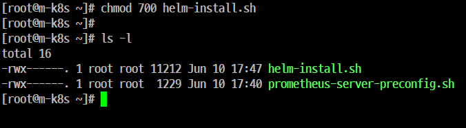
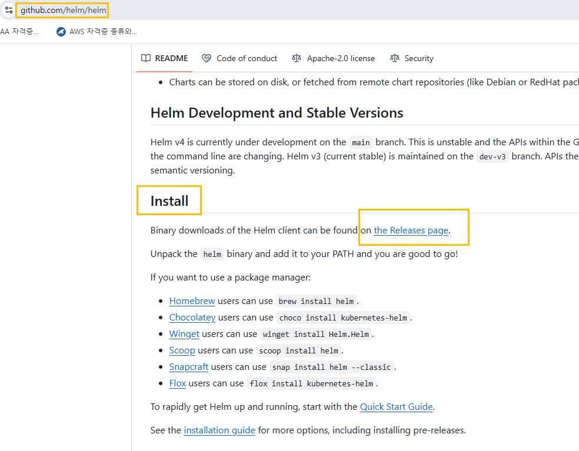
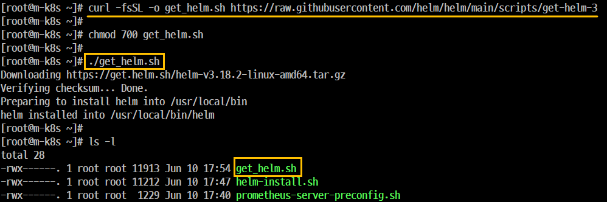
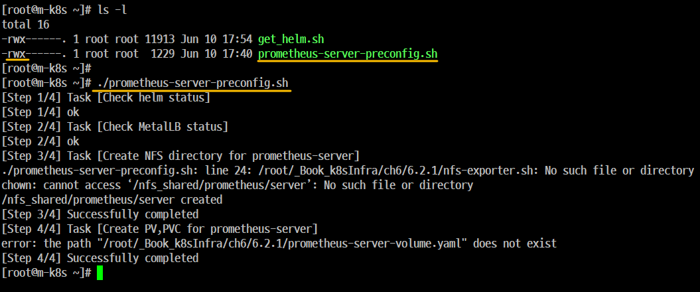

### 헬름으로 'Prometheus' 설치하기

- 개요
    - 'Prometheus'는 'Jenkins'처럼 'Helm' 으로 쉽게 설치할 수 있다. 

#### Step 1. 'Kubernetes'에 'Prometheus' 를 설치하는데 필요한 사전 구성
- 'Helm' 설치




오류 발생




```
curl -fsSL -o get_helm.sh https://raw.githubusercontent.com/helm/helm/main/scripts/get-helm-3
```



```
[root@m-k8s ~]# helm
The Kubernetes package manager

Common actions for Helm:

- helm search:    search for charts
- helm pull:      download a chart to your local directory to view
- helm install:   upload the chart to Kubernetes
- helm list:      list releases of charts

...

Use "helm [command] --help" for more information about a command.

```

```
[root@m-k8s ~]# helm version
version.BuildInfo{Version:"v3.18.2", GitCommit:"04cad4610054e5d546aa5c5d9c1b1d5cf68ec1f8", GitTreeState:"clean", GoVersion:"go1.24.3"}
```


```
helm repo add edu https://iac-source.github.io/helm-charts
helm repo list
```

```
helm repo update
```




```
vi prometheus-server-preconfig.sh
```

```
[root@m-k8s ~]# ls -l
total 24
-rwx------. 1 root root 11913 Jun 10 17:53 get_helm.sh
-rw-r--r--. 1 root root   352 Jun 10 18:14 nfs-exporter.sh
-rwx------. 1 root root  1181 Jun 10 18:14 prometheus-server-preconfig.sh
-rw-r--r--. 1 root root   427 Jun 10 18:11 prometheus-server-volume.yaml
[root@m-k8s ~]#
[root@m-k8s ~]#
[root@m-k8s ~]# chmod 700 nfs-exporter.sh
[root@m-k8s ~]#
[root@m-k8s ~]# ./nfs-exporter.sh
usage: nfs-exporter.sh <name>
[root@m-k8s ~]#
[root@m-k8s ~]#
[root@m-k8s ~]#
[root@m-k8s ~]#
[root@m-k8s ~]# ./prometheus-server-preconfig.sh
[Step 1/4] Task [Check helm status]
[Step 1/4] ok
[Step 2/4] Task [Check MetalLB status]
[Step 2/4] ok
[Step 3/4] Task [Create NFS directory for prometheus-server]
Created symlink from /etc/systemd/system/multi-user.target.wants/nfs-server.service to /usr/lib/systemd/system/nfs-server.service.
/nfs_shared/prometheus/server created
[Step 3/4] Successfully completed
[Step 4/4] Task [Create PV,PVC for prometheus-server]
persistentvolume/prometheus-server created
persistentvolumeclaim/prometheus-server created
[Step 4/4] Successfully completed
[root@m-k8s ~]#

```

#### Step 2. 'Prometheus Object' 설치
- 'Prometheus Object'를 구성하는 요소 3개를 확인한다.
- 'Prometheus Server', 'Node Exporter', 'kube State Metric'


```
./prometheus-install.sh
```

#### Step 3. 설치 확인


#### Step 4. 웹 UI 접속이 되는지 확인

#### Step 5. 사이트 출력


### 'Prometheus 웹 UI'
#### 쿼리 입력기
- 'Prometheus'가 적재한 메트릭 데이터를 조회할 수 있는 표현식을 입력한다.
- 이 때 사용하는 '표현식'은 'PromQL(Prometheus Query Language)' 이라는 'Prometheus'에서 제공하는 '쿼리 언어'이다. 