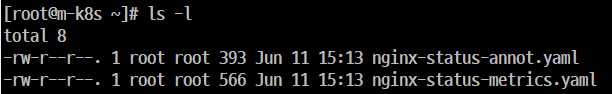
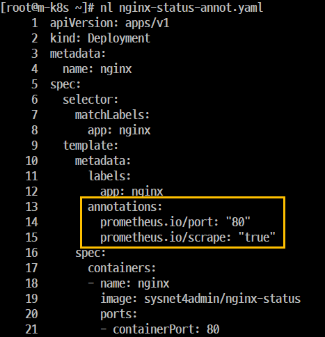
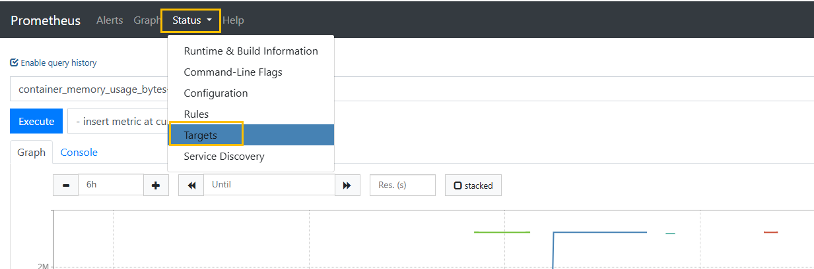
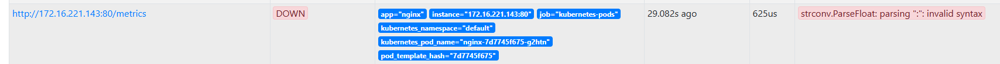
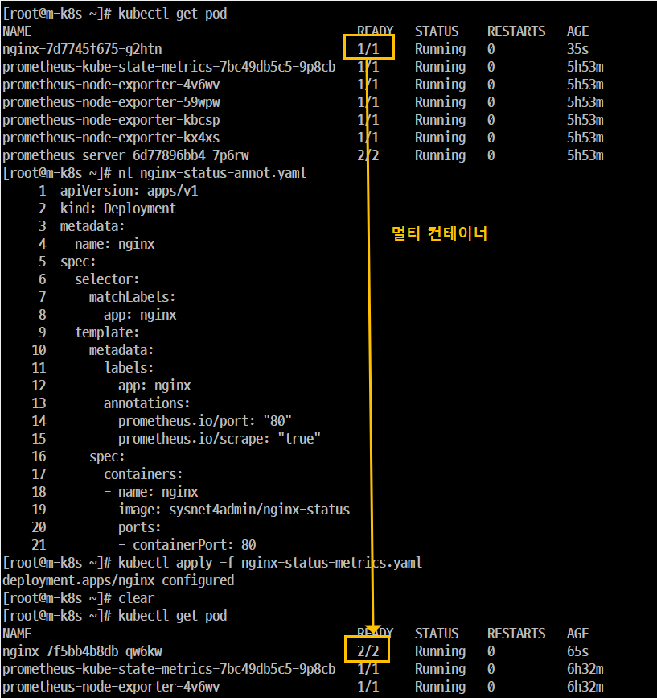
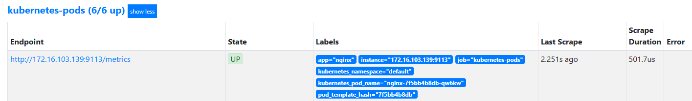
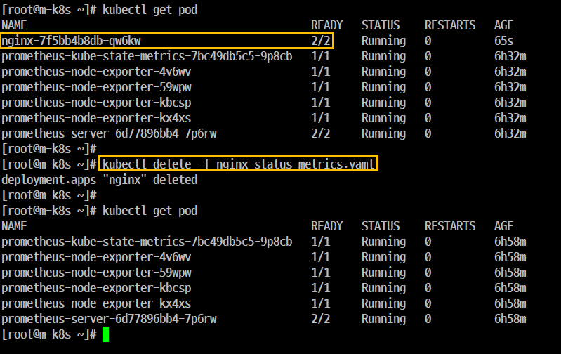

# 'Exporter'
## 개요
- 서비스 디스커버리 에서 수집은 자동으로 진행이 되지만 'Exporter'는 사전 준비 2가지를 미리 준비하고 진행해야 한다.
- Step 1. API Server에서 등록된 경로를 알 수 있게 해야 한다.
- Step 2. 'Exporter' 데이터를 'Prometheus' 타입으로 노출해야 한다.

## 실습

### Step 1. 'API Server'에 등록될 구성이 포함된 파일을 배포한다.



```
kubectl apply -f ./nginx-status-annot.yaml
```

### Step 2. 'Anotations(주석)' 설정
- 'Prometheus Server'가 배포된 Application을 API Server에서 찾아서 Metric을 수집하려면 'Anotations' 설정이 매우 중요하다.



### Step 3. 배포된 내용 확인
- 'API Server'를 통해 배포된 'nginx Deployment'의 정보가 'Prometheus Server'에 등록되었는지 확인한다.

- '웹 UI'의 'Stauts' 메뉴 하단에 있는 'Targets'를 클릭한다.
- 배포된 'nginx Deployment'의 'Metric'이 수집되는지 확인한다.





'nginx Deploymen' 는 등록을 했지만 'Metric'이 수립되지 않았다 즉, 'State' 항목이 'DOWN'으로 나온다.
- 이러한 이유는 'MEtric'이 공개되지 않았기 때문이다.
- 'Metric' 을 공개하는 방법 2가지 (프로그래밍 언어 (SDK), 'Exporter')

### Step 4. 'Exporter'를 이용한 추가 배포
- 'NGINX'에서 제공하는 'nginx-prometheus-exporter'를 추가로 구성한 파일(nginx-status-metrics.yaml)을 배포한다.



- 앞에서 'Pods' 정보 중에서 'nginx-7d7745f675-g2htn'의 'Ready'가 '1/1' 이었는데 이 작업 후 'Pods'의 이름이 'nginx-7f5bb4b8db-qw6kw'로 변경되고 'READY'가 '2/2'로 출력된다.
왜? 'Metric을 공개'로 하기 위해서 '추가로 구성'했기 때문이다.

### Step 5. 배포된 내용 재확인
'웹 UI'의 'Status' 메뉴 하단에 있는 'Targets'를 클릭한다.



### Step 6. 'nginx Deployment'를 삭제한다.



# 'Node Exporter'로 'Kubernetes' 'Node Metric' 수집하기

## 개요
- 여러 'Exporter' 중 'kubernetes'에서 가장 많이 사용하는 'Node Exporter'와 'Kube-State Metric'에 대한 내용이다. 

- 'Node Exporter'는 'Exporter' 중에서 'kubernetes'의 상태 값을 'Metric'으로 추출하는데 특화되어 있다. 

## 실습
### Step 1. 쿼리 입력기에 'node_cpu_seconds_total'을 입력하고 결과를 확인한다.
- 각 'Node(Master 및 WorkerNode)'별로 노드의 'CPU 상태별로 사용된 시간'을 출력한다.

### Step 2. 쿼리 입력기에 'node_memory_MemAvailable_bytes'을 입력하고 결과를 확인한다.
- 각 'Node(Master 및 WorkerNode)'별로 사용 가능한 Memory 용량을 출력