# 'Node Metric' 데이터 시각화

## 개요
- '각 시스템(Node)의 정보(Metric)'를 '데이터화하고 웹 상에서 관리 목적으로 시각화(Grafana)' 하는 것을 말한다.

## 시각화 과정
- 'Grafana'는 'DashBoard(작업이 이루어지는 영역)'를 만들고 그 안에 'Panel(패널)'이라고 하는 **구성 요소**들을 추가하는 방식으로 데이터를 시각화한다.

### Step 1. 'Dashboard' 설정

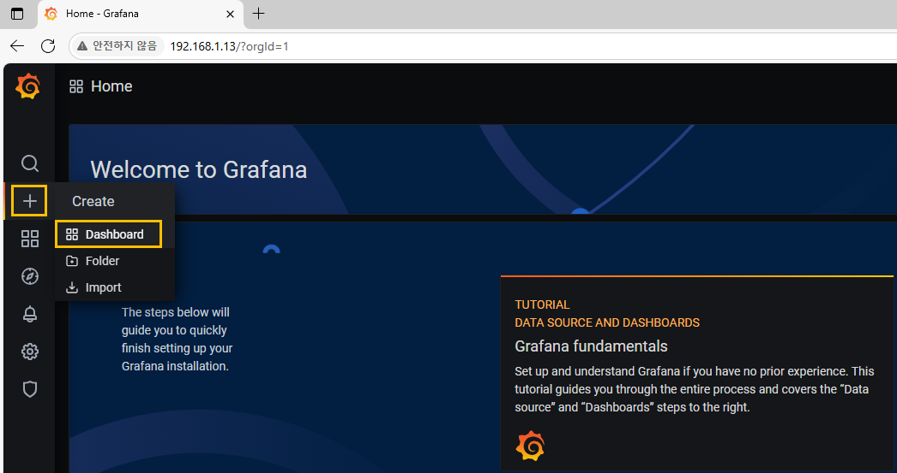
- 왼쪽 '+(Create)' 하단에 있는 'Dashboard'를 클릭한다.

### Step 2. 'Dashboard' 생성


- 출력되는 화면에 보이는 'Add new panel'을 클릭한다. 


### Step 3. 'Metric 표현식'을 이용한 출력

- 하단에 있는 'Metrics' 우측에 다음과 같이 배포한 내용을 입력한다.

```
1 - avg(rate(node_cpu_seconds_total{mode="idle"}[5m])) by (kubernetes_node)
```
- 입력이 완료된 후 '~ + Enter'를 누르거나 또는 다른 곳을 마우스로 찍는다.

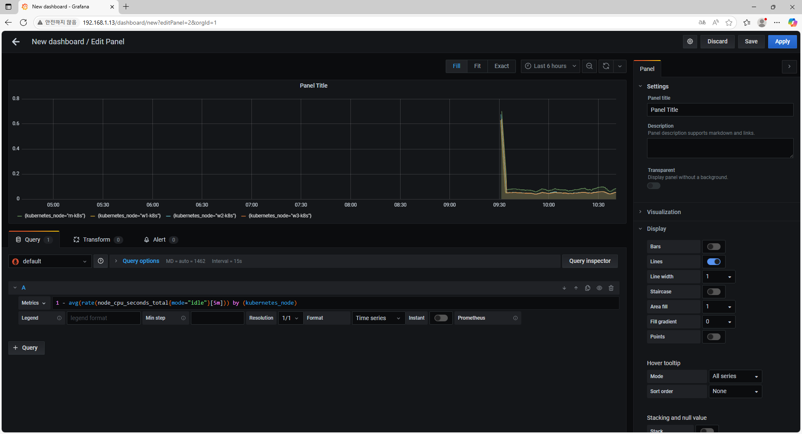

- 표현식이 출력되는지 확인한다..
- 'visualization'을 클릭하고 하단에 있는 다양한 파형을 선택하고 출력되는 내용을 확인한다.

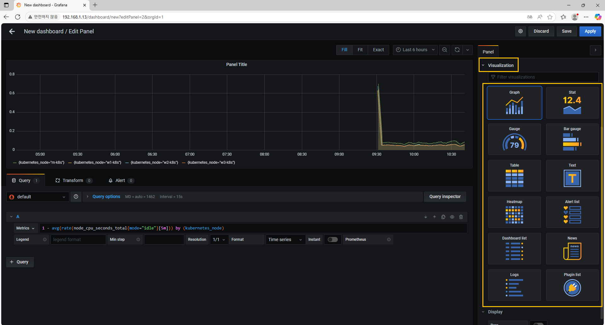

### Step 4. 노드 CPU 사용률 설정
- 우측 상단에 있는 'Panel' 하단의 'Settings'를 확장한다.
- 'Panel의 제목(Panel Title)'을 '노드 CPU 사용률'로 변경한다.
- 하단에 있는 'Metrics' 밑에 보면 'Legend(범례)'가 보이는데 {{Kuberntes_node}} 을 입력한다.
- 'Legend(범례)'는 'Metric' 레이블의 값을 사용해서 시각화 대상을 쉽게 인식할 수 있게 한다.
- 좀 더 짧은 구간의 변화된 값을 확인하기 위해 시간을 조절한다.
- 상단에 보면 'Last 6 hour'로 된 것을 'Last 1 hour'로 수정한다.
### Step 5. 
- 우측에 있는 'Axes(좌표에서의 축)'를 확장한다.
- 'CPU 사용률'을 '백분률'로 표현하기 위해 'Y(Left)'축의 단위를 'Misc'에서 'Percent(0.0 - 1.0)'로 변경한다.
- 설정 내용을 적용하기 위해 우측 상단에 있는 'Apply'를 클릭한다.

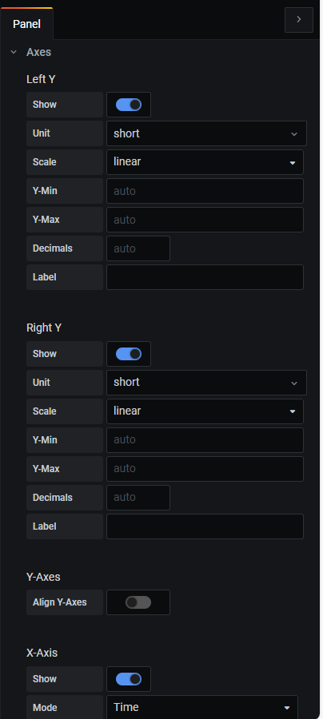

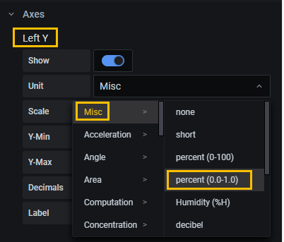

### Step 6. 'Panel' 추가

- 'Dashboard'에 '**노드 CPU 사용률**' 'Panel'만 보이는 'New Dashboard'가 출력된다.

### Step 7. 'Panel' 추가
- 'Panel' 추가하기 위해 상단에 있는 '첫 번째 아이콘(Add panel)'을 클릭한다.
- 'Add new panel'을 클릭한다.

### Step 8. 'Panel' 내용 입력
- 'Panel title'에는 '**노드 메모리 사용량**'을 입력한다.
- 'Metrics'에는 'node_memory_Active_bytes'를 입력한다.
- 'Legend' 에는 {{kubernetes_node}} 를 입력한다.
- 'Y축 단위'는 'Data(Metric)'을 'bytes(Metric)'로 변경한다.


### Step 9. 설정 내용 적용
- 설정 내용을 적용하기 위해 우측 상단에 있는 'Apply'를 클릭한다.
- 'Dashboard'에 새로 생성된 '노드 메모리 사용량' Panel을 확인한다.

### Step 10. 'Panel' 추가
- 'Panel' 추가하기 위해 상단에 있는 '첫 번째 아이콘(Add panel)'을 클릭한다.
- 'Add new panel'을 클릭한다.

### Step 11. 송신 부분 내용 입력
- 'Panel title'에는 '**노드 네트워크 평균 송신 트래픽**'을 입력한다.
- '송신 부분'으로 다음의 내용을 입력한다.
- 'Metrics' 입력
```
avg(rate(node_network_transmit_bytes_total[5m])) by (kubernetes_node)
```
- 'Legend' 에는 {{kubernetes_node}}-transmit 를 입력한다.

### Step 12. 'Query'
- '송신 부분'을 설정이 완료된 후 하단에 있는 'Query'를 클릭한다.

### Step 13. '수신 부분' 내용 입력
- '노드 네티워크 평균 수신 트래픽' 'Panel'의 수신 부분으로 다음의 내용을 입력한다.
```
avg(rate(node_network_receive_bytes_total[5m])) by (kubernetes_node) *-1
```
- 'Legend'에는 입력
```
{{kubenetes_node}}-receive
```
- Y축 단위 는  'Data(Metric)'을 'bytes(Metric)'로 변경한다.

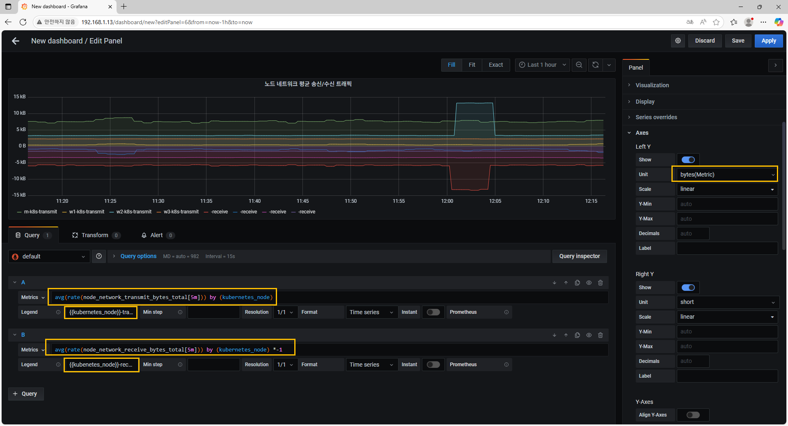

### Step 14. 설정 내용 적용

- 설정 내용을 적용하기 위해 우측 상단에 있는 'Apply'를 클릭한다.
- 'Dashboard'에 새로 생성된 '노드 메모리 사용량' Panel을 확인한다.

### Step 15. 'Panel' 추가
- 'Panel' 추가하기 위해 상단에 있는 '첫 번째 아이콘(Add panel)'을 클릭한다.
- 'Add new panel'을 클릭한다.

### Step 16. '노드 상태' 내용 입력

- 'Panel title'에는 '**노드 상태**'을 입력한다.
- 'Metrics'에는
```
up{job="kubernetes-nodes"}
```
- 'Legend' 에는 
```
{{ instance }} 를 입력한다.
```
### Step 17. 상태값 변경


- **노드 상태** 'Panel' 을 찾아서 이름을 클릭한 후 'Edit'를 누르면 'visulazation'이 보인다.
- 이 화면에서 'Graph'인 것을 'Stat'로 변경한다.
- 모든 노드가 동작중인 상태라는 '1'의 값을 가지고 있기 때문에 구분할 수가 없다.
### 'Visualization(시각화)' 에서 선택할 수 있는 옵션
- Graph(그래프)
    - 'Grafana'에서 가장 많이 사용되는 기본 옵션이다.
    - 경로, 선, 막대 등으로 데이터를 시각화 할 수 있다.
    - 대부분의 '시계열 데이터(데이터를 시간을 기준(축)으로 표시)'를 사용자가 원하는 형태로 표시한다.
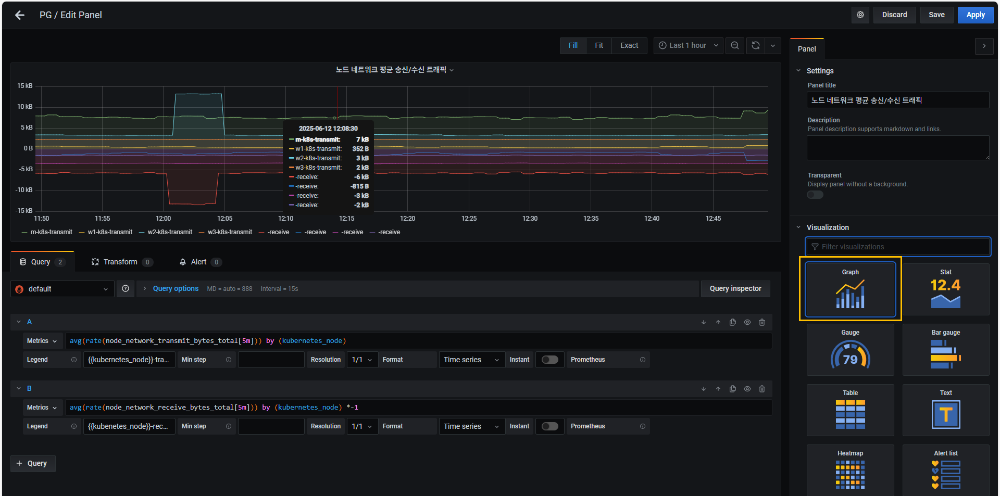


- Stat(상태값)
    - 특정 값과 함께 텍스트 모드를 적용해서 그래프없이 값만 볼 수 있다.
    - 주로 여러 대상이나 단일 대상의 상태를 나타내는데 사용된다.
    - 대상이 동작 중일 때는 '1'로, 동작 중이 아닐 때는 '0' 또는 '아무것도 안 나온다.'
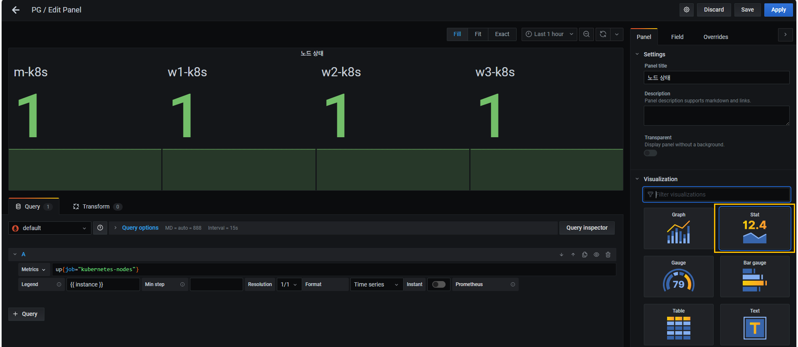

### Step 18. 시각화 목적에 맞는 상태값 형태
- 노드별 상태값을 숫자로만 표시한다.
- '노드 상태' 'Panel' 을 찾아서 이름을 클릭한 후 'Edit'을 누른다.
- 'Display' 항목에서 다음의
- 'Value' 에는 'Last (not null)'을 선택한다.
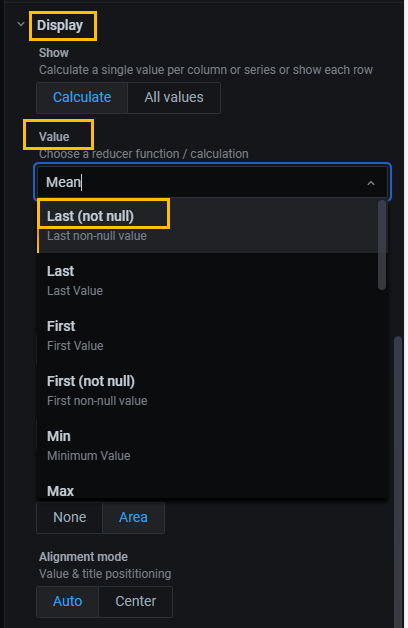
- 'Orientation'에는 'Horizontal'을 선택한다.
- 'Graph mode'에는 'None'을 선택한다.
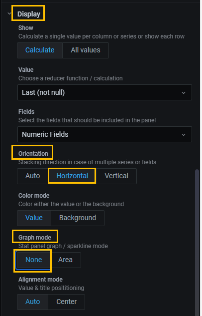

### Step 19. 시각화 목적에 맞는 상태값 형태 ('문자'로 표시)

- 노드별 상태값을 숫자로만 표시된 것을 문자로 표시한다.
- 'Fields'에 있는 'Value mapping' 항목을 확인한다.
- 'Add value mapping'을 클릭한다. 
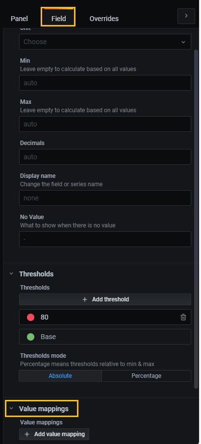

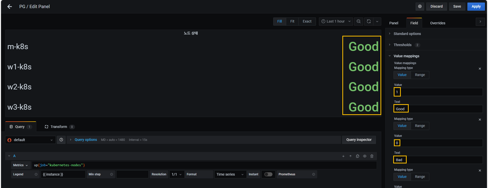
