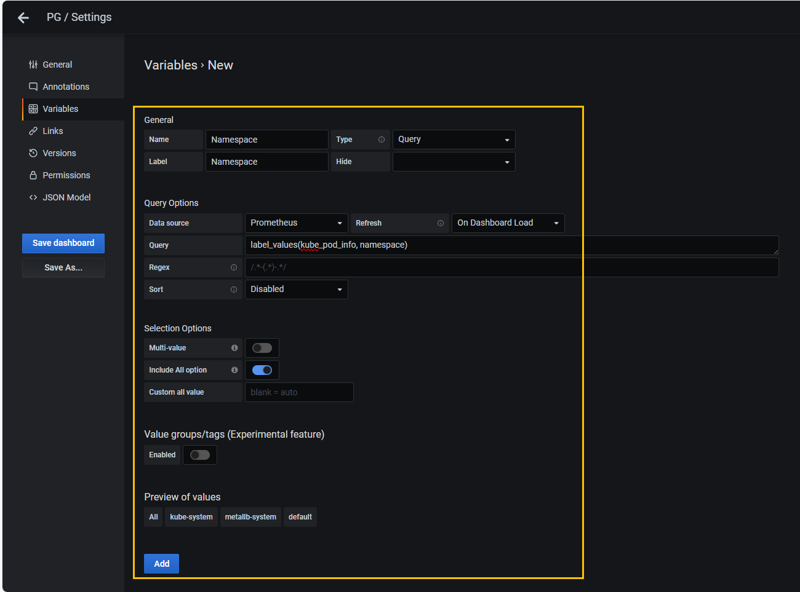
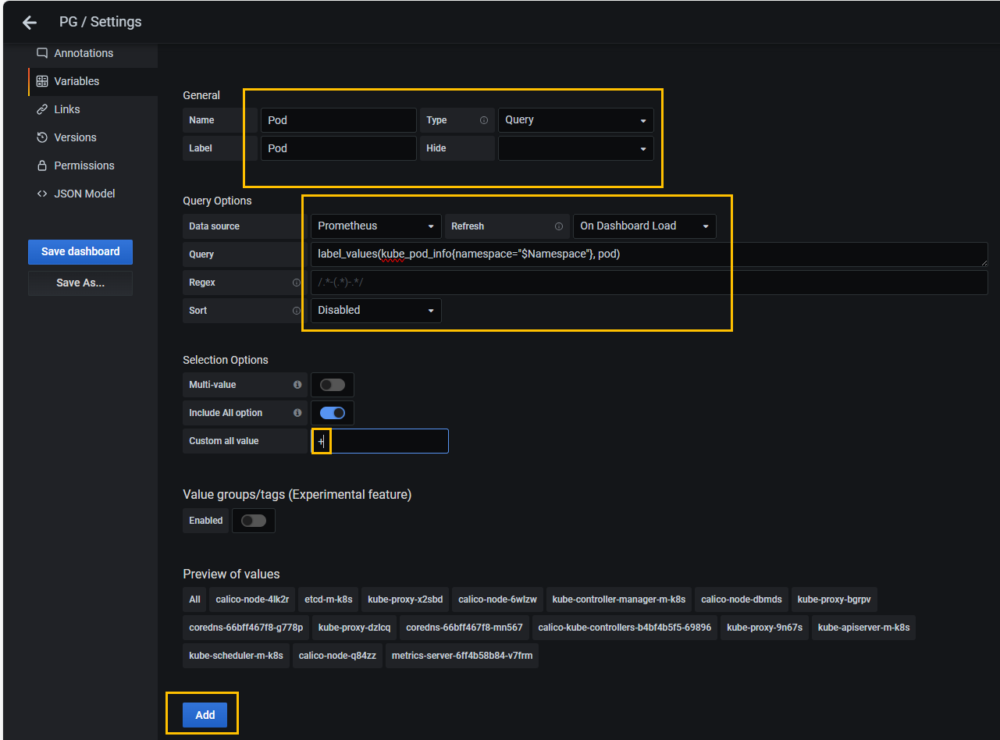
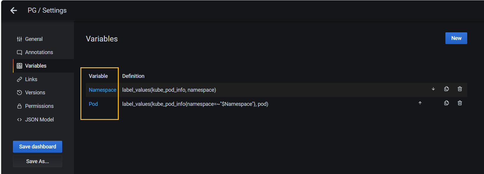
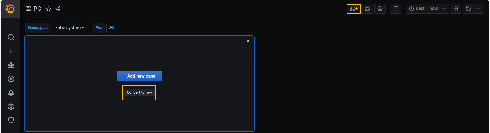
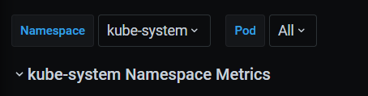

# Pod Metric 데이터 시각화

## 개요
- 'Pod Metric' 시각화 방법은 'Node Metric' 방법과 동일하다.
- 'Pod'는 여러 개의 'Namespace'에 존재하는데 사용자가 원하는 'Namespace'에 속한 'Pod'만을 시각화 한다.
- 'Grafana'에서는 변수를 선언하고 선언한 변수로 사용자가 원하는 내용만을 선별하고 'Dashboard(작업이 이루어지는 영역)'에서 확인한다.

### Step 1. 'Dashboard' 설정
- 톱니바퀴 모양의 'Dashboard Settings'를 클릭한다.

### Step 2. 'Variable(변수)' 메뉴를 선택하고 'Add Variable'을 클릭한다.

### Step 3. 변수 입력
- 'Name'에는 'Namespace' 를 입력한다. 'Dashboard' 에서 사용하는 **변수 이름은 '$Namespace'라는 호출을 이용해 불러 올 수 있다.**
- 'Label'에는 'Namespace' 를 입력한다. 'Dashboard'에서 **변수를 선택할 때 변수를 지칭한다.**
- 'Data Source'에는 'Prometheus'를 입력한다. **쿼리가 실행될 때 값을 받아오는 소스를 설정**
- 'Refresh'에는 **'On Dashboard Load'를 선택한다. 기본값은 'Never' 이다. 변수를 읽어 들이는 방법을 설정한다. 'Dashboard'가 로드 될때마다 새로 읽어들인다.**

- 'Query'는 쿼리를 입력해서 결과를 'Grafana' 변수로 사용하도록 추가한다.
```
label_values(kube_pod_info, namespace)
```
입력

- Include All option에는 '활성화'를 선택한다. 모든 'Namespace' 를 선택할 수 있는 옵션을 적용 또는 미적용할 지를 결정한다.



### Step 4. 'Pod'를 변수로 추가
- 'Namespace'를 변수를 추가했으면 'New'를 클릭하고 하위에 'Namespace' 하위에 속한 'Pod'를 변수로 추가


### Step 5. 'Pod'를 변수를 추가하는데 필요한 설정을 한다.

- 'Name'에는 'Pod'를 입력한다.
- 'Label'dpsms 'Pod'를 입력한다.
- 'Data Source'에는 'Prometheus'를 선택한다.
- 'Refresh'에는 'On Dashboard Load'를 선택한다.
- 'Query'는 쿼리를 입력해서 결과를 'Grafana' 변수로 사용하도록 추가한다.
```
label_values(kube_pod_info{namespace=~"$Namespace"}, pod)
```
입력

- Include All option에는 '활성화(적용)'을 선택
- 'Custom all value'에는 '+'로 설정한다.



### Step 6. 변수 2개 확인



### Step 7. 패널 행으로 정령

- 'Dashboard'로 이동한 후 우측 상단에 있는 'Add panel'을 클릭한다.
- 'Convert to row'를 클릭



Title

```
$Namespace Namespace Metrics
```



### Step 8. 각 Panel들의 타이틀을 누른 상태로 크기를 조절하면서 이동하고 위치를 지정하면 된다.
