# 실습 1. 'Kustomize' 로 'MetalLB' 한 번에 만들기

## Step 1. 'kustomize-install.sh' 명령을 이용한 'kustmize' 설치

파일 올린 후 소유권 700으로 변경
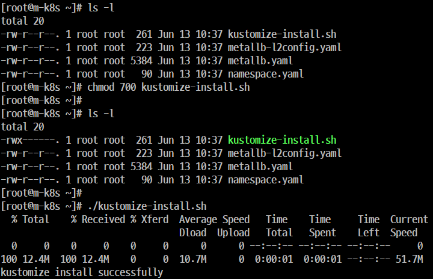

```
chmod 700 kustomize-install.sh
./kustomize-install.sh
```

## Step 2. 'kustomize'에서 리소스 및 주소 할당 영역(Pool)을 구성할 때 사용할 파일(yaml) 확인

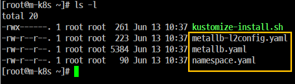

## Step 3. 'kustomize'로 변경될 작업을 정의
- 다음과 같은 명령으로 'kustomization.yaml' 파일을 생성한다.

```
kustomize create --namespace=metallb-system --resources namespace.yaml,metallb.yaml,metallb-l2config.yaml
```

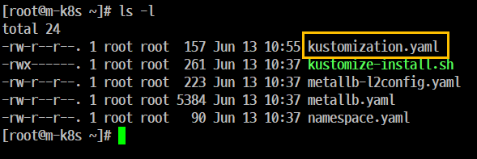

## Step 4. 생성한 파일(kustomization.yaml) 내용을 확인한다.

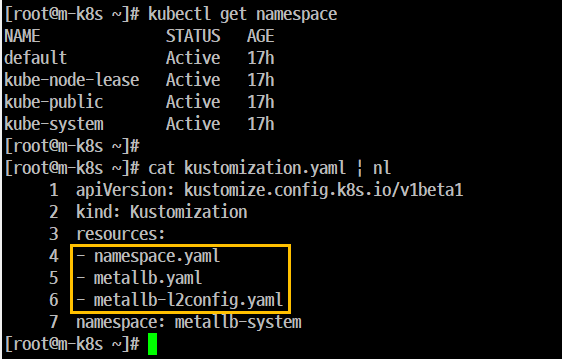


## Step 5. 설치된 이미지를 안정적인 버전으로 유지

```
[root@m-k8s ~]# kustomize edit set image metallb/controller:v0.8.2
[root@m-k8s ~]#
[root@m-k8s ~]# kustomize edit set image metallb/speaker:v0.8.2
```

## Step 6. 'kustmoization.yaml' 내용 확인

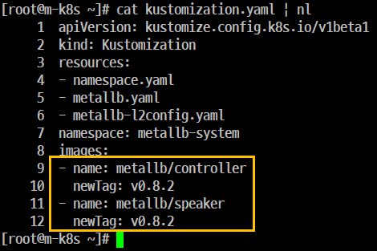

## Step 7. 'MetalLB' 설치를 위한 매니페스트 생성
- 'MetalLB' 설치를 위한 매니페스트를 생성한다.
- 'metallb-l2config.yaml'을 통해서 'ConfigMap'이 만들어지고 이미지 테그가 'v0.8.2'로 적용된 것을 확인한다.

```
kustomize build
```
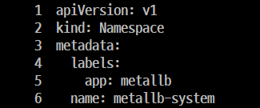

```
apiVersion: v1
kind: Namespace
metadata:
  labels:
    app: metallb
  name: metallb-system

   ... 

apiVersion: v1
data:
  config: |
    address-pools:
    - name: metallb-ip-range
      protocol: layer2
      addresses:
      - 192.168.1.11-192.168.1.19

   ...

        - --config=config
        image: quay.io/metallb/controller:v0.8.2
   imagePullPolicy: IfNotPresent

   ...

        - --config=config
        image: quay.io/metallb/speaker:v0.8.2
        imagePullPolicy: IfNotPresent

   ...
```

## Step 8. 명령을 이용한 배포

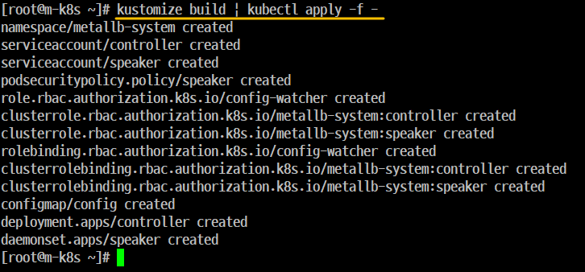

## Step 9. 'MetalLB'가 정상적으로 배포되었는지 확인

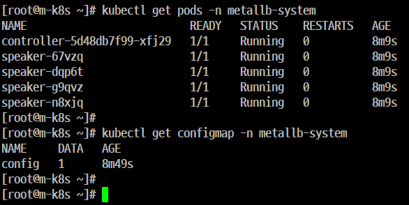
```
[root@m-k8s ~]# kubectl get pods -o wide
No resources found in default namespace.
```

## Step 10. 'kustomize'를 통해 고정 값으로 적용한 'MetalLB'의 태그 확인

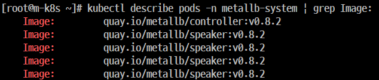

## Step 11. 테스트

- 'Deployment 1개'를 배포한 다음 LoadBalancer 타입으로 노출하고 IP가 정상적으로 할당 되었는지 확인 

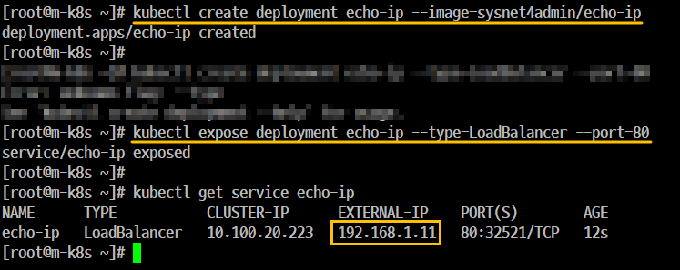

```
kubectl create deploymnet echo-ip --image=sysnet4admin/echo-ip
kubectl expose deploymnet echo-ip --type=LoadBalancer --port=80
```
## Step 12. 'Host OS'의 웹 브라우저를 통한 'echo-ip' 응답 내용 확인

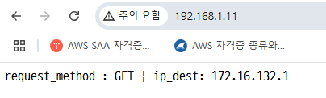

## Step 13. 다음 작업을 위해 'MetalLB'와 'Deployment'를 모두 삭제한다.

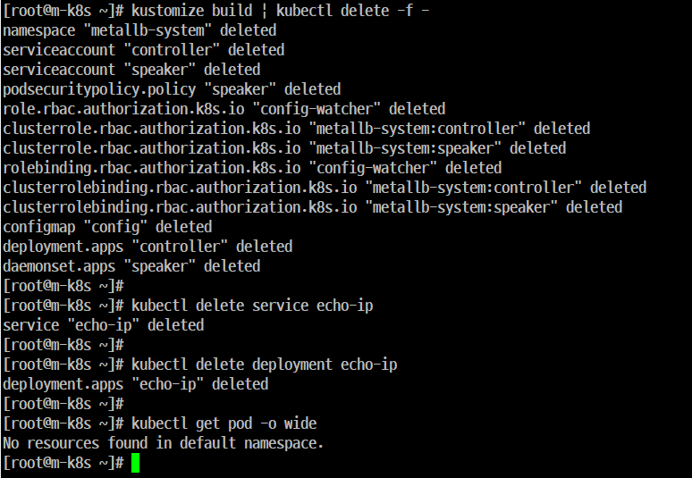

```
kustomize build | kubectl delete -f -
kubectl delete service echo-ip
kubectl delete deployment echo-ip

```
