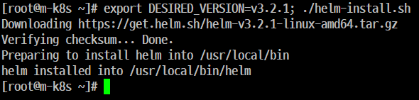
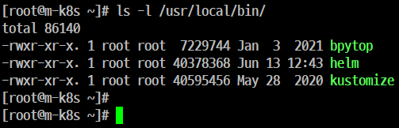
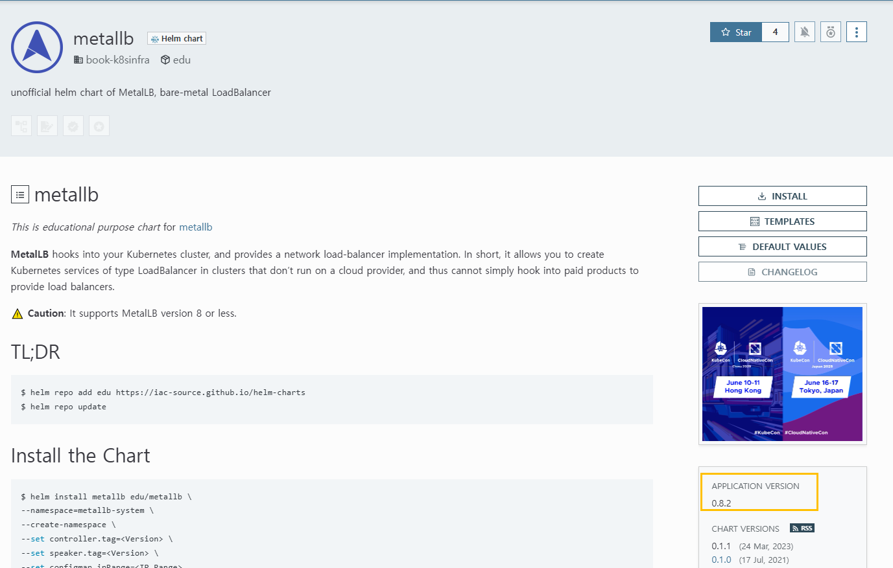
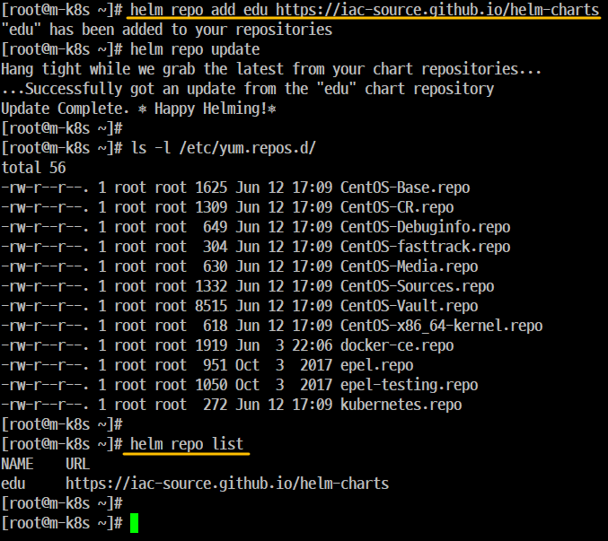
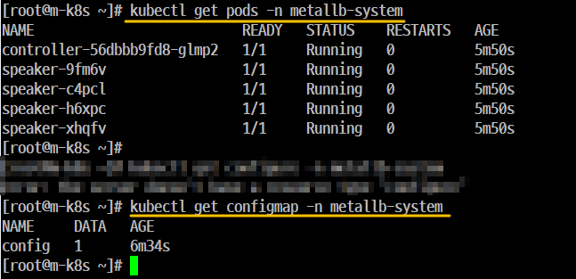
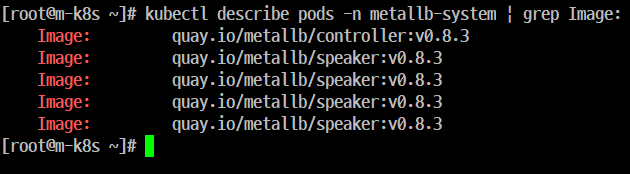
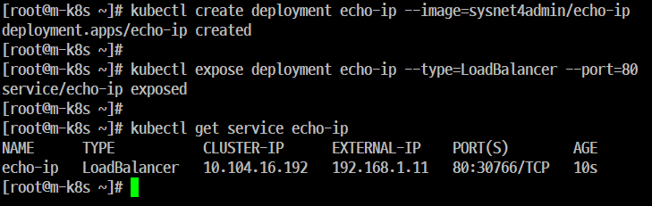
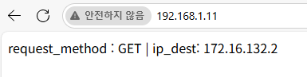

# 실습 2. 'Helm'으로 'MetalLB ' 한번에 만들기

## 개요
- 'Kustomize'를 이용하면 'MetalLB'의 다양한 설정을 사용자의 입맛에 맞게 구성하고 구현할 수가 있다.

- 'Kustomize'는 여러가지 변경할 부분을 사용자가 직접 'kustomization.yaml'에 추가하고 최종적으로 매니페스트를 만들어서 배포해야 한다.

- 즉, 모든 작업들이 수동적으로 해야 한다는 말

- 'Helm'은 이러한 제약 사항들을 없애고 편리성을 높일 수가 있다.

## Step 1. 'Helm' 설치
 
```
export DESIRED_VERSION=v3.2.1; ./helm-install.sh
```

실행 파일 위치



## Step 2. 'MetalLB' 설치를 위한 헬름 차트 등록을 위한 주소 확인
https://artifacthub.io/

- 주소를 확인한 후 검색창에 'metallb'를 입력한 후 엔터키를 누른다.

## Step 3. 'MetalLB' 설치를 위한 헬름 차트 확인
- 여러 개가 나오는데 'book-k8sinfra / edu'를 선택한다.


## Step 4. '차트 저장소(helm-charts)' 확인
- 'MetalLB'의 상세 페이지에는 '차트 저장소(helm-charts)' 등록하는 방법과 차트에 대한 다양한 정보를 함께 제공하고 있다.

- 상세 페이지를 통해 추가해야 하는 차트 주소 및 등록하는 방법도 확인 가능




## Step 5. 저장소 등록
## Step 6. 저장소 등록 확인 (helm repo list)
## Step 7. 최신 차트 정보로 동기화 (helm repo update)



edu 가 저장소 이름

```
helm repo add edu https://iac-source.github.io/helm-charts
```

## Step 8. 등록 및 업데이트한 저장소인 'edu'를 통해 'MetalLB' 설치

[참고](https://artifacthub.io/packages/helm/edu/metallb)
- 명령 실행

```
$ helm install metallb edu/metallb \
--namespace=metallb-system \
--create-namespace \
--set controller.tag=v0.8.3 \
--set speaker.tag=v0.8.3 \
--set configmap.ipRange=192.168.1.11-192.168.1.29 
```
## Step 9. 설치된 'MetalLB' 가 정상적인 상태인지 확인


```
kubectl get pods -n metallb-system
kubectl get configmap -n metallb-system
```

## Step 10. 'Helm' set 옵션을 통해서 변경된 'MetalLB'의 태그 버전을 확인



## Step 11. 테스트

- 'Deployment 1개'를 배포한 다음 LoadBalancer 타입으로 노출하고 IP가 정상적으로 할당 되었는지 확인 



```
kubectl create deployment echo-ip --image=sysnet4admin/echo-ip
kubectl expose deployment echo-ip --type=LoadBalancer --port=80
kubectl get service echo-ip
```
## Step 12. 'Host OS'의 웹 브라우저를 통한 'echo-ip' 응답 내용 확인



## Step 13. 'MetalLB'만 남기고 'echo-ip' 오브젝트 관련 내용 모두 삭제한다.


