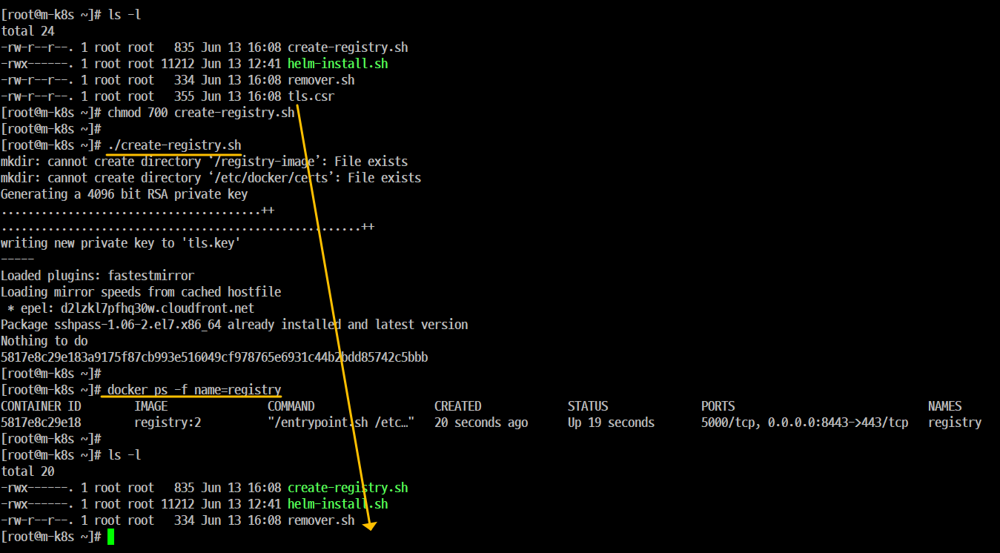
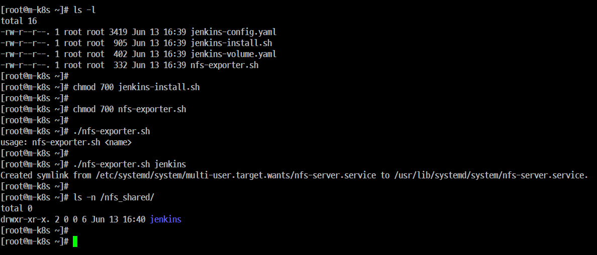
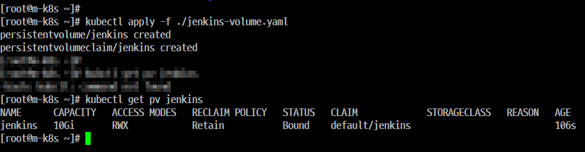
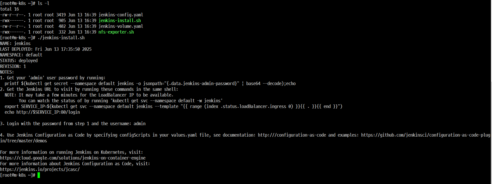
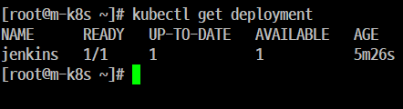
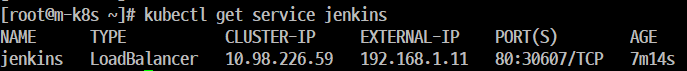
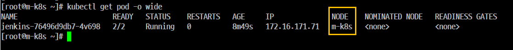

# 'Jenkins' 설치 및 설정


## Step 1. 레지스트리 Push

- 'jenkins'로 '지속적인 통합'을 진행하는 과정에서 '컨테이너 이미지'를 '레지스트리에 Push'해야만 한다. 즉, '레지스트리에 등록' 해야 한다는 말이다.



```
chmod 700 create-registry.sh
./create-registry.sh
```

```
docker ps -f name=registry
```

## Step 2. NFS, PV(PersistentVolume), PVC(PersistentVolumeClaim)



- 'Helm'으로 설치되는 Jenkins는 'Pod'에서 동작하는 Application이기 때문에 'PV'를 Mount하지 않으면 'Pod'가 다시 시작될 때 내부 볼륨에 저장되는 모든 데이터가 삭제된다.


- 이를 방지하기 위해 Application의 pv가 NFS를 통해 프로비저닝(배포) 될 수 있게 NFS 디렉터리를 생성해 준다.
- PV(Persistent Volume, 지속적으로 사용 가능한 볼륨, '파티션'과 같다.) 
- PVC(Persistent VolumeClaim, 지속적으로 사용 가능한 볼륨 요청)

## Step 3. 'UID', 'GID'

```
drwxr-xr-x. 2 0 0 6 Jun 13 16:40 jenkins
```

## Step 4. 소유권 변경
- jenkins PV 가 사용할 NFS디레터리에 대한 '접근 ID'를 '1000번' 으로 설정한다. 
- '1000번'으로 설정하는데 jenkins Controller 이미지가 기본적으로 사용하는 UID와 GID가 '1000번' 이기 때문이다.

```

[root@m-k8s ~]# ls -ld /nfs_shared/jenkins
drwxr-xr-x. 2 vagrant vagrant 6 Jun 13 16:40 /nfs_shared/jenkins/
[root@m-k8s ~]#
[root@m-k8s ~]# cat /etc/passwd | grep 1000
vagrant:x:1000:1000:vagrant:/home/vagrant:/bin/bash
[root@m-k8s ~]#
[root@m-k8s ~]# chown 1000:1000 /nfs_shared/jenkins/
[root@m-k8s ~]#
[root@m-k8s ~]# ls -ld /nfs_shared/jenkins/
drwxr-xr-x. 2 vagrant vagrant 6 Jun 13 16:40 /nfs_shared/jenkins/
[root@m-k8s ~]# ls -n /nfs_shared/
total 0
drwxr-xr-x. 2 1000 1000 6 Jun 13 16:40 jenkins

```
## Step 5. 'PV'와 'PVC' 구성 

- jenkins는 사용자가 배포를 위해 생성한 내용과 사용자의 계정 정보, 사용하는  플러그인과 같은 데이터를 저장하기 위해서 PV와 PVC의 구성을 필요로 한다.
-  왜? 지속적으로 연결되어 있어야 하기 때문이다.
jenkins-volume.yaml 파일을 이용해서 pv와 pvc를 구성하고 구성된 PV와 PVC가 STATUS 필드에 Bound 상태인지를 확인한다.



## Step 6. 'Jenkins' 설치



## Step 7. 배포된 'Jenkins Deployment'의 정보 확인




## Step 8. 배포된 'Jenkins'가 외부에서 접속할 수 있는 상태인지 확인




## Step 9. 'Pod' 상태 확인
- 'Master Node'에도 'Pod'가 배포될 수 있다.



## Step 10. yaml 파일 분석

```
[root@m-k8s ~]# kubectl get node m-k8s -o yaml | nl
     1  apiVersion: v1
     2  kind: Node
     3  metadata:
        ...
    14      kubernetes.io/arch: amd64
    15      kubernetes.io/hostname: m-k8s
    16      kubernetes.io/os: linux
        ...
   164    taints:
   165    - effect: NoSchedule
   166      key: node-role.kubernetes.io/master
        ...    


[root@m-k8s ~]# kubectl get deployment jenkins -o yaml | nl
     1  apiVersion: apps/v1
     2  kind: Deployment
     3  metadata:

        ...

   562        tolerations:
   563        - effect: NoSchedule
   564          key: node-role.kubernetes.io/master

```