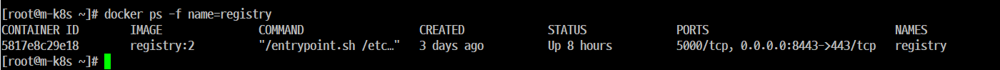
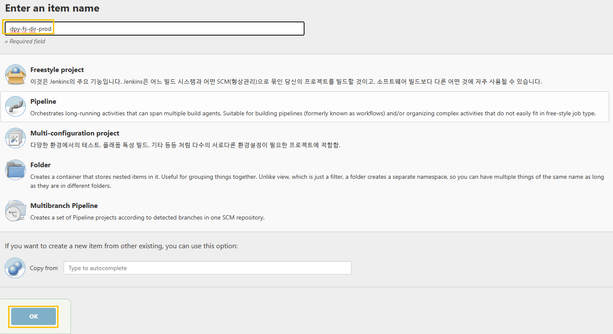
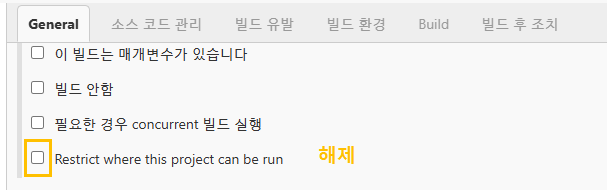
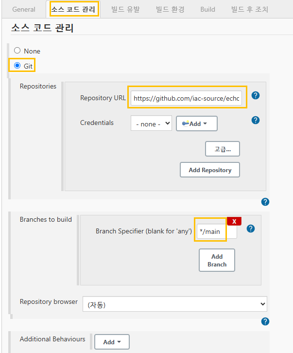
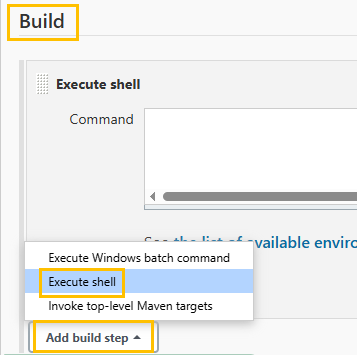
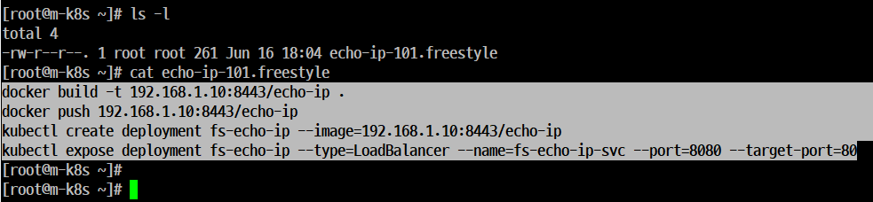
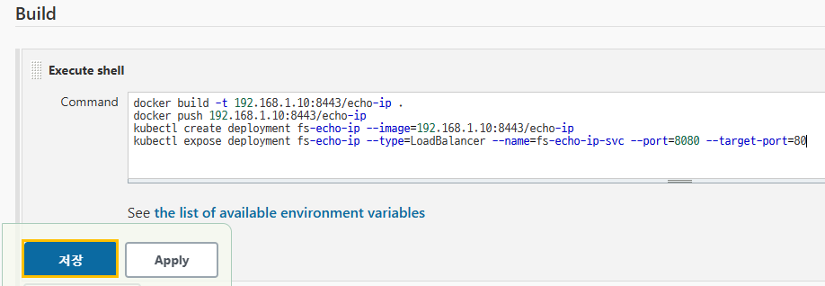
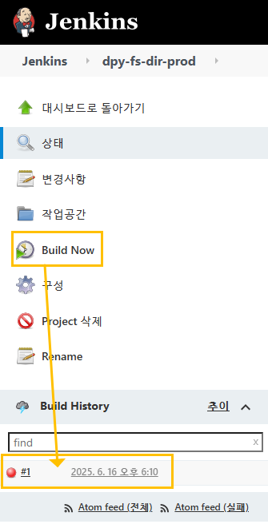

# Freestyle로 echo-ip 배포하기
## 개요
- 'Freestyle'을 이용해서 'Container' 를 'Kubernetes Cluster'에 배포한다.
- 'Jenkins' 는 배포를 위해 사용하고 도구이므로 배포할 대상은 사전에 구성되 있어야 한다.
- 배포할 대상은 IP주소를 반환하는 간단한 'Nginx 웹 서버' 있 'echo-ip'이다.
- 'CI'를 실습하려면 'echo-ip'를 빌드(사용할 수 있는 환경 작업)해야 한다.
- 'gitHub'에서 소스 파일을 가지고 와야 한다.
- 'CD'를 위해서 'Kubectl create'dhk 'expose'를 'Freestyle' 'Project'에서 배포로 사용하도록 정의 한다.

## 'Jenkins Freestyle'로 'CI/CD'를 구성하는 순서
- 'gitHub 저장소'에서 'echo-ip'를 빌드한 정보가 담긴 파일들을 내려(pull) 받는다.
- 받은 파일들을 이용해서 'Container Image'를 빌드한다.
- 빌드한 이미지를 Registry에 저장(push)한다.
- Registry에 저장한 이미지를 'Kubernetes Cluster' 에 'Deployment'로 생성하고 'LoadBalancer' 서비스로 노출한다. 
- 'Registry Container' 확인


### Step 1. 이름을 지정하고  'Freestyle project'를 선택한 후 'OK'를 클릭한다.



### Step 2. 'General' 탭에서 'Restrict where this project can be run'를 체크 해제한다.



### Step 3. '소스 코드관리' 탭에서는 'Git'를 선택한다.
- '소스 코드 관리' 탭에서는 'Jenkins' 외부에 있는 소스 코드 저장소를 'Jenkins CI'로 사용하도록 지정할 수 있다.
- 설정을 위해서 'Git'을 클릭하면 내용을 입력할 수 있는 확장 모드로 변경된다.
- 'Repository URL'에는
https://github.com/iac-source/echo-ip
를 입력한다.

- 'Branch Specifier (blank for 'any')'는 '*/master'에서 '*/main'로 변경한다.
- 현재 입력한 'gitHub 저장소'에 존재하는 '주요(main)' 브랜치 변경 내용에 대해서만 'CI'를 진행하도록 변경한다.



### Step 4. 실제로 'Jenkins'가 작업을 수행할 방법을 선택하는 단계이다.

'빌드 유발' 탭에서는 '빌드' 하단에 있는 'Add build step'을 'Excute Shell'로 변경한다. 



### Step 5. 'Jenkins'에서 빌드에 사용할 명령어를 확인하고 입력한다.

- 명령어는 docker image build, docker image push, docker create deployment, expose LoadBalancer 를 통한 노출의 4단계로 이루어져 있다.

- 실제 'Jenkins'가 작업을 수행할 때는 위에 입력한 셀 명령어들이 실행된다.
- 이 스크립트는 사전에 구성돼 있기 때문에 'cat' 명령으로 스크립트를 출력한 후 내용을 모두 복사하고 'Execute Shell' 메뉴를 누른 후에 나은 칸에 붙여 넣는다.





```
docker build -t 192.168.1.10:8443/echo-ip .
docker push 192.168.1.10:8443/echo-ip
kubectl create deployment fs-echo-ip --image=192.168.1.10:8443/echo-ip
kubectl expose deployment fs-echo-ip --type=LoadBalancer --name=fs-echo-ip-svc --port=8080 --target-port=80
```
다음 저장 누루기

### Step 6. 'Build Now'를 클릭하고 저장한 프로젝트를 실행한다.

### Step 7. 'CI/CD' 작업을 수행하면 하단에 있는 'Build Histroy'에 작업이 추가된다.
- 작업이 정상적으로 종료되었다면 파란색이 나오는데 작업이 실패하면 빨간색으로 나온다.

