## 1. 이전에 실습햇던 시스템 4대를 모두 삭제한다.
## 2. 배포 했던 a.zip 파일을  Hashicorp 폴더 안에 압축 해제 한다.
## 3. vagrantfile을 이용한 Provisioning을 진행하고 시스템을 구축한다.

## 4. 도커 버전을 확인한다.
```
kubectl get nodes -o wide
```
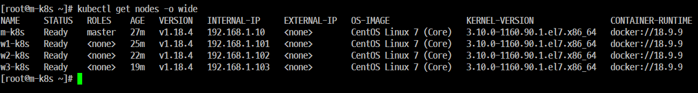

## 5. 배포한 'Dockerfile'의 내용을 확인한다.
```
cat Dockerfile
```

## 6. 'Dockerfile'로 컨테이너 이미지를 빌드한다.

```
docker build -t multistage-img .
```
## 7. 빌드 이미지 용량 확인
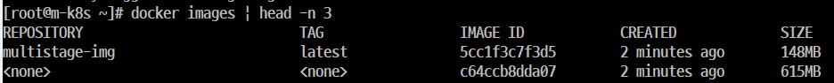

## 8. '댕글링 이미지' 삭제 ('Dangling 이미지'는 'REPOSITORY' 필드에 'none') 

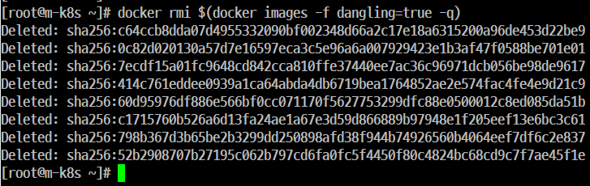

## 9. 'multistage-img'를 이용한 컨테이너를 생성하고 빌드한 컨테이너가 잘 동작하는지 확인한다.

## 10. 'Deployment Pod'를 생성한다.


## 11. '호스트 시스템(m-k8s)'에 이미지가 있는데도 외부에서 이미지를 다운로드 하려고 하기 때문에 오류가 발생한다.

## 12. 오류가 발생한 'Deployment Pod'를 삭제한다.
```
kubectl delete deployment failure1
```

- 레지스트리(Registry, 사설 이미지 생성) 구성하기 

## 13. 압축파일 업로드 후 해제 ------------2번 알집


## 14. 사설 도커 Registry 만들기

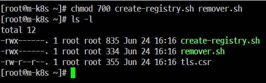

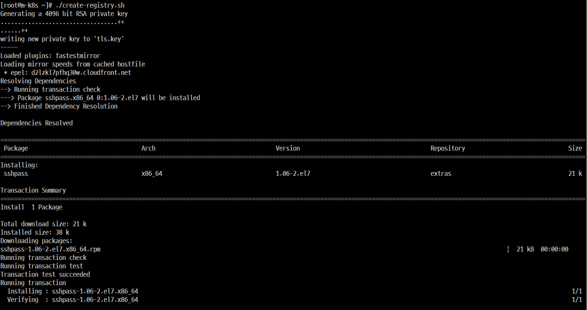
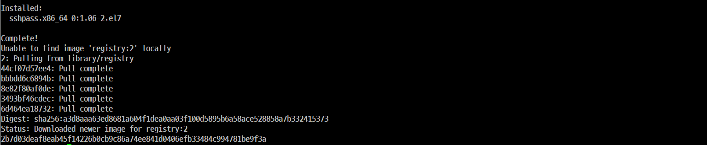

## 15. 생성한 'Registry Container' 정상 동작여부를 확인한다.

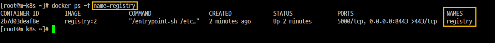

## 16. '사설 도커 Registry'에 등록 가능하도록 컨테이너 이미지의 이름을 변경한다.

```
 docker tag multistage-img 192.168.1.10:8443/multistage-img
```
## 17. 'multistage-img'를 '사설 도커 Registry'에 등록한다.
```
docker images 192.168.1.10:8443/multistage-img
docker push  192.168.1.10:8443/multistage-img

```
## 18. 이미지가 정상 동작하는지 확인한다. ('-k'는 '--insecure'로써 자체 서명 인증서를 사용한다는 말이다.)

```
curl https://192.168.1.10:8443/v2/_catalog -k
docker images | grep multi
```
## 19. 동일한 이미지임을 확인한다.

```
docker ps -f name=registry
```

# Kustomize 를 이용한 'MetalLB(Load Balancer)' 만들기

## 22. '3.zip'압축해제 후 작업한다.

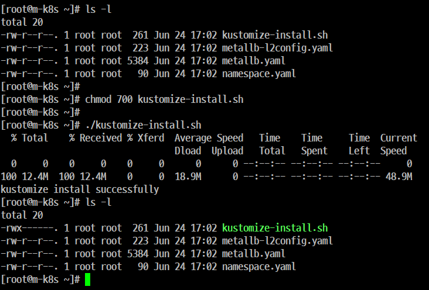

## 23. /usr/local/bin 사용자에 의해 설치된 프로그램은 모두 이 경로에서 동작되도록 설정 해야 한다.

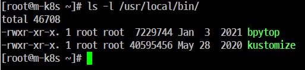

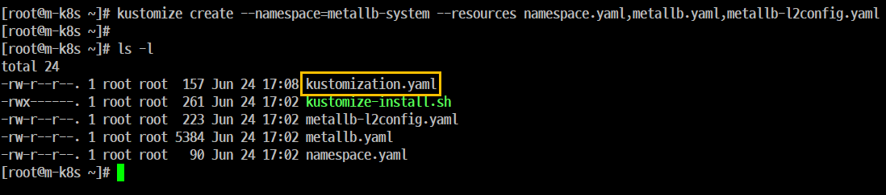

## 24. kustomization.yaml 파일

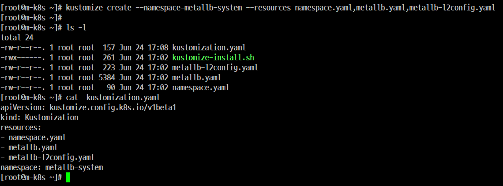

## 25. 설치된 이미지의 사용을 위한  'Controll'와 'speaker' 의 이미지 태그를 'v.0.8.2' 로 지정한다.

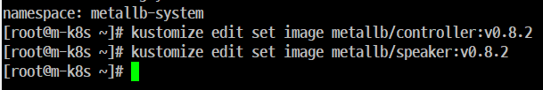

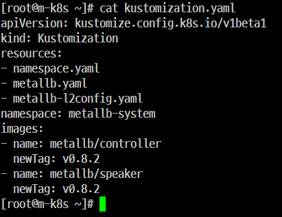


## 26. 'MetalLB' 설치를 위한 '메니페스트(스펙)'을 생성

```
kustomize build

```
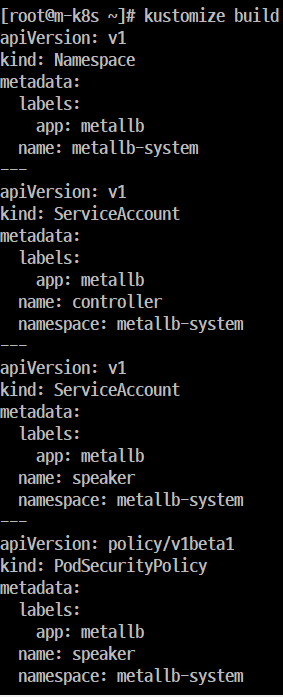

## 27. 빌드한 결과를 'kubectl apply'에 인자로 전달한다.

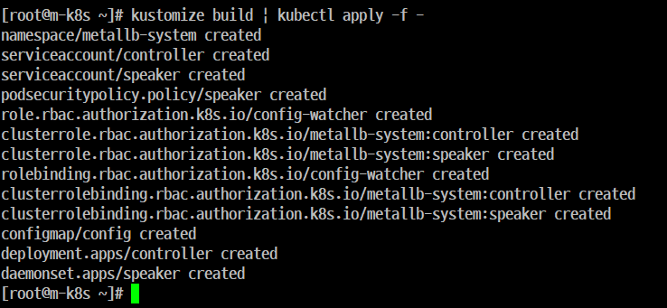

## 28. 'MetalLB'가 정상적으로 배포되었는지 확인한다.


## 29. 'Kustomize'를 통해 고정한 'MetalLB'의 태그를 확인한다.

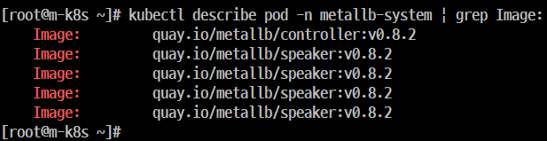

## 30. 테스트를 위한 'Deployment Pod' 1개를 배포하고 'LoadBalancer' 타입으로 노출하고 IP가 정상적으로 할당되었는지 확인한다.


## 31. 사이트를 출력하고 'echo-ip'가 정상적으로 응답하는지 확인한다.

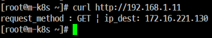

- 삭제하기 'MetalLB', ''

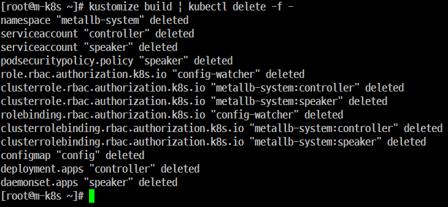

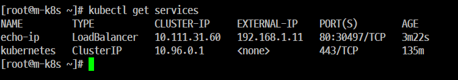

# Helm 으로 배포 간편화하기

## 32. 'MetalLB'를 삭제하고 배포했던 'echo-ip' 관련 'Object'들도 삭제한다.

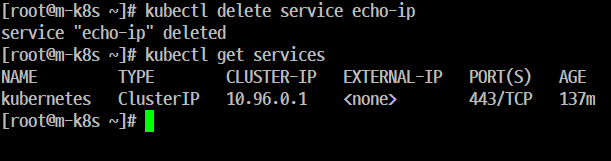

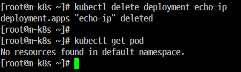

나머지 파일들 삭제

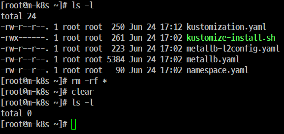

## 33. 4.zip 파일을 압축 해제한 후 'helm'설치

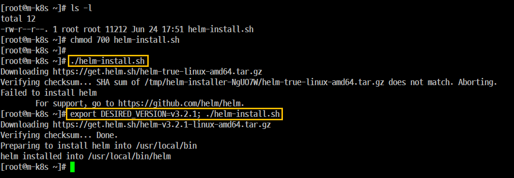

## 34. '33' 설명
- 실행 파일을 실행하면 항상 최신 버전을 다운로드한 후 설치를 하게 된다.
- 오류를 최소화 하기 위해 'DESIRED_VERSION' 환경변수를 이용해서 특정 버전을 다운로드 한 후 설치하기 위함이다.

## 35. 'Helm Chart' 저장소 등록 및 저장소 목록을 확인하고 업데이트를 진행한다.

## 36. '최신 chart 정보를 동기화'를 진행한다. 

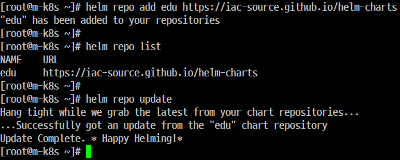


## 37. 스크립트를 이용해서 chart를 설치한다.
```
helm install metallb edu/metallb \
--namespace=metallb-system \
--create-namespace \
--set controller.tag=v0.8.3 \
--set speaker.tag=v0.8.3 \
--set configmap.ipRange=192.168.1.11-192.168.1.29 
```

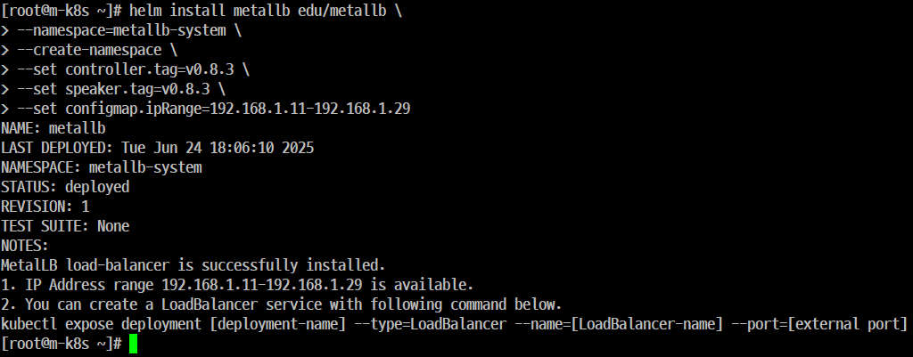

## 38. 'MetalLB' 가 정상적인 상태인지 배포 상태를 확인한다.

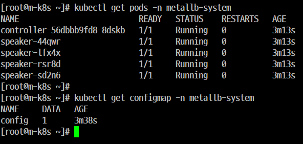

## 39. 'MetalLB' 태그 버전을 확인한다.

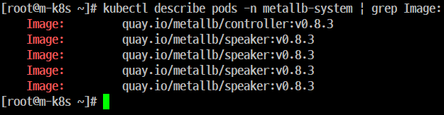

## 40. 테스트를 위한 'Deployment Pod' 1개를 배포하고 'LoadBalancer' 타입으로 노출하고 IP가 정상적으로 할당되었는지 확인한다.

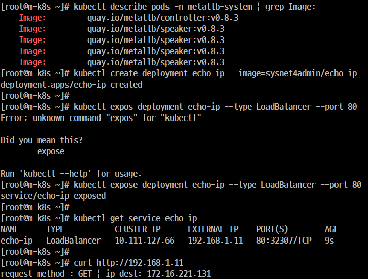

## 41. 사이트를 출력하고 'echo-ip'가 정상적으로 응답하는지 확인한다.

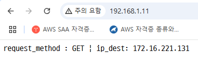

## 42. 컨테이너 이미지를 'Registry'에 등록된 내용 확인한다.

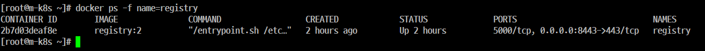

## 43. '5.zip' 압축해제 후 'NFS' 관련 작업을 한다.

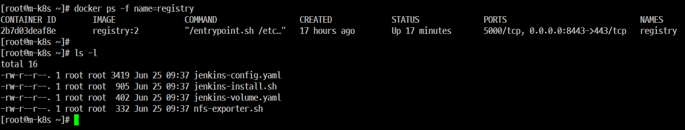

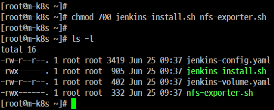

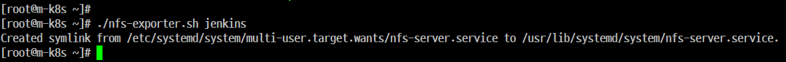

## 44. 생성된 디렉터리의 상태를 확인한다.

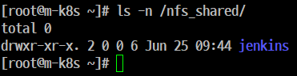

## 45. 접근 권한 부여

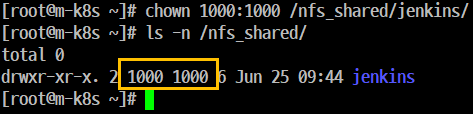

## 46. Jenkins 'PV, PVC'를 구성하고 'Bound' 상태인지 확인한다.

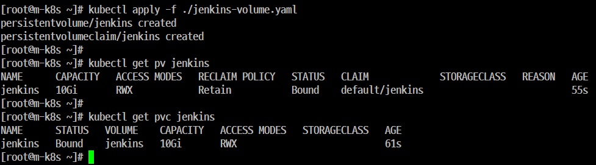


## 47. 'PV(Persistent Volume), PVC(Persistent Volume Claim(요구))'

- 데이터(Container 기반의 'Deployment Pod')를 저장하고 만약에 'Deployment Pod'가 재시작 했을 때도 데이터를 정상적으로 동작할 수 있도록 해 주는 기능


## 48. 'Jenkins' 를 설치한다. 

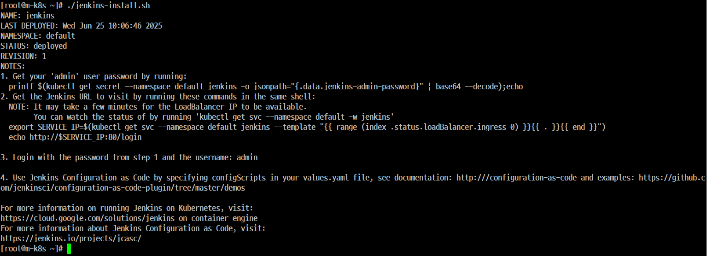

## 49. 'Jenkins'를 외부에 노출시키고 사이트에서 접속할 수 있도록 설정한다.

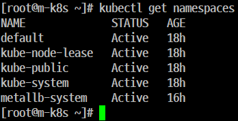


## 50. Jenkins 사이트 출력
http://192.168.1.11/login

## 51. 'Pipeline Project' 생성을 위한 'Item' 추가
- 'Jenkins' 메인 화면 상단에 있는 '새로운 Item'을 클릭한다.
- 'Enter an item name'에는 'dpy-pl-bulk-prod'라고 입력한다.
- 하단에 있는 'Pipeline' 을 클릭한 후 'OK'를 클릭한다..

## 52. '구성'을 설정한다.
- 생성된 'Pipeline Project' 목록에서 'dpy-pl-bulk-prod'을 클릭한다.
- 왼쪽에서 '구성'을 클릭한다.
- 'General'의 하단에 있는 '이 빌드는 매개변수가 있습니다'를 체크해제한다.
- 'Pipeline' 에서 'Definition'을 'Pipelin Script'에서 'Pipeline script from SCM'으로 변경한다.
- SCM 으 Git 으로 변경한다.
- Repository URL 에 'https://github.com/iac-source/echo-ip'를 입력한다.
- 'Branch Specifier (blank for 'any')'에서 '*/main' 으로 변경한다.
- 하단에 있는 'Apply'와 '저장'을 순서대로 클릭한다.

## 53. 'Pipeline Project'를 빌드한다.
- 'Pipeline Project' 화면 왼쪼고에 있는 'Build Now'를 클릭한다.
- 'Build History' 하단에 '빌드 작업 중' 형태로 막대기가 움직이는 것을 확인한다.
- '파란색' '#1'이 출력될 때까지 기다린다.
