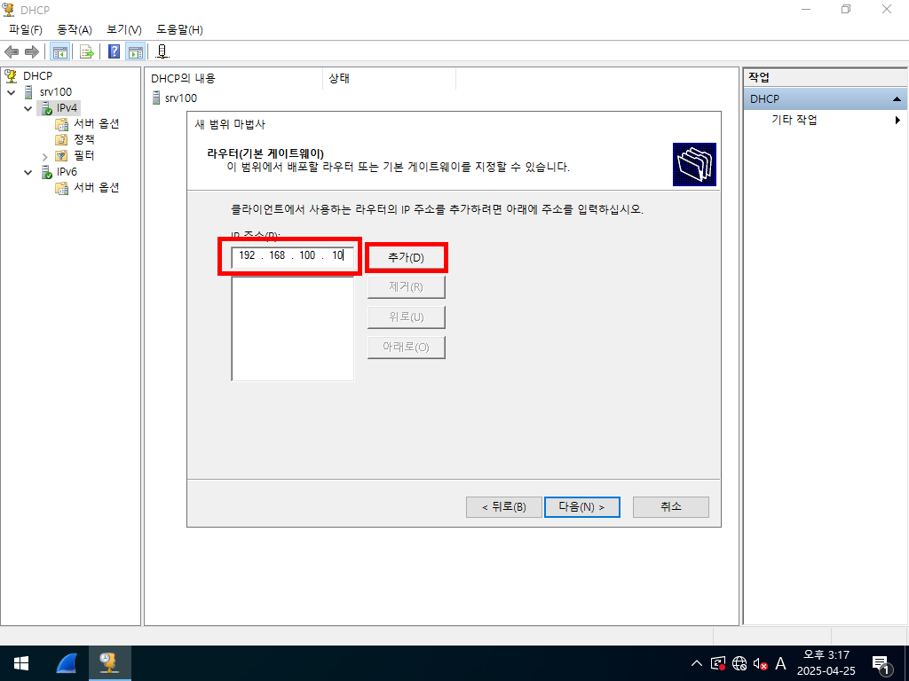

#  DHCP (Dynamic Host Configuration Protocol)

##  장단점

###  장점

---

###  단점

---

##  중요 포인트

  

---

##  실습 1: 임대 생성

###  DHCP Server 설치

1. **서버 관리자 실행**
2. **[역할 및 기능 추가] 클릭 후 다음 3번 → DHCP 선택**
3. **[다음] → [다음] → [설치]**

---

---

---
## 📍 범위 지정

1. **DHCP 콘솔 실행 → 새 범위 만들기**
2. **IP 주소 범위, 서브넷 마스크 입력**
3. **임대 기간 설정 및 DNS 등 세부 구성**

  
  
  
  
  

---
## ⚙️ 세부 설정

1. **라우터(기본 게이트웨이) 설정**
2. **DNS 및 WINS 서버 설정**
3. **DHCP 범위 활성화**

  
  

---

## 🔎 주소 임대 확인

- **DHCP 콘솔 → 주소 임대 목록 확인**

### DHCP Client

