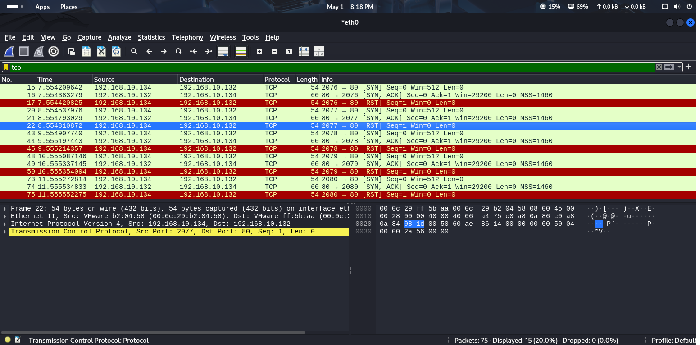

# 📘 DOS and DDOS Attack (서비스 거부 공격)

## 1. 개요

### 🔹 DOS (Denial of Service)
- **정의**  
  시스템에 악의적으로 과도한 트래픽이나 요청을 보내 **리소스를 고갈**시켜 서비스 제공을 방해하는 공격 방식입니다.

- **목적**  
  시스템의 정상적인 동작을 방해하여 **정상 사용자들이 서비스를 이용하지 못하게** 만듭니다.

- **공격 방식 예시**  
  - 특정 서버에 수많은 접속 요청을 보내 **서버의 TCP 연결 수를 고갈**
  - **트래픽 폭주**를 유도해 네트워크 자원 마비
  - 무한 루프나 대기 상태를 유발하는 요청 전송

- **주요 표적**
  - 은행, 결제 대행사(PG사), 루트 네임서버 등 **중요한 인터넷 기반 서비스**

- 🔗 [위키백과 - 서비스 거부 공격](https://ko.wikipedia.org/wiki/%EC%84%9C%EB%B9%84%EC%8A%A4_%EA%B1%B0%EB%B6%80_%EA%B3%B5%EA%B2%A9)

---

### 🔹 DDOS (Distributed Denial of Service)
- **정의**  
  **여러 대의 컴퓨터(좀비 PC)**를 이용해 동시에 하나의 서버를 공격하는 분산 서비스 거부 공격입니다.

- **특징**
  - 공격 규모가 크고 **방어가 매우 어려움**
  - **Botnet**을 이용해 공격을 수행
  - 공격자의 IP가 분산되어 있어 **추적이 어려움**

- **공격 사례**
  - **인터넷 포털 사이트 마비**
  - **금융기관 웹사이트 다운**
  - **게임 서버 장애 유발**

---

# 🔒 hping3를 이용한 포트 스캔 기반 DDoS Attack

## 📝 개요
- `hping3`는 **방화벽 우회, 포트 스캔, TCP/IP 테스트** 등을 지원하는 강력한 네트워크 도구입니다.
- DDoS 공격 시, **목표 서버의 열린 포트를 사전 탐색**하는 데 주로 사용됩니다.

---

## 🖥️ 실습 환경 (Host-only 구성)

| 역할        | 시스템           | IP 주소                            |
|-------------|------------------|-------------------------------------|
| Attacker    | Kali Linux       | 192.168.10.134, / C / 192.168.10.132 / 192.168.10.132      |
| Victim      | CentOS 7.9.2207  | 192.168.10.132, / C / 192.168.10.130,192.168.10.134 / 192.168.10.132                      |
| Zombie Bot  | Windows 10       | 192.168.10.130, / C / 192.168.10.132/ 192.168.10.132 / 192.168.10.132      |

> ※ 모든 시스템은 `192.168.10.0/24` 네트워크 대역에 존재하며, 가상 머신으로 구성됨.

---

## ⚙️ hping3 개요

- `hping3`는 일반 `ping`과 달리 **TCP/UDP/ICMP 패킷**을 자유롭게 생성할 수 있는 도구입니다.
- 기능:
  - **포트 스캐닝**
  - **MTU(Maximum Transmission Unit) 측정**
  - **방화벽 탐지 및 우회 테스트**
  - **DoS/DDoS 공격 시뮬레이션**

### 🔸 MTU란?
- MTU(Maximum Transmission Unit): 한 번에 전송 가능한 **최대 패킷 크기**
- **매체에 따라 값이 다르며**, MTU보다 큰 패킷은 분할(fragmentation)되어 전송됨

---

## 🛠️ 기본 사용법

```
hping3 [옵션] <대상 IP 주소>
```

실습 1. Kali → DNS 서버(192.168.10.132)로 포트 스캔 <br>
- 개요
    - TCP Sync 패킷을 보내면 'Sync/Ack'로 응답이 온다.
- 명령
- 결론
    - 동기 신호 전송(Sync) 후 반송(Sync/Ack)되면 TCP가 완료되고 다시 전송을 하기 위해 연결 준비 상태(RST, Connetction Reset)로 전환된다.<br>
    즉, 다음번 포트를 스캐닝하기 위해 리셋된다.<br>
    
