# 📘 HTTPS (SSL / TLS)

---

## 🔐 1. SSL / TLS

### 📌 개요
- **SSL/TLS**는 컴퓨터 시스템이 **인터넷에서 안전하게 통신**할 수 있도록 하는 **암호화 통신 프로토콜**이다.
- **SSL/TLS 인증서**는 웹 브라우저가 웹 사이트에 대해 **암호화된 네트워크 연결을 설정하고 신뢰할 수 있는지 확인**할 수 있게 해준다.
- 시스템 간의 ID를 확인하고, 안전한 통신을 위해 **암호화된 연결을 수립**한다.
- 결과적으로, **네트워크 통신을 보호하고** 인터넷 상의 웹 사이트 및 네트워크 리소스에 대한 **보안 연결을 보장**한다.

---

## 🌐 2. HTTPS (Hyper Text Transfer Protocol Secure)

### 📌 개요
- **IPSec**에서 CA 인증서를 참고로 확인하도록 한다.
- 일반적으로 공인된 인증 기관(CA)에서 **SSL 인증서**를 발급받아 PC 또는 서버에 설치하여 사용한다.
- **보안을 강화하기 위해 HTTPS 사용이 필수적**이다.
- 통신이 **암호화**되어 있기 때문에, **피싱 사이트나 악성 사이트**가 HTTPS를 사용하는 경우도 있어 **절대적인 신뢰 요소는 아님**.

---

### 🔍 HTTP vs HTTPS

| 구분 | HTTP | HTTPS |
|------|------|-------|
| 프로토콜 | HyperText Transfer Protocol | HyperText Transfer Protocol Secure |
| 보안성 | **평문(암호화 없음)**으로 전송됨 | **암호화된 통신**으로 전송됨 |
| 포트 번호 | 80번 | 443번 |
| 사용 목적 | 일반 웹사이트, 비로그인 페이지 등 | 로그인, 결제, 개인정보 전송 등 |
| 유사 사례 | **Telnet** (비암호화 원격접속) | **SSH** (암호화 원격접속) |

> 📌 **비유적 비교**  
> HTTP는 Telnet처럼 **보안이 없는 상태에서의 통신**에 해당하며,  
> HTTPS는 SSH처럼 **암호화를 기반으로 안전한 통신**을 제공함.

## 3. HTTPS(SSL/TLS) 구조

- HTTPS를 적용하기 위해서는 두 가지의 필수 조건(키, 인증서)이 있다.
- 키를 발급받기 위해서는 인증서를 키로 암호화해서 보관, 사용한다.


## 4. 🖥️ 실습 환경 (NAT 구성)

### ✅ Windows 10
- IP: `192.168.10.130`
- 게이트웨이: `192.168.10.2`
- DNS: `192.168.10.132`

### ✅ CentOS with DNS Server
- IP: `192.168.10.132`
- 게이트웨이: `192.168.10.2`
- DNS: `192.168.10.132`

## 5. 실습

### 패키지 설치
```
yum -y install openssl*
```
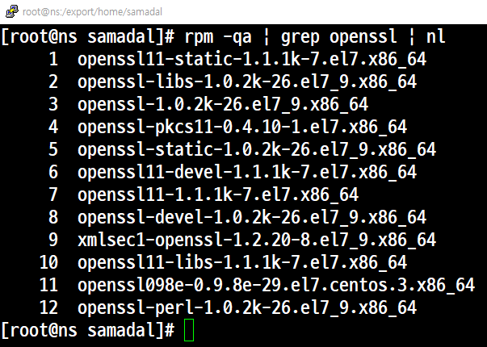

### 키 생성
```
cd /etc/pki/tls/certs/
```
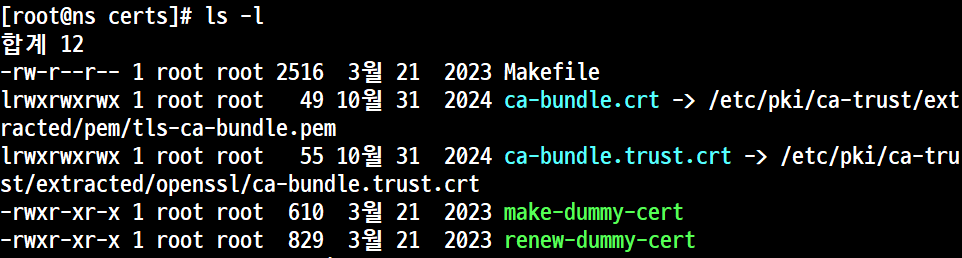

```
[root@ns certs]# openssl genrsa -out http.key 2048
Generating RSA private key, 2048 bit long modulus
.+++
...+++
e is 65537 (0x10001)
```

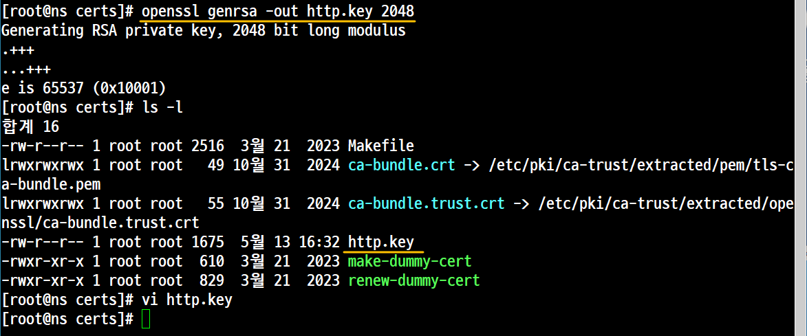

### 인증서 생성

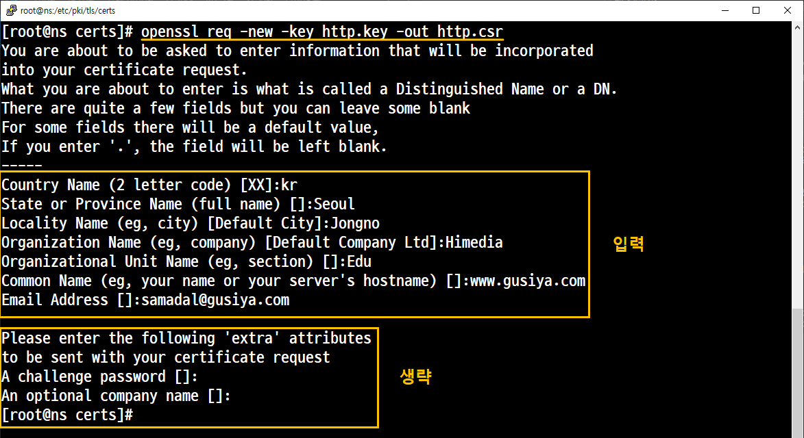


### 생성된 키와 인증서 병합

```
[root@ns certs]# openssl x509 -req -days 365 -in http.csr -signkey http.key -out http.crt
Signature ok
subject=/C=kr/ST=Seoul/L=Jongno/O=Himedia/OU=Edu/CN=www.gusiya.com/emailAddress=samadal@gusiya.com
Getting Private key
```

### SSL Module 설치 및 설정
```
yum -y install mod_ssl
```
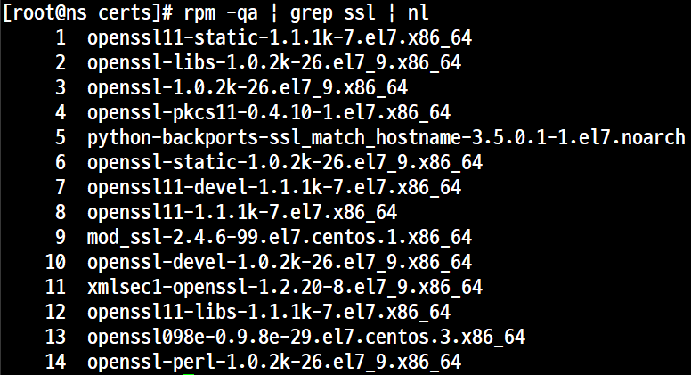

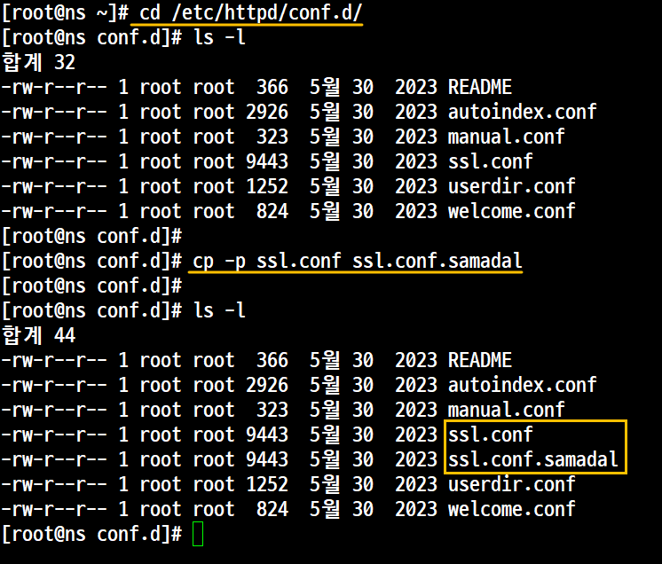

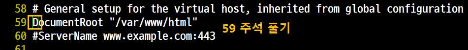

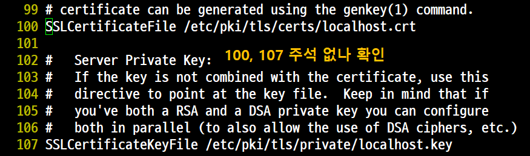

### 데몬 및 기타

```
systemctl restart httpd
```
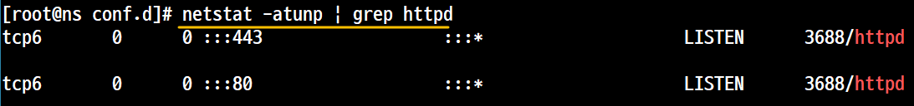

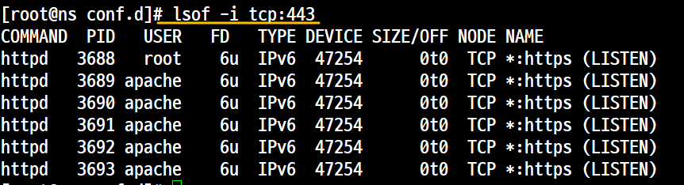


### 사이트 출력

#### 사이트 출력을 위한 기본 작업
>윈도우에서 네임서버 조회
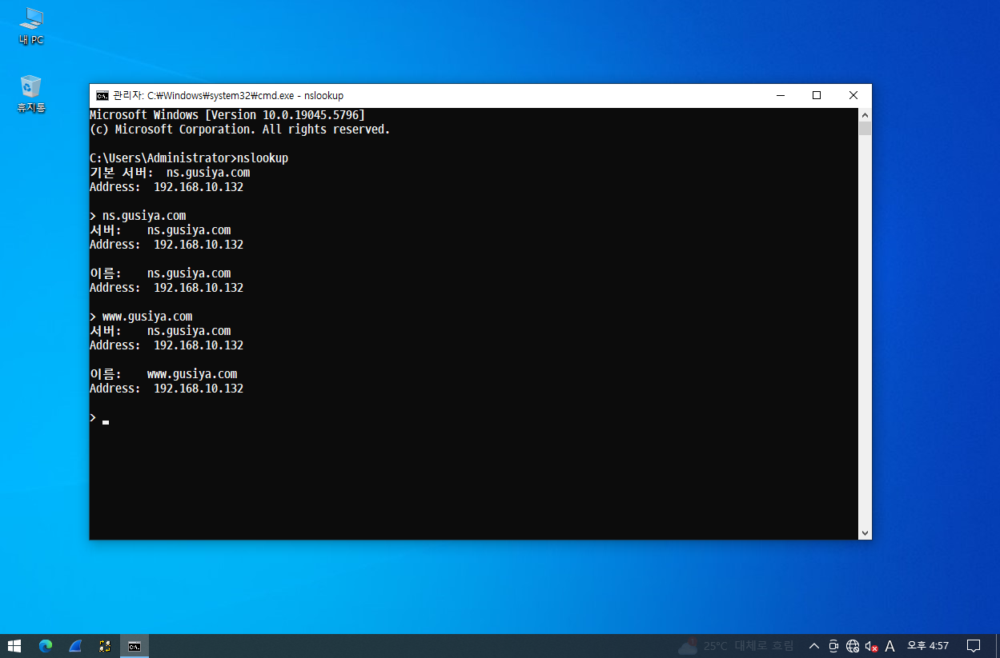

#### https 전용 포트(443) 추가

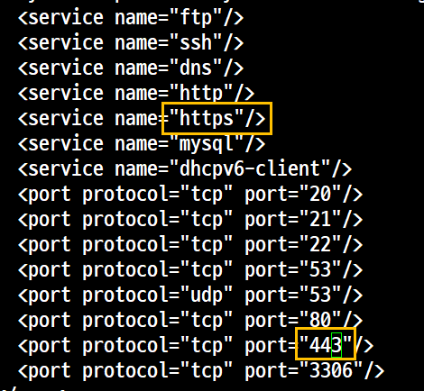
추가 후 데몬 재실행
```
firewall-cmd --reload
```

#### 사이트 출력 
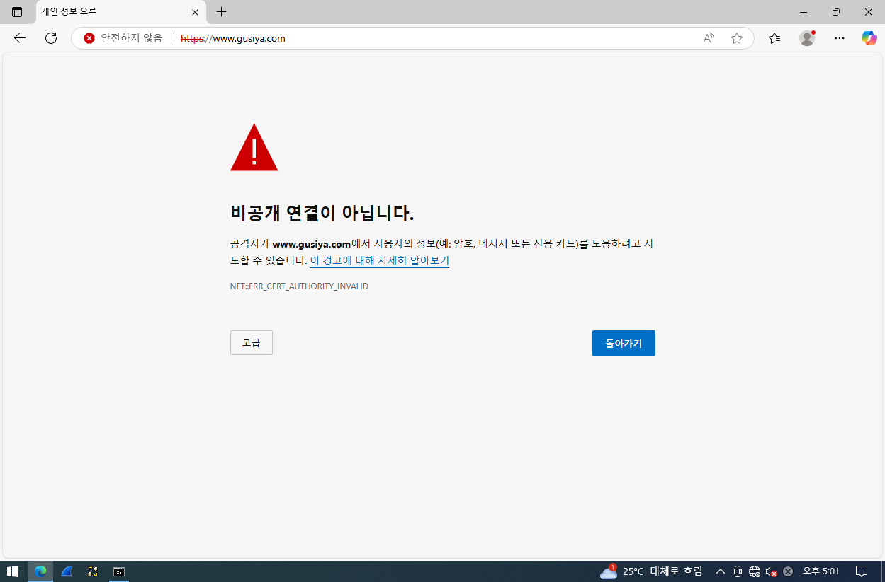

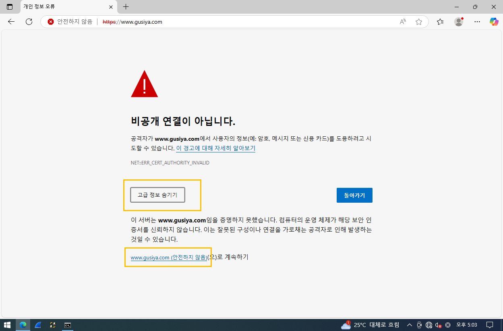

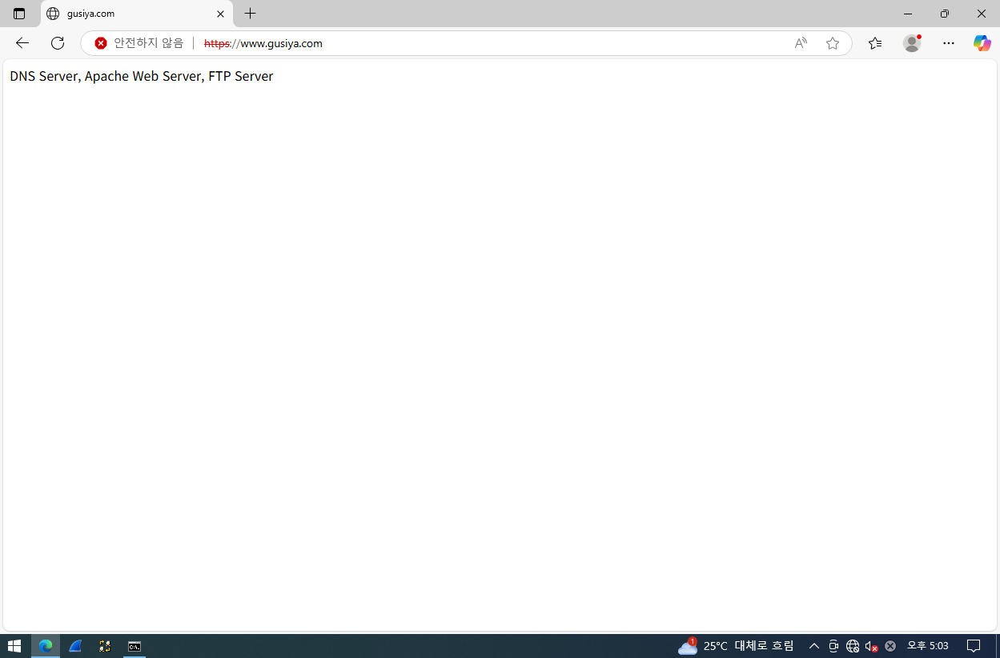

빨간줄은 상업용으로 구입해서 해결