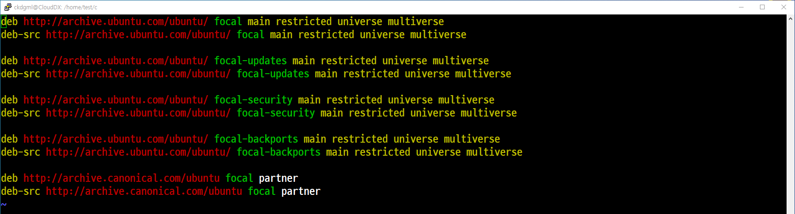
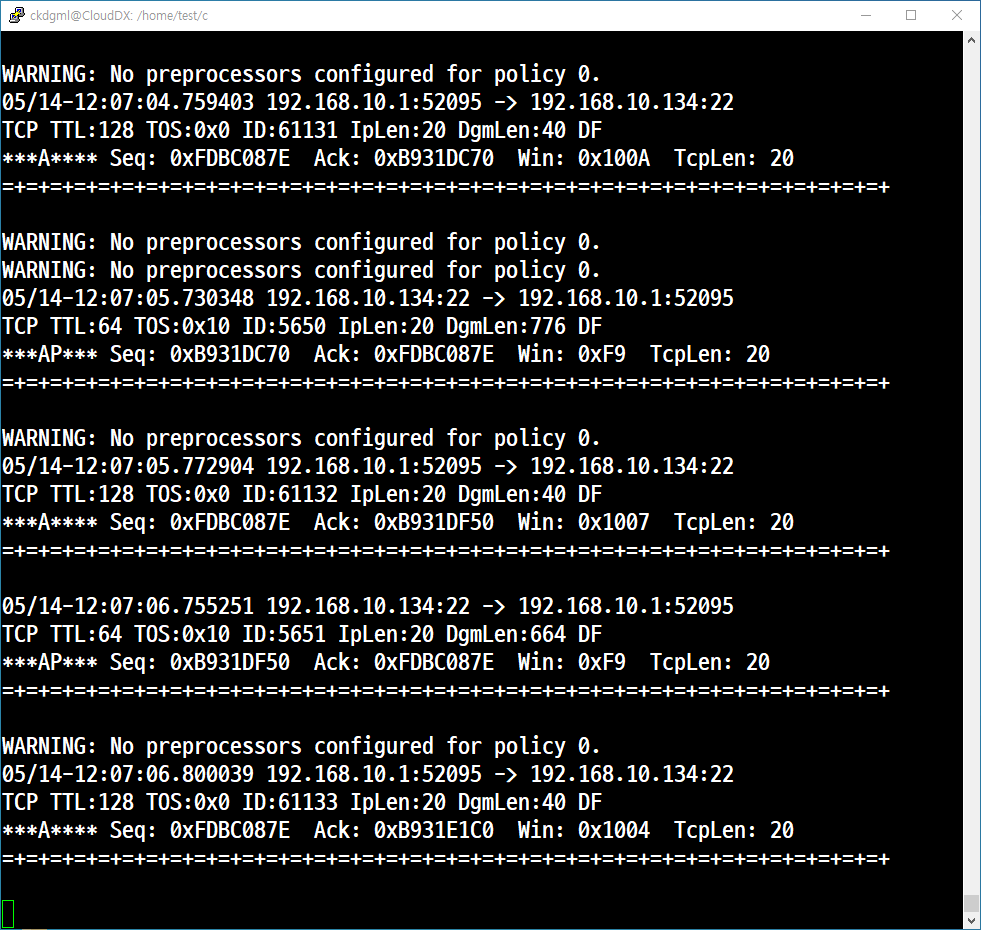
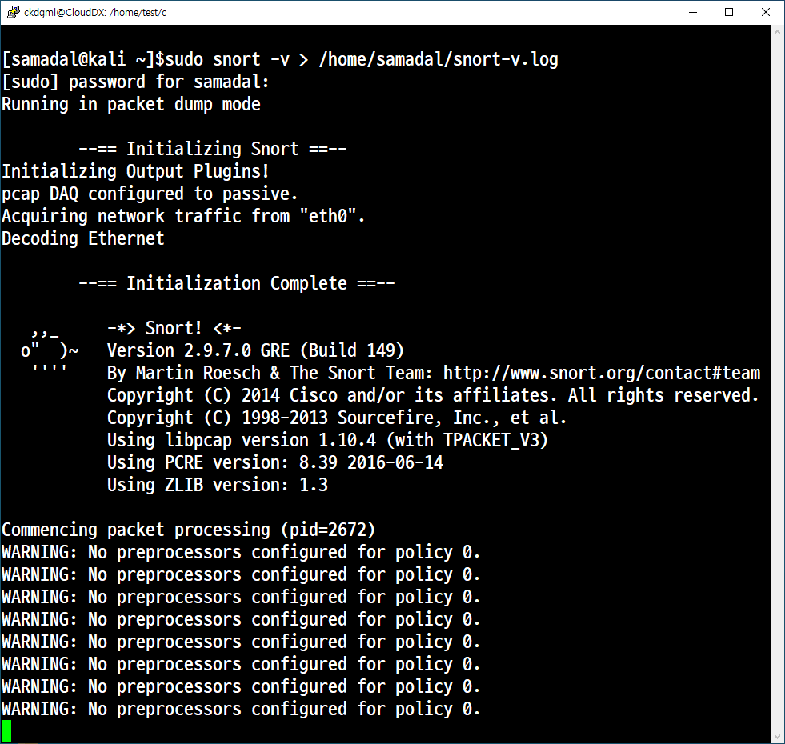
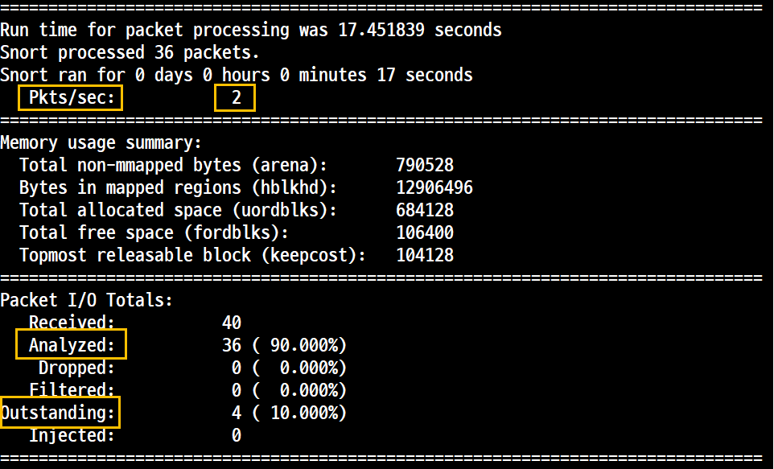
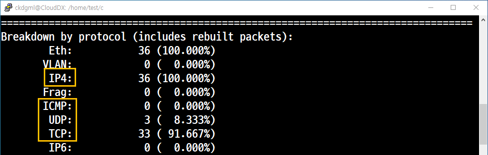
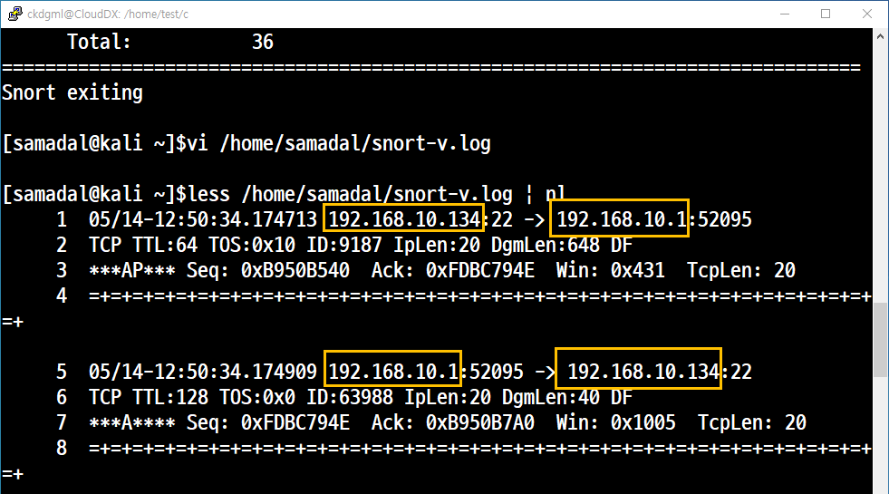
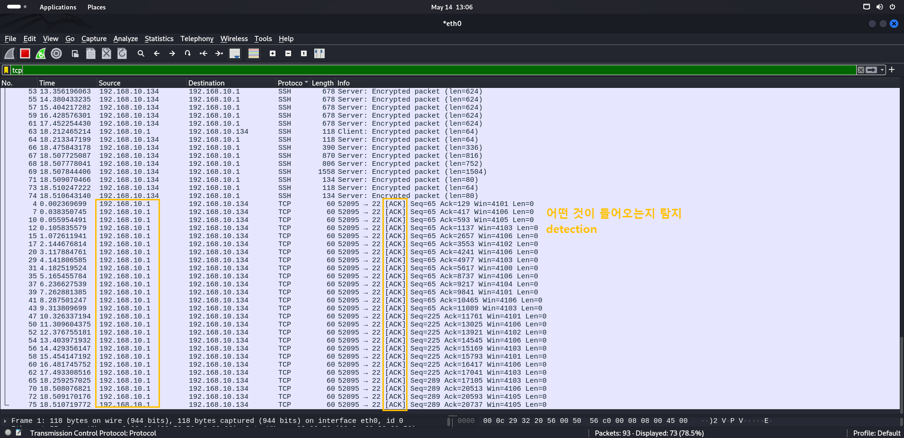
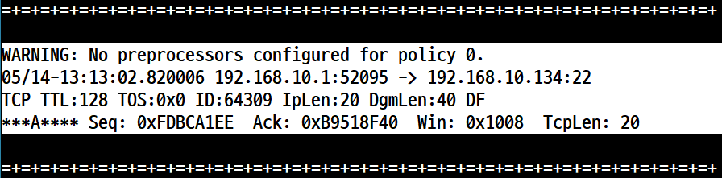

# 📘 IDS/IPS 

## 1. 개요

- 원래 목적은 트래픽 분산을 확인하고 사용하는 프로그램이다.
- 네트워크 침입 **차단** 시스템이면서 네트워크 침입 **탐지** 시스템의 표준이다.
- **Role(롤, 미리 정해 놓은 규칙)** 기반의 패턴 매치 기법이 추가되고 PCRE를 이용한 정규표현식을 지원하면서 IDS/IPS의 기술 표준으로 자리 잡았다. 

- Victim 시스템에 Snort를 설치하고 진행하는 kali를 이용한다.

## IDS / IPS
   

### IDS (Intrusion **Detection** System, 침입 탐지 시스템)

         
- 룰 기반의 패턴 매치 기법으로 악의적인 공격 시도를 **탐지**하여 내부 자산의 피해를 최소화하기 위한 시스템을 말한다.


### IPS (Intrusion **Protection** System, 침입 차단 시스템)
      
      
- IDS와 같이 패턴 매치 기법으로 공격을 탐지하고 **차단 및 방어** 기능도 포함한 시스템을 말한다.


### DAQ (Data Acquisition)       
- Data 수집

## 3. Snort

### 🖥️ 실습 환경 (NAT 구성)

### ✅ kali
- IP: `192.168.10.134`
- 게이트웨이: `192.168.10.2`
- DNS: `192.168.10.2`

kali update, upgrade를 해줌

kali는 기본적으로 Snort를 위한 저장소(Repository)가 없다. <br>
따라서 패키지를 이용해서 설치해 주면 된다.<br>
저장소(Repository) 파일 백업


```
[samadal@kali ~]$ sudo ls -l /var/lib/apt/lists
total 167812
drwxr-xr-x 2 _apt root     4096 Apr 28 04:10 auxfiles
-rw-r--r-- 1 root root   410588 Apr 17 05:04 http.kali.org_kali_dists_kali-rolling_contrib_binary-amd64_Packages
-rw-r--r-- 1 root root   528842 Apr 17 05:04 http.kali.org_kali_dists_kali-rolling_contrib_Contents-amd64.lz4
-rw-r--r-- 1 root root    41480 Apr 17 05:05 http.kali.org_kali_dists_kali-rolling_InRelease
-rw-r--r-- 1 root root 82282115 Apr 17 05:03 http.kali.org_kali_dists_kali-rolling_main_binary-amd64_Packages
-rw-r--r-- 1 root root 85869117 Apr 17 05:04 http.kali.org_kali_dists_kali-rolling_main_Contents-amd64.lz4
-rw-r--r-- 1 root root  1019653 Apr 17 05:04 http.kali.org_kali_dists_kali-rolling_non-free_binary-amd64_Packages
-rw-r--r-- 1 root root  1565188 Apr 17 05:04 http.kali.org_kali_dists_kali-rolling_non-free_Contents-amd64.lz4
-rw-r--r-- 1 root root    39841 Apr 17 05:04 http.kali.org_kali_dists_kali-rolling_non-free-firmware_binary-amd64_Pack                      ages
-rw-r--r-- 1 root root    41083 Apr 17 05:04 http.kali.org_kali_dists_kali-rolling_non-free-firmware_Contents-amd64.lz 
```

```
[samadal@kali ~]$ sudo find /var/lib/apt/lists -type f -exec rm {} \;  -----> 제거

[samadal@kali ~]$ sudo ls -l /var/lib/apt/lists
total 8

drwxr-xr-x 2 _apt root 4096 Apr 28 04:10 auxfiles
drwx------ 2 _apt root 4096 May 13 17:56 partial
```

#### 소스 파일(sources.list) 생성 및 내용 입력

[samadal@kali ~]$ sudo vi /etc/apt/sources.list


```
deb http://archive.ubuntu.com/ubuntu/ focal main restricted universe multiverse
deb-src http://archive.ubuntu.com/ubuntu/ focal main restricted universe multiverse

deb http://archive.ubuntu.com/ubuntu/ focal-updates main restricted universe multiverse
deb-src http://archive.ubuntu.com/ubuntu/ focal-updates main restricted universe multiverse

deb http://archive.ubuntu.com/ubuntu/ focal-security main restricted universe multiverse
deb-src http://archive.ubuntu.com/ubuntu/ focal-security main restricted universe multiverse
   
deb http://archive.ubuntu.com/ubuntu/ focal-backports main restricted universe multiverse
deb-src http://archive.ubuntu.com/ubuntu/ focal-backports main restricted universe multiverse

deb http://archive.canonical.com/ubuntu focal partner
deb-src http://archive.canonical.com/ubuntu focal partner
```

#### 지정된 공개 키 추가
```
sudo apt-key adv --keyserver keyserver.ubuntu.com --recv-keys 3B4FE6ACC0B21F32
sudo apt-key adv --keyserver keyserver.ubuntu.com --recv-keys 871920D1991BC93C
```
#### 패키지 설치를 위한 저장소 갱신 및 패키지 설치
```
sudo apt update
sudo apt install snort
```
#### 확인


## 실습

### Snort 주요 옵션 정리

| 옵션         | 의미        | 설명                                                                 |
|--------------|-------------|----------------------------------------------------------------------|
| `-d`         | Decode      | 패킷의 해독된 내용(페이로드)도 함께 출력                             |
| `-e`         | Ethernet    | Ethernet 헤더(MAC 주소 포함)도 출력                                  |
| `-v`         | Validated   | 간단한 검증 모드(패킷 요약 출력)                                     |
| `-V`         | Version     | Snort 버전 정보 출력                                                 |
| `-l <경로>`  | Log         | 로그 파일 저장 디렉토리 지정                                         |
| `-n <숫자>`  | Number      | 캡처할 패킷 수 지정                                                  |
| `-h <CIDR>`  | Host        | 내부 네트워크 대역 지정 (예: `192.168.1.0/24`)                        |
| `-A`         | Alert       | 경고(Alert) 생성 모드로 실행                                         |
| `-b`         | Binary      | `tcpdump`와 호환되는 바이너리 로그 형식으로 저장                    |

---

### 예제 1. 버전 확인 

```
[samadal@kali ~]$sudo snort -V

   ,,_     -*> Snort! <*-
  o"  )~   Version 2.9.7.0 GRE (Build 149)
   ''''    By Martin Roesch & The Snort Team: http://www.snort.org/contact#team
           Copyright (C) 2014 Cisco and/or its affiliates. All rights reserved.
           Copyright (C) 1998-2013 Sourcefire, Inc., et al.
           Using libpcap version 1.10.4 (with TPACKET_V3)
           Using PCRE version: 8.39 2016-06-14
           Using ZLIB version: 1.3

```
### 예제 2. 패킷 헤더 확인
**IP와 TCP/UDP/ICMP의 헤더를 확인한다.**


```
sudo snort -v
```

**관리자 권한으로 하지 않을 시 오류**
```
[samadal@kali ~]$snort -v
Running in packet dump mode

        --== Initializing Snort ==--
Initializing Output Plugins!
pcap DAQ configured to passive.
Acquiring network traffic from "eth0".
ERROR: Can't start DAQ (-1) - socket: Operation not permitted!
Fatal Error, Quitting..

```


```
sudo snort -v > /home/samadal/snort-v.log
less /home/samadal/snort-v.log
```



#### Pkts/sec (초당 전송되는 패킷 수)
#### Analyzed (패킷 입출력에서의 탐지율 분석)
#### Outstanding (4개는 두드러진 특징을 갖고 있다고 분석)


#### IP4 / TCP / UDP / ICMP (탐지율)



#### 192.168.10.1 은 DHCP

#### 샥스핀을 이용한 패킷 분석




### 예제 3. 패킷 헤더 확인 (-d)

IDS가 동작하고 있으며 외부로 부터 들어오는 패킷을 탐지하고 있다. <br>
내부에서 외부로 나가는 패킷을 해독된 상태로 출력을 한다.<br>
'출력이 해독' 되었다는 것은 문제를 드러내는 것과 동일하지만 여기서는 전혀 문제가 되지 않는다. 왜? 외부로 나가는 것은 IDS와 무관하기 때문이다. 즉, 침입이 아니기 때문이다.




