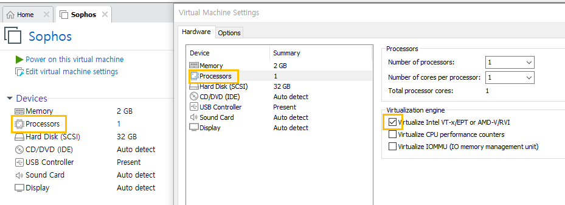

# 🛡️ IPS (Intrusion Prevention System)
## 📌 개요

- 'Sophos'사에서 리눅스 커널을 이용해서 만든 **UTM(Unified Threat Management) 장비**를 말한다.
- **IPS(침입차단시스템), IDS(침입탐지시스템), Anti Virus, Firewall, VPN** 등의 보안 기능 중 최대 **8개** 정도를 **하나의 프로그램에 통합**한 통합 보안 장비이다.
- 보안 사고를 예방하고 신속히 대응하며, **보다 쉽게 보안 관리를 가능하게** 하기 위해 기존 보안 제품을 통합한 장비이다.
- 통합 보안 관리 장비로서 **UTM(Security Management)** 의 역할을 수행한다.
- 특히 **방화벽** 성격이 강해 `Sophos UTM Firewall`이라고도 불린다.

---

## ✅ 장점

- 여러 보안 기능을 하나의 시스템에 통합함으로써 **관리 편의성**이 뛰어남
- 보안 사고에 **신속히 대응** 가능
- **복합적인 보안 위협에 효과적으로 대응**

---

## ❌ 단점

- 다양한 보안 기능을 하나로 통합했기 때문에 **개별 장비 대비 성능은 떨어질 수 있음**
- **고성능 네트워크 환경**에서는 병목이 생길 가능성 존재

## ⚙️ IPS 주요 기능 (Unified Threat Management 기능 구성)


### 🔒 Firewall

- **Stateful Packet Inspection (SPI)** 기반의 방화벽
- SMTP, HTTP, POP3, DNS, Proxy 기능 통합
- 견고한 네트워크 보안 구성

---

### 🔐 VPN

- **IPsec VPN** (DES / 3DES 지원)
- **L2TP VPN** 지원

---

### 🛡️ 침입 방지 / 침입 탐지 시스템

#### IPS (Intrusion Prevention System)
#### IDS (Intrusion Detection System)

- 다양한 **네트워크 기반 공격** 탐지 및 차단
- 다양한 **애플리케이션 기반 공격** 탐지 및 차단
- **이상 행위 탐지(Anomaly Detection)**
- **DoS / DDoS / Scan Attack** 기반 공격 탐지 및 차단

---

### 🦠 Anti Virus

- 이메일 기반 **내·외부 유입 바이러스** 탐지 및 차단
- 웹 기반 **내·외부 유입 바이러스** 탐지 및 차단

---

### 📩 Anti-Spam

- **Bayesian 알고리즘** 기반 스팸 메일 탐지 및 차단
- **점수(Score) 데이터 기반** 스팸 메일 탐지 및 차단

---

### 🚫 Content Filtering

- **유해 사이트 차단**
- **정책 위배 웹사이트** 접근 탐지 및 차단

---

### 🔍 Scan Attack 탐지 및 차단

- Scan Attack 유형의 공격을 감지하고 차단

---

### 🧩 기타 기능

- **Transparent / Router / NAT 모드** 지원
- **피싱 차단**, **SIP Proxy 기능** 제공

## 5. **Sophos UTM (Unified Threat Management, 통합 위협 관리)** 


### 작업

#### [다운로드](https://www.sophos.com/en-us/support/downloads/utm-downloads)
#### 네트워크 어뎁터 설정
 - VMNet1 (Internal)
 - VMNet2 (DMZ)
 - VMNet3 (External)


#### 시스템 구성 1. 기본 설정


#### 시스템 구성 2. 세부 설정




#### 설치


#### [접속 호스트](https://192.168.1.100:4444)


**옵션**


### 중요한 서비스 메뉴 구성
- Network Protection
    - NAT, Firewall, Application Services(FTP, HTTP, ...)


- Web Protection
    - Client를 외부로부터 보호하는 역할(사용자 보호, Web Server 보호 대상 제외)
    - UTM 장비 필터링, 검사 (ACL 유사)


- Webserver Protection
    - Web Hacking 방어 용도


### 네트워크

### Step 1. **Dashboard**를 클릭한 후 우측에 있는 **Interfaces**의 목록을 확인한다.
    - 기본적으로 **VMnet1**만 **활성화** 되어 있다.

### Step 2. **Interface** 추가

- **Interfaces & Routing** 하단에 있는 **Interfaces**를 클릭한다.
- 우측에 있는 **Interfaces** 탭 하단에 있는 **New Interface...** 를 클릭한다.
 


- Internal (기본값으로 잡혀 있기 때문에 확인한다.)
    - Name(Internal) / Type(Ethernet) / Hardware(eth0) / IP(192.168.1.100/24)

- DMZ
    - Nme(DMX) /Type(Ethernet) / Hardware(eth1) / IP(192.168.2.254/24)

- External
    - Nme(External) /Type(Ethernet) / Hardware(eth2) / IP(192.168.3.253/24)

- **활성화** 단추를 클릭한 후 **초록색** 으로 바뀌는 것을 알 수 있다.
- **VMWare** 에 출력되어 있는  **UTM** 가상머신에서 **root/P@ssw0rd**를 입력한다.
- **ifconfig** 명령어로 네트워크 정보를 확인한다.

 
### Step 3. 외부망과의 통신 설정
- 현재 **/etc/resolv.conf**에는 **Loopback Address**인 **127.0.0.1**로 잡혀있다.
- **1st. Super DNS 주소**인 **168.126.63.1**로 변경한다.
- 테스트 1. **ping 8.8.8.8** 또는 **ping google.com**
    - **connect: Network is unreachable**이 출력된다.


web 말고 VMWare 먼저 접속시 초기설정 바로 진행


vi /etc/resolv.conf<br>
super dns


```
route add default gw 192.168.10.2 eth2
```
ping 확인


