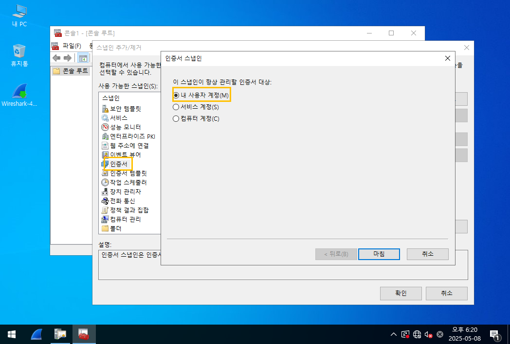

# 📘 IPSec (Internet Protocol Security)

## 1. 개요

> 🔐 **IPSec은 OSI 7계층 중 3계층(네트워크 계층)에서 동작하는 암호화 프로토콜입니다.**

- 서버 간 데이터 교류 중 **전송되는 패킷을 암호화**하여 **보안 위협으로부터 보호**합니다.
- **안전하지 않은 네트워크에서도** 두 컴퓨터 간 **안전한 통신을 보장**합니다.
- IPSec은 하나의 프로토콜이 아닌, **보안 통신을 위한 프로토콜들의 집합**입니다.

---

## 2. IPSec 사용이 필요한 이유

> 🛡️ **네트워크 공격(특히 스니핑, MITM 공격)을 방어하기 위해 사용됩니다.**

- `Wireshark` 같은 툴로 네트워크 트래픽을 **실시간으로 엿볼 수 있음**
- 허브 환경에서는 **중간자 공격(MITM)** 성공 시, 패킷 내용을 **그대로 탈취 가능**
- 암호화되지 않은 트래픽은 **개인정보 유출**로 이어질 수 있음

💡 따라서, IPSec을 사용하여 패킷을 암호화하면 **데이터를 안전하게 보호**할 수 있습니다.

---

## IPSec이 제공하는 보안 기능

| 기능 | 설명 |
|------|------|
| **AH** (Authentication Header) | ✔️ 무결성 보장 ✔️ 출처 인증 ❌ 데이터 기밀성은 보장하지 않음 |
| **ESP** (Encapsulating Security Payload) | ✔️ 무결성 + 기밀성 모두 보장 ✔️ 데이터 암호화 ✔️ 리플레이 공격 방지 |

📌 **ESP는 실질적인 암호화 + 무결성을 동시에 제공**하여 보안 수준이 높습니다.

---

## ✅ 정리

- IPSec은 **암호화 + 인증** 기능을 제공하는 **네트워크 보안 핵심 기술**
- 외부로부터의 **스니핑, 패킷 변조, 도청 공격을 방지**
- 실제로 VPN, 기업 내부망 보안 등에 널리 활용됨

## ✅ IPSec는 3가지만 알면 끝!

---

### 1. 적용 환경에 따른 구성 (2가지)

| 구성 방식       | 설명                         |
|----------------|------------------------------|
| **Host to Host** | 시스템 간 1:1 통신 구성       |
| **Site to Site** | 네트워크 간 N:N 통신 구성    |

📌 Host 간 직접 통신이 필요한 경우와  
VPN처럼 네트워크 단위 연결이 필요한 경우로 나뉩니다.

---

### 2. 방화벽 작동 유무에 따른 구성 (2가지)

| 방화벽 상태                    | 설정 방식                                 |
|-------------------------------|-------------------------------------------|
| **방화벽 미작동**             | `로컬 보안 정책` 설정 (`secpol.msc`) 사용 |
| **방화벽 작동 중**            | `고급 보안이 포함된 Windows 방화벽` (`wf.msc`) 사용 |

📌 보안 정책 설정 위치가 방화벽 상태에 따라 달라지므로 구분해서 적용해야 합니다.

---

### 3. 규칙 적용 방식 (3가지)

| 방식           | 설명                               |
|----------------|------------------------------------|
| **PSK 방식**     | 사전 공유 키(Pre-Shared Key)를 이용한 인증 |
| **Kerberos 방식** | Active Directory 기반 사용자 인증     |
| **CA 인증 방식**  | 인증기관(Certificate Authority)을 통한 공개키 인증 |

📌 보안 수준에 따라 적절한 인증 방식을 선택합니다.  
(공식 환경에서는 보통 **CA 인증 방식**을 권장)

---

## 4. 실습 1. PSK

---

### ✅ 예제 개요

- **실습 목표**: IPSec을 활용한 사전 공유 키(PSK) 기반의 Host-to-Host 보안 통신 구성
- **시스템 구성**:
  - `SRV100`: Windows Server 2022
  - `Client100`: Windows 10
- **환경 조건**:
  - 통신 방식: **Host to Host (HtoH)**
  - 방화벽: **비활성화 (wf.msc ❌)**
  - 인증 방식: **PSK (Pre-Shared Key)**

---

### 🔁 사전 확인

- SRV100 <-> Client100 간 **ping 테스트로 통신 가능 여부 확인**

---

### ⚙️ 보안 정책 설정: `secpol.msc`

> `시작 > 실행 > secpol.msc` 실행 후 아래 절차대로 진행

#### 1. 보안 정책 생성

- `IP 보안 정책` > 우클릭 > **"IP 보안 정책 만들기"**
- 이름: `IPSec_PSK_Test`
- 마법사 진행

 

 
 
 
 
 

---

### 📍 IP 필터 목록 생성

- 새 필터 목록 추가  
- **Source**: 상대 시스템의 IP  
- **Destination**: 내 IP

 

 
 
→ 설정 완료 시 상태 화면:

 

- [새 IP 필터 목록] 버튼 클릭

 

---

### 🔧 필터 동작 구성

> 필터 동작: `요구 보안` 또는 `협상`

 

 
 
 
 

---

### 🔑 인증 방법 설정 (PSK)

- 사전 공유 키 입력: 예) `1234`

 

 
 

---

### 🧪 테스트 절차

#### ✅ 테스트 1: 정책 적용 전

- Wireshark(샥스핀) 실행 → **ICMP 패킷 노출됨**
  
   

---

#### ✅ 정책 설정 및 적용

- **SRV100**: 위와 같이 정책 생성 완료
- **Client100**: 동일 방식으로 동일 정책 생성
   

- 생성한 보안 정책 우클릭 → **[할당] 선택**
- 할당 여부가 `예`로 변경되어야 함
   

- **Client100**에서도 동일하게 적용

---

#### ✅ 테스트 2: 정책 적용 후

- 다시 Wireshark(샥스핀) 실행

- `ping` 명령으로 통신 확인

   

- Client100에서 Wireshark로 확인

   

---

### ✅ 정리

| 항목       | 결과 및 상태                     |
|------------|----------------------------------|
| ping       | 정상 작동                        |
| 보안 정책 | 할당 상태로 변경됨 (`예`)         |
| Wireshark | 암호화된 ESP 패킷 확인 가능 여부   |
---

## 4. 실습 2. PSK – 예제 2

---

### ✅ 예제 개요

- **실습 목표**: 여러 시스템 간 IPSec 정책의 활성화 유무에 따른 통신 보안 상태 확인
- **시스템 구성**:
  - `SRV100`: 정책 설정 시스템
  - `Client100`: ping 요청 송신자
  - `SRV200`: 중간 서버
  - `Client200`: ping 수신자

---

### 🧩 환경 요약

| 항목             | 값                               |
|------------------|----------------------------------|
| 통신 방식        | Host to Host (HtoH)              |
| 방화벽 상태      | 비활성화 (`wf.msc ❌`)            |
| 인증 방식        | PSK (Pre-Shared Key)             |
| 정책 할당 상태   | **초기에는 비활성화 상태로 유지** |

- `예제 1`과 동일한 방식으로 정책은 설정하되, **'할당'은 하지 않음**

---

### 🧪 테스트 1: 정책 비할당 상태에서의 통신

> 🔍 Client100에서 ping 전송  
> Wireshark(샥스핀)으로 나머지 세 시스템(SRV100, SRV200, Client200)에서 패킷 모니터링

📸 캡처 예시:

 
 
 
 

📌 결과:

- **SRV100, SRV200, Client200**의 모든 지점에서 `ICMP 패킷`이 그대로 보임
- 암호화 되지 않은 상태에서 통신이 발생함

---

### ✅ 정책 할당 진행

- `secpol.msc` → 보안 정책 우클릭 → **[할당] 클릭**
- **SRV100, SRV200에만 정책을 할당**
- Client100, Client200은 **정책 비할당 상태 유지**

📸 캡처 예시:

 
 
---

### 🧪 테스트 2: 정책 할당 후 통신

> 🔍 Client100 → Client200으로 ping 전송  
> 모든 시스템에서 샥스핀 실행

📌 결과:

| 구간           | 보이는 프로토콜     |
|----------------|---------------------|
| **SRV100 ↔ SRV200** | `ESP` (암호화된 통신) |
| **SRV200 ↔ Client200** | `ICMP` (암호화되지 않음) |

📸 추가 확인:
 
 
 
 

📌 참고:

- 상황에 따라 `ISAKMP` 프로토콜이 나타날 수도 있음  
  (→ 키 교환 단계에서 사용하는 보안 프로토콜)

---

### ✅ 정리 요약

| 항목                    | 결과                                |
|-------------------------|-------------------------------------|
| 정책 비할당 상태       | 모든 구간에서 `ICMP` 평문 통신 노출 |
| SRV100, SRV200 정책 할당 | 해당 구간에서 `ESP` 암호화 적용됨   |
| Client200 정책 없음     | 평문 `ICMP` 노출 유지                |
| 특별사항               | `ISAKMP` 등장 시, 키 교환 확인 가능 |

예제 3. PSK

- 시스템 구성 (SRV 100, Client 100)
- 환경 구성 (H to H, wf(O), PSK)
- 설정
테스트 1. 샥스핀에 올라온 Protocol을 확인한다.
- client100으로 'ping' 을 때리고 SRV100, SRV200

## 4. 실습 4. PSK – 예제 4 (Site to Site)

---

### ✅ 예제 개요

- **실습 목표**: Site-to-Site 방식에서 PSK 인증을 사용한 IPSec 정책 구성
- **시스템 구성**:
  - `SRV100`: 본사 시스템
  - `Client100`: 지사 시스템
- **환경 조건**:
  - 통신 방식: **Site to Site (S to S)**
  - 방화벽 상태: **활성화 (wf.msc ✔️)**
  - 인증 방식: **PSK (Pre-Shared Key)**

---

### ⚙️ 설정 과정

#### 1. 고급 보안이 포함된 Windows 방화벽 실행

> `wf.msc` → [Windows 방화벽 고급 보안] 콘솔에서 설정 시작

📸 설정 화면:

 
 

---

#### 2. 새 규칙 만들기 (3단계 눌러 진행)

 
 
 
 
 
 
 
 
 
 

---

### 🧪 결과 확인

#### 🔍 정책 설정 후 통신 결과

- ping, 파일 공유, RDP 등 테스트
- Wireshark(샥스핀)으로 패킷 캡처

📸 암호화 적용 결과:

 
 

---

### ✅ 정리 요약

| 항목            | 결과 및 상태                           |
|-----------------|----------------------------------------|
| 구성 방식       | Site to Site (Gateway 간 통신 보호)     |
| 방화벽 상태     | 활성화 (`wf.msc`에서 규칙 설정 필요)     |
| 인증 방식       | PSK (사전 공유 키 사용)                |
| 통신 결과       | ESP 암호화 프로토콜 정상 적용됨         |
| 관리 도구       | `고급 보안이 포함된 Windows 방화벽` 사용 |

## 5. 실습 2. kerberos (생략)

## 6. 실습 3. CA 인증서

시스템 구성
- SRV100 (인증기관, 인증서 발급)
- Client100 (인증서 요청)
- SRV100
    - 인증기관 설치
---

### ✅ 실습 개요

- **목표**: SRV100에 인증기관(CA, Certificate Authority)을 설치하여 IPSec 구성 시 **공식 인증 방식 사용**
- **시스템 구성**:  
  - `SRV100` : 인증기관 역할 수행 (CA 서버로 동작)

---

### 🏗️ CA 인증기관 설치 과정 (SRV100)

#### 1. `서버 관리자` 실행

> 시작 메뉴 → **[서버 관리자]** 실행

---

#### 2. [역할 및 기능 추가] 클릭

- 시작 화면에서 **[역할 및 기능 추가]** 선택
- 이후 **"다음"** 3번 클릭하여 진행

 

---

#### 3. 인증기관 역할 선택

- **"인증 기관"**, **"인증 기관 웹 등록"** 체크
- 기능 추가 메시지에서 → **[기능 추가] 클릭**

📸 예시:

 

---

#### 4. 다음 → 설치 진행

- 요약 화면 확인 후 → **[설치] 클릭**
 

- 설치가 완료되면 재부팅 없이 바로 구성 가능

 
 
 
 
 
 
 

## 인증서 환경설정
- 윈도우 알
- mmc(Microsoft Management Console)

 
 
 
 

