# Password Cracking

# 🖥️ 실습 환경 (NAT 구성)

### ✅ Windows 10
- IP: `192.168.10.130`
- 게이트웨이: `192.168.10.2`
- DNS: `192.168.10.2`

### ✅ Kali(Attacker)
- IP: `192.168.10.128`
- 게이트웨이: `192.168.10.2`
- DNS: `192.168.10.2`

## 🔐 John the Ripper - 개요

- **알파벳, 숫자 조합 또는 단어 조합** 등을 이용하여 **무차별 대입 공격(Brute-force attack)** 방식으로 패스워드를 크래킹한다.
- **무료이자 오픈소스 소프트웨어**이며,  **유료 버전은 _John the Ripper Pro_** 가 존재한다.
- **가장 많이 사용되는 패스워드 크래킹 도구** 중 하나이다.
- **Unix, Linux, Windows 등 다양한 플랫폼**에서 사용 가능하다.
- **오프라인 기반 크래킹 도구**로, 수집된 해시 값을 분석하여 비밀번호를 찾아낸다.
- Kali Linux의 **주 메뉴에 'John'이 포함**되어 있으며, **20.x 버전부터는 'Johnny'(GUI)는 제외**되었다.
  - 필요시 별도로 설치 가능


## 🧪 실습 1. 'Windows 10' 환경에서 John the Ripper 사용

### 📌 1. Administrator 비밀번호 지정 - 컴퓨터 관리에서 설정
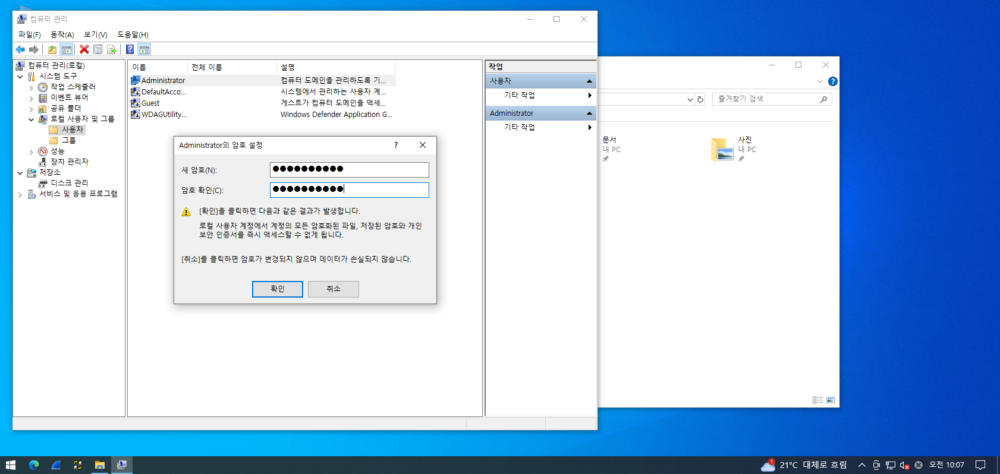

---

### 🔗 2. John the Ripper 공식 사이트 접속
> https://www.openwall.com/john/
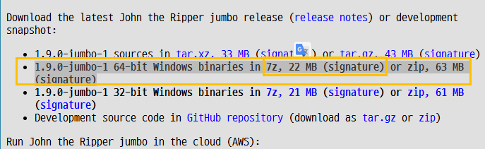

```
john-1.9.0-jumbo-1-win64
```

---

### 📦 3. Cracking 준비
- 다운로드 받은 파일(`john...zip`)을 **Windows로 이동한 후 압축을 해제**한다.
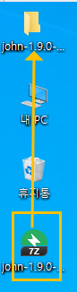

---

### 📁 4. 'run' 폴더로 이동 후 설정
- 압축 해제 후 `run` 폴더로 이동
- 내부의 **`password.lst` 파일의 복사본**을 만들어 둔다.
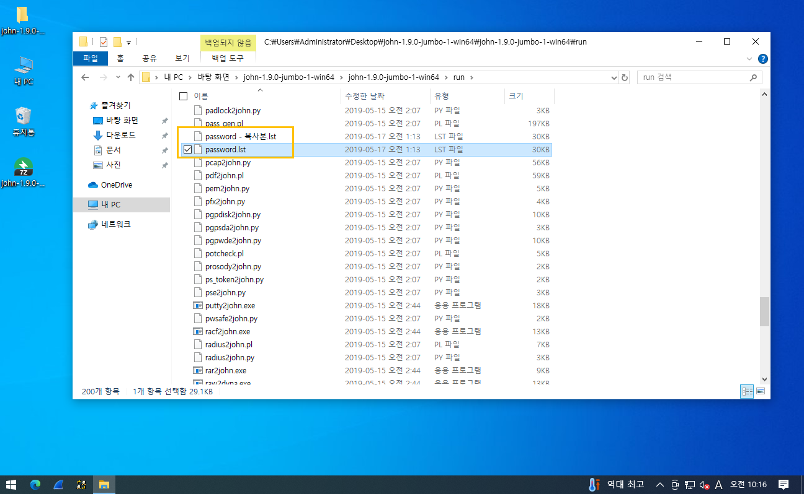

---

### 📝 5. 비밀번호 삽입
- 복사한 `password.lst` 파일을 메모장으로 열기
- 문서의 **맨 위에 administrator의 비밀번호를 입력하고 저장**
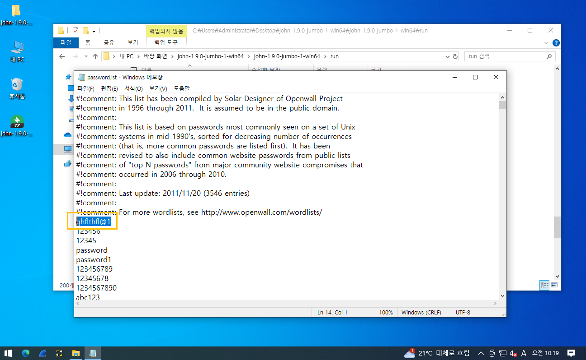

```
C:\Users\Administrator\Desktop\john-1.9.0-jumbo-1-win64\john-1.9.0-jumbo-1-win64\run>john password.lst
Using default input encoding: UTF-8
Loaded 5 password hashes with no different salts (tripcode [DES 256/256 AVX2])
Warning: poor OpenMP scalability for this hash type, consider --fork=2
Will run 2 OpenMP threads
Proceeding with single, rules:Single
Press 'q' or Ctrl-C to abort, almost any other key for status
Almost done: Processing the remaining buffered candidate passwords, if any.
Proceeding with wordlist:password.lst, rules:Wordlist
Proceeding with incremental:ASCII
Warning: MaxLen = 13 is too large for the current hash type, reduced to 8
```

## 🧪 실습 2. 'Kali' 환경에서 John the Ripper 사용

### 사용자 생성 (3개)

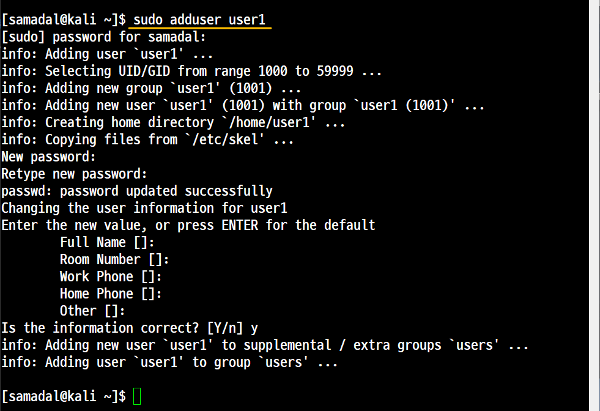
```
sudo adduser
```
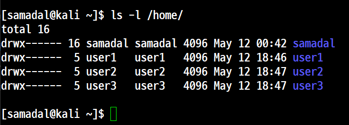

```
/etc/shadow 파일 복사
```

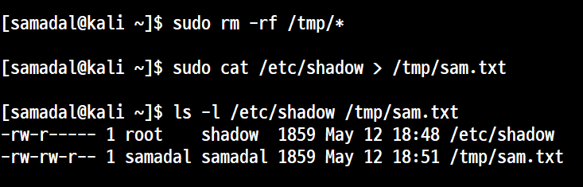


## 필드분석

비밀번호
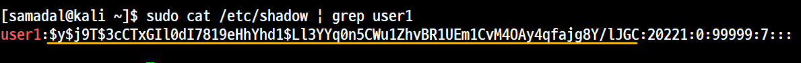

| 구성 요소 | 설명 |
|-----------|------|
| `$y`      | **HashID** |
| `$j9T`    | **Salt** |
| `$3cCTxGIl0dI7819eHhYhd1$Ll3YYq0n5CWu1ZhvBR1UEm1CvM4OAy4qfajg8Y/lJGC` | **Hash Value** |

---

### 🔍 설명

#### 🔸 HashID (`$y`)
- `Identifier(인식자)`에 따라 어떤 **Hash Scheme(구조)**를 사용하는지 식별한다.
- 여기서 사용되는 해시 함수는 **무결성(integrity)**을 보장하며, **복호화가 불가능한** 암호화 방식이다.

#### 🔸 Salt (`$j9T`)
- **해시 속도를 빠르게 하기 위해** 사용되는 임의의 문자열.
- 해시된 패스워드를 빠르게 크랙하기 위해 사용하는 **레인보우 테이블 공격(Rainbow Table Attack)**을 방지하기 위한 장치.
- Salt 값을 모르면 레인보우 테이블을 사용할 수 없기 때문에, **보안성을 높이는 역할**을 한다.

#### 🔸 Hash Value
- 실제로 **암호화된 비밀번호의 해시 값**을 의미한다.
- 이 값은 복호화할 수 없으며, **입력된 값과 해시 비교를 통해 인증**을 수행한다.

### John의 GUI 기반 크래킹 도구인 Jonny 설치

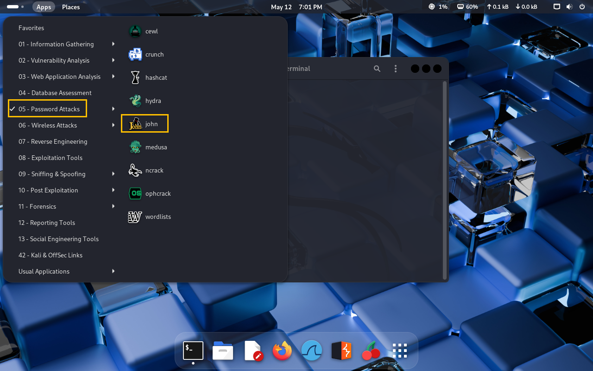

다음 터미널에서
```
sudo apt install johnny
```

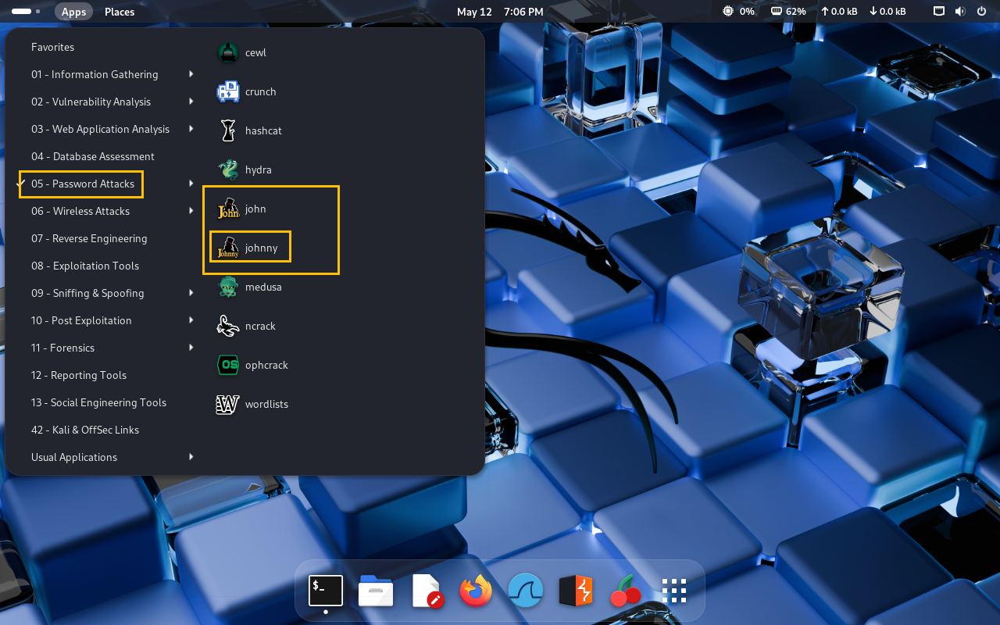
## johnny

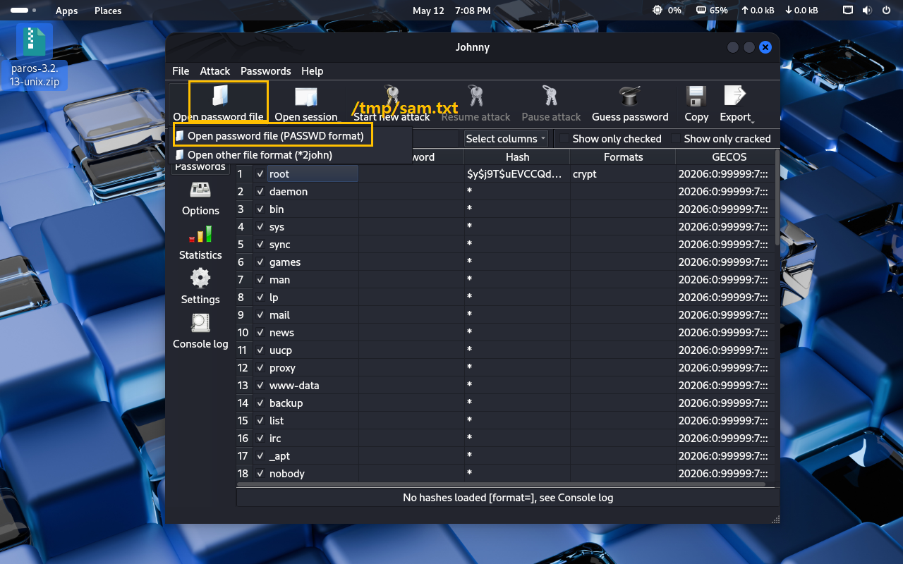

## john
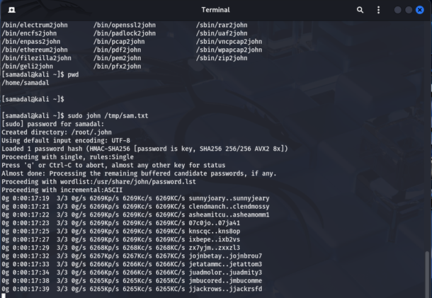
```
sudo john /tmp/sam.txt
```

