# 🌐 Paros 실습 보고서

## 📌 개요

Paros는 **웹 사이트의 취약점을 분석하는 프록시 도구**로, 사용자 요청과 응답을 중간에서 가로채어 분석할 수 있도록 해주는 도구입니다.

---

## 🖥️ 실습 환경 (NAT 구성)

### ✅ 테스트용 시스템 (서버)
- OS: CentOS
- 역할: DNS, Web Server, DB Server 통합
- IP: `192.168.10.132`
- 게이트웨이: `192.168.10.2`
- DNS: `192.168.10.132`

### ✅ Web Proxy 시스템
- OS: Windows 10
- 설치 도구: Odysseus
- IP: `192.168.10.130`
- 게이트웨이: `192.168.10.2`
- DNS: `192.168.10.132`

### ✅ Kali Linux 시스템
- IP: `192.168.10.128`
- 게이트웨이: `192.168.10.2`
- DNS: `192.168.10.132`

---

## 📦 사전 준비

### ✅ Java 설치
- 링크: https://www.oracle.com/java/technologies/downloads/#java8-windows
- 설치 후 `환경변수 설정` 필수
- 설정 방법: `sysdm.cpl` 실행 후 환경변수 추가

> 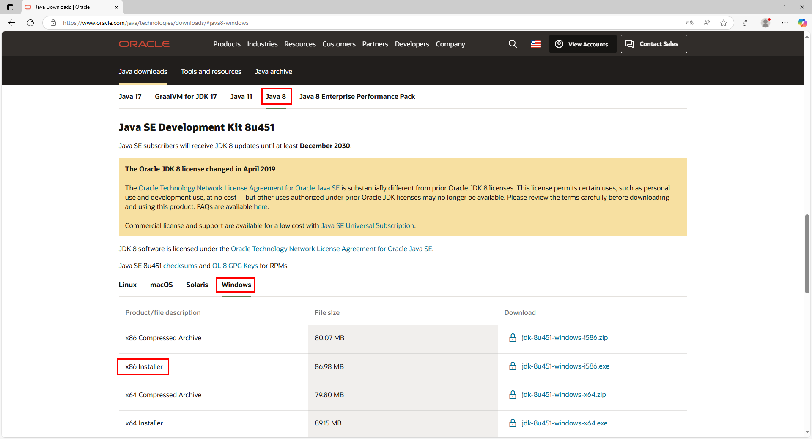  
> 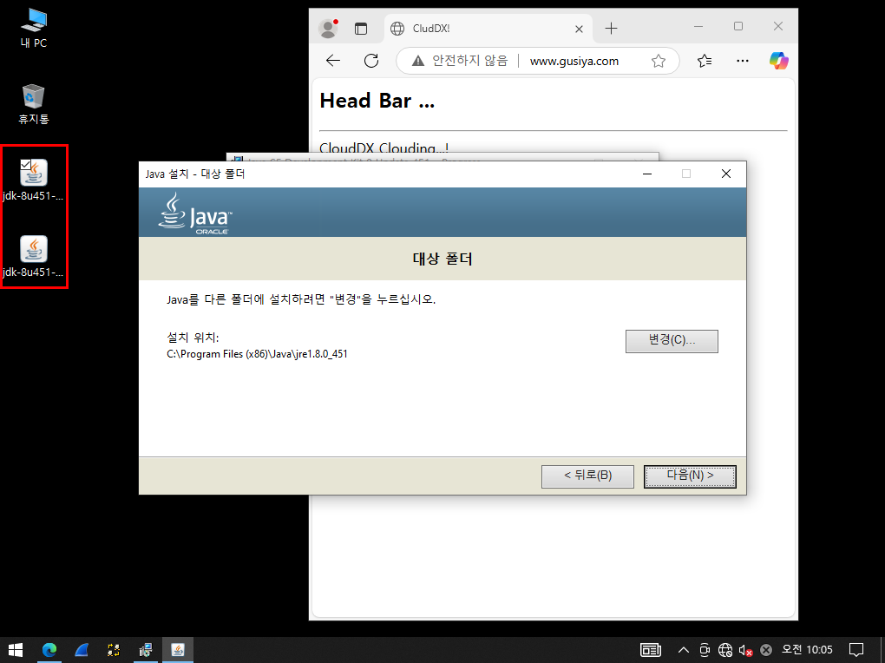  
>   
> 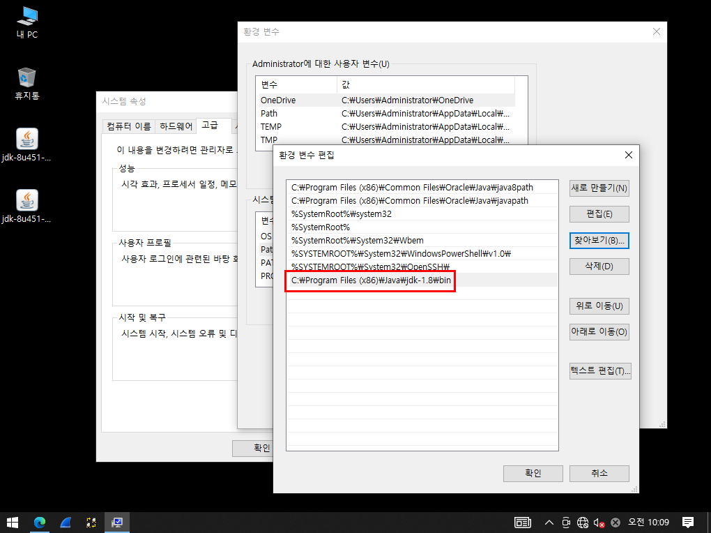  

---

### ✅ Apache ANT 설치
- 링크: https://ant.apache.org/bindownload.cgi
- 설명:
  - Java 빌드 자동화 도구
  - 기본 빌드 파일명: `build.xml`
- 설치:
  - 압축 해제 후 Java 디렉토리에 복사
- 환경변수 설정 필수

> 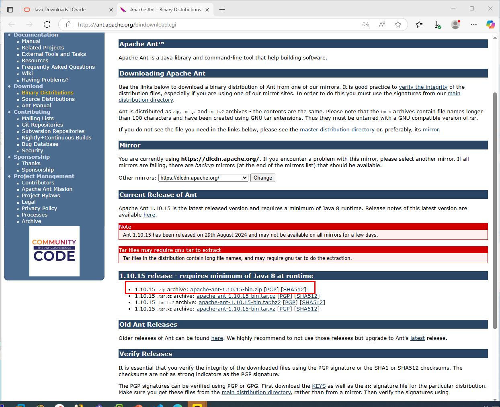  
> 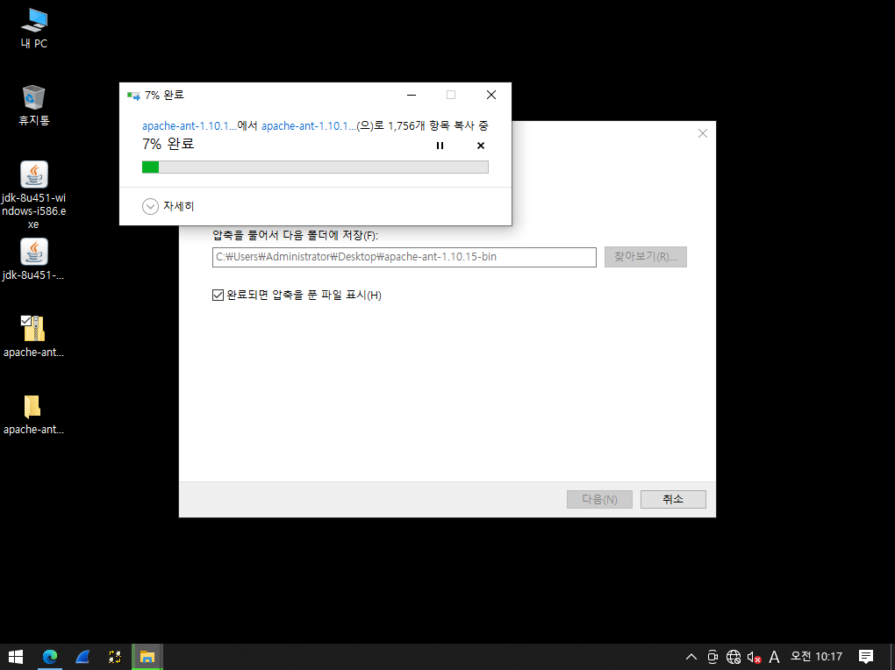  
> 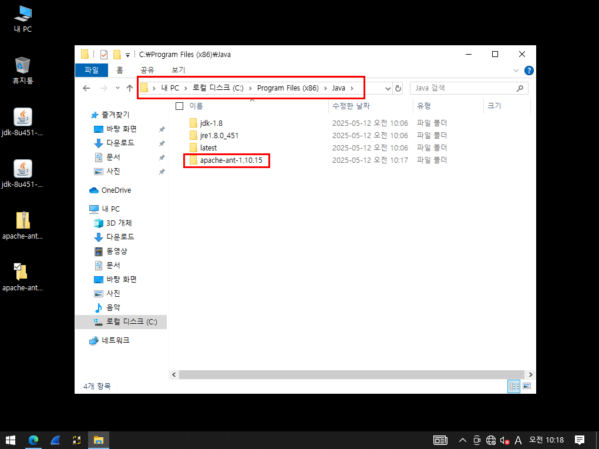  
> 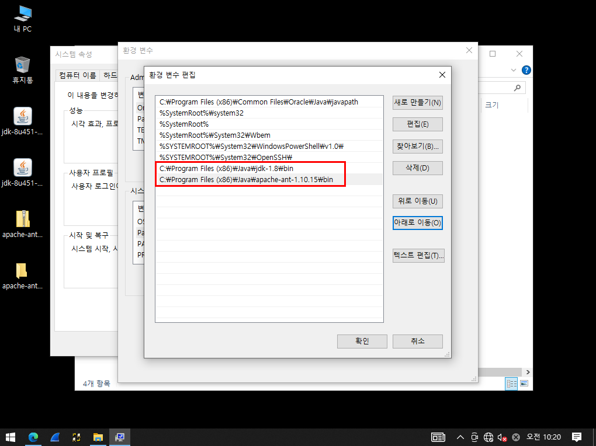  

---

## 🔍 Paros 설치 및 실행

- 링크: https://sourceforge.net/projects/paros/files/Paros/
- 설치 후 실행

> 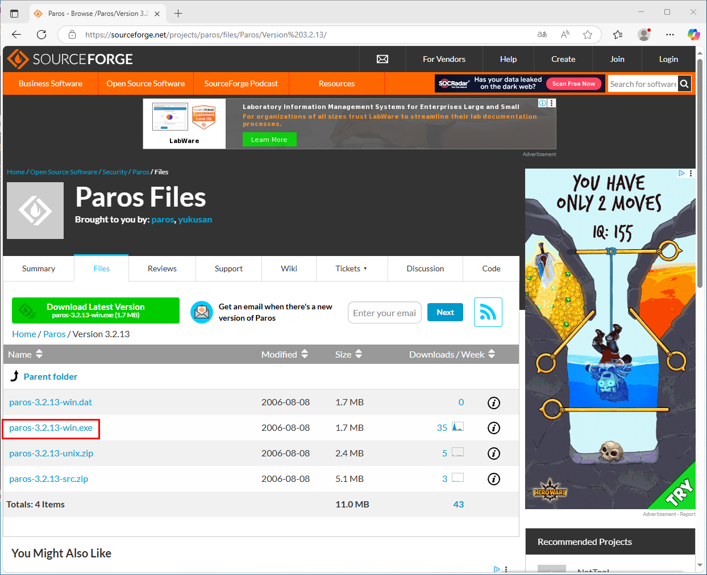  
> 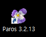  
> 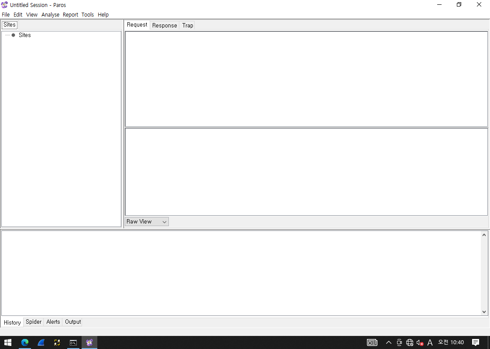  

---

## ✅ 테스트 1: without DB

### Windows 10에서 Proxy 설정
>   
>   

---

### ▶ 실행 1: 포트 미설정 (비정상)

**Request**
```
GET http://www.gusiya.com/favicon.ico HTTP/1.1
Host: www.gusiya.com
Proxy-Connection: keep-alive
User-Agent: ... Paros/3.2.13
Accept: ...
Referer: http://www.gusiya.com/
Accept-Language: ko,en;q=0.9,en-US;q=0.8
```

**Response**
```
HTTP/1.1 404 Not Found
Server: Apache/2.4.6 (CentOS) PHP/7.4.33
...
```

**HTML 출력**
```html
<!DOCTYPE HTML PUBLIC "-//IETF//DTD HTML 2.0//EN">
<html><head>
<title>404 Not Found</title>
</head><body>
<h1>Not Found</h1>
<p>The requested URL /favicon.ico was not found on this server.</p>
</body></html>
```

---

### ▶ 실행 2: 포트 8080 설정 (정상)

**Request**
```
GET http://www.gusiya.com/ HTTP/1.1
Host: www.gusiya.com
...
User-Agent: ... Paros/3.2.13
```

**Response**
```
HTTP/1.1 200 OK
Server: Apache/2.4.6 (CentOS) PHP/7.4.33
Content-Type: text/html; charset=UTF-8
...
```

**HTML 출력**
```html
<html>
  <head>
    <title> CludDX! </title>
  </head>
  <body>
    <H2> Head Bar ... </H2>
    <HR>
    CloudDX Clouding...!
  </body>
</html>
```

---

## ✅ 테스트 2: with DB

- 방화벽 설정 없음
> 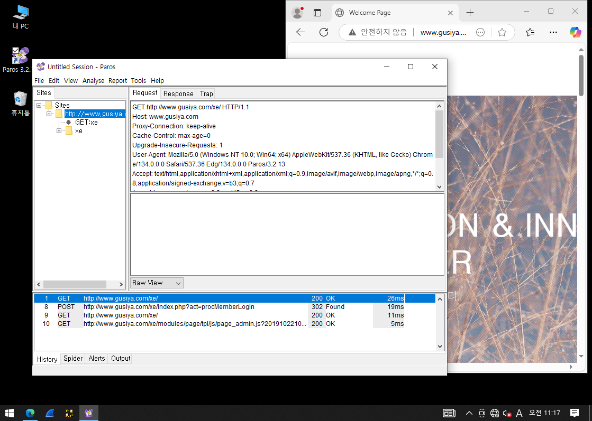  
>   

- POST 방식에서 비밀번호 평문 노출 → 보안 취약점 노출 가능성 있음

---

## 🔑 정리

- Paros를 통해 웹 트래픽을 중간에서 확인하여 보안 취약점을 쉽게 파악 가능
- 포트 설정 여부에 따라 정상 작동 여부 판단
- 로그인 등 민감 데이터가 평문으로 전달되는 경우, 보안 설정 필수
