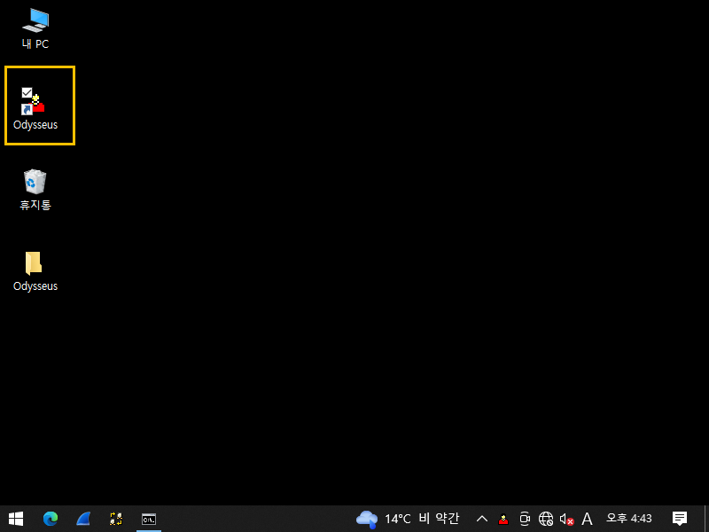
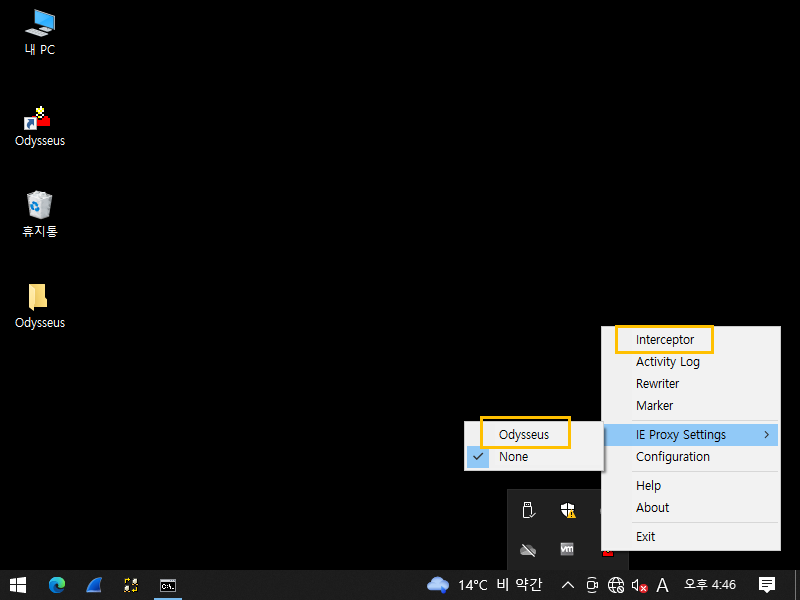
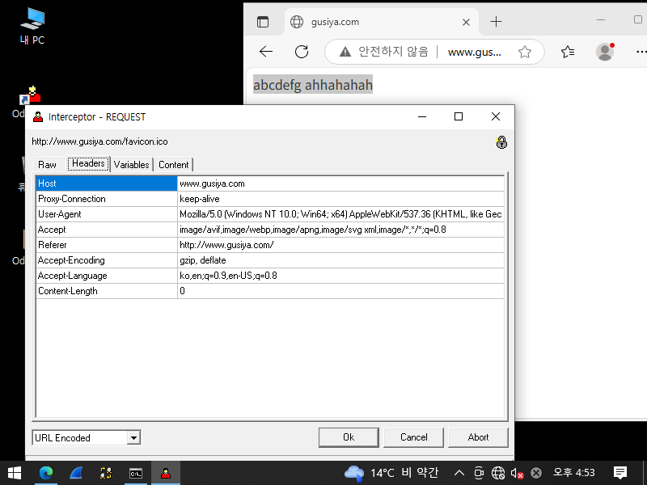
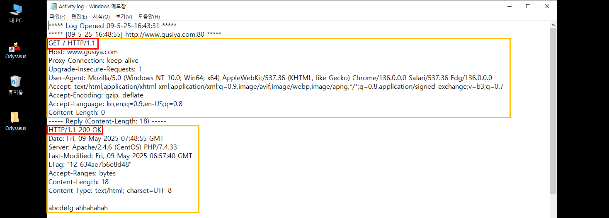
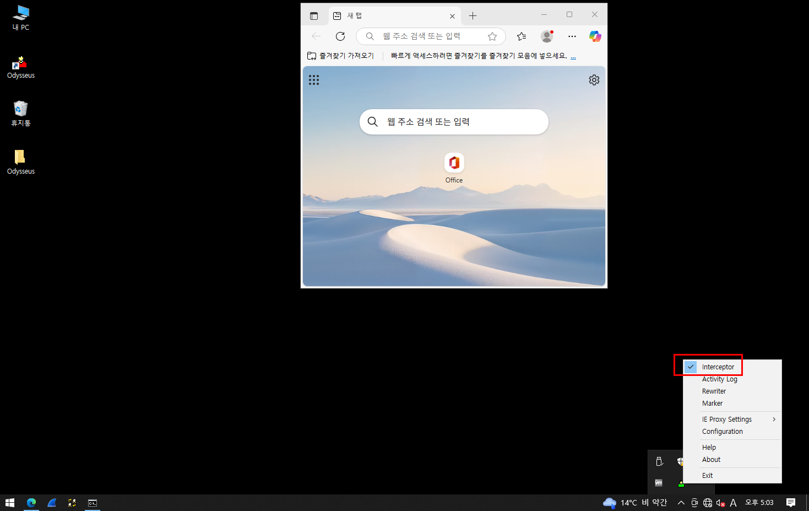
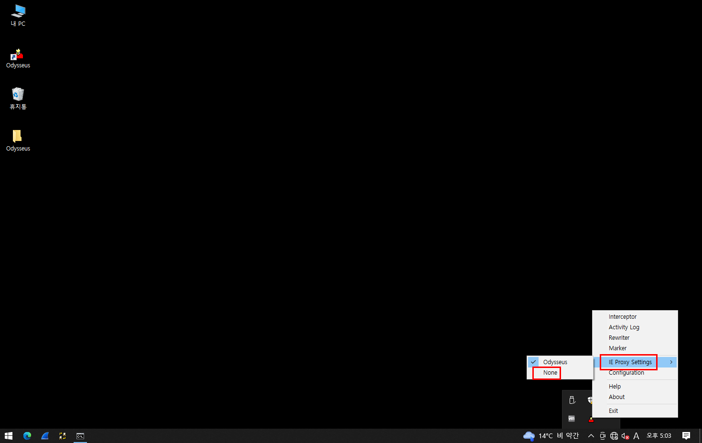
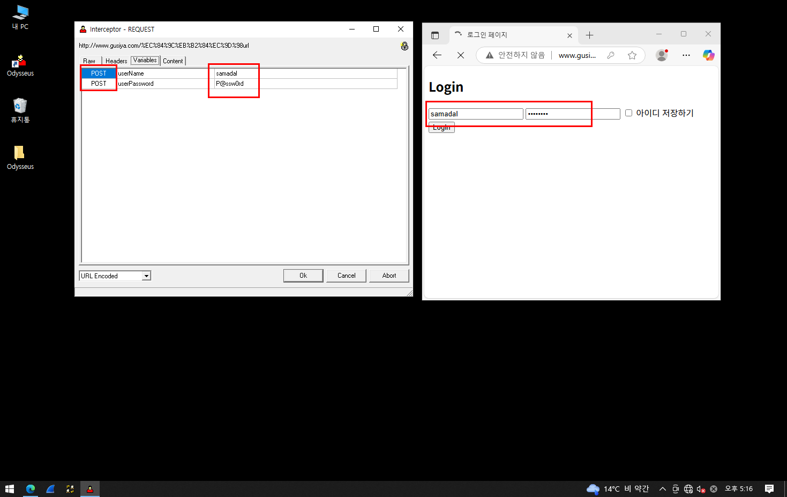
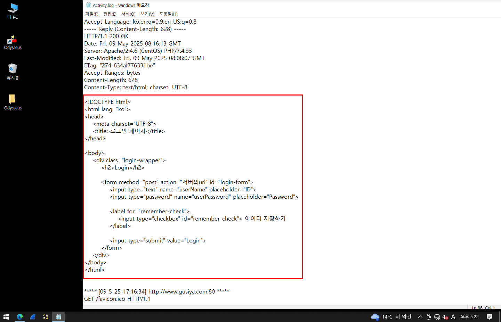
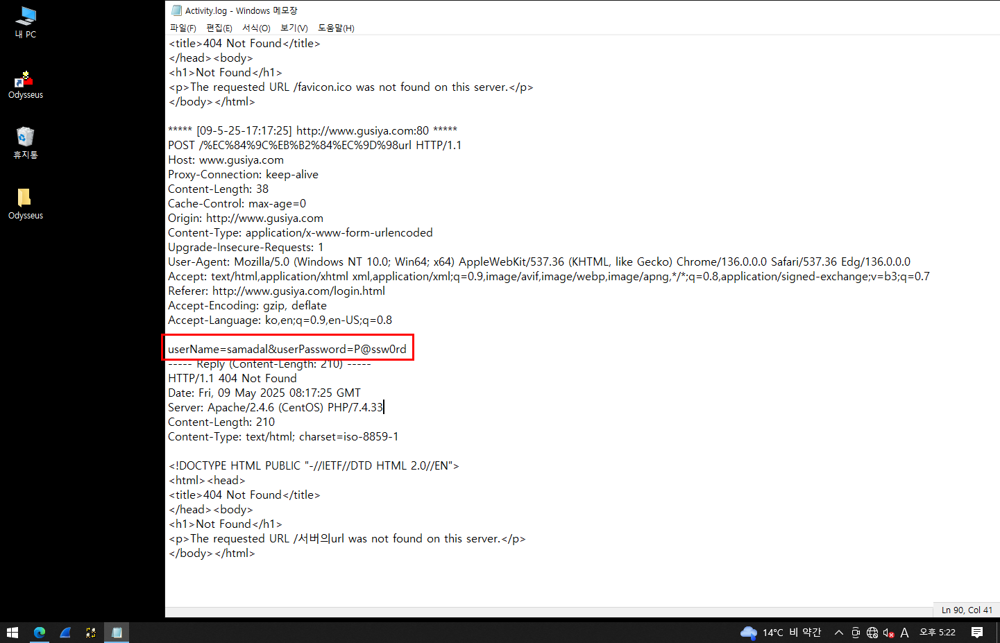

# 📘 Proxy Server

---

## 1. 웹을 통해 나타나는 일반적인 유형

### 🔹 HTTP Request (요청)
- `GET / HTTP/1.1`

### 🔹 HTTP Response (응답)
- `HTTP/1.1 200 OK`

---

## 2. Web Proxy

### 🔹 개요

> 💡 프록시 서버는 **PC와 인터넷 사이에서 중개자 역할을 수행**합니다.

- 인터넷과의 직접 통신을 막고, 대신 **프록시 서버를 통해 요청 및 응답을 주고받는 방식**
- 네트워크 보안 및 **IP 우회**, **패킷 감시** 등에 활용됨
- 일반적으로 **방화벽(Firewall)** 역할도 함께 수행

📌 **Proxy Server를 거치면 Server는 실제 Client의 IP를 알 수 없음**  
→ 보안과 익명성 보장 가능

---

### 🔹 Proxy Server vs Web Proxy

| 항목           | Proxy Server                                             | Web Proxy                                                 |
|----------------|----------------------------------------------------------|------------------------------------------------------------|
| **정의**        | 다양한 네트워크 서비스에 간접적으로 접속하게 해주는 서버 | **웹 요청/응답**을 중개하는 HTTP 중심의 프록시             |
| **기능**        | - 캐시 기능<br>- 보안 및 접근 제어<br>- 패킷 감시 및 수정 | - 웹 데이터 중개<br>- 클라이언트 요청을 서버에 재전송        |
| **역할**        | 클라이언트 대신 외부 서비스에 접근하여 응답 전달         | 브라우저 ↔ 서버 사이에 위치해 HTTP 요청·응답 처리           |
| **활용 예시**   | 방화벽, DNS 프록시, SMTP 프록시 등 다양한 프로토콜 지원  | 학교/회사에서 인터넷 필터링, 우회 접속, 웹 캐시 서버 등     |
| **보안 감시**   | ✔ 가능 (패킷 단위)                                       | ✔ 가능 (HTTP 기반 패킷 감시 및 조작)                        |

---

### 🔹 기타 특징

- 프록시 서버는 **캐시(Cache)**를 활용해 자주 요청되는 데이터를 빠르게 제공
- 보안 목적으로 **웹 필터링**, **사용자 추적 차단**, **로그 기록** 기능 제공
- **역방향 프록시(Reverse Proxy)**는 서버 측에서 부하분산 및 보안을 위해 사용됨

---

## ✅ 요약

- Proxy는 **중개자**이며, 보안, 익명성, 캐시, 필터링 등의 목적
- Web Proxy는 **웹 전용 프록시**로 브라우저와 웹 서버 사이에서 통신을 중계
- **Client ↔ Proxy ↔ Server** 구조로 IP 감춤 및 요청 제어 가능

# 📘 Web Proxy 실습 - Odysseus 활용

---

## 실습 1. Odysseus 기반 Web Proxy 구성 without DB

### 🖥️ 작업환경 (NAT 구성)

#### ✅ 테스트용 시스템
- CentOS (DNS, Web Server, DB Server 통합)
- IP: `192.168.10.132`
- 게이트웨이: `192.168.10.2`
- DNS: `192.168.10.132`

#### ✅ Web Proxy 시스템
- Windows 10
- Odysseus 설치
- IP: `192.168.10.130`
- 게이트웨이: `192.168.10.2`
- DNS: `192.168.10.132`


#### ✅ Kali Linux 시스템
- IP: `192.168.10.128`
- 게이트웨이: `192.168.10.2`
- DNS: `192.168.10.132`
---

## 2. 작업 1: 기본 웹 문서 출력 without DB

### ✅ 단계별 작업

1. **네임서버 조회**
2. **기본 웹 문서 파일 생성**
3. **사이트 출력 테스트 1차**
4. **Odysseus 실행 및 옵션 설정**

📸 실행 화면:
- Odysseus 실행  
  <br>
- 옵션 체크  
  <br>
- 사이트 출력 결과  
  <br>
- 로그 확인  
  <br>

---

## 3. 작업 2: `login.html`을 기본 경로로 생성

### 🚨 매우 중요: 실행 중인 Odysseus는 반드시 중지할 것!

> **⚠️ 시스템 트레이에서 동작 중인 Odysseus를 먼저 종료해야 합니다.**  
> (중복 실행 시 충돌 발생)

📸 참고 화면:
<br>
<br>

📜 **기본 웹 문서(login.html)**

```html
<!DOCTYPE html>
<html lang="ko">
<head>
    <meta charset="UTF-8">
    <title>로그인 페이지</title>
</head>
<body>
    <div class="login-wrapper">
        <h2>Login</h2>
        <form method="post" action="서버의url" id="login-form">
            <input type="text" name="userName" placeholder="ID">
            <input type="password" name="userPassword" placeholder="Password">
            <label for="remember-check">
                <input type="checkbox" id="remember-check"> 아이디 저장하기
            </label>
            <input type="submit" value="Login">
        </form>
    </div>
</body>
</html>
```

### ✅ 사이트 출력 테스트 2차

- `www.gusiya.com/login.html` 검색  
  <br>

### ✅ 로그 확인

<br>
<br>

---

## 실습 2.  with DB


## 4. 악성코드 생성 시스템 구성


### 🐍 작업 목표

- Kali에서 **악성코드를 삽입**하여 CentOS 웹 페이지에 전파
- 사용자가 실행 시 Odysseus 로그를 통해 **계정 정보 또는 요청 내용 편취**

---


