# 📘 snmp

## 🖥️ 실습 환경: NAT 기반 SNMP 구성

### 📌 네트워크 구성 (공통: C Class, Gateway 192.168.10.2)

---

### 🐧 CentOS (SNMP Agent)

- IP 주소: `192.168.10.132`
- SNMP 구성:
  - SNMP Agent 설치 및 설정
  - SNMP Manager로부터 요청을 받아 응답
- 역할: **SNMP Agent**

---

### 🪟 Windows (SNMP Manager)

- IP 주소: `192.168.10.130`
- SNMP 구성:
  - SNMP Manager 설치
  - **CUOIU Mode**를 활용해 MIB 및 OID 확인
- 역할: **SNMP Manager**

---

### 구성 요약

| 역할           | OS       | IP 주소         | SNMP 기능       | 비고                         |
|----------------|----------|------------------|------------------|------------------------------|
| SNMP Agent     | CentOS   | 192.168.10.132   | Agent 설치/응답 | SNMP 요청 수신 및 Trap 전송 |
| SNMP Manager   | Windows  | 192.168.10.130   | Manager 설정     | MIB/OID 확인 (CUOIU 사용)   |

---

📎 **구성 방식**: NAT 기반, 동일 네트워크 세그먼트에서 양방향 통신 확인


```
yum -y install epel-release
```
```
[root@localhost ~]# rpm -qa | grep snmp
net-snmp-utils-5.7.2-49.el7_9.4.x86_64
net-snmp-devel-5.7.2-49.el7_9.4.x86_64
net-snmp-libs-5.7.2-49.el7_9.4.x86_64
net-snmp-agent-libs-5.7.2-49.el7_9.4.x86_64
net-snmp-sysvinit-5.7.2-49.el7_9.4.x86_64
net-snmp-gui-5.7.2-49.el7_9.4.x86_64
net-snmp-perl-5.7.2-49.el7_9.4.x86_64
net-snmp-5.7.2-49.el7_9.4.x86_64
net-snmp-python-5.7.2-49.el7_9.4.x86_64
```
### 설치 가능한 패키지 목록 인터넷 상에서 확인


```
 yum list | grep snmp | nl
```

```
yum -y install net-snmp-*
```
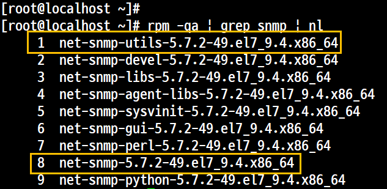

1, 8 대표 패키지

## 환경설정
- 환경 설정 파일 백업
pwd : /etc/snmp


```
cp -p snmpd.conf snmpd.conf.samadal
```

## 파일구성 /etc/snmp/snmpd.conf

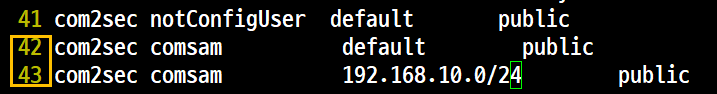


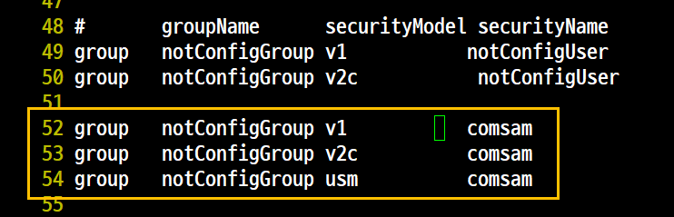


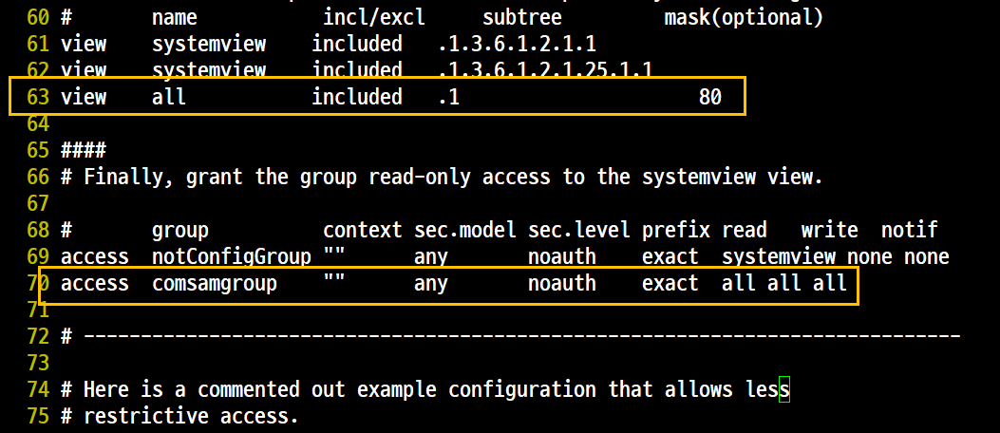

## 방화벽 구성
서비스만 <br>

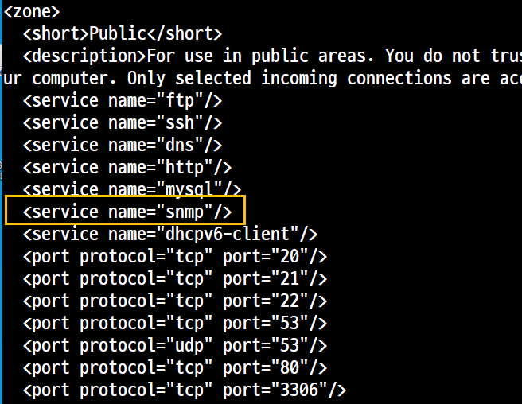

```
firewall-cmd --reload
systemctl restart snmpd.service
```

## 서비스 활성상태인지 확인

```
 netstat -atunp | grep udp
```
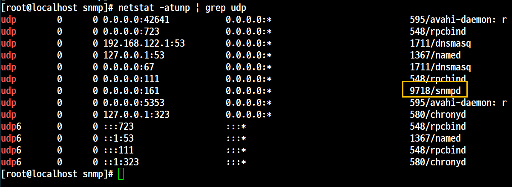

## 명령어 실행

### snmpwalk


- 개요
    - SNMP 정보 확인 후 정상적으로 출력되는지 확읺나다.
    - 각종 서브 트리의 MIB를 확인할 수 있다.
- 사용법
```
snmpwalk -v <SNMP Version> -c <Community Name> <대상IP> <OID>
```
- 실행

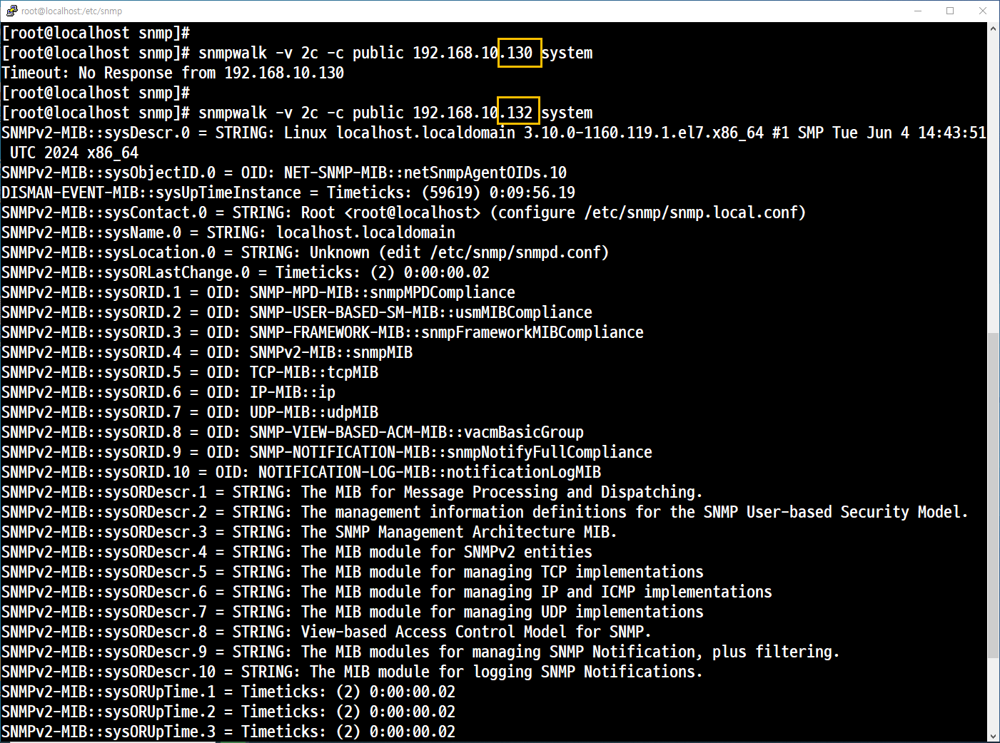

### snmpget

- 개요
    - 하나의 MIB를 불러올 때 사용한다.
    - MIB명을 확인할 때 사용한다.
    - OID를 사용하기 때문에 정확한 OID를 모르면 확인할 수가 없다.
- 사용법
```
[root@localhost snmp]# snmpget -v 2c -c public localhost .1.3.6.1.2.1.25.1.2
HOST-RESOURCES-MIB::hrSystemDate = No Such Object available on this agent at this OID
[root@localhost snmp]#
[root@localhost snmp]#
[root@localhost snmp]# snmpget -v 2c -c public 192.168.10.132 .1.3.6.1.2.1.25.1.2
HOST-RESOURCES-MIB::hrSystemDate = No Such Object available on this agent at this OID
```

### snmptranslate
- 개요
    - 각 항목의 상세 정보를 확인할 때 사용한다.
    - MIB명을 이용해서 OID값을 확인할 때 사용한다.

```
snmptranslate -T(able)d(escription) <MIB명>
```


## 'MIB Browser'를 이용한 MIB, OID 확인
- 개요<br>
그래픽 모드로 확인 가능

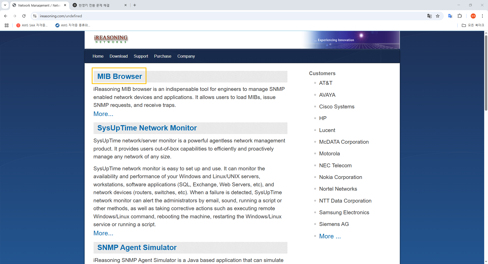
<br>
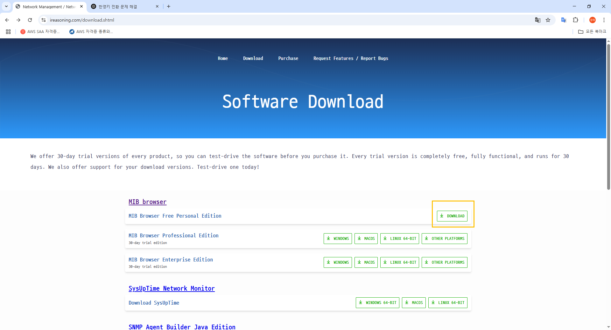
<br>

<br>
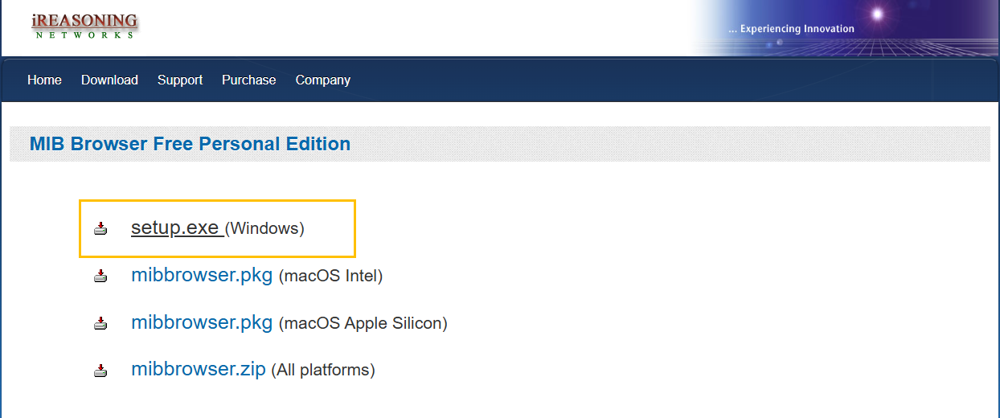
<br>
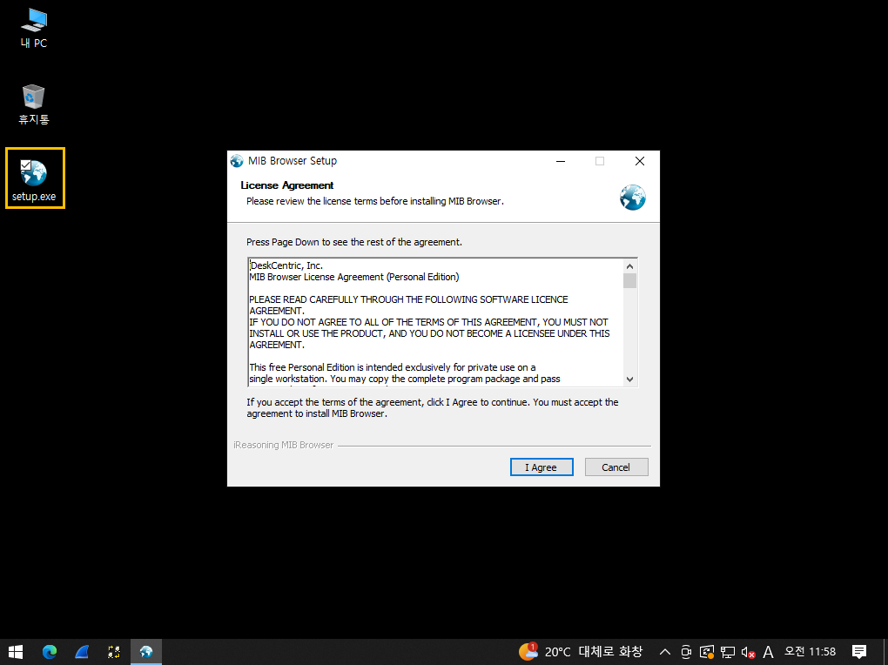
설치는 기본값
<br>
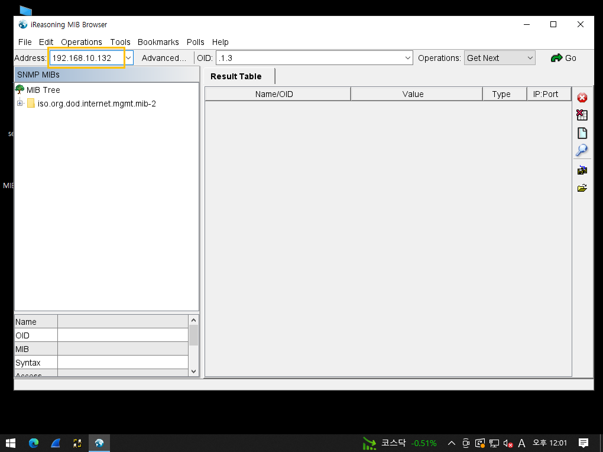

## 실행
1. 오류

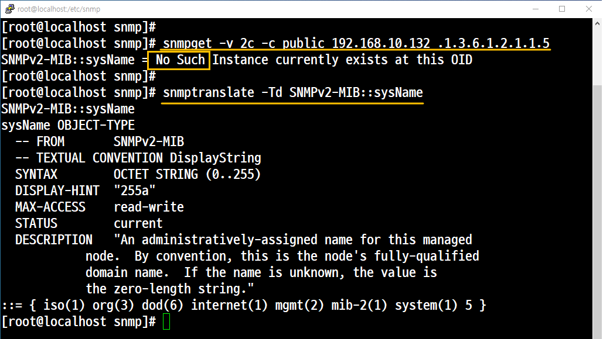
<br>
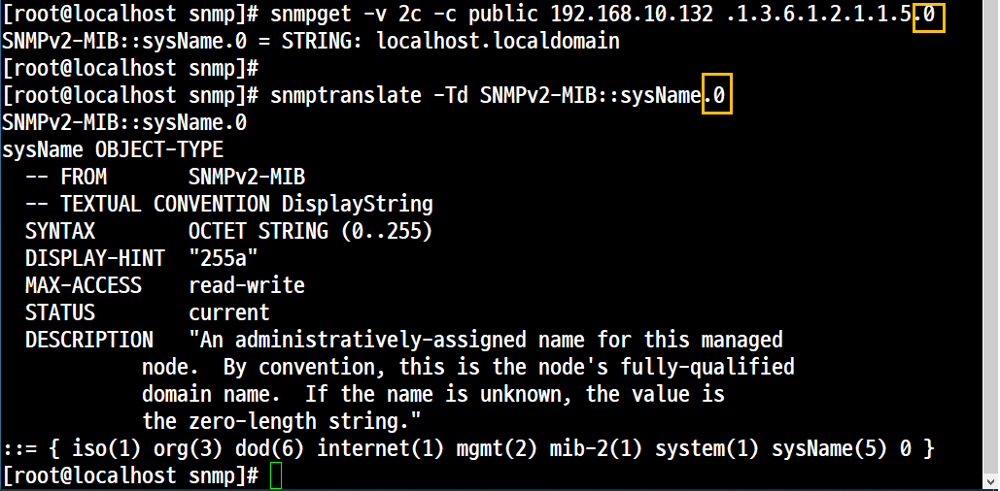

