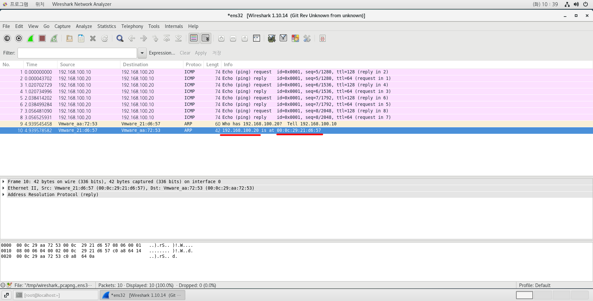

# 📘 네트워크 해킹 절차 및 정보수집(Scanning DNS Zone Transfer)

## 1. 활성화/비활성화 된 호스트 식별

- 네트워크 환경(위치)에 따른 식별 유형
    - 같은 네트워크 안에 있는 경우
        - 같은 MAC Address로 ARP를 보낸 경우에 확인가능
    - 다른 네트워크 안에 있는 경우
        - 라우터 밖에 있는 경우<br>
        → ICMP로 확인 가능 (외부망 WAN)
        - 라우터 안에 있는 경우<br>
        → ARP로 확인 가능 (내부망 LAN)
---

## 2. 실습 환경 구성
- SRV100 (Windows Server 2022)
- Client100 (CentOS 7.9.2207)
- SRV200 (Windows Server 2022)
- Client200 (Windows Server 2022)
---

1. 센토스 와이어샤크 다운로드<br>

2. IP설정 및 데몬 재실행<br>

```
systemctl restart network
```
---

## 3. 테스트

### 로컬 테스트 <br>

- LAN 구간에서의 통신
    → SRV100 내부망에서 Client100으로 ping 명령 때린 후 Client100에서 샥스핀으로 확인
- 샥스핀 패키지를 설치하면 '프로그램' 메뉴 하단에 있는 '인터넷'에 자동적으로 'Wiresharek Network Analyzer'로 등록되어 있다.<br>

- 결과<br>
```
→ 'ICMP' 필터링 결과
192.168.100.10	192.168.100.20	ICMP	74	Echo (ping) request  ttl=128 
192.168.100.20	192.168.100.10	ICMP	74	Echo (ping) reply ttl=64 (request in 1) 
→ 'ARP' 필터링 결과
Vmware_aa:72:53	Vmware_21:d6:57	ARP	60	Who has 192.168.100.20?  Tell 192.168.100.10 
Vmware_21:d6:57	Vmware_aa:72:53	ARP	42	192.168.100.20 is at 00:0c:29:21:d6:57
```




# 📄 패킷 캡처 분석 (Markdown 정리)

## 1. ICMP 필터링 결과
> **ICMP**는 네트워크 연결을 확인하기 위해 사용하는 프로토콜 (Ping 요청/응답)

| 출발지 IP | 목적지 IP | 프로토콜 | 크기 | 설명 |
|:---------|:---------|:--------|:----|:----|
| 192.168.100.10 | 192.168.100.20 | ICMP | 74 bytes | **Echo Request** (Ping 요청), TTL=128 |
| 192.168.100.20 | 192.168.100.10 | ICMP | 74 bytes | **Echo Reply** (Ping 응답), TTL=64 (Request in 1) |

### 🔹 해석
- 192.168.100.10이 192.168.100.20에게 Ping을 보냄
- 192.168.100.20이 Ping에 정상적으로 응답
- TTL로 추정하면
  - 192.168.100.10은 **Windows**
  - 192.168.100.20은 **Linux**

---

## 2. ARP 필터링 결과
> **ARP**는 IP 주소를 MAC 주소로 변환하는 프로토콜

| 출발지 MAC | 목적지 MAC | 프로토콜 | 크기 | 설명 |
|:----------|:----------|:--------|:----|:----|
| Vmware_aa:72:53 | Vmware_21:d6:57 | ARP | 60 bytes | **Who has 192.168.100.20? Tell 192.168.100.10** |
| Vmware_21:d6:57 | Vmware_aa:72:53 | ARP | 42 bytes | **192.168.100.20 is at 00:0c:29:21:d6:57** |

### 🔹 해석
- 192.168.100.10이 "192.168.100.20 MAC 주소 알려줘" 요청
- 192.168.100.20이 "내 MAC은 00:0c:29:21:d6:57"이라고 응답

---

## ✅ 종합 결론
- **Ping 요청과 응답이 정상적으로 오고 갔다.**
- **ARP를 통해 MAC 주소를 정확히 확인하고 통신했다.**
- 즉, **네트워크 연결은 정상적이다.**
---

### WAN 구간에서의 통신

→ Client200에서 Client100으로  ping 명령 때린 후 Client100에서 샥스핀으로 확인 <br>
→ Client200에서 MAC Address를 확인하고 Client 100에서 샥스핀으로 확인
## ARP 필터링 결과
> **ARP**는 IP 주소를 MAC 주소로 변환하는 프로토콜

| No. | 시간 | 출발지 MAC | 목적지 MAC | 프로토콜 | 크기 | 설명 |
|:--|:----|:----------|:-----------|:--------|:----|:----|
| 17 | 4.870150113 | Vmware_27:22:09 | Vmware_f9:99:37 | ARP | 60 bytes | **Who has 192.168.200.20? Tell 192.168.200.10** |
| 18 | 4.870175407 | Vmware_f9:99:37 | Vmware_27:22:09 | ARP | 60 bytes | **192.168.200.20 is at 00:0c:29:f9:99:37** |
| 19 | 4.946896540 | Vmware_aa:72:53 | Vmware_21:d6:57 | ARP | 60 bytes | **Who has 192.168.100.20? Tell 192.168.100.10** |
| 20 | 4.946911505 | Vmware_21:d6:57 | Vmware_aa:72:53 | ARP | 42 bytes | **192.168.100.20 is at 00:0c:29:21:d6:57** |

# 📄 추가 ICMP 패킷 분석 (Markdown 정리)

## ICMP 필터링 결과
> **ICMP**는 네트워크 연결 상태를 확인하는 데 사용되는 프로토콜

| No. | 시간 | 출발지 IP | 목적지 IP | 프로토콜 | 크기 | 설명 |
|:--|:----|:---------|:---------|:--------|:----|:----|
| 3 | 0.000241083 | 192.168.100.20 | 192.168.200.20 | ICMP | 74 bytes | **Echo Reply** (Ping 응답), id=0x0001, seq=1393/28933, TTL=64 (Request in 2) |
| 4 | 0.000404770 | 192.168.100.20 | 192.168.200.20 | ICMP | 74 bytes | **Echo Reply** (Ping 응답), id=0x0001, seq=1393/28933, TTL=62 |
| 5 | 1.011035536 | 192.168.200.20 | 192.168.100.20 | ICMP | 74 bytes | **Echo Request** (Ping 요청), id=0x0001, seq=1394/29189, TTL=128 |
| 6 | 1.011231149 | 192.168.200.20 | 192.168.100.20 | ICMP | 74 bytes | **Echo Request** (Ping 요청), id=0x0001, seq=1394/29189, TTL=126 (Reply in 7) |

---

- 'Request'와 'reply'가 2개씩 나타난 이유(각 Protocol을 클릭한 후 하단에 나온 세부 내용을 보면 된다.)<br>
```
27:22:09          192.168.100.20
21:d6:57          192.168.100.20
aa:72:53          192.168.200.20
f9:99:37          192.168.200.20
```

## 🔹 해석
- **192.168.100.20 → 192.168.200.20** 방향
  - Echo **Reply**를 전송 (ping 응답)
  - TTL이 64 → Linux 계열 시스템 가능성
- **192.168.200.20 → 192.168.100.20** 방향
  - Echo **Request**를 전송 (ping 요청)
  - TTL이 128 → Windows 계열 시스템 가능성
- 순서상 보면, **서로 ping 요청/응답이 오가는 통신 테스트 중**임.

---

## ✅ 종합 결론
- **192.168.100.20**과 **192.168.200.20** 사이 ICMP 통신이 정상 작동하고 있다.
- 두 시스템 간에 **요청 및 응답이 모두 문제없이 이루어지고 있음**.
- TTL 값 차이로 보아 운영체제 종류를 유추할 수 있다.

---
### 원격 테스트 <br>
